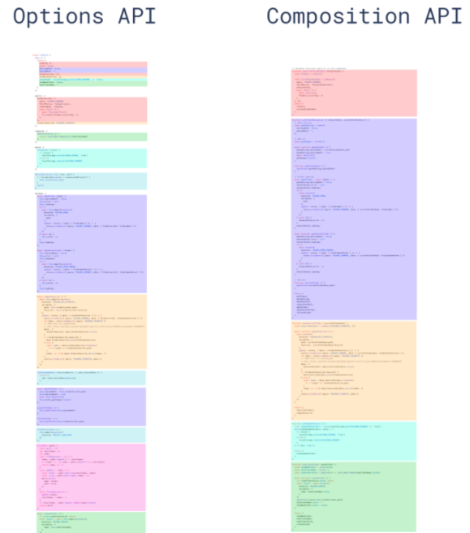

# vue3前置

## 为什么学vue3

> 目标：了解vue3现状，以及它的优点，展望它的未来

1. Vue3现状：

-  [vue-next](https://github.com/vuejs/vue-next/) 2020年09月18日，正式发布vue3.0版本。但由于刚发布周边生态不支持，大多数开发者处于观望。
- 现在主流组件库都已经发布了支持vue3.0的版本，其他生态也在不断地完善中，这是趋势。
  - [element-plus](https://element-plus.org/#/zh-CN)   基于 Vue 3.0 的桌面端组件库 
  - [vant](https://vant-contrib.gitee.io/vant/v3/#/zh-CN)  vant3.0版本，有赞前端团队开源移动端组件库 
  - [ant-design-vue](https://2x.antdv.com/components/overview/)   Ant Design Vue 2.0版本，社区根据蚂蚁 ant design 开发

2. Vue3优点：

- 最火框架，它是国内最火的前端框架之一，[官方文档](https://v3.vuejs.org/)  [中文文档](https://v3.cn.vuejs.org/)
- 性能提升，运行速度事vue2.x的1.5倍左右
- 体积更小，按需编译体积比vue2.x要更小
- 类型推断，更好的支持Ts（typescript）这个也是趋势（js的超集）
- 高级给予，暴露了更底层的API和提供更先进的内置组件
- **★选项API-----组合API (composition api)**  ，能够更好的组织逻辑，封装逻辑，复用逻辑

3. Vue3展望：

- 这是趋势，越来越多的企业将来肯定会升级到Vue3.0
- 大型项目，由于对Ts的友好越来越多大型项目可以用Vue3.0

> 总结：
>
> 1. vue3依赖的相关第三方包有针对性（包的名称发生变化）
> 2. vue3性格更好，编程体验更好
> 3. 这是未来的趋势，未来已来。

## 创建vue应用

> 目标：掌握如何创建vue3应用实例

1. 基于Vue脚手架创建项目

```bash
# 1. 安装脚手架
npm i @vue/cli -g
# 2. 创建vue3项目（选项中选择v3版本，其他和之前一样）
vue create 项目名称
# 3、切换路径
cd 项目名称
# 4、运行项目
npm run serve
```

2. 项目代码结构分析

- 入口文件`main.js`

```js
import { createApp } from 'vue'
// 导入根组件
import App from './App.vue'
// 导入路由对象
import router from './router/index.js'
// 导入store实例对象
import store from './store/index.js'

// app相当于之前Vue2中new Vue()的实例对象vm
// app.use() 表示配置插件
// Vue.use(router) Vue2插件配置
const app = createApp(App)
app.use(store).use(router).mount('#app')
// createApp(App).use(store).use(router).mount('#app')

// Vue2
// import Vue from 'vue'
// const vm = new Vue({
//   router,
//   store,
//   redner: h => h(App)
// }).$mount('#app')

```

> 总结：
>
> 1. Vue的实例化方式发生变化：基于createApp方法进行实例化
> 2. router和store采用use方法进行配置
> 3. Vue3的典型API风格：按需导入，为了提升打包的性能

- 根组件结构

```vue
<template>
  <!-- Vue2中组件的模板必须有唯一的根节点 -->
  <!-- Vue3中组件的模板可以没有根节点 -->
  <div id="nav">
    <router-link to="/">主页</router-link> |
    <router-link to="/about">关于</router-link>
  </div>
  <!-- 路由组件的填充位置 -->
  <router-view />
</template>
```

> 总结：Vue3中组件的模板可以没有根节点（Vue2中组件的模板必须有唯一的根节点）

- 路由模块分析

```js
import { createRouter, createWebHashHistory } from 'vue-router'
import Home from '../views/Home.vue'

const routes = [
  {
    path: '/',
    name: 'Home',
    component: Home
  },
  {
    path: '/about',
    name: 'About',
    component: () => import(/* webpackChunkName: "about" */ '../views/About.vue')
  }
]

// Vue2创建实例对象
// const router = new VueRouter({
//   routes
// })

// Vue3创建实例对象
const router = createRouter({
  // 采用历史API路由模式
  // history: createWebHistory()
  // 采用hash的路由模式
  history: createWebHashHistory(),
  routes
})

export default router
```

> 总结：
>
> 1. 创建路由实例对象采用createRouter方法，Vue3的典型风格
> 2. 采用hash和history的方式有变化
>
> - Vue2采用mode选项：hash/history
> - Vue3采用方法：createWebHashHistory()/createWebHistory()

- Vuex模块

```js
import { createStore } from 'vuex'

// Vue2实例化
// new Vuex.Store({})

// Vue3实例化
export default createStore({
  // 状态
  state: {
  },
  // 修改状态
  mutations: {
  },
  // 异步操作
  actions: {
  },
  // 模块化拆分
  modules: {
  },
  // 类似于组件的计算属性
  getters: {
  }
})

```

> 总结：创建store对象采用createStore方法，而不是new.
>

## 选项API和组合API

> 目标：理解什么是选项API写法，什么是组合API写法。
>

- 选项API与组合API对比分析



什么是选项API写法：`Options ApI`

- 咱们在vue2.x项目中使用的就是 `选项API` 写法
  - 代码风格：data选项写数据，methods选项写函数...，一个功能逻辑的代码分散。
  - 优点：易于学习和使用，写代码的位置已经约定好
  - 缺点：代码组织性差，相似的逻辑（功能）代码不便于复用，逻辑复杂代码多了不好阅读。

什么是组合API：Composition API

- 以功能为单位组织代码结构，后续重用功能更加方便。

> 总结：组合API的最大好处就是以功能为单位组织代码结构，有利于代码的复用
>

## 组合API-setup函数

> 目标：掌握setup函数的基本使用

使用细节：

- `setup` 是一个新的组件选项，作为组件中使用组合API的起点。
- 从组件生命周期来看，它的执行在组件实例创建之前`vue2.x的beforeCreate`执行。
- 这就意味着在`setup`函数中 `this` 还不是组件实例，`this` 此时是 `undefined`
- 在模版中需要使用的数据和函数，需要在 `setup` 返回。


演示代码：

```vue
<template>
  <div>
    <div>setup函数用法</div>
    <hr>
    <div>{{msg}}</div>
    <div>{{info}}</div>
    <div>
      <button @click='handleClick'>点击</button>
    </div>
  </div>
</template>

<script>
export default {
  name: 'App',
  // Vue3依然可以使用data中的数据，但是不建议使用（这是选项API）
  data () {
    return {
      info: 'nihao'
    }
  },
  setup () {
    // 触发时机在beforCreate/created生命周期之前
    // Vue3中beforCreate/created声明周期函数已经废弃了，其实已经被setup替代了

    // 此时无法访问this，因为组件实例此时尚未创建
    // console.log(this)

    // 定义事件函数
    const handleClick = () => {
      console.log('click')
    }

    // 这里返回的数据用于给模板使用：类似于之前data中提供的数据
    return {
      msg: 'hello',
      handleClick
    }
  }
}
</script>

<style lang="less">
</style>

```

> 总结：
>
> 1. setup选项是实现组合API的基础
> 2. 触发的时机在beforeCreate之前
> 3. Vue3中beforCreate/created声明周期函数已经废弃了，其实已经被setup替代了
> 4. 此时无法访问this，因为组件实例此时尚未创建
> 5. setup的返回值用于给模板提供数据和方法
> 6. 模板依然可以从data获取数据，但是不建议使用data了。

## 组合API-生命周期

> 目标：掌握使用组合API写法的生命周期钩子函数

1. 回顾vue2.x生命周期钩子函数：

- beforeCreate  
- created
- beforeMount 
- mounted
- beforeUpdate
- updated
- beforeDestroy
- destroyed

2. 认识vue3.0生命周期钩子函数

- `setup` 创建实例前
- `onBeforeMount`  挂载DOM前
- `onMounted` 挂载DOM后
- `onBeforeUpdate` 更新组件前
- `onUpdated` 更新组件后
- `onBeforeUnmount` 卸载销毁前
- `onUnmounted`  卸载销毁后


演示代码：

```vue
<template>
  <div class="container">
    container
  </div>
</template>
<script>
import { onBeforeMount, onMounted } from 'vue'
export default {
  setup () {
    onBeforeMount(()=>{
      console.log('DOM渲染前',document.querySelector('.container'))
    })
    onMounted(()=>{
      console.log('DOM渲染后1',document.querySelector('.container'))
    })
    onMounted(()=>{
      console.log('DOM渲染后2',document.querySelector('.container'))
    })
  },
}
</script>
```

> 总结：
>
> 1. Vue3生命周期的函数发生了变化
> 2. 去掉两个：beforeCreate和created，添加了setup
> 3. 方法名称发生变化：方法名称前面多了个on，中间是驼峰式的
> 4. 卸载组件的生命周期变化：onBeforeUnmount 、onUnmounted
> 5. 同一个生命周期可以触发多次

## 组合API-reactive函数

> 目标：掌握使用reactive函数定义响应式数据

- reactive是一个函数，它可以定义一个复杂数据类型，成为响应式数据。

演示代码：

```vue
<template>
  <div>
    <div>数据的响应式</div>
    <hr>
    <div>{{obj.msg}}</div>
    <div>
      <button @click='handleClick'>点击</button>
    </div>
  </div>
</template>

<script>
import { reactive } from 'vue'

export default {
  name: 'App',
  setup () {
    // 数据响应式：数据的变化导致视图自动变化
    // let msg = 'hello'
    // reactive方法包裹的对象中的数据都是响应式的
    const obj = reactive({
      msg: 'hello',
      info: 'hi'
    })
    const handleClick = () => {
      // msg = 'nihao'
      // console.log(msg)
      obj.msg = 'nihao'
    }
    return { obj, handleClick }
  }
}
</script>

<style lang="less">
</style>

```

> 总结：
>
> 1. setup默认返回的普通数据不是响应式的
> 2. 如果希望数据是响应式，有一种做法就是给数据包裹reactive方法即可

##  组合API-toRef函数

> 目标：掌握使用toRef函数转换响应式对象中**某个**属性为单独响应式数据，并且值是关联的。

定义响应式数据：

- toRef是函数，转换**响应式对象**中**某个**属性为单独响应式数据，并且**值是关联的**。

演示代码：

```vue
<template>
  <div>
    <div>数据的响应式</div>
    <hr>
    <!-- <div>{{obj.msg}}</div> -->
    <div>{{msg}}</div>
    <div>{{info}}</div>
    <div>
      <button @click='handleClick'>点击</button>
    </div>
  </div>
</template>

<script>
import { reactive, toRef } from 'vue'

export default {
  name: 'App',
  setup () {
    // 需求：模板中必须有添加对象obj前缀,而是直接获取属性
    // reactive方法包裹的对象中的数据都是响应式的
    const obj = reactive({
      msg: 'hello',
      info: 'hi'
    })
    // 把对象中的单个属性取出并且保证数据的响应式
    const msg = toRef(obj, 'msg')
    const info = toRef(obj, 'info')
    const handleClick = () => {
      obj.msg = 'nihao'
      obj.info = 'coniqiwa'
    }
    // reactive中的对象属性如果重新赋值会失去响应式能力
    return { msg, info, handleClick }
  }
}
</script>

<style lang="less">
</style>

```

> 总结：toRef方法可以把对象中的单个属性取出并且保证响应式能力
>

##  组合API-toRefs函数

> 目标：掌握使用toRefs函数定义转换响应式中**所有**属性为响应式数据，通常用于解构|reactive定义对象。

- toRefs是函数，转换**响应式对象**中所有属性（可以是一部分）为单独响应式数据，对象成为普通对象，并且**值是关联的**

演示代码：

```vue
<template>
  <div>
    <div>数据的响应式</div>
    <hr>
    <!-- <div>{{obj.msg}}</div> -->
    <div>{{msg}}</div>
    <div>{{info}}</div>
    <div>
      <button @click='handleClick'>点击</button>
    </div>
  </div>
</template>

<script>
import { reactive, toRefs } from 'vue'

export default {
  name: 'App',
  setup () {
    // 需求：模板中必须有添加对象obj前缀,而是直接获取属性
    // reactive方法包裹的对象中的数据都是响应式的
    const obj = reactive({
      msg: 'hello',
      info: 'hi',
      abc: 'abc'
    })
    // 把对象中的单个属性取出并且保证数据的响应式
    // const msg = toRef(obj, 'msg')
    // const info = toRef(obj, 'info')

    // 把obj对象中的属性结构出来，保证响应式能力
    const { msg, info } = toRefs(obj)
    const handleClick = () => {
      obj.msg = 'nihao'
      obj.info = 'aligotogozayimasi'
    }
    // reactive中的对象属性如果重新赋值会失去响应式能力
    return { msg, info, handleClick }
  }
}
</script>

<style lang="less">
</style>

```

> 总结：toRefs方法可以批量转换对象中的属性为独立的响应式数据
>

## 组合API-ref函数

> 目标：掌握使用ref函数定义响应式数据，一般用于简单类型数据

- ref函数，常用于简单数据类型定义为响应式数据
  - 在修改值和获取值的时候，需要.value
  - 在模板中使用ref申明的响应式数据，可以省略.value

演示代码：

```vue
<template>
  <div>
    <div>数据的响应式</div>
    <hr>
    <div>{{count}}</div>
    <div>
      <button @click='handleClick'>点击</button>
    </div>
  </div>
</template>

<script>
import { ref } from 'vue'

export default {
  name: 'App',
  setup () {
    // ref主要（也可以是对象和数组）用于定义基本类型的数据并保证响应式能力
    const count = ref(0)
    const obj = ref({ msg: 'hello' })
    const handleClick = () => {
      // ref定义的数据，在js中操作时需要通过value属性进行
      // 但是模板中访问不需要value
      count.value += 1
      console.log(obj.value.msg)
    }
    return { count, handleClick }
  }
}
</script>

<style lang="less">
</style>
```

> 总结
>
> 1. 如果是基本类型数据，可以使用ref进行定义
> 2. ref其实也可以定义对象，但是访问时需要value属性

- 数据响应式
  - setup中直接返回的普通数据不是响应式的
  - 通过reactive包裹对象可以成为响应式数据
  - 为了简化对象的访问（去掉前缀），可以使用toRef进行优化
  - 为了获取对象中多个属性，可以使用toRefs进一步简化
  - 如果是简单数据类型，其实使用ref定义更加合适

## 知识运用案例

> 目标：利用所学知识完成组合API实例

基本步骤：

- 记录鼠标坐标
  - 定义一个响应式数据对象，包含x和y属性。
  - 在组件渲染完毕后，监听document的鼠标移动事件 mousemove
  - 指定move函数为事件对应方法，在函数中修改坐标
  - 在setup返回数据，模版中使用
- 累加1功能
  - 定义一个简单数据类型的响应式数据
  - 定义一个修改数字的方法
  - 在setup返回数据和函数，模板中使用


落的代码：

```vue
<template>
  <div>
    <div>案例实战</div>
    <hr>
    <!-- (123, 456) -->
    <div>坐标信息：{{'(' + position.x + ',' + position.y + ')'}}</div>
    <hr>
    <div>总数：{{count}} <button @click='handleCount'>点击</button></div>
  </div>
</template>

<script>
import { reactive, onMounted, onUnmounted, ref } from 'vue'

export default {
  name: 'App',
  setup () {
    // 功能1：监听鼠标移动的坐标并展示
    const position = reactive({
      x: 0,
      y: 0
    })

    const move = (e) => {
      position.x = e.clientX
      position.y = e.clientY
    }

    onMounted(() => {
      // 监听鼠标移动事件
      document.addEventListener('mousemove', move)
    })

    onUnmounted(() => {
      // 组件卸载时解绑事件
      document.removeEventListener('mousemove')
    })

    // -----------------------------------
    // 功能2：点击按钮控制数据的累加操作
    const count = ref(0)

    const handleCount = () => {
      count.value += 1
    }

    return { position, count, handleCount }
  }
}
</script>

<style lang="less">
</style>

```

> 总结：代码的组织形式以功能为单位放到一块
>

- setup方法中的多个功能代码可以拆分为单独的模块，然后再导入，方便代码的复用。

```js
<template>
  <div>Vue3基础-案例</div>
  <div>坐标{{'(' + x + ',' + y + ')'}}</div>
  <hr>
  <div>{{count}}</div>
  <button @click='handleCount'>点击</button>
</template>
<script>
import m1 from '@/module/m1.js'
import m2 from '@/module/m2.js'
import { onMounted, onUnmounted } from '@vue/runtime-core'

export default {
  name: 'App',
  setup () {
    // 功能1：监听鼠标移动的坐标并展示
    onMounted(() => m1.bindEvent())
    onUnmounted(() => m1.unbindEvent())
    // -----------------------------------
    // 功能2：点击按钮控制数据的累加操作
    return { ...m1, ...m2 }
  }
}
</script>
```

```js
// 功能1：监听鼠标移动的坐标并展示
import { reactive } from 'vue'

const position = reactive({
  x: 0,
  y: 0
})

const move = (e) => {
  position.x = e.clientX
  position.y = e.clientY
}

const bindEvent = () => {
  // 监听鼠标移动事件
  document.addEventListener('mousemove', move)
}

const unbindEvent = () => {
  // 组件卸载时解绑事件
  document.removeEventListener('mousemove')
}

export default {
  position,
  bindEvent,
  unbindEvent
}
```

```js
// 功能2：点击按钮控制数据的累加操作
import { ref } from 'vue'

const count = ref(0)

const handleCount = () => {
  count.value += 1
}

export default {
  count,
  handleCount
}

```

> 总结：将来随着业务量的增加，复杂的功能可以单独拆分为独立的模块，然后导入使用，并且方便复用和后期维护。
>

## 组合API-computed函数

> 目标：掌握使用computed函数定义计算属性

- computed函数，是用来定义计算属性的，计算属性不能修改。

1. 基本使用：只读

```vue
<template>
  <div>
    <div>计算属性</div>
    <hr>
    <button @click='age=25'>点击</button>
    <div>今年：{{age}}岁了</div>
    <div>明年：{{nextAge}}岁了</div>
  </div>
</template>

<script>
import { ref, computed } from 'vue'

export default {
  name: 'App',
  setup () {
    // 计算属性：简化模板
    // 应用场景：基于已有的数据，计算一种数据
    const age = ref(18)

    // 计算属性基本使用
    const nextAge = computed(() => {
      // 回调函数必须return，结果就是计算的结果
      // 如果计算属性依赖的数据发生变化，那么会重新计算
      return age.value + 1
    })

    return { age, nextAge }
  }
}
</script>

<style lang="less">
</style>
```

> 总结：Vue3中计算属性也是组合API风格
>
> 1. 回调函数必须return，结果就是计算的结果
> 2. 如果计算属性依赖的数据发生变化，那么会重新计算
> 3. 不要在计算中中进行异步操作

- 高级用法：可读可写

````vue
<template>
  <div>
    <div>计算属性</div>
    <hr>
    <button @click='age=25'>点击</button>
    <button @click='nextAge=28'>点击修改</button>
    <div>今年：{{age}}岁了</div>
    <div>明年：{{nextAge}}岁了</div>
  </div>
</template>

<script>
import { ref, computed } from 'vue'

export default {
  name: 'App',
  setup () {
    // 计算属性：简化模板
    // 应用场景：基于已有的数据，计算一种数据
    const age = ref(18)

    // // 计算属性基本使用
    // const nextAge = computed(() => {
    //   // 回调函数必须return，结果就是计算的结果
    //   // 如果计算属性依赖的数据发生变化，那么会重新计算
    //   return age.value + 1
    // })

    // 修改计算属性的值
    const nextAge = computed({
      get () {
        // 如果读取计算属性的值，默认调用get方法
        return age.value + 1
      },
      set (v) {
        // 如果要想修改计算属性的值，默认调用set方法
        age.value = v - 1
      }
    })

    return { age, nextAge }
  }
}
</script>

<style lang="less">
</style>
````

> 总结：
>
> 1. 计算属性可以直接读取或者修改
> 2. 如果要实现计算属性的修改操作，那么computed的实参应该是对象
>
> - 读取数据触发get方法
> - 修改数据触发set方法，set函数的形参就是你赋给他的值

## 组合API-watch函数

> 目标：掌握使用watch函数定义侦听器

- watch函数，是用来定义侦听器的

1. 监听ref定义的响应式数据

```js
// 1、侦听器-基本类型
const count = ref(10)
// 侦听普通值基本使用
watch(count, (newValue, oldValue) => {
  console.log(newValue, oldValue)
})
```

> 总结：侦听普通数据可以获取修改前后的值；被侦听的数据必须是响应式的。

2. 监听reactive定义的响应式数据

```js
const obj = reactive({
  msg: 'tom'
})

// 侦听对象
// watch(obj, (newValue, oldValue) => {
watch(obj, () => {
  // console.log(newValue === oldValue)
  console.log(obj.msg)
})

const handleClick = () => {
  obj.msg = 'jerry'
}
```

> 总结：如果侦听对象，那么侦听器的回调函数的两个参数是一样的结果，表示最新的对象数据，此时，也可以直接读取被侦听的对象，那么得到的值也是最新的。

3. 监听多个响应式数据数据

```js
// 3、侦听器-侦听多个数据
const n1 = ref(1)
const n2 = ref(2)

watch([n1, n2], (v1, v2) => {
  // v1和v2都是数组
  // v1表示被监听的所有值的最新值
  // v2表示被监听的所有值的原有值
  console.log(v1, v2)
})
```

> 总结：可以得到更新前后的值；侦听的结果也是数组，数据顺序一致

4. 监听reactive定义的响应式数据的某一个属性

```js
// 4、侦听对象中的某个属性
// 如果侦听对象中当个属性，需要使用函数方式
watch(() => obj.age, (v1, v2) => {
  console.log(v1, v2)
})
```

> 总结：如果侦听对象中当个属性，需要使用函数方式，侦听更少的数据有利于提高性能。

5. 配置选项用法

```js
// watch方法的配置选项
// immediate: true 表示，组件渲染后，立即触发一次
watch(() => stuInfo.friend, () => {
  console.log('sutInfo')
}, {
  immediate: true,
  // 被侦听的内容需要是函数的写法 () => stuInfo.friend
  deep: true
})
```

> 总结：
>
> 1. immediate: true,表示组件渲染时立即调用
> 2. deep:true，表示深度监听对象里面的子属性（被侦听的内容需要是函数的写法）

## 组合API-ref属性

> 目标：掌握使用ref属性绑定DOM或组件

获取DOM或者组件实例可以使用ref属性，写法和vue2.0需要区分开

- 基于Vue2的方式操作ref-----数组场景

```vue
<ul>
  <li v-for="(item, index) in list" ref="fruits" :key="index">{{ item }}</li>
  <!-- <my-com :key='index' v-for='index in 8' ref='info'></my-com> -->
</ul>
<button @click="handleClick">点击</button>
```

```js
methods: {
  handleClick () {
    const fruits = this.$refs.fruits
    console.log(fruits[1].innerHTML)
  }
}
// 批量绑定同名的ref （主要就是v-for场景中使用 ref）,此时通过[this.$refs.名称]访问的值应该是一个数组，数组中包含每一个DOM元素
// ref绑定组件的用法与之类似
```

> 总结：
>
> 1. Vue2中可以通过ref直接操作单个DOM和组件 `this.$refs.info.innerHTML`
> 2. Vue2中可以批量通过ref操作DOM和组件 `this.$refs.fruit[0].innerHTML`

- ref操作单个DOM元素----Vue3的规则

```vue
<template>
  <div>
    <div>ref操作DOM和组件</div>
    <hr>
    <!-- 3、模板中绑定上述返回的数据 -->
    <div ref='info'>hello</div>
    <!-- <my-com ref='info'>hello</my-com> -->
    <ul>
      <li ref='fruit' v-for='item in fruits' :key='item.id'>{{item.name}}</li>
    </ul>
    <button @click='handleClick'>点击</button>
  </div>
</template>

<script>
import { ref } from 'vue'

export default {
  name: 'App',
  setup () {
    // this.$refs.info.innerHTML
    // this.$refs.fruit 的值应该是一个数组，数组中放的DOM元素
    // this.$refs.fruit[0].innerHTML ---> apple
    // -----------------------------------------
    // Vue3中通过ref操作DOM
    // 1、定义一个响应式变量
    const info = ref(null)

    const fruits = ref([{
      id: 1,
      name: 'apple'
    }, {
      id: 2,
      name: 'orange'
    }])

    const handleClick = () => {
      // 4、此时可以通过info变量操作DOM
      console.log(info.value.innerHTML)
    }

    // 2、把变量返回给模板使用
    return { fruits, info, handleClick }
  }
}
</script>

<style lang="less">
</style>
```

> 总结：操作单个DOM或者组件的流程
>
> 1. 定义一个响应式变量
> 2. 把变量返回给模板使用
> 3. 模板中绑定上述返回的数据
> 4. 可以通过info变量操作DOM或者组件实例

- 获取v-for遍历的DOM或者组件

```js
<template>
  <div>
    <div>ref操作DOM和组件</div>
    <hr>
    <!-- 3、模板中绑定上述返回的数据 -->
    <div ref='info'>hello</div>
    <!-- <my-com ref='info'>hello</my-com> -->
    <ul>
      <li :ref='setFruits' v-for='item in fruits' :key='item.id'>{{item.name}}</li>
    </ul>
    <button @click='handleClick'>点击</button>
  </div>
</template>

<script>
import { ref } from 'vue'

export default {
  name: 'App',
  setup () {
    // this.$refs.info.innerHTML
    // this.$refs.fruit 的值应该是一个数组，数组中放的DOM元素
    // this.$refs.fruit[0].innerHTML ---> apple
    // -----------------------------------------
    // Vue3中通过ref操作DOM
    // 1、定义一个响应式变量
    const info = ref(null)

    const fruits = ref([{
      id: 1,
      name: 'apple'
    }, {
      id: 2,
      name: 'orange'
    }, {
      id: 3,
      name: 'pineapple'
    }])

    // 定义操作DOM的函数
    const arr = []
    const setFruits = (el) => {
      // 参数el表示单个DOM元素
      arr.push(el)
    }

    const handleClick = () => {
      // 4、此时可以通过info变量操作DOM
      // console.log(info.value.innerHTML)
      console.log(arr)
    }

    // 2、把变量返回给模板使用
    return { fruits, info, handleClick, setFruits }
  }
}
</script>

<style lang="less">
</style>
```

> 总结：ref批量操作元素的流程
>
> 1. 定义一个函数
> 2. 把该函数绑定到ref上（**必须动态绑定**）
> 3. 在函数中可以通过参数得到单个元素，这个元素一般可以放到数组中
> 4. 通过上述数组即可操作批量的元素

## 组合API-父子通讯

> 目标：掌握使用props选项和emits选项完成父子组件通讯
>
> 1. 父组件向子组件传递数据：自定义属性 props
> 2. 子组件向父组件传递数据 :  自定义事件 $emit()

父传子：

```vue
<template>
  <div>
    <div>父子组件的交互</div>
    <button @click='money=200'>修改</button>
    <hr>
    <Child :money='money' />
  </div>
</template>

<script>
import Child from './Child.vue'
import { ref } from 'vue'

export default {
  name: 'App',
  components: { Child },
  setup () {
    const money = ref(100)
    return { money }
  }
}
</script>
```

```vue

<template>
  <div>
    子组件 {{money}}
  </div>
  <button @click='getMoney'>点击</button>
</template>
<script>
export default {
  name: 'Child',
  props: {
    money: {
      type: Number,
      default: 0
    }
  },
  setup (props) {
    // Vue3中，使用形参props获取所有父组件传递的数据
    // props的数据是只读的，不可以在子组件直接修改
    const getMoney = () => {
      console.log(props.money)
    }
    return { getMoney }
  }
}
</script>

```

> 总结：
>
> 1. 子组件模板中直接可以获取props中的属性值
> 2. js代码中需要通过setup函数的第一个形参props获取属性值

子传父：

```diff
<template>
  <div>
    <div>父子组件的交互</div>
    <button @click='money=200'>修改</button>
    <hr>
+    <Child :money='money' @send-money='getMoney' />
  </div>
</template>

<script>
import Child from './Child.vue'
import { ref } from 'vue'

export default {
  name: 'App',
  components: { Child },
  setup () {
    const money = ref(100)
+    const getMoney = (value) => {
+      // value就是子组件传递回来的钱
+      money.value = money.value - value
+    }
+    return { money, getMoney }
  }
}
</script>
```

```diff
<template>
  <div>
    子组件 {{money}}
  </div>
  <button @click='getMoney'>点击</button>
</template>
<script>
export default {
  name: 'Child',
+  // 子组件触发的自定义事件需要在emits选项中进行声明（直观的看到本组件触发了那些自定义事件）
+  emits: ['send-money'],
  props: {
    money: {
      type: Number,
      default: 0
    }
  },
  setup (props, context) {
    // Vue3中，使用形参props获取所有父组件传递的数据
    // props的数据是只读的，不可以在子组件直接修改
    const getMoney = () => {
      console.log(props.money)
      // this.$emit('send-money', 50)
      // 向父组件传递数据50
+      context.emit('send-money', 50)
    }
    return { getMoney }
  }
}
</script>
```

> 总结：
>
> 1. 通过setup函数的参数二context.emit方法触发自定义事件 `context.emit('send-money', 50)`
> 2. 子组件触发的自定义事件需要在emits选项中进行声明（直观的看到本组件触发了那些自定义事件）

## 组合API-依赖注入

> 目标：掌握使用provide函数和inject函数完成后代组件数据通讯

使用场景：有一个父组件，里头有子组件，有孙组件，有很多后代组件，共享父组件数据。

演示代码：

````diff
<template>
  <div>
    <div>父子组件的交互</div>
    <button @click='money=200'>修改</button>
    <hr>
    <Child :money='money' @send-money='getMoney' />
  </div>
</template>

<script>
import Child from './Child.vue'
+ import { ref, provide } from 'vue'

export default {
  name: 'App',
  components: { Child },
  setup () {
+    // 直接把数据传递出去
+    provide('moneyInfo', 1000)
    const money = ref(100)
    const getMoney = (value) => {
      // value就是子组件传递回来的钱
      money.value = money.value - value
    }
    return { money, getMoney }
  }
}
</script>
````

```diff
<template>
  <div>
+    孙子组件:{{moneyInfo}}
  </div>
</template>
<script>
+ import { inject } from 'vue'

export default {
  name: 'GrandSon',
  setup () {
+    const moneyInfo = inject('moneyInfo')
+    return { moneyInfo }
  }
}
</script>
```

```diff
<template>
  <div>
+    子组件 {{money}} --- {{moneyInfo}}
  </div>
  <button @click='getMoney'>点击</button>
  <GrandSon />
</template>
<script>
import GrandSon from '@/GrandSon'
import { inject } from 'vue'
export default {
  name: 'Child',
  components: { GrandSon },
  // 子组件触发的自定义事件需要在emits选项中进行声明（直观的看到本组件触发了那些自定义事件）
  emits: ['send-money'],
  props: {
    money: {
      type: Number,
      default: 0
    }
  },
  setup (props, context) {
+    const moneyInfo = inject('moneyInfo')
    // Vue3中，使用形参props获取所有父组件传递的数据
    // props的数据是只读的，不可以在子组件直接修改
    const getMoney = () => {
      console.log(props.money)
      // this.$emit('send-money', 50)
      // 向父组件传递数据50
      context.emit('send-money', 50)
    }
+    return { getMoney, moneyInfo }
  }
}
</script>
```

> 总结：
>
> 1. 父传子孙数据：provide
> 2. 子孙得到数据：inject

- 孙子把数据直接传递给爷爷

```diff
<template>
  <div>
    <div>父子组件的交互</div>
    <button @click='money=200'>修改</button>
    <hr>
    <Child :money='money' @send-money='getMoney' />
  </div>
</template>

<script>
import Child from './Child.vue'
import { ref, provide } from 'vue'

export default {
  name: 'App',
  components: { Child },
  setup () {
    // 直接把数据传递出去
    provide('moneyInfo', 1000)
    // 把一个函数传递给孙子
+    const handleMoney = (value) => {
+      console.log('孙子传递的数据：', value)
+    }
+    provide('handleMoney', handleMoney)
    const money = ref(100)
    const getMoney = (value) => {
      // value就是子组件传递回来的钱
      money.value = money.value - value
    }
    return { money, getMoney }
  }
}
</script>
```

```diff
<template>
  <div>
    孙子组件:{{moneyInfo}}
  </div>
+  <button @click='handleSend'>点击给爷爷数据</button>
</template>
<script>
import { inject } from 'vue'

export default {
  name: 'GrandSon',
  setup () {
    const moneyInfo = inject('moneyInfo')
+    const handleMoney = inject('handleMoney')
+    const handleSend = () => {
+      // 调用爷爷传递函数
+      handleMoney(200)
+    }
    return { moneyInfo, handleSend }
  }
}
</script>
```

> 总结：子组件传递数据给爷爷组件，需要通过provide一个函数的方式实现
>
> 1. 爷爷组件传递一个函数，后续通过函数的形参获取数据
> 2. 孙子组获取并调用该函数传递数据

## v-model语法糖

> 目标：掌握vue3.0的v-model语法糖原理

1. Vue2中v-model的应用场景

```vue
<template>
  <div>
    <div>v-model指令用法</div>
    <hr>
    <div>{{uname}}</div>
    用户名：<input type="text" v-model='uname'>
    <!-- v-model的本质是属性绑定和事件绑定的结合 -->
    <input type="text" :value='uname' @input='uname=$event.target.value'>
    <!-- ---------------------------------------------------------------- -->
    <!-- v-model也可以使用到组件上 -->
    <my-com v-model='info'></my-com>
    <!-- 此时 $event表示子组件传递的具体数据 this.$emit('input', 100) -->
    <my-com :value='info' @input='info=$event'></my-com>
    <!-- Vue2中$event有两层含义 -->
    <!-- 1. 如果是原始DOM的事件，那么$event表示js的原生事件对象 -->
    <!-- 2、如果是组件的自定义事件，那么$event是$emit传递的数据 -->
  </div>
</template>

<script>
import { ref } from 'vue'

export default {
  name: 'App',
  setup () {
    const uname = ref('tom')
    return { uname }
  }
}
</script>
```

> 总结：Vue2中v-model的应用场景
>
> 1. 用到表单元素上：$event表示事件对象
> 2. 用到组件上：$event表示子组件传递的数据

2. Vue3中v-model新的特性

- v-model的本质是 :modelValue 和 @update:modelValue 两者的绑定

```diff
<template>
  <div>
    <div>v-model指令用法-Vue3</div>
    <hr>
    <div>{{info}}</div>
+    <!-- <TestEvent v-model='info' /> -->
+    <TestEvent :modelValue='info' @update:modelValue='info=$event' />
  </div>
</template>

<script>
import TestEvent from './TextEvent.vue'
import { ref } from 'vue'

export default {
  name: 'App',
  components: { TestEvent },
  setup () {
    const info = ref('hello')
    return { info }
  }
}
</script>
```

```diff
<template>
  <div>
    子组件 {{modelValue}}
  </div>
  <button @click='handleEdit'>点击</button>
</template>
<script>
export default {
  name: 'TestEvent',
  props: {
+    // Vue3中，v-model默认绑定的属性名称是modelValue
+    modelValue: {
+      type: String,
+      default: ''
    }
  },
  setup (props, context) {
    const handleEdit = () => {
      // props.modelValue = 'nihao'
      // 通知父组件修改数据
      // .sync修饰符：update:绑定的属性名称
+      context.emit('update:modelValue', 'nihao')
    }
    return { handleEdit }
  }
}
</script>
```

- v-model可以使用多次

```diff
<template>
  <div>
    <div>v-model指令用法-Vue3</div>
    <hr>
    <div>{{info}}</div>
    <div>{{msg}}</div>
    <!-- v-model提供了一种双向绑定机制（在组件上-父子之间的数据交互） -->
    <!-- .sync修饰符已经被废弃，替代方案是v-model -->
    <!-- <TestEvent v-model='info' :msg.sync='msg' /> -->
+    <TestEvent v-model:modelValue='info' v-model:msg='msg' />
+    <!-- <TestEvent :modelValue='info' @update:modelValue='info=$event' /> -->
  </div>
</template>

<script>
import TestEvent from './TextEvent.vue'
import { ref } from 'vue'

export default {
  name: 'App',
  components: { TestEvent },
  setup () {
    const info = ref('hello')
    const msg = ref('hi')

    return { info, msg }
  }
}
</script>
```

```diff
<template>
  <div>
    子组件 {{modelValue}}
  </div>
  <button @click='handleEdit'>点击</button>
</template>
<script>
export default {
  name: 'TestEvent',
  props: {
    // Vue3中，v-model默认绑定的属性名称是modelValue
    modelValue: {
      type: String,
      default: ''
    },
    msg: {
      type: String,
      default: ''
    }
  },
  setup (props, context) {
    const handleEdit = () => {
      // props.modelValue = 'nihao'
      // 通知父组件修改数据
      // .sync修饰符：update:绑定的属性名称
+      context.emit('update:modelValue', 'nihao')
+      context.emit('update:msg', 'coniqiwa')
    }
    return { handleEdit }
  }
}
</script>
```

> 总结：
>
> 1. v-model可以通过绑定多个属性的方式，向子组件传递多个值并且保证双向绑定
> 2. 可以替代Vue2中sync修饰符（sync修饰符在Vue3中已经被废弃）