# 项目起步

## 创建项目

> 目的：使用vue-cli创建一个vue3.0项目。

第一步：打开命令行窗口。

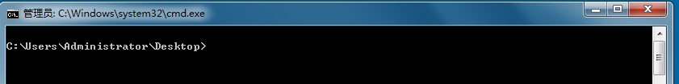

- 注意，所在目录将会是你创建项目的目录。

第二步：执行创建项目命令行

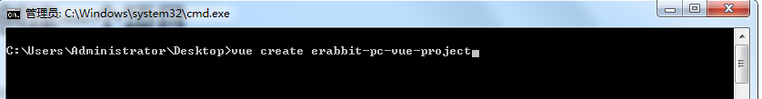

第三步：选择自定义创建

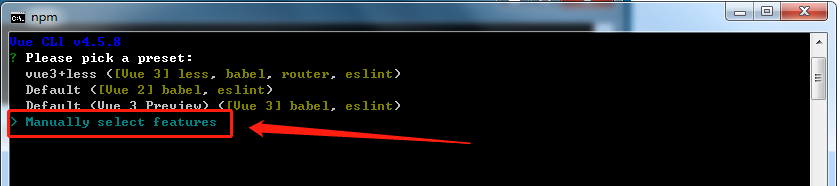

第四步：选中vue-router,vuex,css Pre-processors选项

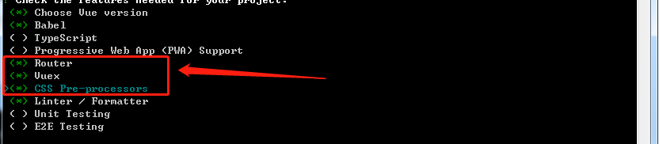

第五步：选择vue3.0版本

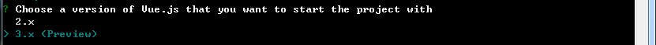

第六步：选择hash模式的路由

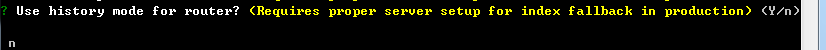

第七步：选择less作为预处理器

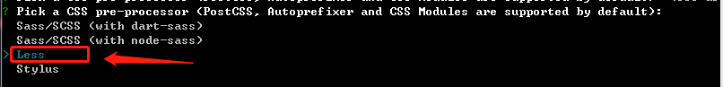

第八步：选择 standard 标准代码风格

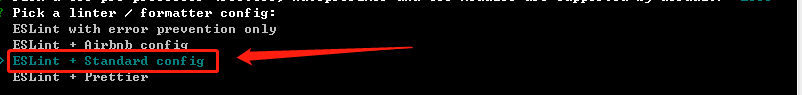

第九步：保存代码校验代码风格，代码提交时候校验代码风格

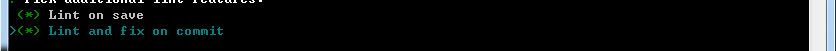

第十步：依赖插件或者工具的配置文件分文件保存

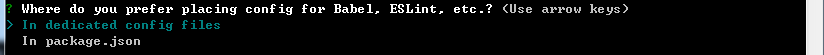

第十一步：是否记录以上操作，选择否

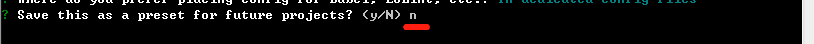

第十二步：等待安装...

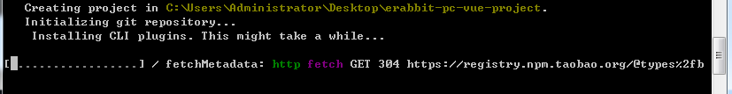

最后：安装完毕

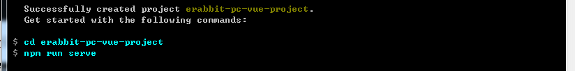

> 总结：选中Vue3版本，包括路由、Vuex、less预处理等信息。
>

## 目录调整

> 目的：对项目功能模块进行拆分。

大致步骤：

- 删除无用代码和文件
- 完善项目的基础结构
- 读懂默认生成的代码

落的代码：

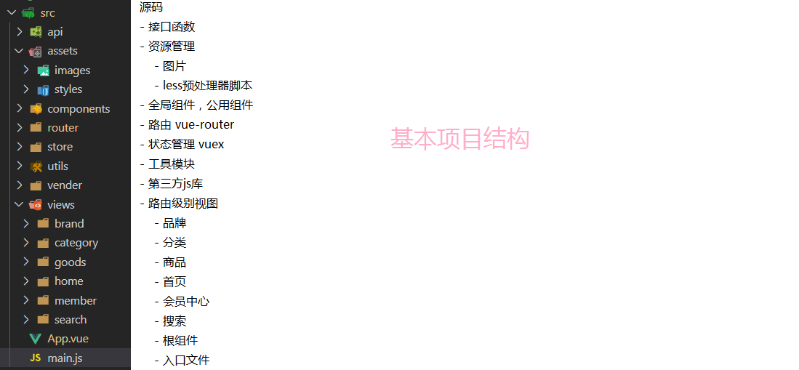

注意：以上结构目录及供参考

**需要注意的一些文件：**

- `router/index.js` 

```js
import { createRouter, createWebHashHistory } from 'vue-router'

const routes = []

// 创建路由实例
const router = createRouter({
  // 使用hash方式实现路由
  history: createWebHashHistory(),
  // 配置路由规则，写法和之前一样
  routes
})

export default router
```

> vue3.0中createRouter来创建路由实例，createWebHashHistory代表使用hash模式的路由。
>

- `store/index.js`

```js
import { createStore } from 'vuex'

// 创建vuex仓库并导出
export default createStore({
  state: {
    // 数据
  },
  mutations: {
    // 改数据函数
  },
  actions: {
    // 请求数据函数
  },
  modules: {
    // 分模块
  },
  getters: {
    // vuex的计算属性
  }
})
```

> vue3.0中createStore来创建vuex实例。
>

- `main.js`

```js
import { createApp } from 'vue'
import App from './App.vue'
import router from './router'
import store from './store'

// 创建一个vue应用实例
createApp(App).use(store).use(router).mount('#app')
```

> vue3.0中createApp来创建应用app。
>

**额外增加两个配置文件（项目的根下面）：**

- `jsconfig.json`

```json
{
  "compilerOptions": {
    "baseUrl": ".",
    "paths": {
      "@/*": ["./src/*"],
    }
  },
  "exclude": ["node_modules", "dist"]
}
```

> 当我们使用路径别名@的时候可以提示路径。
>

- `.eslintignore`

```js
/dist
/src/vender
```

> eslint在做风格检查的时候忽略 dist 和 vender 不去检查。
>

## 基于git管理项目

- git init 
- git add .
- git commit -m '初始化仓库'
- 创建远程仓库
- 添加远程仓库的别名 git remote add origin https://gitee.com/wzj1031/erabbit-132.git
- 推送代码 git push -u origin master

> 总结：
>
> 1. 如果希望提交空目录，需要在目录中创建一个.gitkeep文件，然后提交即可，如果后续在目录写代码了，那么.gitkeep 文件就可以删除了

## Vuex的基本使用

> 目的：知道每个配置作用，根模块vue3.0的用法，带命名空间模块再vue3.0的用法

1. 根模块的用法

定义

```js
import { createStore } from 'vuex'

export default createStore({
  state: {
    info: 'hello'
  },
  mutations: {
    // 定义mutation，用于修改状态
    updateInfo (state, payload) {
      state.info = payload
    }
  },
  actions: {
    // 2秒后更新状态
    updateInfo (context, payload) {
      setTimeout(() => {
        context.commit('updateInfo', payload)
      }, 2000)
    }
  },
  getters: {
    // 定义一个getters
    formatInfo (state) {
      return state.info + 'Tom'
    }
  },
  modules: {
  }
})
```

使用

```vue
<template>
  <div>主页</div>
  <div>获取Store中的state: {{$store.getters.formatInfo}}</div>
  <button @click='handleClick'>点击</button>
</template>

<script>
import { useStore } from 'vuex'

export default {
  name: 'App',
  setup () {
    // this.$store.state.info
    // Vue3中store类似于Vue2中this.$store
    const store = useStore()
    console.log(store.state.info)
    // 修改info的值
    const handleClick = () => {
      // 触发mutation，用于修改state的信息
      // store.commit('updateInfo', 'nihao')
      store.dispatch('updateInfo', 'hi')
    }
    return { handleClick }
  }
}
</script>
```

> 总结：熟悉vuex核心概念的用法：state、mutation、action、getters

2. modules  (分模块)

- 存在两种情况
  - 默认的模块，`state`  `getters` `mutations` `actions`  都是全局的。
  - 带命名空间  `namespaced: true`  的模块，所有功能区分模块，更高封装度和复用。

```js
import { createStore } from 'vuex'
// 全局模块
import global from './modules/global'
// 局部模块
import cart from './modules/cart'
import user from './modules/user'
import cate from './modules/cate'

export default createStore({
  // 全局模块
  ...global,
  // 局部模块
  modules: {
    cart,
    user,
    cate
  }
})
```

使用：

```vue
<template>
  <div>主页</div>
  <div>获取Store中的state: {{$store.getters.formatInfo}}</div>
  <!-- ------------------------------------- -->
  <!-- 获取局部模板的状态 -->
  <div>获取user局部模块状态：{{$store.state.user.uname}}</div>
  <button @click='handleClick'>点击</button>
</template>

<script>
import { useStore } from 'vuex'

export default {
  name: 'App',
  setup () {
    // this.$store.state.info
    // Vue3中store类似于Vue2中this.$store
    const store = useStore()
    console.log(store.state.info)
    // 修改info的值
    const handleClick = () => {
      // 触发mutation，用于修改state的信息
      // store.commit('updateInfo', 'nihao')
      store.dispatch('updateInfo', 'hi')
      // 修改user局部模板的状态
      store.commit('user/updateUname', 'jerry')
    }
    return { handleClick }
  }
}
</script>
```

> 总结：
>
> 1. 为了防止单个模块过于臃肿，可以进行store的模块拆分，方便后期维护
> 2. 拆分为全局模板和局部模块

## vuex-持久化

> 目的：让在vuex中管理的状态数据同时存储在本地。可免去自己存储的环节。

- 在开发的过程中，像用户信息（名字，头像，token）需要vuex中存储且需要本地存储。
- 再例如，购物车如果需要未登录状态下也支持，如果管理在vuex中页需要存储在本地。
- 我们需要category模块存储分类信息，但是分类信息不需要持久化。

1）首先：我们需要安装一个vuex的插件`vuex-persistedstate`来支持vuex的状态持久化。

```bash
npm i vuex-persistedstate
```

2）然后：在`src/store` 文件夹下新建 `modules` 文件，在 `modules` 下新建 `user.js`  和 `cart.js` 

`src/store/modules/user.js`     

```js
// 用户模块
export default {
  namespaced: true,
  state () {
    return {
      // 用户信息
      profile: {
        id: '',
        avatar: '',
        nickname: '',
        account: '',
        mobile: '',
        token: ''
      }
    }
  },
  mutations: {
    // 修改用户信息，payload就是用户信息对象
    setUser (state, payload) {
      state.profile = payload
    }
  }
}

```

`src/store/modules/cart.js  `    

```js
// 购物车状态
export default {
  namespaced: true,
  state: () => {
    return {
      list: []
    }
  }
}
```

3）继续：在 `src/store/index.js` 中导入 user cart cate模块。

```js
import { createStore } from 'vuex'

import user from './modules/user'
import cart from './modules/cart'
import cate from './modules/cate'

export default createStore({
  modules: {
    user,
    cart,
    cate
  }
})
```

4）最后：使用vuex-persistedstate插件来进行持久化

```diff
import { createStore } from 'vuex'
+import createPersistedstate from 'vuex-persistedstate'

import user from './modules/user'
import cart from './modules/cart'
import cate from './modules/cate'

export default createStore({
  modules: {
    user,
    cart,
    cate
  },
+  plugins: [
+    createPersistedstate({
+      key: 'erabbit-client-pc-store',
+      paths: ['user', 'cart']
+    })
+  ]
})
```

**注意：**

===> 默认是存储在localStorage中

===> key是存储数据的键名

===> paths是存储state中的那些数据，如果是模块下具体的数据需要加上模块名称，如`user.token`

===> 修改state后触发才可以看到本地存储数据的的变化。

> 总结：
>
> 1. 基于第三方包实现vuex中的数据的持久化
> 2. 触发持久化的条件是state发生变化

## 请求通用模块封装

> 目的：基于axios封装一个请求工具，调用接口时使用。

- 安装 axios

```bash
npm i axios
```

- 新建 `src/utils/request.js` 模块，代码如下

```js
// 通用接口调用模块
import axios from 'axios'
import store from '@/store'
import router from '@/router'

// 接口调用基准路径
export const baseURL = ''

// 创建一个独立的实例对象
const instance = axios.create({
  baseURL: baseURL
})

// 响应拦截器
instance.interceptors.response.use(res => {
  // 把返回的数据去掉一层data属性
  return res.data
}, err => {
  // 处理token实现的问题
  if (err.response && err.response.status === 401) {
    // token失效了，跳转到登录页
    return router.push('/login')
  }
  return Promise.reject(err)
})

// 请求拦截器
instance.interceptors.request.use(config => {
  // 统一添加请求头
  const token = store.state.user.profile.token
  if (token) {
    // 已经登录成功，统一添加token
    config.headers.Authorization = `Bearer ${token}`
  }
  return config
}, err => {
  return Promise.reject(err)
})

// 封装通用的接口调用方法
export default (options) => {
  return instance({
    method: options.method || 'GET',
    url: options.url,
    // ES6规则：对象的key可以是动态的变量
    [options.method.toUpperCase() === 'GET' ? 'params' : 'data']: options.data
  })
}

// import request from './request.js'
// request({
//   method: 'post',
//   url: '#',
//   data: {
//     account: 'admin',
//     pwd: 123
//   }
// })
```

> 总结：
>
> 1. 创建axios实例
> 2. 封装通用的请求方法
> 3. 配置相关的参数，统一处理请求参数
> 4. 请求拦截器：处理请求头token
> 5. 响应拦截器：1、处理后端返回的数据；2、处理token的失效问题
>
> 注意：对象的键可以是动态的变量（ES6的规则）

## 路由设计

> 目的：知道项目路由层级的设计

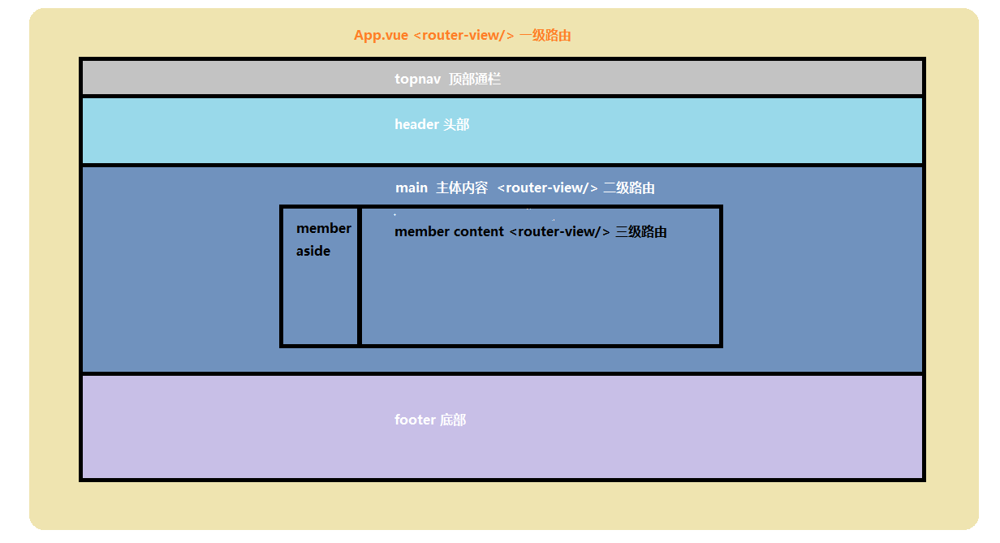


| 路径               | 组件（功能）     | 嵌套级别 |
| ------------------ | ---------------- | -------- |
| /                  | 首页布局容器     | 1级      |
| /                  | 首页             | 2级      |
| /category/:id      | 一级分类         | 2级      |
| /category/sub/:id  | 二级分类         | 2级      |
| /product/:id       | 商品详情         | 2级      |
| /login             | 登录             | 1级      |
| /login/callback    | 第三方登录回调   | 1级      |
| /cart              | 购物车           | 2级      |
| /member/checkout   | 填写订单         | 2级      |
| /member/pay        | 进行支付         | 2级      |
| /member/pay/result | 支付结果         | 2级      |
| /member            | 个人中心布局容器 | 2级      |
| /member            | 个人中心         | 3级      |
| /member/order      | 订单管理         | 3级      |
| /member/order/:id  | 订单详情         | 3级      |

> 总结
>
> 1. 一级路由：登录页面和主页面
> 2. 二级路由：主页中间部分
> 3. 三级路由：个人中心中的订单信息切换