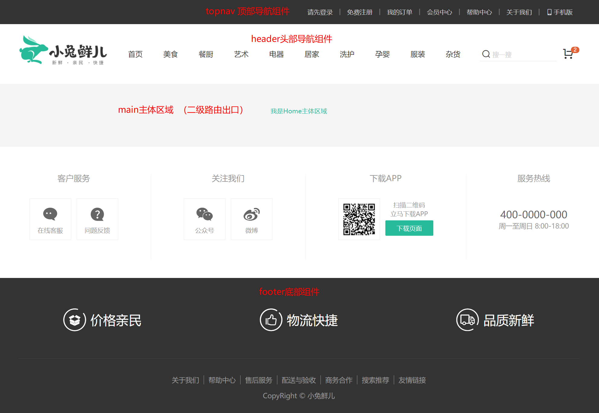
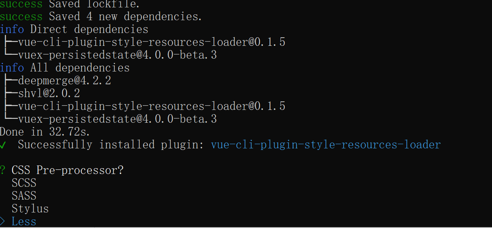
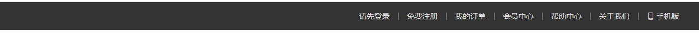
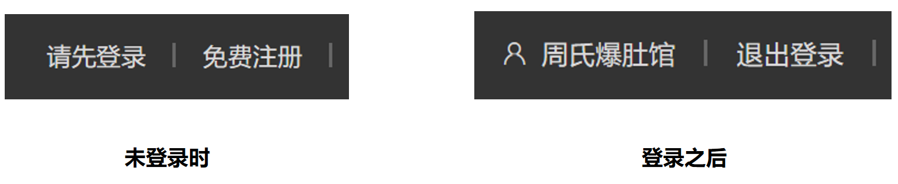
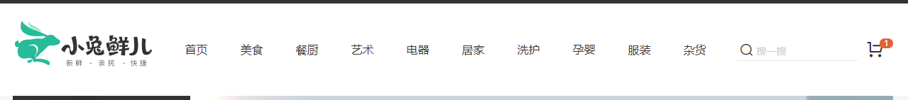
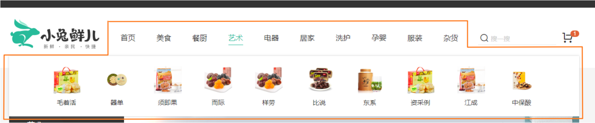
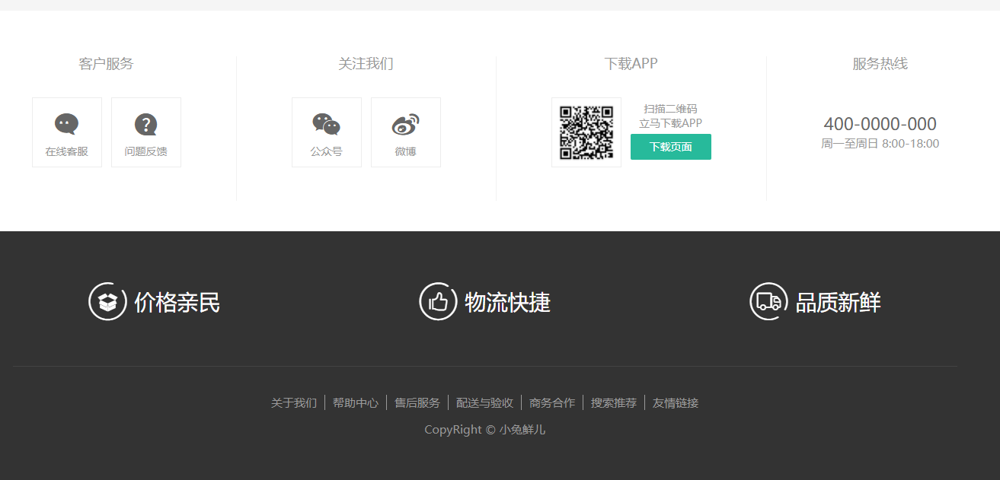

# 路由和组件



`任务目标:`  配置首页路由和组件的嵌套关系

1）根组件下定义一级路由组件出口 `src/App.vue`

```vue
<template>
  <!-- 一级路由 -->
  <router-view></router-view>
</template>
```

2）定义一级路由布局容器组件`src/views/layout/index.vue`

```vue
<template>
  <nav>顶部通栏</nav>
  <header>头部</header>
  <main>
    <!-- 二级路由出口 -->
    <router-view></router-view>
  </main>
  <footer>底部</footer>
</template>

<script>
export default {
  name: 'xtx-layout'
}
</script>
```

3）二级路由首页组件 `src/views/home/index.vue`

```vue
<template>
  <div class='xtx-home-page'>
    首页
  </div>
</template>

<script>
export default {
  name: 'xtx-home-page'
}
</script>

<style scoped lang='less'></style>
```

4）配置路由规则  `src/router/index.js`

```js
import { createRouter, createWebHashHistory } from 'vue-router'
// 路由组件的按需加载（懒加载）
const Login = () => import('@/views/login/index.vue')
const Layout = () => import('@/views/layout/index.vue')
const Home = () => import('@/views/home/index.vue')

const routes = [
  // 主页面路由配置
  {
    path: '/',
    component: Layout,
    children: [
      // 主页二级路由配置
      { path: '/', component: Home }
    ]
  },
  // 登录页面路由配置
  { path: '/login', component: Login }
]

const router = createRouter({
  history: createWebHashHistory(),
  routes
})

export default router
```

> 总结：
>
> 1. 配置主页的基本结构
> 2. 配置一级和二级的路由映射

# Less的自动化导入

`任务目标:` 让业务组件自动加入公共样式（全局字体色值）

> 我们开发的应用有些样式是公用的，比如我们常见的配色色值，为了做到统一修改的目的往往需要定义成`less变量`，很多的业务组件都需要使用这些变量，如果我们每一个业务组件都手动引入然后使用的话，开发量巨大，所以为了解决这个问题，我们采取自动导入的方式，方便我们业务组件使用全局less变量

## 手动引入方案

1）准备样式变量文件  `src/styles/variables.less`

```less
// 主题
@xtxColor:#27BA9B;
// 辅助
@helpColor:#E26237;
// 成功
@sucColor:#1DC779;
// 警告
@warnColor:#FFB302;
// 价格
@priceColor:#CF4444;
```

2）手动引入使用其中的变量

> 在`app.vue`文件中进行简单测试

```less
<template>
  <!-- 一级路由出口 -->
  <router-view />
  <div class="test">我是测试文字</div>
</template>

<style lang="less" scoped>
// 引入我们定义了less变量的文件
// ~线不能丢
@import "~@/styles/variables.less";
.test {
  color: @xtxColor;
}
</style>
```

> 总结：
>
> 1. less文件定义的变量，在组件中使用时，需要单独导入（每个组件使用时都需要导入）
> 2. 导入时需求前面添加波浪线 ~

## 自动引入方案

> 解决方案：使用vue-cli的style-resoures-loader插件来完成自动注入到每个vue组件中style标签中

1）在当前项目下执行一下命令`vue add style-resources-loader`，添加一个vue-cli的插件



2） 安装完毕后会在`vue.config.js`中自动添加配置，如下：

```js
module.exports = {
  pluginOptions: {
    'style-resources-loader': {
      preProcessor: 'less',
      patterns: []
    }
  }
}
```

3）把需要注入的文件配置一下后，重启服务即可

```js
const path = require('path')
module.exports = {
  pluginOptions: {
    'style-resources-loader': {
      preProcessor: 'less',
      patterns: [
        // 配置哪些文件需要自动导入
        path.join(__dirname, './src/styles/variables.less')
      ]
    }
  }
}
```

测试一下，我们不再需要在组件中手动import引入less文件了，直接使用就可以了，nice~

> 总结：
>
> 1. 通过vue脚手架的插件，可以辅助自动化导入less文件
> 2. 后续其他组件在使用less变量时，就不再需要手动导入了

# 重置样式与公用样式

`任务目标:` 让业务组件加入公共样式

1）重置样式

执行 `npm i normalize.css` 安装重置样式的包，然后在 `main.js` 导入 `normalize.css` 即可

```diff
import { createApp } from 'vue'
import App from './App.vue'
import router from './router'
import store from './store'
+import 'normalize.css'
createApp(App).use(store).use(router).mount('#app')
```

2） 公用样式

- 新建文件 `src/styles/common.less` 在该文件写入常用的样式，然后在 `main.js` 导入即可

```less
// 重置样式
* {
  box-sizing: border-box;
 }
 
 html {
   height: 100%;
   font-size: 14px;
 }
 body {
   height: 100%;
   color: #333;
   min-width: 1240px;
   font: 1em/1.4 'Microsoft Yahei', 'PingFang SC', 'Avenir', 'Segoe UI', 'Hiragino Sans GB', 'STHeiti', 'Microsoft Sans Serif', 'WenQuanYi Micro Hei', sans-serif
 }
 
 ul,
 h1,
 h3,
 h4,
 p,
 dl,
 dd {
   padding: 0;
   margin: 0;
 }
 a {
   text-decoration: none;
   color: #333;
   outline: none;
 }
 i {
   font-style: normal;
 }
 input[type="text"],
 input[type="search"],
 input[type="password"], 
 input[type="checkbox"]{
   padding: 0;
   outline: none;
   border: none;
   -webkit-appearance: none;
   &::placeholder{
     color: #ccc;
   }
 }
 img {
   max-width: 100%;
   max-height: 100%;
   vertical-align: middle;
   background: #ebebeb url(../assets/images/200.png) no-repeat center / contain;
 }
 ul {
   list-style: none;
 }
 #app {
   background: #f5f5f5;
   user-select: none;
 }
 
 .container {
   width: 1240px;
   margin: 0 auto;
   position: relative;
 }
 .ellipsis {
   white-space: nowrap;
   text-overflow: ellipsis;
   overflow: hidden;
 }
 
 .ellipsis-2 {
   word-break: break-all;
   text-overflow: ellipsis;
   display: -webkit-box;
   -webkit-box-orient: vertical;
   -webkit-line-clamp: 2;
   overflow: hidden;
 }
 
 .fl {
   float: left;
 }
 
 .fr {
   float: right;
 }
 
 .clearfix:after {
   content: ".";
   display: block;
   visibility: hidden;
   height: 0;
   line-height: 0;
   clear: both;
 }
```

- 入口文件导入样式`src/main.js`

```diff
import { createApp } from 'vue'
import App from './App.vue'
import router from './router'
import store from './store'

import 'normalize.css'
+import '@/styles/common.less'

createApp(App).use(store).use(router).mount('#app')
```

> 总结：
>
> 1. 重置样式，屏蔽浏览器之间的差异
> 2. 添加全局通用样式文件

# Layout组件布局


## 顶部通栏布局

`任务目标:`  完成Layou组件的顶部通栏组件布局



1）在 `public/index.html` 引入字体图标文件

```html
<link rel="stylesheet" href="//at.alicdn.com/t/font_2143783_iq6z4ey5vu.css">
```

2）然后，新建头部导航组件`src/views/layout/components/top-nav.vue`

```vue
<template>
  <nav class="app-topnav">
    <div class="container">
      <ul>
        <li><a href="javascript:;"><i class="iconfont icon-user"></i>周杰伦</a></li>
        <li><a href="javascript:;">退出登录</a></li>
        <li><a href="javascript:;">请先登录</a></li>
        <li><a href="javascript:;">免费注册</a></li>
        <li><a href="javascript:;">我的订单</a></li>
        <li><a href="javascript:;">会员中心</a></li>
        <li><a href="javascript:;">帮助中心</a></li>
        <li><a href="javascript:;">关于我们</a></li>
        <li><a href="javascript:;"><i class="iconfont icon-phone"></i>手机版</a></li>
      </ul>
    </div>
  </nav>
</template>
<script>
export default {
  name: 'AppTopnav'
}
</script>
<style scoped lang="less">
.app-topnav {
  background: #333;
  ul {
    display: flex;
    height: 53px;
    justify-content: flex-end;
    align-items: center;
    li {
      a {
        padding: 0 15px;
        color: #cdcdcd;
        line-height: 1;
        display: inline-block;
        i {
          font-size: 14px;
          margin-right: 2px;
        }
        &:hover {
          color: @xtxColor;
        }
      }
    }
  }
}
</style>
```

3）在 `src/views/layout/index.vue` 中导入使用

```html
<template>
  <!-- 顶部通栏 -->
  <TopNav />
  <header>头部</header>
  <main>
    <!-- 二级路由 -->
    <router-view></router-view>
  </main>
  <footer>底部</footer>
</template>

<script>
import TopNav from './components/top-nav.vue'
export default {
  name: 'XtxLayout',
  components: { TopNav }
}
</script>
```

4）根据当前的登录状态显示  用户名和退出登录



- 顶部通栏组件`src/views/layout/components/top-nav.vue`

```vue
<ul>
    <template v-if="$store.state.user.profile.token">
      <li><a href="javascript:;"><i class="iconfont icon-user"></i>周杰伦</a></li>
      <li><a href="javascript:;">退出登录</a></li>
    </template>
    <template v-else>
      <li><a href="javascript:;">请先登录</a></li>
      <li><a href="javascript:;">免费注册</a></li>
    </template>
    <li><a href="javascript:;">我的订单</a></li>
    <li><a href="javascript:;">会员中心</a></li>
    <li><a href="javascript:;">帮助中心</a></li>
    <li><a href="javascript:;">关于我们</a></li>
    <li><a href="javascript:;"><i class="iconfont icon-phone"></i>手机版</a></li>
</ul>
```

> 总结：
>
> 1. 顶部通栏的基本布局
> 2. 根据登录信息（vuex中）控制用户信息的显示
>
> 注意：熟悉模板内部template标签的用法

## 头部布局

`任务目标:`  完成Layout组件的头部布局



1）新建header头部组件`src/views/ayout/components/top-header.vue`

```vue
<template>
  <header class='app-header'>
    <div class="container">
      <h1 class="logo"><RouterLink to="/">小兔鲜</RouterLink></h1>
      <ul class="navs">
        <li class="home"><RouterLink to="/">首页</RouterLink></li>
        <li><a href="#">美食</a></li>
        <li><a href="#">餐厨</a></li>
        <li><a href="#">艺术</a></li>
        <li><a href="#">电器</a></li>
        <li><a href="#">居家</a></li>
        <li><a href="#">洗护</a></li>
        <li><a href="#">孕婴</a></li>
        <li><a href="#">服装</a></li>
        <li><a href="#">杂货</a></li>
      </ul>
      <div class="search">
        <i class="iconfont icon-search"></i>
        <input type="text" placeholder="搜一搜">
      </div>
      <div class="cart">
        <a class="curr" href="#">
          <i class="iconfont icon-cart"></i><em>2</em>
        </a>
      </div>
    </div>
  </header>
</template>

<script>
export default {
  name: 'AppHeader'
}
</script>

<style scoped lang='less'>
.app-header {
  background: #fff;
  .container {
    display: flex;
    align-items: center;
  }
  .logo {
    width: 200px;
    a {
      display: block;
      height: 132px;
      width: 100%;
      text-indent: -9999px;
      background: url('~@/assets/images/logo.png') no-repeat center 18px / contain;
    }
  }
  .navs {
    width: 820px;
    display: flex;
    justify-content: space-around;
    padding-left: 40px;
    li {
      margin-right: 40px;
      width: 38px;
      text-align: center;
      a {
        font-size: 16px;
        line-height: 32px;
        height: 32px;
        display: inline-block;
      }
      &:hover {
        a {
          color: @xtxColor;
          border-bottom: 1px solid @xtxColor;
        }
      }
    }
  }
  .search {
    width: 170px;
    height: 32px;
    position: relative;
    border-bottom: 1px solid #e7e7e7;
    line-height: 32px;
    .icon-search {
      font-size: 18px;
      margin-left: 5px;
    }
    input {
      width: 140px;
      padding-left: 5px;
      color: #666;
    }
  }
  .cart {
    width: 50px;
    .curr {
      height: 32px;
      line-height: 32px;
      text-align: center;
      position: relative;
      display: block;
      .icon-cart{
        font-size: 22px;
      }
      em {
        font-style: normal;
        position: absolute;
        right: 0;
        top: 0;
        padding: 1px 6px;
        line-height: 1;
        background: @helpColor;
        color: #fff;
        font-size: 12px;
        border-radius: 10px;
        font-family: Arial;
      }
    }
  }
}
</style>
```

2）在 `src/views/layout/index.vue` 中导入使用

```html
<template>
  <!-- 顶部通栏 -->
  <AppTopnav/>
  <!-- 头部组件 -->
  <AppHeader/>
  <main>
    <!-- 二级路由 -->
    <router-view></router-view>
  </main>
  <footer>底部</footer>
</template>

<script>
import TopNav from './components/top-nav'
import Header from './components/header'
export default {
  name: 'XtxLayout',
   components: {
    TopNav,
    Header
  }
}
</script>
```

> 总结：实现顶部导航栏基本布局

## 抽离分类导航组件

`任务目标:` 提取头部分类导航组件，提供给头部




1)	提取头部导航区域为一个组件`src/components/top-nav-common.vue` 

```vue
<template>
  <ul class="app-header-nav">
    <li class="home"><RouterLink to="/">首页</RouterLink></li>
    <li><a href="#">美食</a></li>
    <li><a href="#">餐厨</a></li>
    <li><a href="#">艺术</a></li>
    <li><a href="#">电器</a></li>
    <li><a href="#">居家</a></li>
    <li><a href="#">洗护</a></li>
    <li><a href="#">孕婴</a></li>
    <li><a href="#">服装</a></li>
    <li><a href="#">杂货</a></li>
  </ul>
</template>

<script>
export default {
  name: 'AppHeaderNav'
}
</script>

<style scoped lang='less'>
.app-header-nav {
  width: 820px;
  display: flex;
  padding-left: 40px;
  position: relative;
  z-index: 998;
  li {
    margin-right: 40px;
    width: 38px;
    text-align: center;
    a {
      font-size: 16px;
      line-height: 32px;
      height: 32px;
      display: inline-block;
    }
    &:hover {
      a {
        color: @xtxColor;
        border-bottom: 1px solid @xtxColor;
      }
    }
  }
}
</style>

```

2）在 `src/views/layout/components/header-sticky.vue` 中使用组件，注意，删除结构和样式

```html
<template>
  <header class='app-header'>
    <div class="container">
      <h1 class="logo"><RouterLink to="/">小兔鲜</RouterLink></h1>
      <!-- 头部导航区域 -->
      <HeaderNavCommon />
      <div class="search">
        <i class="iconfont icon-search"></i>
        <input type="text" placeholder="搜一搜">
      </div>
      <div class="cart">
        <a class="curr" href="#">
          <i class="iconfont icon-cart"></i><em>2</em>
        </a>
      </div>
    </div>
  </header>
</template>

<script>
import HeaderNavCommon from '@/components//header-nav-common'
export default {
  name: 'AppHeader',
  components: {
    HeaderNavCommon
  }
}
</script>
```

3）完善子级分类布局 `src/Layout/components/top-header-common.vue` 

> 一级分类鼠标hover的时候，会展示二级分类列表

```vue
<template>
  <ul class="app-header-nav">
    <li class="home"><RouterLink to="/">首页</RouterLink></li>
    <li>
      <a href="#">美食</a>
      <div class="layer">
        <ul>
          <li v-for="i in 10" :key="i">
            <a href="#">
              
              <p>果干</p>
            </a>
          </li>
        </ul>
      </div>
    </li>
    <li><a href="#">餐厨</a></li>
    <li><a href="#">艺术</a></li>
    <li><a href="#">电器</a></li>
    <li><a href="#">居家</a></li>
    <li><a href="#">洗护</a></li>
    <li><a href="#">孕婴</a></li>
    <li><a href="#">服装</a></li>
    <li><a href="#">杂货</a></li>
  </ul>
</template>

<script>
export default {
  name: 'AppHeaderNav'
}
</script>

<style scoped lang='less'>
.app-header-nav {
  width: 820px;
  display: flex;
  padding-left: 40px;
  position: relative;
  z-index: 998;
  > li {
    margin-right: 40px;
    width: 38px;
    text-align: center;
    > a {
      font-size: 16px;
      line-height: 32px;
      height: 32px;
      display: inline-block;
    }
    &:hover {
      > a {
        color: @xtxColor;
        border-bottom: 1px solid @xtxColor;
      }
    }
    // 初始样式 不显示
    .layer {
      width: 1240px;
      background-color: #fff;
      position: absolute;
      left: -200px;
      top: 56px;
      height: 0;
      overflow: hidden;
      opacity: 0;
      box-shadow: 0 0 5px #ccc;
      transition: all 0.2s 0.1s;
      ul {
        display: flex;
        flex-wrap: wrap;
        padding: 0 70px;
        align-items: center;
        height: 124px;
        li {
          width: 110px;
          text-align: center;
          img {
            width: 60px;
            height: 60px;
          }
          p {
            padding-top: 10px;
          }
          &:hover {
            p {
              color: @xtxColor;
            }
          }
        }
      }
    }
    // hover之后显示出来
    &:hover {
         // 加上 >
      > a {
        color: @xtxColor;
        border-bottom: 1px solid @xtxColor;
      }
      > .layer {
        height: 124px;
        opacity: 1;
      }
    }
  }
}
</style>
```

> 总结：
>
> 1. 拆分独立的导航组件（复用）
> 2. 悬停下拉效果（样式控制）

## 底部布局

`任务目标:`  完成Layou组件的顶部footer组件布局



1）新建底部组件`src/views/layout/components/bottom-footer.vue`

```vue
<template>
  <footer class="app_footer">
    <!-- 联系我们 -->
    <div class="contact">
      <div class="container">
        <dl>
          <dt>客户服务</dt>
          <dd><i class="iconfont icon-kefu"></i> 在线客服</dd>
          <dd><i class="iconfont icon-question"></i> 问题反馈</dd>
        </dl>
        <dl>
          <dt>关注我们</dt>
          <dd><i class="iconfont icon-weixin"></i> 公众号</dd>
          <dd><i class="iconfont icon-weibo"></i> 微博</dd>
        </dl>
        <dl>
          <dt>下载APP</dt>
          <dd class="qrcode"></dd>
          <dd class="download">
            <span>扫描二维码</span>
            <span>立马下载APP</span>
            <a href="javascript:;">下载页面</a>
          </dd>
        </dl>
        <dl>
          <dt>服务热线</dt>
          <dd class="hotline">400-0000-000 <small>周一至周日 8:00-18:00</small></dd>
        </dl>
      </div>
    </div>
    <!-- 其它 -->
    <div class="extra">
      <div class="container">
        <div class="slogan">
          <a href="javascript:;">
            <i class="iconfont icon-footer01"></i>
            <span>价格亲民</span>
          </a>
          <a href="javascript:;">
            <i class="iconfont icon-footer02"></i>
            <span>物流快捷</span>
          </a>
          <a href="javascript:;">
            <i class="iconfont icon-footer03"></i>
            <span>品质新鲜</span>
          </a>
        </div>
        <!-- 版权信息 -->
        <div class="copyright">
          <p>
            <a href="javascript:;">关于我们</a>
            <a href="javascript:;">帮助中心</a>
            <a href="javascript:;">售后服务</a>
            <a href="javascript:;">配送与验收</a>
            <a href="javascript:;">商务合作</a>
            <a href="javascript:;">搜索推荐</a>
            <a href="javascript:;">友情链接</a>
          </p>
          <p>CopyRight © 小兔鲜儿</p>
        </div>
      </div>
    </div>
  </footer>
</template>

<script>
export default {
  name: 'AppFooter'
}
</script>

<style scoped lang='less'>
.app_footer {
  overflow: hidden;
  background-color: #f5f5f5;
  padding-top: 20px;
  .contact {
    background: #fff;
    .container {
      padding: 60px 0 40px 25px;
      display: flex;
    }
    dl {
      height: 190px;
      text-align: center;
      padding: 0 72px;
      border-right: 1px solid #f2f2f2;
      color: #999;
      &:first-child {
        padding-left: 0;
      }
      &:last-child {
        border-right: none;
        padding-right: 0;
      }
    }
    dt {
      line-height: 1;
      font-size: 18px;
    }
    dd {
      margin: 36px 12px 0 0;
      float: left;
      width: 92px;
      height: 92px;
      padding-top: 10px;
      border: 1px solid #ededed;
      .iconfont {
        font-size: 36px;
        display: block;
        color: #666;
      }
      &:hover {
        .iconfont {
          color: @xtxColor;
        }
      }
      &:last-child {
        margin-right: 0;
      }
    }
    .qrcode {
      width: 92px;
      height: 92px;
      padding: 7px;
      border: 1px solid #ededed;
    }
    .download {
      padding-top: 5px;
      font-size: 14px;
      width: auto;
      height: auto;
      border: none;
      span {
        display: block;
      }
      a {
        display: block;
        line-height: 1;
        padding: 10px 25px;
        margin-top: 5px;
        color: #fff;
        border-radius: 2px;
        background-color: @xtxColor;
      }
    }
    .hotline {
      padding-top: 20px;
      font-size: 22px;
      color: #666;
      width: auto;
      height: auto;
      border: none;
      small {
        display: block;
        font-size: 15px;
        color: #999;
      }
    }
  }
  .extra {
    background-color: #333;
  }
  .slogan {
    height: 178px;
    line-height: 58px;
    padding: 60px 100px;
    border-bottom: 1px solid #434343;
    display: flex;
    justify-content: space-between;
    a {
      height: 58px;
      line-height: 58px;
      color: #fff;
      font-size: 28px;
      i {
        font-size: 50px;
        vertical-align: middle;
        margin-right: 10px;
        font-weight: 100;
      }
      span {
        vertical-align: middle;
        text-shadow: 0 0 1px #333;
      }
    }
  }
  .copyright {
    height: 170px;
    padding-top: 40px;
    text-align: center;
    color: #999;
    font-size: 15px;
    p {
      line-height: 1;
      margin-bottom: 20px;
    }
    a {
      color: #999;
      line-height: 1;
      padding: 0 10px;
      border-right: 1px solid #999;
      &:last-child {
        border-right: none;
      }
    }
  }
}
</style>

```

2）在 `src/views/layout/index.vue` 中导入使用

```html
<template>
 <!-- 顶部通栏组件 -->
  <TopNav />
  <!-- header区域 -->
  <Header />
  <main>
    <!-- 二级路由出口 -->
    <router-view></router-view>
  </main>
  <!-- 底部footer -->
  <Footer/>
</template>

<script>
import Footer from './components/footer'
export default {
  name: 'XtxLayout',
  components: { AppFooter }
}
</script>
```

> 总结：实现底部的基本布局
>


# 接口数据渲染导航

## 使用vuex管理分类数据

1）定义API函数  `src/api/home.js`

```js
// 定义首页需要的接口函数
import request from '@/utils/request'

// 获取顶部导航栏列表数据
export const findHeadCategory = () => {
  return request({
    method: 'get',
    url: '/home/category/head'
  })
}

```

2）定义一个vuex的cate模块，来存储分类数据，提供修改和获取的函数 `src/store/modules/cate.js`

```js
// 商品分类
import { findHeadCategory } from '@/api/home'

export default {
  namespaced: true,
  state: {
    list: []
  },
  mutations: {
    // 更新分类列表数据
    updateCate (state, payload) {
      state.list = payload
    }
  },
  actions: {
    // 调用接口获取分类的数据
    async findHeadCategory (context) {
      const ret = await findHeadCategory()
      if (ret && ret.result) {
        context.commit('updateCate', ret.result)
      }
    }
  },
  getters: {}
}
```

3）把cate模块挂载到vuex的实例上 `src/store/index.js`

```js
import cate from './cate.js'
```

```js
modules: {
    // 分模块
    user,
    cart,
    cate
}
```

> 总结：
>
> 1. 准备分类列表状态数据
> 2. 封装修改数据的mutation
> 3. 封装获取接口数据的action

- 触发action获取列表数据`src/compotents/top-nav-common.vue` 

```html
<template>
  <ul class="app-header-nav">
    <li class="home">
      <RouterLink to="/">首页</RouterLink>
    </li>
    <li>
      <a href="#">美食</a>
      <!-- 鼠标悬停时显示的碳层 -->
      <div class="layer">
        <ul>
          <li v-for="i in 10" :key="i">
            <a href="#">
              
              <p>果干</p>
            </a>
          </li>
        </ul>
      </div>
    </li>
    <li><a href="#">餐厨</a></li>
    <li><a href="#">艺术</a></li>
    <li><a href="#">电器</a></li>
    <li><a href="#">居家</a></li>
    <li><a href="#">洗护</a></li>
    <li><a href="#">孕婴</a></li>
    <li><a href="#">服装</a></li>
    <li><a href="#">杂货</a></li>
  </ul>
</template>

<script>
import { useStore } from 'vuex'

export default {
  name: 'AppHeaderNav',
  setup () {
    const store = useStore()
    store.dispatch('cate/findHeadCategory')
  }
}
</script>
```

> 总结：组件中触发action，通过vuex提供的数据动态渲染分类

- 分类列表数据的动态填充

```vue
<template>
  <ul class="app-header-nav">
    <li class="home">
      <RouterLink to="/">首页</RouterLink>
    </li>
    <li v-for='item in $store.state.cate.list' :key='item.id'>
      <!-- 一级分类 -->
      <a href="#">{{item.name}}</a>
      <!-- 鼠标悬停时显示的碳层 -->
      <div class="layer">
        <!-- 二级分类 -->
        <ul>
          <li v-for="cate in item.children" :key="cate.id">
            <a href="#">
              
              <p>{{cate.name}}</p>
            </a>
          </li>
        </ul>
      </div>
    </li>
  </ul>
</template>
```


# 吸顶头部交互实现 

> 电商网站的首页内容会比较多，会有很多频，为了能让用户在滚动浏览内容的过程中都能够快速的切换到其它模块，需要导航一直可见，所以需要一个吸顶导航的效果

## 传统实现

`任务目标:`  使用选项式api完成头部组件吸顶效果的实现

**交互要求**

1. 滚动距离大于等于78个px的时候，组件固定在视口顶部跟随页面移动
2. 滚动距离小于78个px的时候，组件消失

**实现思路**

1. 准备一个吸顶组件，准备一个类名，控制样式让其固定在顶部
2. 监听页面滚动，判断滚动距离，距离大于78px添加类名

**代码落地**

1）新建吸顶导航组件`src/layout/components/header-sticky.vue` 

```vue
<template>
  <div class="app-header-sticky">
    <div class="container">
      <!-- 左侧图标 -->
      <RouterLink class="logo" to="/" />
      <!-- 中间的分类导航菜单 -->
      <TopNavCommon />
      <!-- 右侧按钮 -->
      <div class="right">
        <RouterLink to="/">品牌</RouterLink>
        <RouterLink to="/">专题</RouterLink>
      </div>
    </div>
  </div>
</template>

<script>
import TopNavCommon from '@/components/top-nav-common.vue'

export default {
  name: 'AppHeaderSticky',
  components: { TopNavCommon }
}
</script>

<style scoped lang='less'>
.app-header-sticky {
  width: 100%;
  height: 80px;
  position: fixed;
  left: 0;
  top: 0;
  z-index: 999;
  background-color: #fff;
  border-bottom: 1px solid #e4e4e4;
  // 此处为关键样式!!!
  // 默认情况下完全把自己移动到上面
  transform: translateY(-100%);
  // 完全透明
  opacity: 0;
  // 显示出来的类名
  &.show {
    transition: all 0.3s linear;
    transform: none;
    opacity: 1;
  }
  .container {
    display: flex;
    align-items: center;
  }
  .logo {
    width: 200px;
    height: 80px;
    background: url('~@/assets/images/logo.png') no-repeat right 2px;
    background-size: 160px auto;
  }
  .right {
    width: 220px;
    display: flex;
    text-align: center;
    padding-left: 40px;
    border-left: 2px solid @xtxColor;
    a {
      width: 38px;
      margin-right: 40px;
      font-size: 16px;
      line-height: 1;
      &:hover {
        color: @xtxColor;
      }
    }
  }
}
</style>
```

2）Layout首页引入吸顶导航组件 `src/views/layout/index.vue`

```html
<template>
  <!-- 顶部通栏组件 -->
  <TopNav />
  <!-- header区域 -->
  <Header />
  <!-- 吸顶组件 -->
  <HeaderSticky/>
  <main>
    <!-- 二级路由出口 -->
    <router-view></router-view>
  </main>
  <!-- 底部footer -->
  <Footer/>
</template>

<script>
import TopNav from './components/top-nav'
import Header from './components/header'
import Footer from './components/footer'
import HeaderSticky from '@/components/header-sticky'
export default {
  name: 'XtxLayout',
  components: { AppTopnav, AppHeader, AppFooter, HeaderSticky  }
}
</script>
```

3）在滚动到78px完成显示效果（添加类名）

> 通过滚动事件的触发，在回调函数里判断当前是否已经滚动了78px，如果大于则添加类名，否则移除类名
>
> 1. document.documentElement.scrollTop  获取滚动距离
> 2. :class  动态控制类名显示

```diff
.app-header-sticky {
  width: 100%;
  height: 80px;
  position: fixed;
  left: 0;
  top: 0;
  z-index: 999;
  background-color: #fff;
  border-bottom: 1px solid #e4e4e4;
+  transform: translateY(-100%);
+  opacity: 0;
+  &.show {
+    transition: all 0.3s linear;
+    transform: none;
+    opacity: 1;
+  }
```

- 通过控制滚动距离，动态添加类名 `src/views/layout/components/header-sticky.vue`

```diff
import TopNavCommon from '@/components/top-nav-common'
export default {
  name: 'AppHeaderSticky',
  components: { TopNavCommon },
+  setup () {
+    const top = ref(0)
+      window.onscroll = () => {
+        const scrollTop = document.documentElement.scrollTop
+        top.value = scrollTop
+      }
+    return { top }
+  }
}
```

```vue
<template>
  <div class="app-header-sticky" :class='{show: top>=78}'>
    <div class="container" v-if='top>=78'>
```

> 总结：
>
> 1. 默认让组件出现在页面的顶部，可视区之外
> 2. 当页面滚动的距离超过78px时，添加一个类名，该类名控制吸顶组件显示出来

## 基于第三方实现

`任务目标:`  使用组合式API实现重构吸顶功能

> vueuse/core : 组合式API常用复用逻辑的集合
>
> https://vueuse.org/core/useWindowScroll/

1）安装@vueuse/core 包，它封装了常见的一些交互逻辑

```bash
npm i @vueuse/core@5.3.0
```

2）在吸顶导航中使用`src/components/header-sticky.vue` 

```vue
<template>
  <div class="app-header-sticky" :class="{show:top >= 78}">
    <div class="container" v-if='top>=78'>
      <RouterLink class="logo" to="/" />
      <HeaderNav />
      <div class="left">
        <RouterLink to="/" >品牌</RouterLink>
        <RouterLink to="/" >专题</RouterLink>
      </div>
    </div>
  </div>
</template>

<script>
import HeaderNav from './header-nav'
import { useWindowScroll } from '@vueuse/core'
export default {
  name: 'AppHeaderSticky',
  components: { HeaderNav },
  setup () {
    // y表示具体顶部的滚动距离 会动态更新
    const { y: top } = useWindowScroll()
    return { top }
  }
}
</script>
```

> 总结：
>
> 1. 安装npm i @vueuse/core@5.3.0版本号要锁定
> 2. 熟悉useWindowScroll方法的基本用法


## 回顾

- 主页layout结构：整个页面的主体规划
  - 顶部的通栏：阿里字体图标库的用法
  - 顶部的分类导航：拆分分类列表组件（多个地方都要使用这个部分）
  - 中间的二级路由填充位：前端路由（路由组件的填充位置）
  - 底部Footer：静态布局
- 实现顶部分类导航的功能
  - 动态获取分类的接口数据并且进行渲染：axios调用接口；vuex的基本使用（state/mutation/action/getters/modules）
  - 实现吸顶效果：1. 动态添加一个固定定位的类名即可吸顶；2. 监听页面的滚动事件
    - 基于原生js的规则实现
    - 基于第三方实现：vueuse/core 包提供一个方法实现滚动的监控