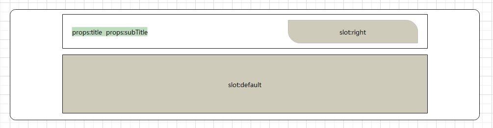
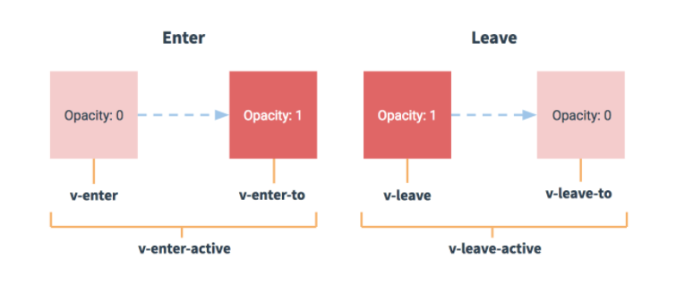

# 首页模块

## 首页主体-左侧分类-结构渲染

> **目的：** 实现首页主体内容-左侧分类

大致步骤：

- 准备左侧分类组件数据和基础布局
- 从vuex中拿出9个分类数据，且值需要两个子分类，但是左侧是10个，需要补充一个品牌数据。
- 动态渲染组件


1. 设置一级分类的默认数据

- 9个分类数据

```js
// 默认的分类数据  '@/utils/constant.js'
export const category = [
  '居家',
  '美食',
  '服饰',
  '母婴',
  '个护',
  '严选',
  '运动',
  '杂项',
  '数码'
]

// 提供默认的分类数据，防止出现空白的分类效果
import { category } from '@/utils/constant.js'

export default {
  namespaced: true,
  state: {
    // list: [{id: 0, name: '居家'}]
    list: category.map((item, index) => ({ id: index, name: item }))
  },
```

- 准备组件：`src/views/home/components/home-cate.vue`  

```vue
<template>
  <div class='home-category'>
    <ul class="menu">
      <li v-for="i in 10" :key="i">
        <RouterLink to="/">居家</RouterLink>
        <RouterLink to="/">洗漱</RouterLink>
        <RouterLink to="/">清洁</RouterLink>  
      </li>
    </ul>
  </div>
</template>

<script>
export default {
  name: 'HomeCategory'
}
</script>

<style scoped lang='less'>
.home-category {
  width: 250px;
  height: 500px;
  background: rgba(0,0,0,0.8);
  position: relative;
  z-index: 99;
  .menu {
    li {
      padding-left: 40px;
      height: 50px;
      line-height: 50px;
      &:hover {
        background: @xtxColor;
      }
      a {
        margin-right: 4px;
        color: #fff;
        &:first-child {
          font-size: 16px;
        }
      }
    }
  }
}
</style>
```

- 预览组件：`src/views/home/index.vue`

```vue
<template>
  <div class="page-home">
      <div class="container">
        <!-- 左侧分类 -->
        <HomeCategory />
      </div>
  </div>
</template>
<script>
import HomeCategory from './components/home-cate.vue'
export default {
  name: 'PageHome',
  components: { HomeCategory }
}
</script>
<style scoped lang='less'>
.xtx-home-page {
  .container {
    width: 1240px;
    margin: 0 auto;
    position: relative;
  }
}
</style>
```

> 总结：准备分类组件的基本布局，导入并使用

2. 从vuex中拿出分类，取出子分类中的前两项。给一级分类追加一项品牌，进行渲染。

- 通过getters取出两个子分类

```js
getters: {
  // 获取主页的分类数据（二级分类只要前两项）
  cateList (state) {
    return state.list.map(item => {
      // 拷贝一份新的对象，不要直接修改item中的数据
      return {
        ...item,
        children: item.children && item.children.filter((item, i) => i < 2)
      }
    })
  }
}
```
- 动态渲染左侧分类
```vue
<template>
  <div class='home-category'>
    <ul class="menu">
      <li v-for="item in $store.getters['cate/cateList']" :key="item.id">
        <RouterLink to="/">{{item.name}}</RouterLink>
        <RouterLink v-for='cate in item.children' :key='cate.id' to="/">{{cate.name}}</RouterLink>
      </li>
    </ul>
  </div>
</template>

<script>
export default {
  name: 'HomeCategory'
}
</script>
```

> 总结：基于store中的数据对分类数据进行动态处理（获取两项子分类），然后进行展示
>
> 注意：getters中加工处理二级分类的数据，不要修改原始的数据，否则会影响悬停的列表效果

3. 手动添加一个品牌数据

```js
<script>
import { ref, computed, reactive } from 'vue'
import { useStore } from 'vuex'
import { findBrand } from '@/api/home.js'
export default {
  name: 'HomeCategory',
  setup () {
    const store = useStore()
    // 当前选中的一级分类的id
    const categoryId = ref(null)
    // 基于id获取右侧对应的商品数据
    const goods = computed(() => {
      const cate = store.getters['cate/cateList'].find(item => {
        return item.id === categoryId.value
      })
      return cate ? cate.goods : []
    })
    // 动态添加一个品牌数据
    const brand = reactive({
      id: 'brandId',
      name: '品牌',
      children: [
        { id: 'subBrandId', name: '品牌推荐' }
      ],
      // 右侧弹窗数据
      brands: []
    })
    // 获取品牌的列表数据
    findBrand().then(ret => {
      brand.brands = ret.result
    })
    return { categoryId, goods, brand }
  }
}
</script>
```

> 总结：固定添加一份品牌的分类信息

## 首页主体-左侧分类-弹层展示

> **目的：** 实现首页主体内容-左侧分类-鼠标进入弹出


大致步骤：

- 准备布局
- 得到数据
  - 鼠标经过记录ID
  - 通过ID得到分类推荐商品，使用计算属性
  - 完成渲染


落地代码：

1. 准备布局：`src/views/home/components/home-cate.vue`  

```html
<!-- 弹层 -->
<div class="layer">
  <h4>分类推荐 <small>根据您的购买或浏览记录推荐</small></h4>
  <ul>
    <li v-for="i in 9" :key="i">
      <RouterLink to="/">
        
        <div class="info">
          <p class="name ellipsis-2">【定金购】严选零食大礼包（12件）</p>
          <p class="desc ellipsis">超值组合装，满足馋嘴欲</p>
          <p class="price"><i>¥</i>100.00</p>
        </div>
      </RouterLink>
    </li>
  </ul>
</div>
```

```less
.layer {
  width: 990px;
  height: 500px;
  background: rgba(255,255,255,0.8);
  position: absolute;
  left: 250px;
  top: 0;
  display: none;
  padding: 0 15px;
  h4 {
    font-size: 20px;
    font-weight: normal;
    line-height: 80px;
    small {
      font-size: 16px;
      color: #666;
    }
  }
  ul {
    display: flex;
    flex-wrap: wrap;
    li {
      width: 310px;
      height: 120px;
      margin-right: 15px;
      margin-bottom: 15px;
      border: 1px solid #eee;
      border-radius: 4px;
      background: #fff;
      &:nth-child(3n) {
        margin-right: 0;
      }
      a {
        display: flex;
        width: 100%;
        height: 100%;
        align-items: center;
        padding: 10px;
        &:hover {
          background: #e3f9f4;
        }
        img {
            width: 95px;
            height: 95px;
        }
        .info {
          padding-left: 10px;
          line-height: 24px;
      width: 190px;
          .name {
            font-size: 16px;
            color: #666;
          }
          .desc {
            color: #999;
          }
          .price {
            font-size: 22px;
            color: @priceColor;
            i {
              font-size: 16px;
            }
          }
        }
      }
    }
  }
}
&:hover {
  .layer {
    display: block;
  }
}
```

2. 渲染逻辑：`src/views/home/components/home-cate.vue`  

- 定义一个数据记录当前鼠标经过分类的ID，使用计算属性得到当前的分类推荐商品数据

```vue
<script>
import { ref, computed } from 'vue'
import { useStore } from 'vuex'

export default {
  name: 'HomeCategory',
  setup () {
    const store = useStore()
    // 当前选中的一级分类的id
    const categoryId = ref(null)
    // 基于id获取右侧对应的商品数据
    const goods = computed(() => {
      const cate = store.state.cate.list.find(item => item.id === categoryId.value)
      return cate ? cate.goods : []
    })

    return { categoryId, goods }
  }
}
</script>
```

- 渲染模版

```vue
<template>
  <div class='home-category'>
    <ul class="menu">
      <li @mouseenter="categoryId=item.id" v-for="item in $store.getters['cate/cateList']" :key="item.id">
        <RouterLink to="/">{{item.name}}</RouterLink>
        <RouterLink v-for='cate in item.children' :key='cate.id' to="/">{{cate.name}}</RouterLink>
      </li>
    </ul>
    <!-- 弹层 -->
    <div class="layer">
      <h4>分类推荐 <small>根据您的购买或浏览记录推荐</small></h4>
      <ul>
        <li v-for="item in goods" :key="item.id">
          <RouterLink to="/">
            
            <div class="info">
              <p class="name ellipsis-2">{{item.name}}</p>
              <p class="desc ellipsis">{{item.desc}}</p>
              <p class="price"><i>¥</i>{{item.price}}</p>
            </div>
          </RouterLink>
        </li>
      </ul>
    </div>
  </div>
</template>
```

> 总结：
>
> 1. 获取悬停分类时对应的一级分类id值
> 2. 根据id计算右侧的对应的分类商品信息（计算属性）
> 3. 右侧数据动态遍历
>
> 注意：计算属性的结果不要直接使用，建议进行严谨性判断

## 首页主体-左侧分类-处理品牌

> **目的：**  品牌展示特殊，需要额外获取数据和额外的布局。


大致步骤：

- 定义API接口，在 `home-cate.vue` 组件获取数据。
- 完成基础布局，根据数据进行渲染。
- 处理左侧分类激活显示。


落地代码：

1. 定义API接口，在 `home-category.vue` 组件获取数据。

`src/api/home.js`

```js
// 获取品牌数据
export const findBrand = (limit) => {
  return request({
    method: 'get',
    url: '/home/brand',
    data: { limit }
  })
}
```

- 单独添加品牌数据`src/views/home/components/home-category.vue`

```diff
    const brand = reactive({
      id: 'brand',
      name: '品牌',
      children: [{ id: 'brand-children', name: '品牌推荐' }],
+     brands: []
    })
```

```js
import { findBrand } from '@/api/home.js'
// setup函数无法使用async方式（async函数和普通函数本质上类型是不同）
setup () {
    // 准备品牌数据
    const brand = reactive({
      id: 'brandId',
      name: '品牌',
      children: [{ id: 'subBrandId', name: '品牌推荐' }],
      brands: []
    })
    // 获取品牌的数据
    findBrand().then(ret => {
      brand.brands = ret.result
    })
    return { brand }
}
```

2. 进行渲染：`src/views/home/components/home-cate.vue`

- 布局样式

```vue
<ul>
  <li class="brand" v-for="i in 6" :key="i">
    <RouterLink to="/">
      
      <div class="info">
        <p class="place"><i class="iconfont icon-dingwei"></i>北京</p>
        <p class="name ellipsis">DW</p>
        <p class="desc ellipsis-2">DW品牌闪购</p>
      </div>
    </RouterLink>
  </li>
</ul>
```

```less
li.brand {
  height: 180px;
  a {
    align-items: flex-start;
    img {
      width: 120px;
      height: 160px;
    }
    .info {
      p {
        margin-top: 8px;
      }
      .place {
        color: #999;
      }
    }
  }
}
```

- 获取品牌数据并进行渲染

```vue
<template>
  <div class='home-category'>
    <ul class="menu">
      <li @mouseenter="categoryId=item.id" v-for="item in $store.getters['cate/cateList']" :key="item.id">
        <RouterLink to="/">{{item.name}}</RouterLink>
        <RouterLink v-for='cate in item.children' :key='cate.id' to="/">{{cate.name}}</RouterLink>
      </li>
      <!-- 品牌项目 -->
      <li @mouseenter="categoryId='brandId'">
        <RouterLink to="/">{{brand.name}}</RouterLink>
        <RouterLink to="/">{{brand.children[0].name}}</RouterLink>
      </li>
    </ul>
    <!-- 弹层 -->
    <div class="layer" v-if='categoryId!=="brandId" && goods && goods.length'>
      <h4>分类推荐 <small>根据您的购买或浏览记录推荐</small></h4>
      <!-- 商品数据 -->
      <ul>
        <li v-for="item in goods" :key="item.id">
          <RouterLink to="/">
            
            <div class="info">
              <p class="name ellipsis-2">{{item.name}}</p>
              <p class="desc ellipsis">{{item.desc}}</p>
              <p class="price"><i>¥</i>{{item.price}}</p>
            </div>
          </RouterLink>
        </li>
      </ul>
    </div>
    <div class="layer" v-if='categoryId==="brandId" && brand.brands.length'>
      <h4>品牌推荐 <small>根据您的购买或浏览记录推荐</small></h4>
      <!-- 品牌数据 -->
      <ul>
        <li class="brand" v-for="item in brand.brands" :key="item.id">
          <RouterLink to="/">
            
            <div class="info">
              <p class="place"><i class="iconfont icon-dingwei"></i>{{item.place}}</p>
              <p class="name ellipsis">{{item.name}}</p>
              <p class="desc ellipsis-2">{{item.desc}}</p>
            </div>
          </RouterLink>
        </li>
      </ul>
    </div>
  </div>
</template>

<script>
import { ref, computed, reactive } from 'vue'
import { useStore } from 'vuex'
import { findBrand } from '@/api/home.js'

export default {
  name: 'HomeCategory',
  setup () {
    const store = useStore()
    // 当前选中的一级分类的id
    const categoryId = ref(null)
    // 基于id获取右侧对应的商品数据
    const goods = computed(() => {
      const cate = store.getters['cate/cateList'].find(item => {
        console.log(item.id, categoryId.value)
        return item.id === categoryId.value
      })
      return cate ? cate.goods : []
    })
    // 动态添加一个品牌数据
    const brand = reactive({
      id: 'brandId',
      name: '品牌',
      children: [
        { id: 'subBrandId', name: '品牌推荐' }
      ],
      // 右侧弹窗数据
      brands: []
    })
    // 获取品牌的列表数据
    findBrand().then(ret => {
      brand.brands = ret.result
    })
    return { categoryId, goods, brand }
  }
}
</script>
```

> 注意：getters中不要处理异步任务（不要调用接口）

3. 处理左侧分类激活显示 `src/views/home/components/home-cate.vue`

- 激活类active

```diff
  .menu {
    li {
      padding-left: 40px;
      height: 50px;
      line-height: 50px;
+      &:hover,&.active {
        background: @xtxColor;
      }
```

- 绑定类

```vue
<ul class="menu">
  <li :class='{active: categoryId===item.id}' @mouseenter="categoryId=item.id" v-for="item in $store.getters['cate/cateList']" :key="item.id">
    <RouterLink to="/">{{item.name}}</RouterLink>
    <RouterLink v-for='cate in item.children' :key='cate.id' to="/">{{cate.name}}</RouterLink>
  </li>
  <!-- 品牌项目 -->
  <li :class='{active: categoryId==="brandId"}' @mouseenter="categoryId='brandId'">
    <RouterLink to="/">{{brand.name}}</RouterLink>
    <RouterLink to="/">{{brand.children[0].name}}</RouterLink>
  </li>
</ul>
```

- 移除类

```diff
+  <div class='home-category' @mouseleave="categoryId=null">
    <ul class="menu">
```

> **总结：**  
>
> 1. 品牌数据需要请求后台，再汇总到所有数据中，
> 2. 然后渲染，
> 3. 然后激活当前的分类。


## 首页主体-左侧分类-骨架效果

> **目的：**  为了在加载的过程中等待效果更好，封装一个骨架屏组件。

大致步骤：

- 需要一个组件，做占位使用。这个占位组件有个专业术语：骨架屏组件。
  - 暴露一些属性：高，宽，背景，是否有闪动画。
- 这是一个公用组件，需要全局注册，将来这样的组件建议再vue插件中定义。
- 使用组件完成左侧分类骨架效果。


落的代码：

1. 封装组件：`src/components/library/xtx-skeleton.vue`

```vue
<template>
  <div class="xtx-skeleton" :style="{width,height}" :class="{shan:animated}">
    <!-- 1 盒子-->
    <div class="block" :style="{backgroundColor:bg}"></div>
    <!-- 2 闪效果 xtx-skeleton 伪元素 --->
  </div>
</template>
<script>
export default {
  name: 'XtxSkeleton',
  // 使用的时候需要动态设置 高度，宽度，背景颜色，是否闪下
  props: {
    bg: {
      type: String,
      default: '#efefef'
    },
    width: {
      type: String,
      default: '100px'
    },
    height: {
      type: String,
      default: '100px'
    },
    animated: {
      type: Boolean,
      default: false
    }
  }
}
</script>
<style scoped lang="less">
.xtx-skeleton {
  display: inline-block;
  position: relative;
  overflow: hidden;
  vertical-align: middle;
  .block {
    width: 100%;
    height: 100%;
    border-radius: 2px;
  }
}
.shan {
  &::after {
    content: "";
    position: absolute;
    animation: shan 1.5s ease 0s infinite;
    top: 0;
    width: 50%;
    height: 100%;
    background: linear-gradient(
      to left,
      rgba(255, 255, 255, 0) 0,
      rgba(255, 255, 255, 0.3) 50%,
      rgba(255, 255, 255, 0) 100%
    );
    transform: skewX(-45deg);
  }
}
@keyframes shan {
  0% {
    left: -100%;
  }
  100% {
    left: 120%;
  }
}
</style>
```

2.  封装插件：插件定义 `src/componets/library/index.js`   使用插件   `src/main.js`

```js
// 扩展vue原有的功能：全局组件，自定义指令，挂载原型方法，注意：没有全局过滤器。
// 这就是插件
// vue2.0插件写法要素：导出一个对象，有install函数，默认传入了Vue构造函数，Vue基础之上扩展
// vue3.0插件写法要素：导出一个对象，有install函数，默认传入了app应用实例，app基础之上扩展

import XtxSkeleton from './xtx-skeleton.vue'

export default {
  install (app) {
    // 在app上进行扩展，app提供 component directive 函数
    // 如果要挂载原型 app.config.globalProperties 方式
    app.component(XtxSkeleton.name, XtxSkeleton)
  }
}
```

```diff
import { createApp } from 'vue'
import App from './App.vue'
import router from './router'
import store from './store'
import './mock'
+import XtxUI from './components/library'

import 'normalize.css'
import '@/assets/styles/common.less'
+// 插件的使用，在main.js使用app.use(插件)
+createApp(App).use(store).use(router).use(XtxUI).mount('#app')
```

> 总结：准备基础组件；通过Vue插件的方式扩展全局组件；入口文件导入插件并配置插件

3. 最后使用组件完成左侧分类骨架效果： `src/views/home/components/home-cate.vue`

```diff
    <ul class="menu">
      <li :class="{active:categoryId===item.id}" v-for="item in list" :key="item.id" @mouseenter="categoryId=item.id">
        <RouterLink to="/">{{item.name}}</RouterLink>
        <template v-if="item.children">
          <RouterLink to="/" v-for="sub in item.children" :key="sub.id">{{sub.name}}</RouterLink>
        </template>
+        <span v-else>
+          <XtxSkeleton width="60px" height="18px" style="margin-right:5px" bg="rgba(255,255,255,0.2)" />
+          <XtxSkeleton width="50px" height="18px" bg="rgba(255,255,255,0.2)" />
+        </span>
      </li>
    </ul>
```

```less
.xtx-skeleton {
  animation: fade 1s linear infinite alternate;
}
@keyframes fade {
  from {
    opacity: 0.2;
  }
  to {
    opacity: 1;
  }
}
```

> 总结：
>
> 1. 封装骨架屏单元格组件
> 2. 配置Vue插件并且配置全局组件
> 3. 入口文件导入并配置UI组件库这个插件
> 4. 分类列表中使用骨架屏组件进行占位

## 回顾

- 熟悉左侧分类效果的业务功能：两级分类（数据和顶部的分类导航是同一份数据）
- 实现流程

1. 页面的基本布局：拆分一个独立的组件，导入home页即可
2. 添加弹层布局：基于css的hover，控制透明度
3. 分类数据的动态渲染：
   - 计算属性（当前选中的一级分类的id和所有的分类的数据list）
4. 品牌数据的动态渲染
   - 调用接口获取对应的品牌数据
   - 单独准备一个品牌对象用于放置接口返回的数据
   - 品牌的数据单独渲染
   - 基于getters把接口得到的品牌数据加入分类的列表中（问题：getters中不可以进行异步操作）
5. 给分类的加载添加骨架屏效果
   - 封装一个单独的骨架屏组件：抽取一些通用的属性
   - 基于Vue插件的方式进行封装：Vue插件的本质和扩展方式
   - 基于Vue插件扩展一个全局UI组件：注册全局组件
   - 入口文件到如插件并配置：配置一个插件
   - 实现分类加载的骨架屏效果：逻辑


## 首页主体-轮播图-基础布局

> **目的：**  封装小兔鲜轮播图组件，第一步：基础结构的使用。

**大致步骤：**

- 准备xtx-carousel组件基础布局，全局注册
- 准备home-banner组件，使用xtx-carousel组件，再首页注册使用。
- 深度作用选择器覆盖xtx-carousel组件的默认样式

**落的代码：**

1. 轮播图组件基本布局

- 轮播图基础结构 `src/components/library/xtx-carousel.vue`

```vue
<template>
  <div class='xtx-carousel'>
    <ul class="carousel-body">
      <li class="carousel-item fade">
        <RouterLink to="/">
          
        </RouterLink>
      </li>
    </ul>
    <a href="javascript:;" class="carousel-btn prev"><i class="iconfont icon-angle-left"></i></a>
    <a href="javascript:;" class="carousel-btn next"><i class="iconfont icon-angle-right"></i></a>
    <div class="carousel-indicator">
      <span v-for="i in 5" :key="i"></span>
    </div>
  </div>
</template>

<script>
export default {
  name: 'XtxCarousel'
}
</script>
<style scoped lang="less">
.xtx-carousel{
  width: 100%;
  height: 100%;
  min-width: 300px;
  min-height: 150px;
  position: relative;
  .carousel{
    &-body {
      width: 100%;
      height: 100%;
    }
    &-item {
      width: 100%;
      height: 100%;
      position: absolute;
      left: 0;
      top: 0;
      opacity: 0;
      transition: opacity 0.5s linear;
      &.fade {
        opacity: 1;
        z-index: 1;
      }
      img {
        width: 100%;
        height: 100%;
      }
    }
    &-indicator {
      position: absolute;
      left: 0;
      bottom: 20px;
      z-index: 2;
      width: 100%;
      text-align: center;
      span {
        display: inline-block;
        width: 12px;
        height: 12px;
        background: rgba(0,0,0,0.2);
        border-radius: 50%;
        cursor: pointer;
        ~ span {
          margin-left: 12px;
        }
        &.active {
          background:  #fff;
        }
      }
    }
    &-btn {
      width: 44px;
      height: 44px;
      background: rgba(0,0,0,.2);
      color: #fff;
      border-radius: 50%;
      position: absolute;
      top: 228px;
      z-index: 2;
      text-align: center;
      line-height: 44px;
      opacity: 0;
      transition: all 0.5s;
      &.prev{
        left: 20px;
      }
      &.next{
        right: 20px;
      }
    }
  }
  &:hover {
    .carousel-btn {
      opacity: 1;
    }
  }
}
</style>

```

- 全局注册轮播图 `src/components/library/index.js`

```diff
import XtxSkeleton from './xtx-skeleton.vue'
+import XtxCarousel from './xtx-carousel.vue'

export default {
  install (app) {
    app.component(XtxSkeleton.name, XtxSkeleton)
+    app.component(XtxCarousel.name, XtxCarousel)
  }
}
```

2. 首页广告组件基础结构 `src/views/home/components/home-banner.vue`

```vue
<template>
  <div class="home-banner">
    <XtxCarousel />
  </div>
</template>
<script>
export default {
  name: 'HomeBanner'
}
</script>
<style scoped lang="less">
.home-banner {
  width: 1240px;
  height: 500px;
  position: absolute;
  left: 0;
  top: 0;
  z-index: 98
}
</style>
```

- 首页使用广告组件

```diff
<template>
+  <!-- 首页入口 -->
+  <div class="home-entry">
+    <div class="container">
      <!-- 左侧分类 -->
      <HomeCategory />
      <!-- 轮播图 -->
      <HomeBanner />
    </div>
  </div>
</template>
<script>
import HomeCategory from './components/home-category'
+import HomeBanner from './components/home-banner'
export default {
  name: 'HomePage',
  components: {
+    HomeCategory,
    HomeBanner
  }
}
</script>
<style scoped lang="less"></style>
```

> 总结：
>
> 1. xtx-carousel组件：轮播图通用组件
> 2. home-banner组件：首页业务组件（基于xtx-carousel组件实现效果）

- 覆盖轮播图组件样式   `src/views/home/components/home-banner.vue`

```less
// vue2
.xtx-carousel {
  ::v-deep .carousel-btn.prev {
    left: 270px;
  }
  ::v-deep .carousel-indicator {
    padding-left: 250px;
  }
}
// vue3
.xtx-carousel {
  :deep(.carousel-btn.prev) {
    left: 270px;
  }
  :deep(.carousel-indicator) {
    padding-left: 250px;
  }
}
```

> 1. 封装通用轮播图组件 xtx-carousel
> 2. 封装业务组件 home-banner
> 3. 在业务组件中定制通用组件的样式（不可以直接修改通用组件的样式）
>
> 注意：  需要注意要覆盖样式，首页轮播图有特殊布局要求。
>


## 首页主体-轮播图-渲染结构

> **目的：**  封装小兔鲜轮播图组件，第二步：动态渲染结构。

**大致步骤：**

- 定义获取广告图API函数
- 在home-banner组件获取轮播图数据，传递给xtx-carousel组件
- 在xtx-carousel组件完成渲染

**落的代码：**

1. 获取轮播图数据

- API函数 `src/api/home.js`

```js
/**
 * 获取广告图
 * @returns Promise
 */
export const findBanner = () => {
  return request({
      method: 'get',
      url: '/home/banner'
  })
}
```

- 广告组件获取数据，传给轮播图 `src/views/home/components/home-banner.vue`

```diff
<template>
  <div class="home-banner">
+    <XtxCarousel :sliders="sliders" />
  </div>
</template>
<script>
import { ref } from 'vue'
import { findBanner } from '@/api/home'
export default {
  name: 'HomeBanner',
+  setup () {
+    const sliders = ref([])
+    findBanner().then(data => {
+      sliders.value = data.result
+    })
+    return { sliders }
+  }
}
</script>
```

- 完成轮播图结构渲染 `src/components/library/xtx-carousel.vue`

```diff
<template>
  <div class='xtx-carousel'>
    <ul class="carousel-body">
+      <li class="carousel-item" v-for="(item,i) in sliders" :key="i" :class="{fade:index===i}">
        <RouterLink to="/">
+          
        </RouterLink>
      </li>
    </ul>
    <a href="javascript:;" class="carousel-btn prev"><i class="iconfont icon-angle-left"></i></a>
    <a href="javascript:;" class="carousel-btn next"><i class="iconfont icon-angle-right"></i></a>
    <div class="carousel-indicator">
+      <span v-for="(item,i) in sliders" :key="i" :class="{active:index===i}"></span>
    </div>
  </div>
</template>

<script>
+import { ref } from 'vue'
export default {
  name: 'XtxCarousel',
+  props: {
+    sliders: {
+      type: Array,
+      default: () => []
+    }
+  },
+  setup () {
+    // 默认显示的图片的索引
+    const index = ref(0)
+    return { index }
+  }
}
</script>
```

> **总结：**  fade是控制显示那张图片的，需要一个默认索引数据，渲染第一张图和激活第一个点。
>
> 1. 封装一个接口获取轮播图数据
> 2. 把获取的数据传递给xtx-carousel组件
> 3. 组件内部渲染传递过来的数据
> 4. 通过索引控制类名（透明度），从而影响当前显示的图片


## 首页主体-轮播图-逻辑封装

> **目的：**  封装小兔鲜轮播图组件，第三步：逻辑功能实现。


**大致步骤：**

- 自动播放，暴露自动轮播属性，设置了就自动轮播
- 如果有自动播放，鼠标进入离开，暂停，开启
- 指示器切换，上一张，下一张
- 销毁组件，清理定时器


**落地代码：** `src/components/library/xtx-carousel.vue`

- 自动轮播实现

```diff
+import { ref, watch } from 'vue'
export default {
  name: 'XtxCarousel',
  props: {
    sliders: {
      type: Array,
      default: () => []
    },
+    duration: {
+      type: Number,
+      default: 3000
+    },
+    autoplay: {
+      type: Boolean,
+      default: false
+    }
  },
  setup (props) {
    // 默认显示的图片的索引
    const index = ref(0)
+    // 自动播放
+    let timer = null
+    const autoPlayFn = () => {
+      clearInterval(timer)
+      timer = setInterval(() => {
+        index.value++
+        if (index.value >= props.sliders.length) {
+          index.value = 0
+        }
+      }, props.duration)
+    }
+    watch(() => props.sliders, (newVal) => {
+      // 有数据&开启自动播放，才调用自动播放函数
+      if (newVal.length > 1 && props.autoplay) {
+        index.value = 0
+        autoPlayFn()
+      }
+    }, { immediate: true })
+
    return { index }
  }
}
```

- 如果有自动播放，鼠标进入离开，暂停，开启

```js
// 鼠标进入停止，移出开启自动，前提条件：autoPlay为true
const stop = () => {
  if (timer) clearInterval(timer)
}
const start = () => {
  if (props.sliders.length && props.autoPlay) {
    autoPlayFn()
  }
}

return { index, stop, start }
```

```diff
+  <div class='xtx-carousel' @mouseenter="stop" @mouseleave="start">
```

- 指示器切换，上一张，下一张

```js
// 上一张下一张
const toggle = (step) => {
    index.value += step
    if (index >= props.sliders.length) {
        index.value = 0
        return
    }
    if (index < 0) {
        index.value = props.sliders.length - 1
    }
}

return { index, stop, start, toggle }
```

```vue
<!-- 上一张 -->
<a @click="toggle(-1)" href="javascript:;" class="carousel-btn prev"><i class="iconfont icon-angle-left"></i></a>
<!-- 下一张 -->
<a @click="toggle(1)" href="javascript:;" class="carousel-btn next"><i class="iconfont icon-angle-right"></i></a>
```

- 销毁组件，清理定时器

```js
// 组件消耗，清理定时器
onUnmounted(() => {
   if (timer.value) clearInterval(timer.value)
})
```


> **总结：** 按照思路步骤，一步步实现即可。
>
> 1. 基本组件拆分和布局
> 2. 自动轮播
> 3. 悬停控制启动和停止
> 4. 手动控制切换
> 5. 销毁定时器
> 6. 抽取相关的参数


## 首页主体-面板封装

> **目的：**  提取首页的公用面板进行复用


大致思路：

- 头部
  - 标题和副标题由props传入
  - 右侧内容由插槽传入
    - 【查看更多】使用次数多，封装成全局组件
- 主体
  - 全部由插槽传入




实现步骤：

- 查看更多全局组件实现`src/components/library/xtx-more.vue`  定义

```vue
<template>
  <RouterLink :to="path" class="xtx-more">
    <span>查看全部</span>
    <i class="iconfont icon-angle-right"></i>
  </RouterLink>
</template>

<script>
export default {
  name: 'XtxMore',
  props: {
    path: {
      type: String,
      default: '/'
    }
  }
}
</script>

<style scoped lang='less'>
.xtx-more {
  margin-bottom: 2px;
  span {
    font-size: 16px;
    vertical-align: middle;
    margin-right: 4px;
    color: #999;
  }
  i {
    font-size: 14px;
    vertical-align: middle;
    position: relative;
    top: 2px;
    color: #ccc;
  }
  &:hover {
    span,i {
      color: @xtxColor;
    }
  }
}
</style>

```

- 通过插件注册`src/components/library/index.js`  

```diff
import XtxSkeleton from './xtx-skeleton.vue'
import XtxCarousel from './xtx-carousel.vue'
+import XtxMore from './xtx-more.vue'

export default {
  install (app) {
    app.component(XtxSkeleton.name, XtxSkeleton)
    app.component(XtxCarousel.name, XtxCarousel)
+    app.component(XtxMore.name, XtxMore)
  }
}

```

- 定义首页需要的面板组件 `src/views/home/components/home-pannel.vue`

```vue
<template>
  <div class="home-panel">
    <div class="container">
      <div class="head">
        <h3>{{ title }}<small>{{ subTitle }}</small></h3>
        <slot name="right" />
      </div>
      <slot />
    </div>
  </div>
</template>

<script>
export default {
  name: 'HomePanel',
  props: {
    title: {
      type: String,
      default: ''
    },
    subTitle: {
      type: String,
      default: ''
    }
  }
}
</script>

<style scoped lang='less'>
.home-panel {
  background-color: #fff;
  .head {
    padding: 40px 0;
    display: flex;
    align-items: flex-end;
    h3 {
      flex: 1;
      font-size: 32px;
      font-weight: normal;
      margin-left: 6px;
      height: 35px;
      line-height: 35px;
      small {
        font-size: 16px;
        color: #999;
        margin-left: 20px;
      }
    }
  }
}
</style>

```

- 测试面板组件

```vue
<!-- 测试Pannel组件 -->
<HomePannel title='主标题' subTitle='副标题'>
  <template #right>
    <XtxMore path='/' />
  </template>
  <template v-slot:default>
    <div>内容区</div>
  </template>
</HomePannel>
```

> 总结：
>
> 1. 封装【查看更多】组件
> 2. 封装【面板】组件（具名插槽的用法，默认插槽的用法）
>
> 注意：如果template标签上面没有指定插槽名称，默认该标签会渲染出来

## 首页主体-新鲜好物

> **目的：**  使用面板组件完成新鲜好物模块。


大致步骤：

- 封装API调用接口
- 进行组件基础布局
- 调用接口渲染组件


落地代码：

- 封装调用接口方法`src/api/home.js`

```js
export const findNew = () => {
  return request({
    method: 'get',
    url: 'home/new'
  })
}
```
- 创建新鲜好物组件 `src/views/home/components/home-new.vue`

```vue
<template>
  <div class="home-new">
    <HomePanel title="新鲜好物" sub-title="新鲜出炉 品质靠谱">
      <template #right><XtxMore path="/" /></template>
      <!-- 面板内容 -->
      <ul class="goods-list">
        <li v-for="item in goods" :key="item.id">
          <RouterLink :to="`/product/${item.id}`">
            
            <p class="name ellipsis">{{item.name}}</p>
            <p class="price">&yen;{{item.price}}</p>
          </RouterLink>
        </li>
      </ul>
    </HomePanel>
  </div>
</template>
<script>
import { ref } from 'vue'
import HomePanel from './home-pannel'
import { findNew } from '@/api/home'
export default {
  name: 'HomeNew',
  components: { HomePanel },
  setup () {
    const goods = ref([])
    findNew().then(data => {
      goods.value = data.result
    })
    return { goods }
  }
}
</script>
<style scoped lang="less">
.goods-list {
  display: flex;
  justify-content: space-between;
  height: 406px;
  li {
    width: 306px;
    height: 406px;
    background: #f0f9f4;
    .hoverShadow();
    img {
      width: 306px;
      height: 306px;
    }
    p {
      font-size: 22px;
      padding: 12px 30px 0 30px;
      text-align: center;
    }
    .price {
      color: @priceColor;
    }
  }
}
</style>
```

- 导入组件`src/views/home/index.vue`

```diff
    <!-- 新鲜好物 -->
+    <HomeNew />
  </div>
</template>

<script>
import HomeCategory from './components/home-category'
import HomeBanner from './components/home-banner'
+import HomeNew from './components/home-new'
export default {
  name: 'xtx-home-page',
+  components: { HomeCategory, HomeBanner, HomeNew }
}
</script>
```

> 总结：
>
> 1. 封装新鲜好物的组件，动态渲染接口获取的列表数据
> 2. setup函数中async/await的使用规则

```vue
<!-- 如果setup中使用async/await，需要包裹标签<suspense>，表示异步组件，目前这个特性是实验性的 -->
<!-- <suspense> -->
<HomeNew />
<!-- </suspense> -->
```

- less的混入用法（类似于函数）

```less
// 定义混入方法时，需要在类选择器之后添加一个小括号
// 定义混入方法
.abc () {
    color: red;
}
.active {
    border: 1px solid blue;
    // 使用混入方法
    .abc();
}
.current {
    background: orange;
    // 使用混入方法
    .abc();
}
// 混入的好处：把重复的代码抽离出去，使用的时候可以多次导入，降低代码的冗余度
```

- 动画样式拆分mixins.less文件

```less
// 鼠标经过上移阴影动画
.hoverShadow () {
  transition: all .5s;
  &:hover {
    transform: translate3d(0,-3px,0);
    box-shadow: 0 3px 8px rgba(0,0,0,0.2);
  }
}
```

- 配置自动化导入 vue.config.js

```diff
const path = require('path')
module.exports = {
  pluginOptions: {
    'style-resources-loader': {
      preProcessor: 'less',
      patterns: [
        // 自动导入指定的less资源
        path.join(__dirname, './src/styles/variables.less'),
+        path.join(__dirname, './src/styles/mixins.less')
      ]
    }
  }
}

```


> **总结：**
>
> 1. vue3.0中  template和v-slot要配置使用（不可以单独使用template标签），支持插槽指令的简写。
> 2. 关于less的混入的使用规则：先定义，再使用
> 3. less的自动化导入的配置：基于vue-cli的插件实现


## 首页主体-人气推荐

> 目的： 完成人气推荐模块

大致步骤：

- 定义API函数调用接口
- 定义组件且完成渲染
- 在首页组件中导入使用


落地代码：

- 封装接口方法`src/api/home.js`

```js
// 人气推荐
export const findHot = () => {
  return request({
    method: 'get',
    url: 'home/hot'
  })
}
```

- 准备组件模板`src/views/home/components/home-hot.vue`

```vue
<template>
  <HomePanel title="人气推荐" sub-title="人气爆款 不容错过">
    <ul ref="pannel" class="goods-list">
      <li v-for="item in goods" :key="item.id">
        <RouterLink to="/">
          
          <p class="name">{{item.title}}</p>
          <p class="desc">{{item.alt}}</p>
        </RouterLink>
      </li>
    </ul>
  </HomePanel>
</template>

<script>
import { ref } from 'vue'
import HomePanel from './home-pannel'
import { findHot } from '@/api/home'
export default {
  name: 'HomeNew',
  components: { HomePanel },
  setup () {
    const goods = ref([])
    findHot().then(data => {
      goods.value = data.result
    })
    return { goods }
  }
}
</script>

<style scoped lang='less'>
.goods-list {
  display: flex;
  justify-content: space-between;
  height: 426px;
  li {
    width: 306px;
    height: 406px;
    .hoverShadow();
    img {
      width: 306px;
      height: 306px;
    }
    p {
      font-size: 22px;
      padding-top: 12px;
      text-align: center;
    }
    .desc {
      color: #999;
      font-size: 18px;
    }
  }
}
</style>

```

- 导入并配置组件 `src/views/home/index.vue`

```diff
    <!-- 新鲜好物 -->
    <HomeNew />
    <!-- 人气推荐 -->
+    <HomeHot />
  </div>
</template>

<script>
import HomeCategory from './components/home-category'
import HomeBanner from './components/home-banner'
import HomeNew from './components/home-new'
+import HomeHot from './components/home-hot'
export default {
  name: 'xtx-home-page',
+  components: { HomeCategory, HomeBanner, HomeNew, HomeHot }
}
</script>
```

> 总结：调用接口；动态填充模板；导入组件并使用（局部组件的用法）
>

## 首页主体-补充-vue动画

> **目标：** 知道vue中如何使用动画，知道Transition组件使用。

当vue中，显示隐藏，创建移除，一个元素或者一个组件的时候，可以通过transition实现动画。



如果元素或组件离开，完成一个淡出效果：

```vue
<transition name="fade">
  <p v-if="show">100</p>
</transition>
```

```less
.fade-leave {
    opacity: 1
}
.fade-leave-active {
    transition: all 1s;
}
.fade-leave-to {
    opcaity: 0
}
```

- 进入（显示，创建）
  - v-enter  进入前  （vue3.0  v-enter-from）
  - v-enter-active  进入中
  - v-enter-to 进入后
- 离开（隐藏，移除）
  - v-leave  离开前  （vue3.0  v-leave-from）
  - v-leave-active  离开中
  - v-leave-to 离开后

> 注意：多个transition使用不同动画，可以添加name属性，name属性的值替换v即可。
>


## 首页主体-面板骨架效果

> **目的：** 加上面板的骨架加载效果

定义一个骨架布局组件：

`src/views/home/components/home-skeleton.vue` 

```vue
<template>
  <div class='home-skeleton'>
    <div class="item" v-for="i in 4" :key="i" :style="{backgroundColor:bg}">
      <XtxSkeleton bg="#e4e4e4" width="306px" height="306px" animated />
      <XtxSkeleton bg="#e4e4e4" width="160px" height="24px" animated />
      <XtxSkeleton bg="#e4e4e4" width="120px" height="24px" animated />
    </div>
  </div>
</template>

<script>
export default {
  name: 'HomeSkeleton',
  props: {
    bg: {
      type: String,
      default: '#fff'
    }
  }
}
</script>

<style scoped lang='less'>
.home-skeleton {
  width: 1240px;
  height: 406px;
  display: flex;
  justify-content: space-between;
  .item {
    width: 306px;
    .xtx-skeleton ~ .xtx-skeleton{
      display: block;
      margin: 16px auto 0;
    }
  }
}
</style>

```

- 在 `home-hot` `home-new` 组件分别使用

```diff
  <HomePanel title="人气推荐" sub-title="人气爆款 不容错过">
+    <div style="position: relative;height: 426px;">
+      <Transition name="fade">
+        <ul v-if="goods.length" ref="pannel" class="goods-list">
          <li v-for="item in goods" :key="item.id">
            <RouterLink to="/">
              
              <p class="name">{{item.title}}</p>
              <p class="desc">{{item.alt}}</p>
            </RouterLink>
          </li>
        </ul>
+         <HomeSkeleton v-else />
+      </Transition>
+    </div>
  </HomePanel>
```

```diff
<template>
  <HomePanel title="新鲜好物" sub-title="新鲜出炉 品质靠谱">
    <template v-slot:right><XtxMore /></template>
+    <div style="position: relative;height: 406px;">
+      <Transition name="fade">
+        <ul v-if="goods.length" ref="pannel" class="goods-list">
          <li v-for="item in goods" :key="item.id">
            <RouterLink to="/">
              
              <p class="name">{{item.name}}</p>
              <p class="price">&yen;{{item.price}}</p>
            </RouterLink>
          </li>
        </ul>
+        <HomeSkeleton bg="#f0f9f4" v-else />
+      </Transition>
+    </div>
  </HomePanel>
</template>
```

- 在 `src/assets/styles/common.less` 定义动画

```less
.fade{
  &-leave {
    &-active {
      position: absolute;
      width: 100%;
      transition: opacity .5s .2s;
      z-index: 1;
    }
    &-to {
      opacity: 0;
    }
  }
}
```

> 注意：动画的父容器需要是定位，防止定位跑偏。
>
> 1. 添加骨架屏
> 2. 添加过度动画


## 首页主体-组件数据懒加载

> **目的：**  实现当组件进入可视区域在加载数据。

我们可以使用 `@vueuse/core` 中的 `useIntersectionObserver` 来实现监听进入可视区域行为，但是必须配合vue3.0的组合API的方式才能实现。

**大致步骤：**

- 理解 `useIntersectionObserver`  的使用，各个参数的含义
- 改造 home-new 组件成为数据懒加载，掌握 `useIntersectionObserver`  函数的用法
- 封装 `useLazyData` 函数，作为数据懒加载公用函数
- 把 `home-new` 和 `home-hot` 改造成懒加载方式


**落地代码：**

1. 先分析下这个`useIntersectionObserver` 函数：

```js
// const {stop} = useIntersectionObserver(target, fn, options)
// 1、参数一target表示被监听的DOM元素
// 2、参数二是回调函数，用于通知监听的动作（回调函数的第一个形参isIntersecting表示被监听的元素已经进入了可视区）
// 3、表示配置选项
// stop 是停止观察是否进入或移出可视区域的行为    
const { stop } = useIntersectionObserver(
  // target 是观察的目标dom容器，必须是dom容器，而且是vue3.0方式绑定的dom对象
  target,
  // isIntersecting 是否进入可视区域，true是进入 false是移出
  // observerElement 被观察的dom
  ([{ isIntersecting }], observerElement) => {
    // 在此处可根据isIntersecting来判断，然后做业务
  },
)
```


2. 开始改造 `home-new` 组件：`rc/views/home/components/home-new.vue` 

- 进入可视区后获取数据

```html
<div ref="box" style="position: relative;height: 406px;">
// 省略。。。
<script>
import HomePanel from './home-panel'
import HomeSkeleton from './home-skeleton'
import { findNew } from '@/api/home'
import { ref } from 'vue'
import { useIntersectionObserver } from '@vueuse/core'
export default {
  name: 'HomeNew',
  components: { HomePanel, HomeSkeleton },
  setup () {
    const goods = ref([])
    const target = ref(null)
    const { stop } = useIntersectionObserver(
      target,
      ([{ isIntersecting }]) => {
        if (isIntersecting) {
          stop()
          findNew().then(data => {
            goods.value = data.result
          })
        }
      }
    )
    return { goods, target }
  }
}
</script>
```

> 总结：监听DOM元素进入可视区，进入后停止监听，并且调用接口获取数据
>

3. 由于首页面板数据加载都需要实现懒数据加载，所以封装一个钩子函数，得到数据。

`src/hook/index.js`

```js
// 封装一个通用的方法实现数据的懒加载
import { useIntersectionObserver } from '@vueuse/core'
import { ref } from 'vue'

export const useLazyData = (apiFn) => {
  // target表示组件的最外层div元素
  const target = ref(null)
  // 懒加载接口返回的数据
  const result = ref([])
  // 监听组件是否进入可视区
  const { stop } = useIntersectionObserver(target, ([{ isIntersecting }]) => {
    // 如果target对应的DOM进入可视区，那么该回调函数就触发
    if (isIntersecting) {
      // 被监听的DOM进入了可视区:此时调用接口获取数据；停止继续监听
      stop()
      apiFn().then(data => {
        result.value = data.result
      })
    }
  })
  // result表示接口懒加载获取的业务数据
  // target表示被监听的DOM元素，需要在模板中被ref属性绑定
  return { result, target }
}
```

4. 再次改造  `home-new` 组件：`rc/views/home/components/home-new.vue` 

```diff
import { findNew } from '@/api/home'
+import { useLazyData } from '@/hooks'
export default {
  name: 'HomeNew',
  components: { HomePanel, HomeSkeleton },
  setup () {
+    const { target, result: goods } = useLazyData(findNew)
+    return { goods, target }
  }
}
```

```diff
+ <div ref="target" style="position: relative;height: 426px;">
```

5. 然后改造  `home-hot` 组件：`src/views/home/components/home-hot.vue` 

```diff
+  <HomePanel title="人气推荐" sub-title="人气爆款 不容错过" ref='target'>
```

```diff
import { findHot } from '@/api/home'
import HomePanel from './home-panel'
import HomeSkeleton from './home-skeleton'
+import { useLazyData } from '@/hooks'
export default {
  name: 'HomeHot',
  components: { HomePanel, HomeSkeleton },
  setup () {
+    const { target, result: goods } = useLazyData(findHot)
+    return { target, goods }
  }
}
```

> 总结，
>
> 1. 将懒加载的整体流程代码封装为Hook
> 2. 基于hook方法实现新鲜好物和人气推荐模块的懒加载效果

## 回顾

- 轮播图：通过透明度控制哪一个显示
  - 自动轮播
  - 重启和暂停
  - 手动切换
  - 性能优化
  - 抽取一些通用的属性
- 封装通用的【加载更多】组件
- 封装【面板】组件：新鲜好物、人气推荐
- 新鲜好物功能：调用接口；获取数据；填充模板
- setup中不建议使用async函数（※）
- less混入定义的自动化导入配置
- 人气推荐功能：调用接口；获取数据；填充模板
- Vue中动画的基本使用（※）
- 给上述两个功能添加骨架屏效果（※）
- 数据的懒加载（※）：组件进入可视区才调用接口
- 如何判断一个DOM元素是否进入可视区？原生js自己判断；基于第三方提供的方法判断
- vueuse包提供的useIntersectionObserver 方法如何使用（参数；返回值）（※）
- 基于该方法实现两个组件的懒加载


## 首页主体-热门品牌

> **目的：**  实现品牌的展示，和切换品牌效果。

**基本步骤：**

- 准备基础布局组件
- 获取数据实现渲染，完成切换效果
- 加上骨架效果和数据懒加载


**落的代码：**

1. 基础结构：`src/views/home/components/home-brand.vue`

```vue
<template>
  <HomePanel title="热门品牌" sub-title="国际经典 品质保证">
    <template v-slot:right>
      <a href="javascript:;" class="iconfont icon-angle-left prev"></a>
      <a href="javascript:;" class="iconfont icon-angle-right next"></a>
    </template>
    <div class="box" ref="box">
      <ul class="list" >
        <li v-for="i in 10" :key="i">
          <RouterLink to="/">
            
          </RouterLink>
        </li>
      </ul>
    </div>
  </HomePanel>
</template>

<script>
import HomePanel from './home-pannel'
export default {
  name: 'HomeBrand',
  components: { HomePanel }
}
</script>

<style scoped lang='less'>
.home-panel {
  background:#f5f5f5
}
.iconfont {
  width: 20px;
  height: 20px;
  background: #ccc;
  color: #fff;
  display: inline-block;
  text-align: center;
  margin-left: 5px;
  background: @xtxColor;
  &::before {
    font-size: 12px;
    position: relative;
    top: -2px
  }
  &.disabled {
    background: #ccc;
    cursor: not-allowed;
  }
}
.box {
  display: flex;
  width: 100%;
  height: 345px;
  overflow: hidden;
  padding-bottom: 40px;
  .list {
    width: 200%;
    display: flex;
    transition: all 1s;
    li {
      margin-right: 10px;
      width: 240px;
      &:nth-child(5n) {
        margin-right: 0;
      }
      img {
        width: 240px;
        height: 305px;
      }
    }
  }
}
</style>
```

- 使用组件：`src/views/home/index.vue`

```diff
    <!-- 人气推荐 -->
    <HomeHot />
    <!-- 热门品牌 -->
+    <HomeBrand />
```

```diff
+import HomeBrand from './components/home-brand'
export default {
  name: 'xtx-home-page',
+  components: { HomeCategory, HomeBanner, HomeNew, HomeHot, HomeBrand }
}
```

2. 获取数据,动态渲染列表数据

- 由于最后会使用到数据懒加载，那么我们也会使用组合API实现。

```js
export default {
  name: 'HomeBrand',
  components: { HomePanel },
  setup () {
    const { result, target } = useLazyData(() => findBrand(10))
    return { result, target }
  }
}
```

> 注意：调用接口时需要传递参数，hook方法实参需要是一个函数，在函数内调用接口方法并且传递实参。

- 业务上，只有两页数据切换，0--->1 或者 1--->0 的方式。

```js
<template>
  <HomePanel title="热门品牌" sub-title="国际经典 品质保证" ref='target'>
    <template #right>
      <a @click='index=0' :class='{disabled: index===0}' href="javascript:;" class="iconfont icon-angle-left prev"></a>
      <a @click='index=1' :class='{disabled: index===1}' href="javascript:;" class="iconfont icon-angle-right next"></a>
    </template>
    <div class="box" ref="box">
      <ul class="list" :style="{transform:`translateX(${-index*1240}px)`}">
        <li v-for="item in list" :key="item.id">
          <RouterLink to="/">
            
          </RouterLink>
        </li>
      </ul>
    </div>
  </HomePanel>
</template>

<script>
import HomePanel from './home-pannel'
import { useLazyData } from '@/hook'
import { findBrand } from '@/api/home.js'
import { computed, ref } from 'vue'

export default {
  name: 'HomeBrand',
  components: { HomePanel },
  setup () {
    const { result, target } = useLazyData(() => findBrand(10))

    // 当前的页的索引
    const index = ref(0)

    // 通过计算属性计算每页的数据
    const list = computed(() => {
      return result.value.filter((item, i) => {
        if (index.value === 0) {
          // 获取第一页数据：前五条数据
          return i <= 4
        } else if (index.value === 1) {
          // 获取第二页数据：后五条数据
          return i > 4
        }
      })
    })

    return { list, target, index }
  }
}
</script>
```

> 总结：控制按钮的样式；控制切换逻辑；控制页面的切换。

3. 加上数据懒加载和骨架效果

```vue
<template>
  <HomePanel title="热门品牌" sub-title="国际经典 品质保证" ref='target'>
    <template #right>
      <a @click='index=0' :class='{disabled: index===0}' href="javascript:;" class="iconfont icon-angle-left prev"></a>
      <a @click='index=1' :class='{disabled: index===1}' href="javascript:;" class="iconfont icon-angle-right next"></a>
    </template>
    <div class="box" ref="box">
      <transition name="fade">
        <!-- 正常的数据 -->
        <ul v-if='result && result.length' class="list" :style='{transform: `translateX(${-index*1240}px)` }'>
          <li v-for="item in result" :key="item.id">
            <RouterLink to="/">
              
            </RouterLink>
          </li>
        </ul>
        <!-- 每有数据的时候临时显示骨架屏效果 -->
        <div class='skeleton' v-else>
          <XtxSkeleton class="item" v-for="i in 5" :key="i" animated bg="#e4e4e4" width="240px" height="305px" />
        </div>
      </transition>
    </div>
  </HomePanel>
</template>

<script>
import HomePanel from './home-pannel'
import { useLazyData } from '@/hook'
import { findBrand } from '@/api/home.js'
import { computed, ref } from 'vue'

export default {
  name: 'HomeBrand',
  components: { HomePanel },
  setup () {
    const { result, target } = useLazyData(() => findBrand(10))

    // 当前的页的索引
    const index = ref(0)

    // 通过计算属性计算每页的数据
    const list = computed(() => {
      return result.value.filter((item, i) => {
        if (index.value === 0) {
          // 获取第一页数据：前五条数据
          return i <= 4
        } else if (index.value === 1) {
          // 获取第二页数据：后五条数据
          return i > 4
        }
      })
    })

    return { list, result, target, index }
  }
}
</script>

<style scoped lang='less'>
.home-panel {
  background: #f5f5f5;
}
.iconfont {
  width: 20px;
  height: 20px;
  background: #ccc;
  color: #fff;
  display: inline-block;
  text-align: center;
  margin-left: 5px;
  background: @xtxColor;
  &::before {
    font-size: 12px;
    position: relative;
    top: -2px;
  }
  &.disabled {
    background: #ccc;
    cursor: not-allowed;
  }
}
.box {
  display: flex;
  width: 100%;
  height: 345px;
  overflow: hidden;
  padding-bottom: 40px;
  .skeleton {
    width: 100%;
    display: flex;
    .item {
      margin-right: 10px;
      &:nth-child(5n) {
        margin-right: 0;
      }
    }
  }
  .list {
    width: 200%;
    display: flex;
    transition: all 1s;
    li {
      margin-right: 10px;
      width: 240px;
      &:nth-child(5n) {
        margin-right: 0;
      }
      img {
        width: 240px;
        height: 305px;
      }
    }
  }
}
</style>
```

```less
.skeleton {
    width: 100%;
    display: flex;
    .item {
      margin-right: 10px;
      &:nth-child(5n) {
        margin-right: 0;
      }
    }
}
```

> **总结：**  注意下useLazyData传参的情况。
>
> 1. 基本布局
> 2. 获取接口数据
> 3. 动态渲染并实现切换效果
> 4. 控制动画切换
> 5. 添加骨架屏

```js
// 如果要传递参数，需要包裹一层函数，函数的返回值必须是Promise实例对象
const { target, result } = useLazyData(() => findBrand(10))
```


## 首页主体-商品区块

> **目的：**  完成商品区域展示。


**大致步骤：**

- 准备一个商品盒子组件 `home-goods`  展示单个商品
- 定义产品区块组件 `home-product` 使用 `home-goods`  完成基础布局 
- 在首页中使用 `home-product` 组件
- 定义API函数，获取数据，进行渲染
- 处理板块需要进入可视区太多内容才能加载数据问题。


**落地代码：**

1. 单个商品组件：`src/views/home/components/home-goods.vue`

```vue
<template>
  <div class="goods-item">
    <RouterLink to="/" class="image">
      
    </RouterLink>
    <p class="name ellipsis-2">美威 智利原味三文鱼排 240g/袋 4片装</p>
    <p class="desc">海鲜年货</p>
    <p class="price">&yen;108.00</p>
    <div class="extra">
      <RouterLink to="/">
        <span>找相似</span>
        <span>发现现多宝贝 &gt;</span>
      </RouterLink>
    </div>
  </div>
</template>

<script>
export default {
  name: 'HomeGoods'
}
</script>

<style scoped lang='less'>
.goods-item {
  width: 240px;
  height: 300px;
  padding: 10px 30px;
  position: relative;
  overflow: hidden;
  border: 1px solid transparent;
  transition: all .5s;
  .image {
    display: block;
    width: 160px;
    height: 160px;
    margin: 0 auto;
    img {
      width: 100%;
      height: 100%;
    }
  }
  p {
    margin-top: 6px;
    font-size: 16px;
    &.name {
      height: 44px;
    }
    &.desc {
      color: #666;
      height: 22px;
    }
    &.price {
      margin-top: 10px;
      font-size: 20px;
      color: @priceColor;
    }
  }
  .extra {
    position: absolute;
    left: 0;
    bottom: 0;
    height: 86px;
    width: 100%;
    background: @xtxColor;
    text-align: center;
    transform: translate3d(0,100%,0);
    transition: all .5s;
    span {
      display: block;
      color: #fff;
      width: 120px;
      margin: 0 auto;
      line-height: 30px;
      &:first-child {
        font-size: 18px;
        border-bottom:1px solid #fff;
        line-height: 40px;
        margin-top: 5px;
      }
    }
  }
  &:hover {
    border-color: @xtxColor;
    .extra {
      transform: none;
    }
  }
}
</style>

```


2. 产品区块组件：`src/views/home/components/home-product.vue`

```vue
<template>
  <div class="home-product">
    <HomePanel title="生鲜" v-for="i in 4" :key="i">
      <template v-slot:right>
        <div class="sub">
          <RouterLink to="/">海鲜</RouterLink>
          <RouterLink to="/">水果</RouterLink>
          <RouterLink to="/">蔬菜</RouterLink>
          <RouterLink to="/">水产</RouterLink>
          <RouterLink to="/">禽肉</RouterLink>
        </div>
        <XtxMore />
      </template>
      <div class="box">
        <RouterLink class="cover" to="/">
          
          <strong class="label">
            <span>生鲜馆</span>
            <span>全场3件7折</span>
          </strong>
        </RouterLink>
        <ul class="goods-list">
          <li v-for="i in 8" :key="i">
            <HomeGoods />
          </li>
        </ul>
      </div>
    </HomePanel>
  </div>
</template>

<script>
import HomePanel from './home-pannel'
import HomeGoods from './home-goods'
export default {
  name: 'HomeProduct',
  components: { HomePanel, HomeGoods }
}
</script>

<style scoped lang='less'>
.home-product {
  background: #fff;
  height: 2900px;
  .sub {
    margin-bottom: 2px;
    a {
      padding: 2px 12px;
      font-size: 16px;
      border-radius: 4px;
      &:hover {
        background: @xtxColor;
        color: #fff;
      }
      &:last-child {
        margin-right: 80px;
      }
    }
  }
  .box {
    display: flex;
    .cover {
      width: 240px;
      height: 610px;
      margin-right: 10px;
      position: relative;
      img {
        width: 100%;
        height: 100%;
        object-fit: cover;
      }
      .label {
        width: 188px;
        height: 66px;
        display: flex;
        font-size: 18px;
        color: #fff;
        line-height: 66px;
        font-weight: normal;
        position: absolute;
        left: 0;
        top: 50%;
        transform: translate3d(0,-50%,0);
        span {
          text-align: center;
          &:first-child {
            width: 76px;
            background: rgba(0,0,0,.9);
          }
          &:last-child {
            flex: 1;
            background: rgba(0,0,0,.7);
          }
        }
      }
    }
    .goods-list {
      width: 990px;
      display: flex;
      flex-wrap: wrap;
      li {
        width: 240px;
        height: 300px;
        margin-right: 10px;
        margin-bottom: 10px;
        &:nth-last-child(-n+4) {
          margin-bottom: 0;
        }
        &:nth-child(4n) {
          margin-right: 0;
        }
      }
    }
  }
}
</style>
```

3. 使用组件：`src/views/home/index.vue`

```diff
    <!-- 人气推荐 -->
    <HomeHot />
    <!-- 热门品牌 -->
    <HomeBrand />
    <!-- 商品区域 -->
+    <HomeProduct />
```

```diff
+import HomeProduct from './components/home-product'
export default {
  name: 'xtx-home-page',
+  components: { HomeCategory, HomeBanner, HomeNew, HomeHot, HomeBrand, HomeProduct }
}
```

4. 获取数据渲染：

- 定义API `src/api/home.js`

```js
// 获取商品信息
export const findGoods = () => {
  return request({
    method: 'get',
    url: 'home/goods'
  })
}
```

- 进行渲染`src/views/home/components/home-product.vue`

```vue
<template>
  <div class="home-product" ref='target'>
    <HomePanel title="生鲜" v-for="item in result" :key="item.id">
      <template v-slot:right>
        <div class="sub">
          <RouterLink v-for='tag in item.children' :key='tag.id' to="/">{{tag.name}}</RouterLink>
        </div>
        <XtxMore />
      </template>
      <div class="box">
        <RouterLink class="cover" to="/">
          
          <strong class="label">
            <span>{{item.name}}馆</span>
            <span>{{item.saleInfo}}</span>
          </strong>
        </RouterLink>
        <ul class="goods-list">
          <li v-for="goods in item.goods" :key="goods.id">
            <HomeGoods :goods='goods' />
          </li>
        </ul>
      </div>
    </HomePanel>
  </div>
</template>

<script>
import HomePanel from './home-pannel'
import HomeGoods from './home-goods'
import { useLazyData } from '@/hook'
import { findGoods } from '@/api/home.js'

export default {
  name: 'HomeProduct',
  components: { HomePanel, HomeGoods },
  setup () {
    // 通过懒加载的方式获取商品区块的数据
    const { result, target } = useLazyData(findGoods)
    console.log(target)
    return { result, target }
  }
}
</script>
```

- 单个商品布局 `src/views/home/components/home-goods.vue`

```diff
<template>
  <div class="goods-item">
    <RouterLink to="/" class="image">
+      
    </RouterLink>
+    <p class="name ellipsis-2">{{goods.name}}</p>
+    <p class="desc ellipsis">{{goods.tag}}</p>
+    <p class="price">&yen;{{goods.price}}</p>
    <div class="extra">
      <RouterLink to="/">
        <span>找相似</span>
        <span>发现现多宝贝 &gt;</span>
      </RouterLink>
    </div>
  </div>
</template>

<script>
export default {
  name: 'HomeGoods',
+  props: {
+    goods: {
+      type: Object,
+      default: () => {}
+    }
+  }
}
</script>
```

> 总结：调用接口，获取数据，填充模板
>
> 注意：调试窗口大小会影响监听的动作（保证调试时，页面左侧足够大）

5. 处理问题：

- 产品区域需要滚动比较多才能去加载数据。

```diff
  const { stop } = useIntersectionObserver(
    container,
    ([{ isIntersecting }], dom) => {
      if (isIntersecting) {
        stop()
        apiFn && apiFn().then(({ result }) => {
          data.value = result
        })
      }
+    }, {
+      threshold: 0
+    }
  )  
```

- threshold 容器和可视区交叉的占比（进入的面积/容器完整面试） 取值，0-1 之间，默认比0大，所以需要滚动较多才能触发进入可视区域事件。


## 首页主体-最新专题

> **目的：**  完成最新专题展示。

基础布局：`src/views/home/components/home-special.vue`

```vue
<template>
  <HomePanel title="最新专题">
    <template v-slot:right><XtxMore /></template>
    <div class="special-list" ref="homeSpecial">
      <div class="special-item" v-for="i in 3" :key="i">
        <RouterLink to="/">
          
          <div class="meta">
            <p class="title">
              <span class="top ellipsis">看到撒娇的撒娇的凯撒就</span>
              <span class="sub ellipsis">倒萨倒萨倒萨</span>
            </p>
            <span class="price">&yen;19.99起</span>
          </div>
        </RouterLink>
        <div class="foot">
          <span class="like"><i class="iconfont icon-hart1"></i>100</span>
          <span class="view"><i class="iconfont icon-see"></i>100</span>
          <span class="reply"><i class="iconfont icon-message"></i>100</span>
        </div>
      </div>
    </div>
  </HomePanel>
</template>

<script>
import HomePanel from './home-pannel'
export default {
  name: 'HomeSpecial',
  components: { HomePanel }
}
</script>

<style scoped lang='less'>
.home-panel {
  background: #f5f5f5;
}
.special-list {
  height: 380px;
  padding-bottom: 20px;
  display: flex;
  justify-content: space-between;
  .special-item {
    width: 404px;
    background: #fff;
    .hoverShadow();
    a {
      display: block;
      width: 100%;
      height: 288px;
      position: relative;
      img {
        width: 100%;
        height: 100%;
      }
      .meta {
        background-image: linear-gradient(to top,rgba(0, 0, 0, 0.8),transparent 50%);
        position: absolute;
        left: 0;
        top: 0;
        width: 100%;
        height: 288px;
        .title {
          position: absolute;
          bottom: 0px;
          left: 0;
          padding-left: 16px;
          width: 70%;
          height: 70px;
          .top {
            color: #fff;
            font-size: 22px;
            display: block;
          }
          .sub {
            display: block;
            font-size: 19px;
            color: #999;
          }
        }
        .price {
          position: absolute;
          bottom: 25px;
          right: 16px;
          line-height: 1;
          padding: 4px 8px 4px 7px;
          color: @priceColor;
          font-size: 17px;
          background-color: #fff;
          border-radius: 2px;
        }
      }
    }
    .foot {
      height: 72px;
      line-height: 72px;
      padding: 0 20px;
      font-size: 16px;

      i {
        display: inline-block;
        width: 15px;
        height: 14px;
        margin-right: 5px;
        color: #999;
      }
      .like,
      .view {
        float: left;
        margin-right: 25px;
        vertical-align: middle;
      }
      .reply {
        float: right;
        vertical-align: middle;
      }
    }
  }
}
</style>
```

使用组件：`src/views/home/index.vue`

```diff
    <!-- 商品区域 -->
    <HomeProduct />
    <!-- 最新专题 -->
+    <HomeSpecial />
```

```diff
+import HomeSpecial from './components/home-special'
export default {
  name: 'xtx-home-page',
+  components: { HomeCategory, HomeBanner, HomeNew, HomeHot, HomeBrand, HomeProduct, HomeSpecial }
}
```


获取数据： 

- 定义API `src/api/home.js`

```js
// 获取最新专题
export const findSpecial = () => {
  return request({
    method: 'get',
    url: 'home/special'
  })
}
```

- 渲染组件 `src/views/home/components/home-speical.vue`

```diff
<template>
  <HomePanel title="最新专题">
    <template v-slot:right><XtxMore /></template>
    <div class="special-list" ref="target">
+      <div class="special-item" v-for="item in result" :key="item.id">
        <RouterLink to="/">
+          
           <div class="meta">
             <p class="title">
+               <span class="top ellipsis">{{item.title}}</span>
+               <span class="sub ellipsis">{{item.summary}}</span>
             </p>
+             <span class="price">&yen;{{item.lowestPrice}}起</span>
           </div>
        </RouterLink>
        <div class="foot">
+          <span class="like"><i class="iconfont icon-hart1"></i>{{item.collectNum}}</span>
+          <span class="view"><i class="iconfont icon-see"></i>{{item.viewNum}}</span>
+          <span class="reply"><i class="iconfont icon-message"></i>{{item.replyNum}}</span>
        </div>
      </div>
    </div>
  </HomePanel>
</template>

<script>
import HomePanel from './home-panel'
+import { findSpecial } from '@/api/home'
+import { useLazyData } from '@/hooks'
export default {
  name: 'HomeSpecial',
  components: { HomePanel },
+  setup () {
+    const { target, result } = useLazyData(findSpecial)
+    return { target,result }
+  }
}
</script>
```

> 总结：组件基本布局；调用接口获取数据；动态填充模板；配置数据懒加载。
>

## 首页主体-图片懒加载

> **目的：** 当图片进入可视区域内去加载图片，且处理加载失败，封装成指令。

介绍一个webAPI：[IntersectionObserver](https://developer.mozilla.org/en-US/docs/Web/API/IntersectionObserver/IntersectionObserver )

```js
// 创建观察对象实例
// const observer = new IntersectionObserver(callback[, options])

const obs = new IntersectionObserver(([{isIntersecting}], observer) => {
    // entries = [{isIntersecting: true}]
    
}, {})
// 监听DOM元素
obs.observe(imgDom)
// 取消DOM监听
obs.unobserve(imgDom)

// callback 被观察dom进入可视区离开可视区都会触发
// - 两个回调参数 entries , observer
// - entries 被观察的元素信息对象的数组 [{元素信息},{}]，信息中isIntersecting判断进入或离开
// - observer 就是观察实例
// options 配置参数
// - 三个配置属性 root rootMargin threshold
// - root 基于的滚动容器，默认是document
// - rootMargin 容器有没有外边距
// - threshold 交叉的比例

// 实例提供两个方法
// observe(dom) 观察哪个dom
// unobserve(dom) 停止观察那个dom
```

- 基于vue3.0和IntersectionObserver封装懒加载指令`src/components/library/index.js`

```diff
export default {
  install (app) {
    app.component(XtxSkeleton.name, XtxSkeleton)
    app.component(XtxCarousel.name, XtxCarousel)
    app.component(XtxMore.name, XtxMore)
+    defineDirective(app)
  }
}
```

```js
import defaultImg from '@/assets/images/200.png'
// 指令
const defineDirective = (app) => {
  // 图片懒加载指令
  app.directive('lazyload', {
    mounted (el, binding) {
      const observer = new IntersectionObserver(([{ isIntersecting }]) => {
        if (isIntersecting) {
          observer.unobserve(el)
          el.onerror = () => {
              el.src = defaultImg
          }  
          el.src = binding.value
        }
      }, {
        threshold: 0.01
      })
      observer.observe(el)
    }
  })
}
```

- 使用指令：`src/views/home/component/home-product.vue`

```diff
        <RouterLink class="cover" to="/">
+          
          <strong class="label">
            <span>{{cate.name}}馆</span>
            <span>{{cate.saleInfo}}</span>
          </strong>
        </RouterLink>
```

`src/views/home/component/home-goods.vue`

```diff
    <RouterLink to="/" class="image">
+      
    </RouterLink>
```

``src/views/home/component/home-product.vue`

```diff
        <RouterLink class="cover" to="/">
+          
          <strong class="label">
            <span>{{item.name}}馆</span>
            <span>{{item.saleInfo}}</span>
          </strong>
        </RouterLink>
```


**注意：**在img上使用使用v-lazyload值为图片地址，不设置src属性。

1. 原生js的API监听DOM元素进入可视区基本使用
2. Vue3的自定义指令的基本规则
3. 处理图片的加载和失败的情况

---


