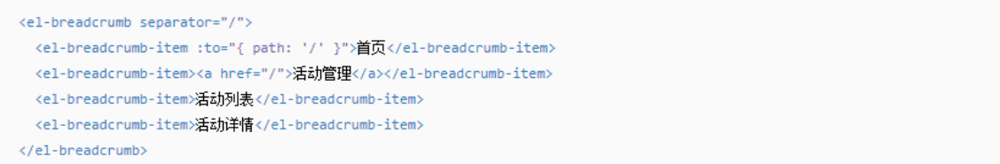
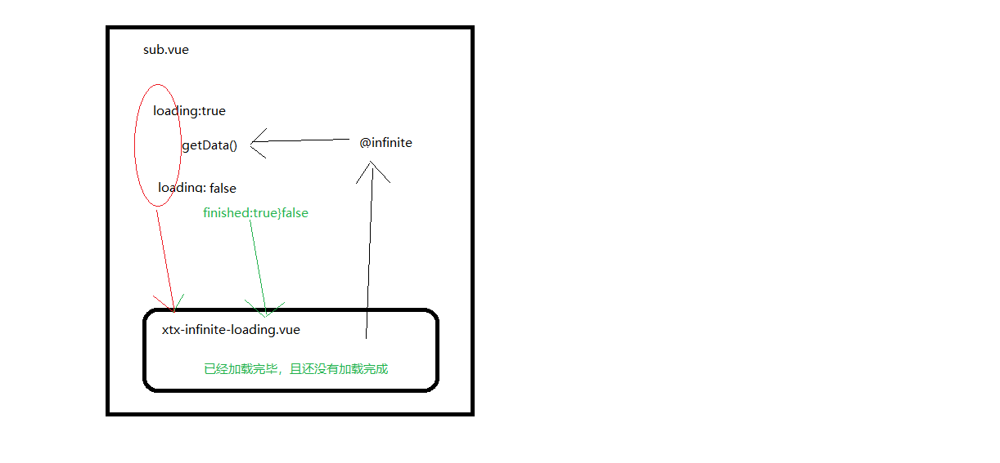

# 商品分类


## 首页头部分类导航交互

> 目的：实现点击的时候跳转，且能关闭二级分类弹窗。

描述：由于是单页面路由跳转不会刷新页面，css的hover一直触发无法关闭分类弹窗。


大致逻辑：

- 配置路由组件支持分类跳转
- 鼠标进入一级分类展示对应的二级分类弹窗
- 点击一级分类，二级分类，隐藏二级分类弹窗
- 离开一级分类，二级分类，隐藏二级分类弹窗


落地代码：

**1) 配置路由和组件实现跳转**

- 配置路由规则 `src/router/index.js`

```diff
+import TopCategory from '@/views/category'
+import SubCategory from '@/views/category/sub'

const routes = [
  {
    path: '/',
    component: Layout,
    children: [
      { path: '/', component: Home },
+      { path: '/category/:id', component: TopCategory },
+      { path: '/category/sub/:id', component: SubCategory }
    ]
  }
]
```

- 创建一级分类组件 `src/views/category/index.vue`

```vue
<template>
  <div>Top-Category</div>
</template>
<script>
export default {
  name: 'TopCategory'
}
</script>
<style scoped lang="less"></style>
```

- 创建二级分类组件`src/views/category/sub.vue`

```vue
<template>
  <div>Sub-Category</div>
</template>
<script>
export default {
  name: 'SubCategory'
}
</script>
<style scoped lang="less"></style>
```

- 修改跳转的链接

```vue
<template>
  <ul class="app-header-nav">
    <li class="home">
      <RouterLink to="/">首页</RouterLink>
    </li>
    <li :key='item.id' v-for='item in list'>
      <RouterLink :to='"/category/" + item.id'>{{item.name}}</RouterLink>
      <div class="layer">
        <ul>
          <li v-for="cate in item.children" :key="cate.id">
            <RouterLink :to='"/category/sub/" + cate.id'>
              
              <p>{{cate.name}}</p>
            </RouterLink>
          </li>
        </ul>
      </div>
    </li>
  </ul>
</template>
```

> 总结：准备一级和二级的路由组件并配置路由映射，修改跳转链接

2）跳转后关闭二级分类弹窗

- 给每一个一级分类定义控制显示隐藏的数据，`open`  布尔类型，通过open设置类名控制显示隐藏。
- 当进入一级分类的时候，将open改为true
- 当离开一级分类的时候，将open改为false
- 点击一级分类，二级分类，将open改为false


在vuex种给一级分类加open数据 `src/store/modules/cate.js` 

```diff
    async getCategory ({ commit }) {
      const { result } = await findHeadCategory()
      // 给一级分类加上一个控制二级分类显示隐藏的数据open
+      result.forEach(item => {
+        item.open = false
+      })
      // 获取数据成功，提交mutations进行数据修改
      commit('setCategory', result)
    }
```

在头部导航组件  实现显示和隐藏  `src/components/top-nav-common.vue`

```vue
<li @mouseenter="show(item.id)" @mouseleave="hide(item.id)" :class='{active: item.open}' v-for='item in $store.state.cate.list' :key='item.id'>
```

```js
mutations: {
    updateStatus (state, payload) {
      // 修改分类的状态
      const cate = state.list.find(item => item.id === payload.id)
      if (cate) {
        cate.open = payload.open
      }
    }
},
```

```js
// 控制二级分类的显示和隐藏
const show = (id) => {
  // 触发mutation修改state数据
  store.commit('cate/updateStatus', {
    id: id,
    open: true
  })
}
const hide = (id) => {
  store.commit('cate/updateStatus', {
    id: id,
    open: false
  })
}
return { hide, show }
```

修改样式：把hover修改为类active

```less
    // &:hover {
    &.active {
      // 加上 >
      > a {
        color: @xtxColor;
        border-bottom: 1px solid @xtxColor;
      }
      > .layer {
        height: 124px;
        opacity: 1;
      }
    }
```

点击隐藏操作

```diff
<li @mouseenter="show(item.id)" @mouseleave="hide(item.id)" :class='{active: item.open}' v-for='item in $store.state.cate.list' :key='item.id'>
  <!-- 一级分类 -->
+  <RouterLink @click='hide(item.id)' :to='`/category/${item.id}`'>{{item.name}}</RouterLink>
  <!-- 鼠标悬停时显示的碳层 -->
  <div class="layer">
    <!-- 二级分类 -->
    <ul>
      <li v-for="cate in item.children" :key="cate.id">
+        <RouterLink @click='hide(item.id)' :to='`/category/sub/${cate.id}`'>
          
          <p>{{cate.name}}</p>
        </RouterLink>
      </li>
    </ul>
  </div>
</li>
```

> 总结：
>
> 1. 通过标志位控制二级分类的显示和隐藏
> 2. 悬停时显示，离开时隐藏
> 3. 点击时隐藏


## 顶级类目-面包屑组件-初级

> **目的：**  封装一个简易的面包屑组件，适用于两级场景。

**大致步骤：**

- 准备静态的 `xtx-bread.vue` 组件
- 定义 `props` 暴露 `parentPath`  `parentName`  属性，默认插槽，动态渲染组件
- 在 `library/index.js` 注册组件，使用验证效果。

**落的代码：**

- 基础结构 `src/components/library/xtx-bread.vue`

```vue
<template>
  <div class='xtx-bread'>
    <div class="xtx-bread-item">
      <RouterLink to="/">首页</RouterLink>
    </div>
    <i class="iconfont icon-angle-right"></i>
    <div class="xtx-bread-item">
      <RouterLink to="/category/10000">电器</RouterLink>
    </div>
    <i class="iconfont icon-angle-right"></i>
    <div class="xtx-bread-item">
      <span>空调</span>
    </div>
  </div>
</template>

<script>
export default {
  name: 'XtxBread'
}
</script>

<style scoped lang='less'>
.xtx-bread{
  display: flex;
  padding: 25px 10px;
  &-item {
    a {
      color: #666;
      transition: all .4s;
      &:hover {
        color: @xtxColor;
      }
    }
  }
  i {
    font-size: 12px;
    margin-left: 5px;
    margin-right: 5px;
    line-height: 22px;
  }
}
</style>
```

- 定义props进行渲染  `src/components/library/xtx-bread.vue`

```diff
<template>
  <div class='xtx-bread'>
    <div class="xtx-bread-item">
      <RouterLink to="/">首页</RouterLink>
    </div>
    <i class="iconfont icon-angle-right"></i>
+    <div class="xtx-bread-item" v-if="parentName">
+      <RouterLink v-if="parentPath" :to="parentPath">{{parentName}}</RouterLink>
+      <span v-else>{{parentName}}</span>
+    </div>
+    <i v-if="parentName" class="iconfont icon-angle-right"></i>
    <div class="xtx-bread-item">
+      <span><slot /></span>
    </div>
  </div>
</template>

<script>
export default {
  name: 'XtxBread',
+  props: {
+    parentName: {
+      type: String,
+      default: ''
+    },
+    parentPath: {
+      type: String,
+      default: ''
+    }
+  }
}
</script>
```

- 注册使用  `src/components/library/index.js`

```diff
+import XtxBread from './xtx-bread.vue'

export default {
  install (app) {
+      app.component(XtxBread.name, XtxBread)
```

使用： `<XtxBread parentPath="/category/1005000" parentName="电器">空调</XtxBread>`

> **总结：** 
>
> 1. 封装基本的面包屑组件
> 2. 仅仅支持二级导航，不够灵活(不支持无限级别导航)


## 顶级类目-面包屑组件-高级

> **目的：**  封装一个高复用的面包屑组件，适用于多级场景。认识 render 选项和 h 函数。

参考element-ui的面包屑组件：




**大致步骤：**

- 使用插槽和封装选项props组件完成面包屑组件基本功能，但是最后一项多一个图标。
- 学习 render 选项，h 函数 的基本使用。
- 通过 render 渲染，h 函数封装面包屑功能。


**落的代码：**

- 我们需要两个组件，`xtx-bread` 和  `xtx-bread-item` 才能完成动态展示。

 定义单项面包屑组件 `src/components/library/xtx-bread-item.vue` 

```vue
<template>
  <div class="xtx-bread-item">
    <RouterLink v-if="to" :to="to"><slot /></RouterLink>
    <span v-else><slot /></span>
    <i class="iconfont icon-angle-right"></i>
  </div>
</template>
<script>
export default {
  name: 'XtxBreadItem',
  props: {
    to: {
      type: [String, Object]
    }
  }
}
</script>

```

 在 `library/index.js`注册

```diff
+import 'XtxBreadItem' from './xtx-bread-item.vue'
export default {
  install (app) {
+      app.component(XtxBreadItem.name, XtxBread)
```

- 过渡版，你发现结构缺少风格图标，如果在item中加上话都会有图标，但是最后一个是不需要的。

```vue
<template>
  <div class='xtx-bread'>
    <slot />
  </div>
</template>

<script>
export default {
  name: 'XtxBread'
}
</script>

<style scoped lang='less'>
.xtx-bread {
  display: flex;
  padding: 25px 10px;
  :deep(&-item) {
    a {
      color: #666;
      transition: all 0.4s;
      &:hover {
        color: @xtxColor;
      }
    }
  }
  :deep(i) {
    font-size: 12px;
    margin-left: 5px;
    margin-right: 5px;
    line-height: 22px;
  }
}
</style>

```

```vue
<!-- 面包屑 -->
<XtxBread>
    <XtxBreadItem to="/">首页</XtxBreadItem>
    <XtxBreadItem to="/category/1005000">电器</XtxBreadItem>
    <XtxBreadItem >空调</XtxBreadItem>
</XtxBread>
```

> 总结：
>
> 1. 封装两个组件xtx-bread和xtx-bread-item
> 2. 默认插槽的用法
> 3. scoped的作用要熟悉, :deep选择器要熟悉

## 顶级类目-面包屑组件-终极

- 终极版，使用render函数自己进行拼接创建。

 [createElement](https://cn.vuejs.org/v2/guide/render-function.html#createElement-%E5%8F%82%E6%95%B0)  [render](https://cn.vuejs.org/v2/api/#render) `render选项与h函数 ` 

- 指定组件显示的内容：`new Vue({选项})`
  - el 选项，通过一个选择器找到容器，容器内容就是组件内容
  - template 选项，`<div>组件内容</div>` 作为组件内容
  - render选项，它是一个函数，函数回默认传人createElement的函数（h），这个函数用来创建结构，再render函数返回渲染为组件内容。它的优先级更高。

```js
//import App from './App.vue'
//new Vue({
//    render:h=>h(App)
//}).mount('#app')
// h() =====>  createElement()
// h(App) =====>  根据APP组件创建html结构
// render的返回值就是html结构，渲染到#app容器
// h() 函数参数，1.节点名称  2. 属性|数据 是对象  3. 子节点
```

`xtx-bread-item.vue`

```diff
<template>
  <div class="xtx-bread-item">
    <RouterLink v-if="to" :to="to"><slot /></RouterLink>
    <span v-else><slot /></span>
-    <i class="iconfont icon-angle-right"></i>
  </div>
</template>
```

`xtx-bread.vue`

```vue
<script>
import { h } from 'vue'
export default {
  name: 'XtxBread',
  render () {
    // 用法
    // 1. template 标签去除，单文件组件
    // 2. 返回值就是组件内容
    // 3. vue2.0 的h函数传参进来的，vue3.0 的h函数导入进来
    // 4. h 第一个参数 标签名字  第二个参数 标签属性对象  第三个参数 子节点
    // 需求
    // 1. 创建xtx-bread父容器
    // 2. 获取默认插槽内容
    // 3. 去除xtx-bread-item组件的i标签，因该由render函数来组织
    // 4. 遍历插槽中的item，得到一个动态创建的节点，最后一个item不加i标签
    // 5. 把动态创建的节点渲染再xtx-bread标签中
    const items = this.$slots.default()
    const dymanicItems = []
    items.forEach((item, i) => {
      dymanicItems.push(item)
      if (i < (items.length - 1)) {
        dymanicItems.push(h('i', { class: 'iconfont icon-angle-right' }))
      }
    })
    return h('div', { class: 'xtx-bread' }, dymanicItems)
  }
}
</script>

<style lang='less'>
// 去除 scoped 属性，目的：然样式作用到xtx-bread-item组件
.xtx-bread{
  display: flex;
  padding: 25px 10px;
  &-item {
    a {
      color: #666;
      transition: all .4s;
      &:hover {
        color: @xtxColor;
      }
    }
  }
  i {
    font-size: 12px;
    margin-left: 5px;
    margin-right: 5px;
    line-height: 22px;
    // 样式的方式，不合理
    // &:last-child {
    //   display: none;
    // }
  }
}
</style>
```

- 使用代码

```vue
<!-- 面包屑 -->
<XtxBread>
    <XtxBreadItem to="/">首页</XtxBreadItem>
    <XtxBreadItem to="/category/1005000">电器</XtxBreadItem>
    <XtxBreadItem >空调</XtxBreadItem>
</XtxBread>
```


- 总结，一下知识点
  - render 是vue提供的一个渲染函数，优先级大于el,template等选项，用来提供组件结构。
  - 注意：
    - vue2.0  render函数提供render(h){}函数用来创建节点
    - vue3.0  函数由 vue 直接提供，需要按需导入 `import { h } from 'vue'`
  - this.$slots.default() 获取默认插槽的节点结构，按照要求拼接结构。
  - h函数的传参 tag 标签名|组件名称, props 标签属性|组件属性, node 子节点|多个节点
  - 具体参考 [render]([https://vue-docs-next-zh-cn.netlify.app/guide/render-function.html#dom-%E6%A0%91](https://vue-docs-next-zh-cn.netlify.app/guide/render-function.html#dom-树) )
- 注意：不要在 xtx-bread 组件插槽写注释，也会被解析(用户不爽)，改善用户体验

---

- 基于jsx方式实现

```vue
<script>
// import { h } from 'vue'
export default {
  name: 'XtxBread',
  render () {
    // vue2的render函数的形参是 h 函数
    // vue3中h函数是导入的
    // createElement(标签名称, 标签的属性, 标签的子元素)
    // console.dir(this.$slots.default())
    // 获取XtxBread组件的所有的插槽里面填充组件实例
    const items = this.$slots.default()
    const results = []
    items.forEach((item, index) => {
      results.push(item)
      // 手动生成一个i图标，添加到面包屑项目的后面
      // const iTag = h('i', { class: 'iconfont icon-angle-right' })
      if (index < items.length - 1) {
        // results.push(iTag)
        results.push(<i className='iconfont icon-angle-right'></i>)
      }
    })
    // div的子节点应该动态生成：更加插槽的内容动态生成
    // return h('div', { class: 'xtx-bread' }, results)
    return <div className='xtx-bread'>{results}</div>
  }
}
</script>
```

> 总结：
>
> 1. jsx其实就是直接在js代码中写HTML标签
> 2. 标签中插入的动态值使用单个花括号（插值表达式）
> 3. class名称需要换成className

## 顶级类目-批量注册组件

> **目的：**  自动的批量注册组件。

大致步骤：

- 使用 `require` 提供的函数 `context`  加载某一个目录下的所有 `.vue` 后缀的文件。
- 然后 `context` 函数会返回一个导入函数 `importFn`  
  - 它又一个属性 `keys() `  获取所有的文件路径
- 通过文件路径数组，通过遍历数组，再使用 `importFn`  根据路径导入组件对象
- 遍历的同时进行全局注册即可


落的代码：

`src/components/library/index.js`

```js
// 其实就是vue插件，扩展vue功能，全局组件、指令、函数 （vue.30取消过滤器）
// 当你在mian.js导入，使用Vue.use()  (vue3.0 app)的时候就会执行install函数
// import XtxSkeleton from './xtx-skeleton.vue'
// import XtxCarousel from './xtx-carousel.vue'
// import XtxMore from './xtx-more.vue'
// import XtxBread from './xtx-bread.vue'
// import XtxBreadItem from './xtx-bread-item.vue'

// 导入library文件夹下的所有组件
// 批量导入需要使用一个函数 require.context(dir,deep,matching)
// 参数：1. 目录  2. 是否加载子目录  3. 加载的正则匹配
const importFn = require.context('./', false, /\.vue$/)
// console.dir(importFn.keys()) 文件名称数组

export default {
  install (app) {
    // app.component(XtxSkeleton.name, XtxSkeleton)
    // app.component(XtxCarousel.name, XtxCarousel)
    // app.component(XtxMore.name, XtxMore)
    // app.component(XtxBread.name, XtxBread)
    // app.component(XtxBreadItem.name, XtxBreadItem)

    // 批量注册全局组件
    importFn.keys().forEach(key => {
      // 导入组件
      const component = importFn(key).default
      // 注册组件
      app.component(component.name, component)
    })

    // 定义指令
    defineDirective(app)
  }
}

const defineDirective = (app) => {
  // 图片懒加载指令 v-lazyload
  app.directive('lazyload', {
    // vue2.0 inserted函数，元素渲染后
    // vue3.0 mounted函数，元素渲染后
    mounted (el, binding) {
      // 元素插入后才能获取到dom元素，才能使用 intersectionobserve进行监听进入可视区
      // el 是图片元素  binding.value 图片地址
      const observe = new IntersectionObserver(([{ isIntersecting }]) => {
        if (isIntersecting) {
          el.src = binding.value
          // 取消观察
          observe.unobserve(el)
        }
      }, {
        threshold: 0.01
      })
      // 进行观察
      observe.observe(el)
    }
  })
}

```


总结，知识点：

- require.context() 是webpack提供的一个自动导入的API
  - 参数1：加载的文件目录
  - 参数2：是否加载子目录
  - 参数3：正则，匹配文件
  - 返回值：导入函数 fn
    - keys() 获取读取到的所有文件列表

> 好处：后续再添加的全局UI组件，就不再需要手动导入了。
>

## 回顾

- 主页
  - 热门品牌：基本布局，调用接口，填充页面；实现切换（计算属性；CSS3过度）
  - 商品区块：监听进入可视区（控制触发条件）
  - 最新专题：
  - 图片懒加载：自定义指令用法；原生js监听图片进入可视区
- 分类
  - 通过状态位控制二级分类的弹层：vuex的操作
  - 面包屑组件的封装
    - 初级：抽取组件的通用属性
    - 高级：支持无限级导航（多最后一个小的箭头）
    - 终极：基于render函数动态渲染组件模板：获取插槽内容；render函数用法
    - JSX封装：熟悉JSX的基本规则
  - 全局UI组件的自动化导入
    - 批量获取所有的组件路径，然后遍历每一个组件的路径，然后导入组件，最后逐个配置全局组件。（底层由webpack处理）


## 顶级类目-基础布局搭建

> **目的：** 完成顶级分类的，面包屑+轮播图+所属全部子级分类展示。

大致步骤：

- 准备基础结构，获取轮播图数据给组件使用
- 获取面包屑和所有分类数据给子级分类展示使用

落的代码：

- 基本结构和轮播图渲染  `src/views/category/index.vue`

```vue
<template>
  <div class="top-category">
    <div class="container">
      <!-- 面包屑 -->
      <XtxBread>
        <XtxBreadItem to="/">首页</XtxBreadItem>
        <XtxBreadItem>空调</XtxBreadItem>
      </XtxBread>
      <!-- 轮播图 -->
      <XtxCarousel :sliders="sliders" style="height:500px" />
      <!-- 所有二级分类 -->
      <div class="sub-list">
        <h3>全部分类</h3>
        <ul>
          <li v-for="i in 8" :key="i">
            <a href="javascript:;">
              
              <p>空调</p>
            </a>
          </li>
        </ul>
      </div>
      <!-- 不同分类商品 -->
    </div>
  </div>
</template>
<script>
import { ref } from 'vue'
import { findBanner } from '@/api/home'
export default {
  name: 'TopCategory',
  setup () {
    // 轮播图
    const sliders = ref([])
    findBanner().then(data => {
      sliders.value = data.result
    })
    return { sliders }  
  }
}
</script>
<style scoped lang="less">
.top-category {
  h3 {
    font-size: 28px;
    color: #666;
    font-weight: normal;
    text-align: center;
    line-height: 100px;
  }
  .sub-list {
    margin-top: 20px;
    background-color: #fff;
    ul {
      display: flex;
      padding: 0 32px;
      flex-wrap: wrap;
      li {
        width: 168px;
        height: 160px;
        a {
          text-align: center;
          display: block;
          font-size: 16px;
          img {
            width: 100px;
            height: 100px;
          }
          p {
            line-height: 40px;
          }
          &:hover {
            color: @xtxColor;
          }
        }
      }
    }
  }
}
</style>
```

> 总结：实现一级分类页面整体布局

- 从vuex获取分类数据，进行渲染。

```js
import { useStore } from 'vuex'
import { useRoute } from 'vue-router'
import { computed, ref } from 'vue'
```

```js
// 面包屑+所有分类
const store = useStore()
const route = useRoute()
const currentCate = computed(() => {
    const cate = store.getters.cates.find(item => {
        return item.id === route.params.id
    })
    return cate
})

return {
    sliders,
    currentCategory,
}
```

```vue
<template>
  <div class="top-category">
    <div class="container" v-if='currentCate'>
      <!-- 面包屑 -->
      <XtxBread>
        <XtxBreadItem to="/">首页</XtxBreadItem>
        <XtxBreadItem>{{currentCategory.name}}</XtxBreadItem>
      </XtxBread>
      <!-- 轮播图 -->
      <XtxCarousel :sliders="sliders" style="height:500px" />
      <!-- 所有二级分类 -->
      <div class="sub-list">
        <h3>全部分类</h3>
        <ul>
          <li v-for="item in currentCategory.children" :key="item.id">
            <a href="javascript:;">
              
              <p>{{item.name}}</p>
            </a>
          </li>
        </ul>
      </div>
      <!-- 不同分类商品 -->
    </div>
  </div>
</template>
```

> 总结：
>
> 1. 获取vuex中一级分类详细数据（根据当前路由参数中传递一级分类的id）: 路由参数获取；计算属性
> 2. 动态填充面包屑导航的名称
> 3. 动态渲染二级分类列表

## 顶级类目-分类商品-布局

> **目的：** 展示各个子级分类下推荐的商品基础布局


大致步骤：

- 准备单个商品组件
- 完成推荐商品区块布局


落的代码：

- 商品信息组件  `src/views/category/components/goods-item.vue` 

```vue
<template>
  <RouterLink to="/" class='goods-item'>
    
    <p class="name ellipsis">红功夫 麻辣小龙虾 19.99/500g 实惠到家</p>
    <p class="desc ellipsis">火锅食材</p>
    <p class="price">&yen;19.99</p>
  </RouterLink>
</template>

<script>
export default {
  name: 'GoodsItem'
}
</script>

<style scoped lang='less'>
.goods-item {
  display: block;
  width: 220px;
  padding: 20px 30px;
  text-align: center;
  .hoverShadow();
  img {
    width: 160px;
    height: 160px;
  }
  p {
    padding-top: 10px;
  }
  .name {
    font-size: 16px;
  }
  .desc {
    color: #999;
    height: 29px;
  }
  .price {
    color: @priceColor;
    font-size: 20px;
  }
}
</style>
```

- 顶级分类组件，进行布局 `src/views/category/index.vue`

```diff
+import GoodsItem from './components/goods-item'
export default {
  name: 'TopCategory',
  components: {
+    GoodsItem
  },
```

```vue
      <!-- 分类关联商品 -->
      <div class="ref-goods">
        <div class="head">
          <h3>- 海鲜 -</h3>
          <p class="tag">温暖柔软，品质之选</p>
          <XtxMore />
        </div>
        <div class="body">
          <GoodsItem v-for="i in 5" :key="i" />
        </div>
      </div>
```

```less
  .ref-goods {
    background-color: #fff;
    margin-top: 20px;
    position: relative;
    .head {
      .xtx-more {
        position: absolute;
        top: 20px;
        right: 20px;
      }
      .tag {
        text-align: center;
        color: #999;
        font-size: 20px;
        position: relative;
        top: -20px;
      }
    }
    .body {
      display: flex;
      justify-content: flex-start;
      flex-wrap: wrap;
      padding: 0 65px 30px;
    }
  }
```

> 总结：
>
> 1. 拆分单个商品的组件
> 2. 实现单块相关商品布局

## 顶级类目-分类商品-展示

> 根据切换路由的时候，根据分类ID获取数据，渲染分类商品。


大致步骤：

- 定义API，组件初始化要去加载数据，但是动态路由不会重新初始化组件。
- 如果监听地址栏id的变化，然后变化了就去加载数据，但是初始化有不会加载了。
- 不过watch提供了   immediate: true  可让watch初始化的时候主动触发一次。


落的代码：

1. 定义API  `src/api/category.js`

```js
/**
 * 获取单个顶级分类信息
 * @param {String} id - 顶级分类ID
 */
export const findTopCategory = (id) => {
  return request({
      method: 'get',
      url: '/category',
      data: {id}
  })
}
```

2. 使用watch加载数据  `src/views/category/index.vue`

```js
const goods = ref([])
// 监听路由参数的变化
watch(() => route.params.id, (newVal) => {
  // 获取相关商品的数据
  findTopCategory(newVal).then(ret => {
    goods.value = ret.result
  })
}, {
  immediate: true
})
return { sliders, currentCate, goods }
```

3. 开始渲染 `src/views/category/index.vue`

```vue
<!-- 不同分类商品 -->
<div class="ref-goods" v-for='item in goods.children' :key='item.id'>
  <div class="head">
    <h3>- {{item.name}} -</h3>
    <p class="tag">温暖柔软，品质之选</p>
    <XtxMore />
  </div>
  <div class="body">
    <GoodsItem :goods='g' v-for="g in item.goods" :key="g.id" />
  </div>
</div>
```

4. 开始渲染 `src/views/category/components/goods-item.vue`

```vue
<template>
  <RouterLink to="/" class='goods-item'>
    
    <p class="name ellipsis">{{goods.name}}</p>
    <p class="desc ellipsis">{{goods.tag}}</p>
    <p class="price">&yen;{{goods.price}}</p>
  </RouterLink>
</template>

<script>
export default {
  name: 'GoodsItem',
  props: {
    goods: {
      type: Object,
      default: () => { }
    }
  }
}
</script>
```

> 总结：
>
> 1. 调用接口获取分类相关的商品数据
> 2. 动态填充组件的模板
> 3. 需要使用侦听器侦听路由的参数变化（动态路由组件默认有缓存，仅仅实例化一次）

## 顶级类目-面包屑切换动画

> **目的：**   由于切换顶级类目，面包屑文字瞬间完成，体验差，给切换的文字加上动画。


大致步骤：

- 给面包屑ITEM组件加上Transition组件并且创建 动画条件
- 定义动画css样式


落地代码：

- 加transition和name属性，以及加上key属性关联ID才会创建和移除。

```vue
<transition name="fade-right" mode="out-in">
  <XtxBreadItem :key="currCategory.id">{{currCategory.name}}</XtxBreadItem>
</transition>
```

- 写动画样式 `common.less`  做为公用

```less
.fade-right-enter-to,
.fade-right-leave-from{
  opacity: 1;
  transform: none;
}
.fade-right-enter-active,
.fade-right-leave-active{
  transition: all .5s;
}
.fade-right-enter-from,
.fade-right-leave-to{
  opacity: 0;
  transform: translate3d(20px,0,0);
}
```

> **总结： **   不同的key可以创建移除元素，创造触发动画条件。通过key保证每次切换组件都重新创建。

- 添加动画之后，让面包屑插槽中依然支持动画

```js
const slotContent = this.$slots.default().filter(item => typeof item.type !== 'symbol')
```

> 注意：如果是注释，那么节点类型 type 应该是 symbol

## 二级类目-处理跳转细节

> **目的：**  在路由跳转的时候，优化跳转的细节。

大致需求：

- 现在的路由跳转默认在当前浏览的位置（卷曲的高度），我们需要会到顶部。
- 在点击二级类目的时候，页面滚动到顶部，造成进入一级类目事件触发（依然显示下拉），显示其对应二级弹窗，需要处理。
- 切换到二级类目路由的时候也有ID，但是也触发了watch导致发送了请求，需要处理。
- 基于vue-router控制一级分类点中的高亮效果


落的代码：

- 每次切换路由的时候滚动到顶部 `src/router/index.js`

```diff
const router = createRouter({
  history: createWebHashHistory(),
  routes,
+  scrollBehavior () {
+    return { left: 0, top: 0 }
+  }
})
```

- 滚动到顶部，鼠标有时候会进入一级类目上，触发弹出二级类目。改成在一级类目上移动弹出二级类目。`src/components/top-nav-common.vue`

```diff
    <li class="home"><RouterLink to="/">首页</RouterLink></li>
+    <li @mousemove="show(item)"
```

- 切换到二级类目路由的时候也有ID，但是也触发了watch导致发送了请求，需要处理。 `src/views/category/index.vue`

```diff
// 监听路由参数的变化
// 这里侦听的路由参数的id必须是一级分类的id，不可以二级分类的id
watch(() => route.params.id, (newVal) => {
  // 获取相关商品的数据
+  if (route.fullPath === `/category/${newVal}`) {
    findTopCategory(newVal).then(ret => {
      goods.value = ret.result
    })
+  }
}, {
  immediate: true
})
```

> **总结：**  
>
> 1. 控制路由跳转时，滚动条的位置：基于前端路由的配置选项
> 2. mouseenter和mousemove的区别
> 3. watch侦听路由参数的问题：不同的动态路由参数的变化都会被侦听到
> 4. vue-router规则：点中的路由链接会自动添加相应的类名router-link-exact-active，如果要控制高亮效果，给该类名添加样式即可


## 二级类目-展示面包屑

> 目的：根据二级类目ID展示多级面包屑


大致思路：

- 封装一个独立的组件来完成，因为需要加动画。

- 使用组合API的方式通过计算属性得到所需数据


逻辑代码：

- 组件基本结构 `src/views/category/components/sub-bread.vue` 

```vue
<template>
  <XtxBread>
    <XtxBreadItem to="/">首页</XtxBreadItem>
    <XtxBreadItem>电器</XtxBreadItem>
    <XtxBreadItem>空调</XtxBreadItem>
  </XtxBread>
</template>
```

- 将该组件在 `src/views/category/sub.vue`  中使用

```vue
<template>
  <div class='sub-category'>
    <div class="container">
      <!-- 面包屑 -->
      <SubBread />
      
    </div>
  </div>
</template>

<script>
import SubBread from './components/sub-bread'
export default {
  name: 'SubCategory',
  components: { SubBread}
}
</script>
```

- 从vuex中通过计算属性得到面包屑所需数据 `src/views/category/components/sub-bread.vue`

```vue
<template>
  <XtxBread v-if='cateInfo'>
    <XtxBreadItem to="/">首页</XtxBreadItem>
    <Transition name='fade-right' mode='out-in'>
      <XtxBreadItem :key='cateInfo.fcate.id' :to='"/category/" + cateInfo.fcate.id'>{{cateInfo.fcate.name}}</XtxBreadItem>
    </Transition>
    <Transition name='fade-right' mode='out-in'>
      <XtxBreadItem :key='cateInfo.scate.id'>{{cateInfo.scate.name}}</XtxBreadItem>
    </Transition>
  </XtxBread>
</template>
<script>
import { useStore } from 'vuex'
import { useRoute } from 'vue-router'
import { computed } from 'vue'

export default {
  name: 'SubBread',
  setup () {
    // 获取面包屑相关数据
    const store = useStore()
    const route = useRoute()
    // 计算一级和二级分类的数据
    const cateInfo = computed(() => {
      const info = {
        fcate: {},
        scate: {}
      }
      store.state.cate.list.some(first => {
        // 根据路由参数的二级分类的id查找二级分类的详细信息
        // first.children的存在性需要判断（默认只有一级分类）
        const scate = first.children && first.children.find(second => second.id === route.params.id)
        if (scate) {
          // 找到了二级分类，此时应该把一级和二级都得到
          info.fcate.id = first.id
          info.fcate.name = first.name
          info.scate.id = scate.id
          info.scate.name = scate.name
          // 终止继续遍历
          return true
        }
      })
      return info
    })
    return { cateInfo }
  }
}
</script>
```

- 给面包屑添加一个切换的动画

```vue
<Transition name='fade-right' mode='out-in'>
  <XtxBreadItem :key='cateInfo.fcate.id' :to='"/category/" + cateInfo.fcate.id'>{{cateInfo.fcate.name}}</XtxBreadItem>
</Transition>
<Transition name='fade-right' mode='out-in'>
  <XtxBreadItem :key='cateInfo.scate.id'>{{cateInfo.scate.name}}</XtxBreadItem>
</Transition>
```

> 总结：
>
> 1. 面包屑需要的数据包括id和name（一级分类和二级分类）
> 2. 数组的some方法也支持遍历，并且可以终止继续遍历，但是forEach无法终止
> 3. 动态控制组件需要添加条件判断
> 4. 实现动画的组件需要添加一个唯一的key，防止组件被缓存

## 二级类目-筛选区展示

> 目的：根据后台返回的筛选条件展示筛选区域。


大致步骤：

- 定义一个组件来展示筛选区域
- 获取数据进行品牌和属性的渲染
- 控制属性的选中状态
- 添加骨架屏效果


落地代码：

- 基础布局：`src/views/category/components/sub-filter.vue`

```vue
<template>
	<!-- 筛选区 -->
   <div class="sub-filter">
     <div class="item" v-for="i in 4" :key="i">
       <div class="head">品牌：</div>
       <div class="body">
         <a href="javascript:;">全部</a>
         <a href="javascript:;" v-for="i in 4" :key="i">小米</a>
       </div>
     </div>
   </div>
</template>
<script>
export default {
  name: 'SubFilter'
}
</script>
<style scoped lang='less'>
  // 筛选区
  .sub-filter {
    background: #fff;
    padding: 25px;
    .item {
      display: flex;
      line-height: 40px;
      .head {
        width: 80px;
        color: #999;
      }
      .body {
        flex: 1;
        a {
          margin-right: 36px;
          transition: all .3s;
          display: inline-block;  
          &.active,
          &:hover {
            color: @xtxColor;
          }
        }
      }
    }
  }
</style>
```

- 在 `sub.vue` 组件使用

```diff
<template>
  <div class='sub-category'>
    <div class="container">
      <!-- 面包屑 -->
      <SubBread />
      <!-- 筛选区 -->
+      <SubFilter />
      </div>
    </div>
  </div>
</template>

<script>
import SubBread from './components/sub-bread'
+import SubFilter from './components/sub-filter'
export default {
  name: 'SubCategory',
+  components: { SubBread, SubFilter}
}
</script>
```

> 总结：准备筛选条件的基本布局（多个规格参数第一层遍历；第二层遍历时单个规格的每一项数据）
>

- 获取数据：在地址栏二级类目ID改变的时候去加载筛选条件数据

`src/api/category.js`  定义API

```js
// 获取二级分类的筛选条件数据
export const findSubCategoryFilter = (id) => {
  return request({
    method: 'get',
    url: '/category/sub/filter',
    data: { id }
  })
}
```

`src/views/category/sub-filter.vue`  获取数据，组装数据。

```js
<script>
import { findSubCategoryFilter } from '@/api/home.js'
import { ref, watch } from 'vue'
import { useRoute } from 'vue-router'

export default {
  name: 'SubFilter',
  setup () {
    const route = useRoute()
    const filterParams = ref(null)

    watch(() => route.params.id, (newId) => {
      // 判断是否为二级路由,防止一级分类的干扰
      if (route.path !== '/category/sub/' + newId) return
      // 获取二级分类下面的筛选条件数据（品牌和规格参数数据）
      findSubCategoryFilter(route.params.id).then(data => {
        // 需要给品牌和规格所有的数据前面添加规定的【全部】选项
        data.result.brands.unshift({
          id: null,
          name: '全部'
        })
        data.result.saleProperties.forEach(item => {
          item.properties.unshift({
            id: null,
            name: '全部'
          })
        })
        // 把品牌数据和规格数据进行合并
        filterParams.value = {
            brands = data.result.brands,
            saleProperties = data.result.saleProperties
        }
      })
    }, {
      immediate: true
    })

    return { filterParams }
  }
}
</script>
```

- 模板渲染

```vue
<template>
  <!-- 筛选区 -->
  <div class="sub-filter" v-if='conditions.length'>
    <!-- 品牌条件 -->
    <div class="item">
      <div class="head">品牌：</div>
      <div class="body">
        <a @click='brands.selectedBrand=item.id' :class='{active: brands.selectedBrand===item.id}' href="javascript:;" v-for='item in brands' :key='item.id'>{{item.name}}</a>
      </div>
    </div>
    <!-- 规格条件 -->
    <div class="item" v-for="item in conditions" :key="item.id">
      <div class="head">{{item.name}}：</div>
      <div class="body">
        <a @click='item.selectedProp=tag.id' :class='{active: item.selectedProp===tag.id}' href="javascript:;" v-for="tag in item.properties" :key="tag.id">{{tag.name}}</a>
      </div>
    </div>
  </div>
</template>
<script>
import { findSubCategoryFilter } from '@/api/category.js'
import { useRoute } from 'vue-router'
import { watch, ref } from 'vue'

export default {
  name: 'SubFilter',
  setup () {
    const route = useRoute()
    const conditions = ref([])
    const brands = ref([])
    // 动态路由组件默认是缓存的
    watch(() => route.params.id, (newVal) => {
      // 仅仅监听二级分类的id
      if (route.fullPath !== `/category/sub/${route.params.id}`) return
      findSubCategoryFilter(newVal).then(ret => {
        // 给每一种规格的左侧添加【全部】
        ret.result.saleProperties.forEach(item => {
          // 记录每一种规格选中的值
          item.selectedProp = null
          item.properties.unshift({
            id: null,
            name: '全部'
          })
        })
        conditions.value = ret.result.saleProperties
        // 记录品牌的选中状态
        ret.result.brands.selectedBrand = null
        // 给品牌的左侧添加【全部】
        ret.result.brands.unshift({
          id: null,
          name: '全部'
        })
        brands.value = ret.result.brands
      })
    }, {
      immediate: true
    })
    return { conditions, brands }
  }
}
</script>
<style scoped lang='less'>
// 筛选区
.sub-filter {
  background: #fff;
  padding: 25px;
  .item {
    display: flex;
    line-height: 40px;
    .head {
      width: 80px;
      color: #999;
    }
    .body {
      flex: 1;
      a {
        margin-right: 36px;
        transition: all 0.3s;
        display: inline-block;
        &.active,
        &:hover {
          color: @xtxColor;
        }
      }
    }
  }
}
</style>
```

> 总结：品牌和规格数据要单独渲染
>
> 1. 控制选中的高亮
> 2. 控制单个规格的选中

- 渲染模板：`src/views/category/sub.vue`  且加上骨架效果

```vue
<template>
  <!-- 筛选区 -->
  <div class="sub-filter" v-if='conditions.length && brands.length && !loading'>
    <!-- 品牌条件 -->
    <div class="item">
      <div class="head">品牌：</div>
      <div class="body">
        <a @click='brands.selectedBrand=item.id' :class='{active: brands.selectedBrand===item.id}' href="javascript:;" v-for='item in brands' :key='item.id'>{{item.name}}</a>
      </div>
    </div>
    <!-- 规格条件 -->
    <div class="item" v-for="item in conditions" :key="item.id">
      <div class="head">{{item.name}}：</div>
      <div class="body">
        <a @click='item.selectedProp=tag.id' :class='{active: item.selectedProp===tag.id}' href="javascript:;" v-for="tag in item.properties" :key="tag.id">{{tag.name}}</a>
      </div>
    </div>
  </div>
  <div v-else class="sub-filter">
    <XtxSkeleton class="item" width="800px" height="40px" />
    <XtxSkeleton class="item" width="800px" height="40px" />
    <XtxSkeleton class="item" width="600px" height="40px" />
    <XtxSkeleton class="item" width="600px" height="40px" />
    <XtxSkeleton class="item" width="600px" height="40px" />
  </div>
</template>
<script>
import { findSubCategoryFilter } from '@/api/category.js'
import { useRoute } from 'vue-router'
import { watch, ref } from 'vue'

export default {
  name: 'SubFilter',
  setup () {
    const route = useRoute()
    const conditions = ref([])
    const brands = ref([])
    const loading = ref(false)
    // 动态路由组件默认是缓存的
    watch(() => route.params.id, (newVal) => {
      // 仅仅监听二级分类的id
      if (route.fullPath !== `/category/sub/${route.params.id}`) return
      // 接口正在调用，此时应该显示骨架屏
      loading.value = true
      findSubCategoryFilter(newVal).then(ret => {
        // 给每一种规格的左侧添加【全部】
        ret.result.saleProperties.forEach(item => {
          // 记录每一种规格选中的值
          item.selectedProp = null
          item.properties.unshift({
            id: null,
            name: '全部'
          })
        })
        conditions.value = ret.result.saleProperties
        // 记录品牌的选中状态
        ret.result.brands.selectedBrand = null
        // 给品牌的左侧添加【全部】
        ret.result.brands.unshift({
          id: null,
          name: '全部'
        })
        brands.value = ret.result.brands
        // 接口调用成功后，隐藏骨架屏
        loading.value = false
      })
    }, {
      immediate: true
    })
    return { conditions, brands, loading }
  }
}
</script>
```

```less
.xtx-skeleton {
    padding: 10px 0;
}
```

> 总结：
>
> 1. 数据加载的过程中，显示骨架屏
> 2. 不可以单纯根据筛选数据的存在性判断骨架屏，因为二级路由在切换时，之前已经有数据了，所以需要额外添加一个接口数据加载的状态位（接口调用的过程中显示骨架屏）


## 二级类目-复选框组件封装

> 目的：实现一个自定义复选框组件。

大致步骤：

- 实现组件本身的选中与不选中效果
- 实现组件的v-model指令
- 改造成 `@vueuse/core` 的函数写法


落地代码： `src/components/library/xtx-checkbox.vue`

- 1）实现组件功能

```vue
<template>
  <div class="xtx-checkbox" @click="changeChecked()">
    <i v-if="checked" class="iconfont icon-checked"></i>
    <i v-else class="iconfont icon-unchecked"></i>
    <span v-if="$slots.default"><slot /></span>
  </div>
</template>
<script>
import { ref } from 'vue'
export default {
  name: 'XtxCheckbox',
  setup () {
    const checked = ref(false)
    const changeChecked = () => {
      checked.value = !checked.value
    }
    return { checked, changeChecked }
  }
}
</script>
<style scoped lang="less">
.xtx-checkbox {
  display: inline-block;
  margin-right: 2px;
  .icon-checked {
    color: @xtxColor;
    ~ span {
      color: @xtxColor;
    }
  }
  i {
    position: relative;
    top: 1px;
  }
  span {
    margin-left: 2px;
  }
}
</style>
```

> 总结：准备复选框组件相关的模板，实现选中和反选的基本功能

- 2）实现双向绑定
  - vue3.0中v-model会拆解成  属性 `modelValue`   和  事件 `update:modelValue`  

```js
<template>
  <div class="xtx-checkbox" @click='toggleSelect()'>
    <i v-if="checked" class="iconfont icon-checked"></i>
    <i v-else class="iconfont icon-unchecked"></i>
    <span>
      <slot />
    </span>
  </div>
</template>
<script>
import { toRef } from 'vue'

export default {
  name: 'XtxCheckbox',
  props: {
    modelValue: {
      type: Boolean,
      default: false
    }
  },
  setup (props, { emit }) {
    // 父组件将原始的状态值传递给子组件并且保证响应式能力
    const checked = toRef(props, 'modelValue')
    const toggleSelect = () => {
      // checked.value = !checked.value
      // 修改父组件中的modelValue的值
      emit('update:modelValue', !checked.value)
    }
    return { checked, toggleSelect }
  }
}
</script>
```

> 总结：支持v-model指令，相当于属性绑定 :modelValue 和 触发事件 update:modelValue

- 3）补充 ` @vueuse/core` 的实现

```js
<template>
  <div class="xtx-checkbox" @click='checked=!checked'>
    <i v-if="checked" class="iconfont icon-checked"></i>
    <i v-else class="iconfont icon-unchecked"></i>
    <span>
      <slot />
    </span>
  </div>
</template>
<script>
// import { toRef } from 'vue'
import { useVModel } from '@vueuse/core'

export default {
  name: 'XtxCheckbox',
  props: {
    modelValue: {
      type: Boolean,
      default: false
    }
  },
  setup (props, { emit }) {
    // 获取父组件传递过来的modelValue的值
    const checked = useVModel(props, 'modelValue', emit)
    // const toggleSelect = () => {
    //   // 这个操作实际上修改的是父组件的值
    //   checked.value = !checked.value
    // }
    return { checked }
  }
  // setup (props, { emit }) {
  //   // 父组件将原始的状态值传递给子组件并且保证响应式能力
  //   const checked = toRef(props, 'modelValue')
  //   const toggleSelect = () => {
  //     // checked.value = !checked.value
  //     // 修改父组件中的modelValue的值
  //     emit('update:modelValue', !checked.value)
  //   }
  //   return { checked, toggleSelect }
  // }
}
</script>
```

> 总结： `useVModel` 工具函数可实现双向绑定，简化手工操作。
>


## 二级类目-结果区-排序组件

> 目的：封装排序组件，完成排序切换效果

大致步骤：

- 定义一个组件 `sub-sort`，完成基础布局
- 在 `sub.vue` 组件使用
- 完成切换排序时候的交换效果

落地代码：

- 1）基础布局： `src/views/category/components/sub-sort.vue`

```vue
<template>
  <div class='sub-sort'>
    <div class="sort">
      <a href="javascript:;">默认排序</a>  
      <a href="javascript:;">最新商品</a>
      <a href="javascript:;">最高人气</a>
      <a href="javascript:;">评论最多</a>
      <a href="javascript:;">
        价格排序
        <i class="arrow up" />
        <i class="arrow down" />
      </a>
    </div>
    <div class="check">
      <XtxCheckbox>仅显示有货商品</XtxCheckbox>
      <XtxCheckbox>仅显示特惠商品</XtxCheckbox>
    </div>
  </div>
</template>
<script>
export default {
  name: 'SubSort'
}
</script>
<style scoped lang='less'>
.sub-sort {
  height: 80px;
  display: flex;
  align-items: center;
  justify-content: space-between;
  .sort {
    display: flex;
    a {
      height: 30px;
      line-height: 28px;
      border: 1px solid #e4e4e4;
      padding: 0 20px;
      margin-right: 20px;
      color: #999;
      border-radius: 2px;
      position: relative;
      transition: all .3s;
      &.active {
        background: @xtxColor;
        border-color: @xtxColor;
        color: #fff;
      }
      .arrow {
        position: absolute;
        border: 5px solid transparent;
        right: 8px;
        &.up {
          top: 3px;
          border-bottom-color: #bbb;
            &.active {
            border-bottom-color: @xtxColor;
          }
        }
        &.down {
          top: 15px;
          border-top-color: #bbb;
          &.active {
            border-top-color: @xtxColor;
          }
        }
      }
    }
  }
  .check {
    .xtx-checkbox {
      margin-left: 20px;
      color: #999;
    }
  }
}
</style>
```

使用组件：`src/views/category/sub.vue`

```diff
<template>
  <div class='sub-category'>
    <div class="container">
      <!-- 面包屑 -->
      <SubBread />
      <!-- 筛选区 -->
      <SubFilter />
      <!-- 结果区域 -->
+      <div class="goods-list">
+        <!-- 排序 -->
+        <SubSort />
+        <!-- 列表 -->
+      </div>
    </div>
  </div>
</template>

<script>
import SubBread from './components/sub-bread'
import SubFilter from './components/sub-filter'
+import SubSort from './components/sub-sort'
export default {
  name: 'SubCategory',
+  components: { SubBread, SubFilter, SubSort}
}
</script>

<style scoped lang='less'>
+.goods-list {
+  background: #fff;
+  padding: 0 25px;
+  margin-top: 25px;
+}
</style>

```

> 总结：实现商品列表的基本布局（排序组件；商品列表组件）

- 2）交互效果：

```vue
<template>
  <div class='sub-sort'>
    <div class="sort">
      <a @click='updateSort(null)' :class='{active: sortParams.sortField===null}' href="javascript:;">默认排序</a>
      <a @click='updateSort("publishTime")' :class='{active: sortParams.sortField==="publishTime"}' href="javascript:;">最新商品</a>
      <a @click='updateSort("orderNum")' :class='{active: sortParams.sortField==="orderNum"}' href="javascript:;">最高人气</a>
      <a @click='updateSort("evaluateNum")' :class='{active: sortParams.sortField==="evaluateNum"}' href="javascript:;">评论最多</a>
      <a @click='updateSort("price")' href="javascript:;">
        价格排序
        <i class="arrow up" :class='{active: sortParams.sortMethod==="asc"}' />
        <i class="arrow down" :class='{active: sortParams.sortMethod==="desc"}' />
      </a>
    </div>
    <div class="check">
      <XtxCheckbox>仅显示有货商品</XtxCheckbox>
      <XtxCheckbox>仅显示特惠商品</XtxCheckbox>
    </div>
  </div>
</template>
<script>
import { reactive } from 'vue'
export default {
  name: 'SubSort',
  setup () {
    // 排序相关的参数
    const sortParams = reactive({
      // sortField的取值由后端决定：
      // 最新商品 publishTime
      // 最高人气 orderNum
      // 评论最多 evaluateNum
      // 价格排序 price

      // 排序的选项（根据什么排序）
      sortField: null,
      // 价格排序的顺序（价格的正序asc和反序desc）
      sortMethod: null,
      // 是否有货
      inventory: false,
      // 是否打折
      onlyDiscount: false
    })

    // 修改排序条件
    const updateSort = (type) => {
      if (type === 'price') {
        // 价格
        if (sortParams.sortMethod) {
          if (sortParams.sortMethod === 'asc') {
            // 如果原来是升序，修改为降序
            sortParams.sortMethod = 'desc'
          } else {
            // 如果原来是降序，修改为升序
            sortParams.sortMethod = 'asc'
          }
        } else {
          // 第一次点击
          sortParams.sortMethod = 'desc'
        }
      } else {
        // 其他情况
        sortParams.sortMethod = null
      }
      sortParams.sortField = type
    }

    return { sortParams, updateSort }
  }
}
</script>
```

> 总结：
>
> 1. 控制排序按钮的点亮操作
> 2. 控制价格的正反排序
> 3. 实现复选框数据绑定

## 回顾

- 一级分类
  - 基本布局
  - 填充面包屑和二级分类：基于计算属性获取（vuex），根据路由参数
  - 给面包屑条目添加动画：支持插槽中写注释
  - 细节处理
    - 页面切换时，控制滚动条到顶部：基于vue-router的配置选项
    - 二级分类的弹窗问题：mouseenter -> mousemove
    - 侦听器侦听路由参数id：添加判断条件（基于路由的路径 route.fullPath）
    - 路由链接点击高亮：vue-router本身的规则
- 二级分类
  - 面包屑动态渲染：计算属性获取面包屑数据，根据二级分类的id
  - 条件筛选的布局：
    - 基本布局
    - 调用接口填充数据：两层循环
    - 添加品牌数据和【全部】选项
    - 控制选中操作
    - 添加骨架屏：添加额外的状态位，基于接口调用
  - 复选框组件：基本布局；控制双向绑定v-model；基于vueuse提供的方法优化双向绑定
  - 排序效果：基本布局；控制条件的切换


## 二级类目-结果区-数据加载

> 目的：实现结果区域商品展示。


大致步骤：

- 完成结果区域商品布局
- 完成 `xtx-infinite-loading` 组件封装
- 使用 `xtx-infinite-loading` 完成数据加载和渲染


落地代码：`src/views/category/sub.vue`

1. 基础布局

```vue
<template>
  <div class='sub-category'>
    <div class="container">
      <!-- 面包屑 -->
      <SubBread />
      <!-- 筛选区 -->
      <SubFilter />
      <!-- 结果区域 -->
      <div class="goods-list">
        <!-- 排序 -->
        <SubSort />
        <!-- 列表 -->
        <ul>
          <li v-for="i in 20" :key="i" >
            <GoodsItem :goods="{}" />
          </li>
        </ul>
      </div>
    </div>
  </div>
</template>

<script>
import SubBread from './components/sub-bread'
import SubFilter from './components/sub-filter'
import SubSort from './components/sub-sort'
import GoodsItem from './components/goods-item'
export default {
  name: 'SubCategory',
  components: { SubBread, SubFilter, SubSort, GoodsItem }
}
</script>

<style scoped lang='less'>
.goods-list {
  background: #fff;
  padding: 0 25px;
  margin-top: 25px;
  ul {
    display: flex;
    flex-wrap: wrap;
    padding: 0 5px;
    li {
      margin-right: 20px;
      margin-bottom: 20px;
      &:nth-child(5n) {
        margin-right: 0;
      }
    }
  }
}
</style>
```

> 总结：基于封装的商品组件动态渲染列表

1. 无限列表加载组件 `src/components/xtx-infinite-loading.vue`



```vue
<template>
  <div class="xtx-infinite-loading" ref="container">
    <div class="loading" v-if="loading">
      <span class="img"></span>
      <span class="text">正在加载...</span>
    </div>
    <div class="none" v-if="finished">
      <span class="img"></span>
      <span class="text">亲，没有更多了</span>
    </div>
  </div>
</template>

<script>
import { ref } from 'vue'
import { useIntersectionObserver } from '@vueuse/core'
export default {
  name: 'XtxInfiniteLoading',
  props: {
    loading: {
      type: Boolean,
      default: false
    },
    finished: {
      type: Boolean,
      default: false
    }
  },
  setup (props, { emit }) {
    const container = ref(null)
    useIntersectionObserver(
      container,
      ([{ isIntersecting }], dom) => {
        if (isIntersecting) {
          if (props.loading === false && props.finished === false) {
            emit('infinite')
          }
        }
      },
      {
        threshold: 0
      }
    )
    return { container }
  }
}
</script>

<style scoped lang='less'>
.xtx-infinite-loading {
  .loading {
    display: flex;
    align-items: center;
    justify-content: center;
    height: 200px;
    .img {
      width: 50px;
      height: 50px;
      background: url(../../assets/images/load.gif) no-repeat center / contain;
    }
    .text {
      color: #999;
      font-size: 16px;
    }
  }
  .none {
    display: flex;
    align-items: center;
    justify-content: center;
    height: 200px;
    .img {
      width: 200px;
      height: 134px;
      background: url(../../assets/images/none.png) no-repeat center / contain;
    }
    .text {
      color: #999;
      font-size: 16px;
    }
  }
}
</style>

```

> 总结：加载更多组件基本封装，实现进入可视区触发接口调用

1. 定义获取数据的API `src/api/category.js`

```js
/**
 * 获取分类下的商品（带筛选条件）
 * @param {Object} params - 可参考接口文档
 */
export const findSubCategoryGoods = (data) => {
  return request({
      method: 'post',
      url: '/category/goods/temporary',
      data
  })
}
```

4. 在`src/views/category/sub.vue` 使用组件

```diff
      <!-- 结果区域 -->
      <div class="goods-list">
        <!-- 排序 -->
        <GoodsSort />
        <!-- 列表 -->
        <ul>
          <li v-for="item in list" :key="item.id" >
            <GoodsItem :goods="item" />
          </li>
        </ul>
        <!-- 加载 -->
+        <XtxInfiniteLoading :loading="loading" :finished="finished" @infinite="getData" />
      </div>
```

```vue
<script>
import SubBread from './components/sub-bread.vue'
import SubFilter from './components/sub-filter.vue'
import SubSort from './components/sub-sort.vue'
import GoodsItem from './components/goods-item.vue'
import { ref, reactive, watch } from 'vue'
import { useRoute } from 'vue-router'
import { findSubCategoryGoods } from '@/api/category.js'

export default {
  name: 'SubCategory',
  components: { SubBread, SubFilter, SubSort, GoodsItem },
  setup () {
    const route = useRoute()
    // 单次接口调用的状态
    const loading = ref(false)
    // 加载完成的标志
    const finished = ref(false)
    // 商品总数
    const total = ref(0)
    // 商品列表
    const list = ref([])
    // 请求参数
    const reqParams = reactive({
      page: 1,
      pageSize: 10
    })
    const getData = () => {
      // 设置接口正在调用
      loading.value = true
      findSubCategoryGoods(reqParams).then(ret => {
        // 把本次加载的数据追加到列表中
        list.value.push(...ret.result.items)
        // 获取商品列表的总数
        total.value = ret.result.counts
        // 本次接口调用完成
        loading.value = false
        if (list.value.length === total.value) {
          // 没有更多数据了
          finished.value = true
        }
        // 页码需要累加
        reqParams.page += 1
      })
    }

    // 如果二级分类发生变化，重置当前的数据
    watch(() => route.params.id, (newVal) => {
      // 判断是否为二级分类
      if (route.fullPath !== '/category/sub/' + newVal) return
      // 重置数据
      list.value = []
      total.value = 0
      loading.value = false
      finished.value = false
      reqParams.page = 1
    })

    return { loading, finished, getData, list }
  }
}
</script>
```

> 总结：
>
> 1. 监听进入可视区，进入之后触发接口调用
> 2. 单次加载状态的控制loading
> 3. 页码的累加控制
> 4. 加载完成的控制finished
> 5. 控制二级分类的切换操作


## 二级类目-结果区-进行筛选

> 目的：在做了筛选和排序的时候从新渲染商品列表。

大致步骤：

- 排序组件，当你点击了排序后 或者 复选框改变后  触发自定义事件 `sort-change`  传出排序参数
- 筛选组件，当你改了品牌，或者其他筛选添加，触发自定义事件 `filter-change`  传出筛选参数
- 在sub组件，分别绑定 `sort-change`  `filter-change`  得到参数和当前参数合并，回到第一页，清空数据，设置未加载完成，触发加载。

1. 排序规则变化

- 监听条件的触发动作：基于watch侦听即可
- 侦听到条件变化后，把最新的参数传递给父组件
- 父组件获取到这些变化的参数后，添加到接口调用的参数中
- 清空重置列表相关数据即可（加载更多的组件会进入可视区，触发接口调用，调用时就会采用最新的参数）

```js
// 侦听排序相关参数的变化
watch(sortParams, (newValue) => {
  // 把子组件选中的数据传递给父组件
  emit('update-sort', newValue)
})
```

```vue
<!-- 排序组件 -->
<SubSort @update-sort='updateSort' />
```

```js
// 获取排序参数
const updateSort = (sortParams) => {
  // 把对象sortParams中的所有属性添加到filterParams
  // Object.assign方法的作用：浅拷贝（复制对象的第一层属性和值）
  Object.assign(filterParams, sortParams)
  // 基于上述最新的参数，重新调用接口即可（重置列表数据即可）
  list.value = []
  loading.value = false
  finished.value = false
  filterParams.page = 1
  total.value = 0
}
```

2. 筛选条件变化

- 获取选中的筛选条件值
- 把选中的品牌和规格的参数传递给父组件
- 父组件接收到值后，合并到请求参数中，重置列表相关数据即可（接口自动调用）

```js
watch([selectedBrand, conditions], () => {
  // 同时侦听多个值：品牌的侦听；规格的侦听
  const attrs = []
  conditions.value.forEach(item => {
    // 获取选项的name值
    const tagInfo = item.properties.find(tag => tag.id === item.selectedProp)
    attrs.push({
      groupName: item.name,
      propertyName: tagInfo.name
    })
  })
  // 传递到父组件
  emit('update-filter', {
    brandId: selectedBrand.value,
    attrs: attrs
  })
}, {
  deep: true
})
```

```vue
<SubFilter @update-filter='updateFilter' />
```

```js
// 接收筛选条件传递过来的参数
const updateFilter = (params) => {
  // ES6的方法Object.assign，用于合并两个对象中的属性(浅拷贝)
  // 把sortParams对象中的所有属性放到reqParams对象里面
  Object.assign(filterParams, params)
  // 重置数据即可(只要数据置空，加载更多的组件就会进入可视区，那么就触发load数据)
  list.value = []
  filterParams.page = 1
  loading.value = false
  finished.value = false
  total.value = 0
}
```

- 修复一个bug：如果没有筛选到数据，再次修改条件，不会再次触发接口

```js
// 接收排序组件传递过来的参数
const updateSort = (sortParams) => {
  // ES6的方法Object.assign，用于合并两个对象中的属性(浅拷贝)
  // 把sortParams对象中的所有属性放到reqParams对象里面
  Object.assign(reqParams, sortParams)
  reqParams.page = 1
  loading.value = false
  finished.value = false
  // 如果修改参数时，页面本来就没有数据，那么就手动调用接口
  if (list.value.length === 0) {
    getData()
  } else {
    // 重置数据即可(只要数据置空，加载更多的组件就会进入可视区，那么就触发load数据)
    list.value = []
  }
}
```

> 总结：如果筛选之后，已经没有数据了，此时加载更多的组件已经进入了可视区，不会自动再出发接口调用了，需要手动触发一次。
>


