# 商品详情


## 商品详情-基础布局

> 目的：完成商品详情基础布局，路由配置，搭好页面架子。

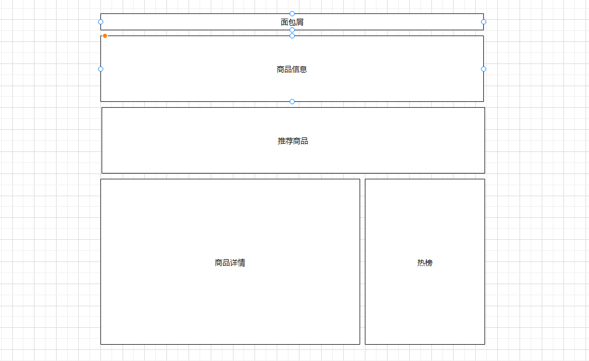


大致步骤：

- 准备组件结构容器
- 提取商品推荐组件且使用
- 配置路由和组件


落地代码：

- 页面组件：`src/views/goods/index.vue`

```vue
<template>
  <div class='xtx-goods-page'>
    <div class="container">
      <!-- 面包屑 -->
      <XtxBread>
        <XtxBreadItem to="/">首页</XtxBreadItem>
        <XtxBreadItem to="/">手机</XtxBreadItem>
        <XtxBreadItem to="/">华为</XtxBreadItem>
        <XtxBreadItem to="/">p30</XtxBreadItem>
      </XtxBread>
      <!-- 商品信息 -->
      <div class="goods-info"></div>
      <!-- 商品推荐 -->
      <GoodsRelevant />
      <!-- 商品详情 -->
      <div class="goods-footer">
        <div class="goods-article">
          <!-- 商品+评价 -->
          <div class="goods-tabs"></div>
          <!-- 注意事项 -->
          <div class="goods-warn"></div>
        </div>
        <!-- 24热榜+专题推荐 -->
        <div class="goods-aside"></div>
      </div>
    </div>
  </div>
</template>

<script>
import GoodsRelevant from './components/goods-relevant'
export default {
  name: 'XtxGoodsPage',
  components: { , GoodsRelevant }
}
</script>

<style scoped lang='less'>
.goods-info {
  min-height: 600px;
  background: #fff;
}
.goods-footer {
  display: flex;
  margin-top: 20px;
  .goods-article {
    width: 940px;
    margin-right: 20px;
  }
  .goods-aside {
    width: 280px;
    min-height: 1000px;
  }
}
.goods-tabs {
  min-height: 600px;
  background: #fff;
}
.goods-warn {
  min-height: 600px;
  background: #fff;
  margin-top: 20px;
}
</style>
```

- 商品推荐组件：`src/views/goods/components/goods-relevant.vue`

```vue
<template>
  <div class='goods-relevant'></div>
</template>

<script>
export default {
  name: 'GoodsRelevant'
}
</script>

<style scoped lang='less'>
.goods-relevant {
  background: #fff;
  min-height: 460px;
  margin-top: 20px;
}
</style>

```

- 路由配置：`src/router/index.js`

```js
const Goods = () => import('@/views/goods/index')
```

```diff
    children: [
      { path: '/', component: Home },
      { path: '/category/:id', component: TopCategory },
      { path: '/category/sub/:id', component: SubCategory },
+      { path: '/product/:id', component: Goods }
    ]
```

> 总结：
>
> 1. 实现页面的基本结构
> 2. 拆分推荐的商品的组件
> 3. 配置路由

## 商品详情-渲染面包屑

> 目的：获取数据，渲染面包屑。


大致步骤：

- 定义获取商品详情API函数
- 在组件setup中获取商品详情数据
- 定义一个useXxx函数处理数据

注意：如果携带一个错误的token，那么是获取不到数据的（后端的验证策略有问题）


落地代码：

- API函数 `src/api/product.js`

```js
import request from '@/utils/request'

// 获取商品的详细数据
export const findGoods = (id) => {
  return request({
    method: 'get',
    url: '/goods',
    data: { id }
  })
}
```

- useGoods函数 `src/views/goods/index.vue`  在setup中使用

```js
import GoodsRelevant from './components/goods-relevant'
import { ref, watch } from 'vue'
import { findGoods } from '@/api/product.js'
import { useRoute } from 'vue-router'

const useGoods = () => {
  const route = useRoute()
  // 调用接口获取商品详情数据
  const detail = ref(null)
  watch(() => route.params.id, (newVal) => {
    // 必须保证监听的是商品详情地址
    if (route.fullPath !== '/product/' + newVal) return
    findGoods(newVal).then(ret => {
      detail.value = ret.result
    })
  }, {
    immediate: true
  })
  return detail
}

export default {
  name: 'XtxGoodsPage',
  components: { GoodsRelevant },
  setup () {
    const detail = useGoods()
    return { detail }
  }
}
```

- 防止报错，加载完成goods再显示所有内容

```vue
<template>
  <div class='xtx-goods-page'>
    <div class="container" v-if='detail'>
```

- 渲染面包屑

```vue
<!-- 面包屑 -->
<XtxBread>
    <XtxBreadItem to="/">首页</XtxBreadItem>
    <XtxBreadItem :to="`/category/${detail.categories[1].id}`">{{detail.categories[1].name}}</XtxBreadItem>
    <XtxBreadItem :to="`/category/sub/${detail.categories[0].id}`">{{detail.categories[0].name}}</XtxBreadItem>
    <XtxBreadItem>{{detail.name}}</XtxBreadItem>
</XtxBread>
```

> 总结：
>
> 1. 调用接口获取商品详情数据
> 2. 拆分useGoods函数，方便后续代码的拆分和维护
> 3. 动态填充面包屑导航的数据

## 商品详情-图片预览组件

> 目的：完成商品图片预览功能和切换

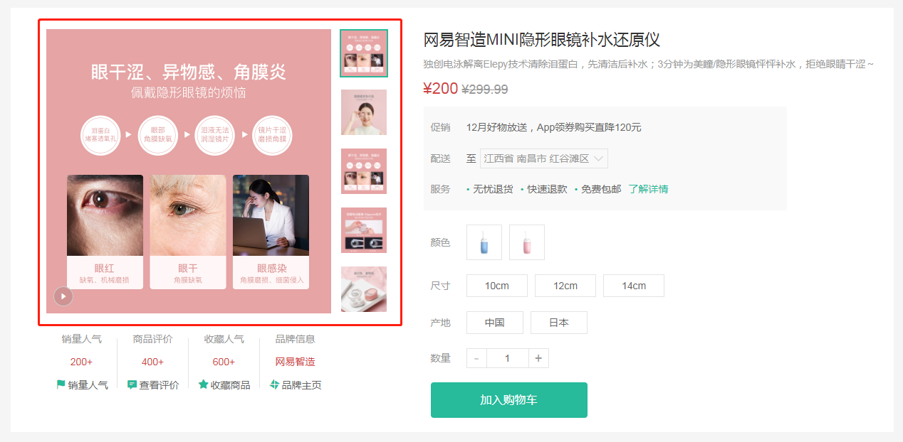

大致步骤：

- 首先准备商品信息区块左右两侧的布局盒子
- 在定义一个商品图片组件，用来实现图片预览
  - 首先组件布局，渲染
  - 实现切换图片


落地代码：

- 商品信息区块，布局盒子 `src/views/goods/index.vue`

```vue
<!-- 商品信息 -->
<div class="goods-info">
    <div class="media"></div>
    <div class="spec"></div>
</div>
```

```less
.goods-info {
  min-height: 600px;
  background: #fff;
  display: flex;
  .media {
    width: 580px;
    height: 600px;
    padding: 30px 50px;
  }
  .spec {
    flex: 1;
    padding: 30px 30px 30px 0;
  }
}
```

- 商品图片组件，渲染和切换 `src/views/goods/components/goods-image.vue`

```vue
<template>
  <div class="goods-image">
    <div class="middle">
      
    </div>
    <ul class="small">
      <li v-for="(img,i) in images" :key="img" :class="{active:i===currIndex}">
        
      </li>
    </ul>
  </div>
</template>
<script>
import { ref } from 'vue'
export default {
  name: 'GoodsImage',
  props: {
    images: {
      type: Array,
      default: () => []
    }
  },
  setup (props) {
    const currIndex = ref(0)
    return { currIndex }
  }
}
</script>
<style scoped lang="less">
.goods-image {
  width: 480px;
  height: 400px;
  position: relative;
  display: flex;
  .middle {
    width: 400px;
    height: 400px;
    background: #f5f5f5;
  }
  .small {
    width: 80px;
    li {
      width: 68px;
      height: 68px;
      margin-left: 12px;
      margin-bottom: 15px;
      cursor: pointer;
      &:hover,&.active {
        border: 2px solid @xtxColor;
      }
    }
  }
}
</style>
```

> 总结：
>
> 1. 实现基本布局
> 2. 封装图片预览组件，实现鼠标悬停切换效果（类似之前所作的Tab效果）

## 商品详情-图片放大镜

> 目的：实现图片放大镜功能

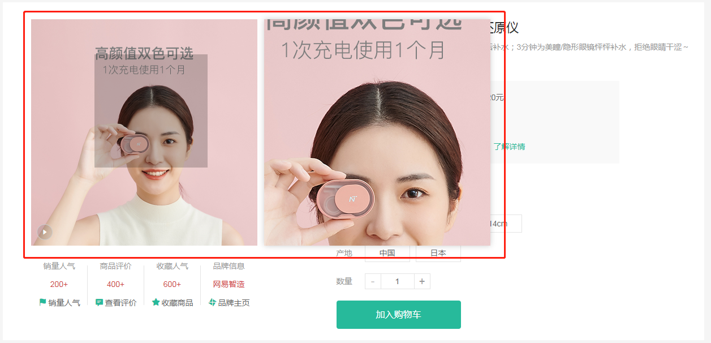

大致步骤：

- 首先准备大图容器和遮罩容器
- 然后使用`@vueuse/core`的`useMouseInElement`方法获取基于元素的偏移量
- 计算出 遮罩容器定位与大容器背景定位  暴露出数据给模板使用


落地代码：`src/views/goods/components/goods-image.vue`

- 准备大图容器 

```diff
  <div class='goods-image'>
+    <div class="large" :style="[{backgroundImage:`url(${images[currIndex]})`}]"></div>
    <div class="middle">
```

```diff
.goods-image {
  width: 480px;
  height: 400px;
  position: relative;
  display: flex;
+  z-index: 500;
+  .large {
+    position: absolute;
+    top: 0;
+    left: 412px;
+    width: 400px;
+    height: 400px;
+    box-shadow: 0 0 10px rgba(0,0,0,0.1);
+    background-repeat: no-repeat;
+    background-size: 800px 800px;
+    background-color: #f8f8f8;
+  }
```

> 总结：实现右侧大图布局效果（背景图放大4倍）

- 准备待移动的遮罩容器 

```diff
    <div class="middle" ref="target">
      
+      <div class="layer"></div>
    </div>
```

```diff
  .middle {
    width: 400px;
    height: 400px;
+    position: relative;
+    cursor: move;
+    .layer {
+      width: 200px;
+      height: 200px;
+      background: rgba(0,0,0,.2);
+      left: 0;
+      top: 0;
+      position: absolute;
+    }
  }
```

> 总结：添加左侧遮罩层和右侧大图预览区（基于绝对定位控制位置）

- vueuse提供的监听进入指定范围方法的基本使用

```js
const { elementX, elementY, isOutside } = useMouseInElement(target)
```

> 总结：方法的参数target表示被监听的DOM对象；返回值elementX, elementY表示被监听的DOM的左上角的位置信息left和top；isOutside表示是否在DOM的范围内，true表示在范围之外。false表示范围内。

- 使用vueuse提供的API获取鼠标偏移量

```js
import { reactive, ref, watch } from 'vue'
import { useMouseInElement } from '@vueuse/core'
```

```js

const usePreviewImage = () => {
  // 被监听的区域
  const target = ref(null)
  // 控制遮罩层和预览图的显示和隐藏
  const isShow = ref(false)
  // 遮罩层位置坐标
  const position = reactive({
    left: 0,
    top: 0
  })
  // 右侧预览大图的坐标
  const bgPosition = reactive({
    backgroundPositionX: 0,
    backgroundPositionY: 0
  })
  const { elementX, elementY, isOutside } = useMouseInElement(target)
  // 基于侦听器侦听值的变化
  watch([elementX, elementY, isOutside], () => {
    // console.log(elementX.value, elementY.value, isOutside.value)
    // 通过标志位控制显示和隐藏
    isShow.value = !isOutside.value
    if (isOutside.value) return
    // X方向坐标范围控制
    if (elementX.value < 100) {
      // 左侧
      position.left = 0
    } else if (elementX.value > 300) {
      // 右侧
      position.left = 200
    } else {
      // 中间
      position.left = elementX.value - 100
    }
    // Y方向坐标范围控制
    if (elementY.value < 100) {
      // 左侧
      position.top = 0
    } else if (elementY.value > 300) {
      // 右侧
      position.top = 200
    } else {
      // 中间
      position.top = elementY.value - 100
    }
    // 计算预览大图的移动的距离
    bgPosition.backgroundPositionX = -position.left * 2 + 'px'
    bgPosition.backgroundPositionY = -position.top * 2 + 'px'
    // 计算遮罩层的位置
    position.left = position.left + 'px'
    position.top = position.top + 'px'
  })

  return { position, bgPosition, isShow, target }
}
```

- 在setup中返回模板需要数据，并使用它

```diff
  setup () {
    const { currIndex, toggleImg } = useToggleImg()
+    const { position, bgPosition, show, target } = usePreviewImg()
+    return { currIndex, toggleImg, position, bgPosition, show, target }
  }
```

```vue
    <div class="large" v-show="show" :style="[{backgroundImage:`url(${images[currIndex]})`},bgPosition]"></div>
    <div class="middle" ref="target">
      
      <div class="layer" v-show="show" :style="position"></div>
    </div>
```

> 总结：
>
> 1. 基于Vueuse提供方法监控进入DOM内的坐标
> 2. 基于坐标的变化控制遮罩层的移动
> 3. 基于坐标的变化控制右侧预览图背景的变化
> 4. 控制进入和离开时显示和隐藏效果


## 商品详情-基本信息展示

> 目的：展示商品基本信息

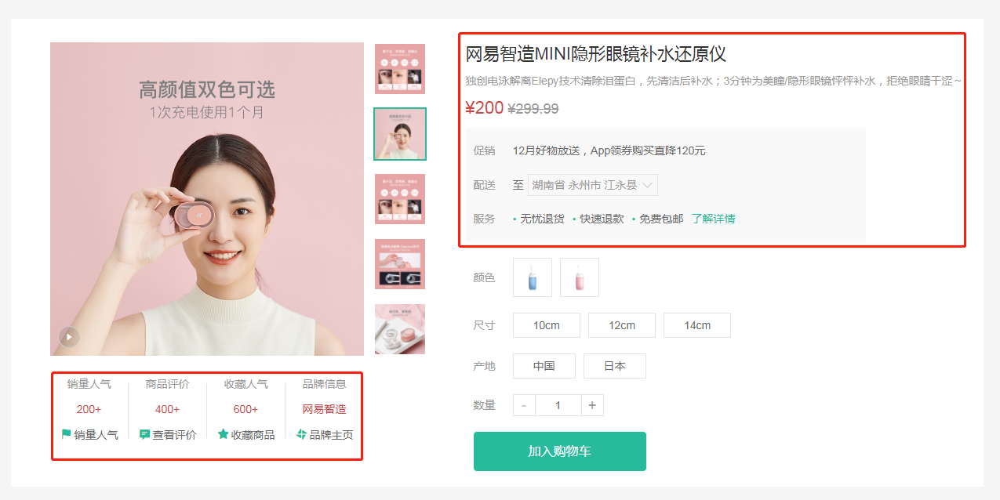

大致步骤：

- 商品销售属性组件
- 商品名称信息组件


落地代码：

- ⑴基础布局：

红色区域1 `src/views/goods/components/goods-sales.vue`

```vue
<template>
  <ul class="goods-sales">
    <li>
      <p>销量人气</p>
      <p>200+</p>
      <p><i class="iconfont icon-task-filling"></i>销量人气</p>
    </li>
    <li>
      <p>商品评价</p>
      <p>400+</p>
      <p><i class="iconfont icon-comment-filling"></i>查看评价</p>
    </li>
    <li>
      <p>收藏人气</p>
      <p>600+</p>
      <p><i class="iconfont icon-favorite-filling"></i>收藏商品</p>
    </li>
    <li>
      <p>品牌信息</p>
      <p>苏宁电器</p>
      <p><i class="iconfont icon-dynamic-filling"></i>品牌主页</p>
    </li>
  </ul>
</template>

<script>
export default {
  name: 'GoodsSales'
}
</script>

<style scoped lang='less'>
.goods-sales {
  display: flex;
  width: 400px;
  align-items: center;
  text-align: center;
  height: 140px;
  li {
    flex: 1;
    position: relative;
    ~ li::after {
      position: absolute;
      top: 10px;
      left: 0;
      height: 60px;
      border-left: 1px solid #e4e4e4;
      content: "";
    }
    p {
      &:first-child {
        color: #999;
      }
      &:nth-child(2) {
        color: @priceColor;
        margin-top: 10px;
      }
      &:last-child {
        color: #666;
        margin-top: 10px;
        i {
          color: @xtxColor;
          font-size: 14px;
          margin-right: 2px;
        }
        &:hover {
          color: @xtxColor;
          cursor: pointer;
        }
      }
    }
  }
}
</style>

```

红色区域2  `src/views/goods/components/goods-name.vue`

```vue
<template>
  <p class="g-name">2件装 粉釉花瓣心意点缀 点心盘*2 碟子盘子</p>
  <p class="g-desc">花瓣造型干净简约 多功能使用堆叠方便</p>
  <p class="g-price">
    <span>108.00</span>
    <span>199.00</span>
  </p>
  <div class="g-service">
    <dl>
      <dt>促销</dt>
      <dd>12月好物放送，App领券购买直降120元</dd>
    </dl>
    <dl>
      <dt>配送</dt>
      <dd>至 </dd>
    </dl>
    <dl>
      <dt>服务</dt>
      <dd>
        <span>无忧退货</span>
        <span>快速退款</span>
        <span>免费包邮</span>
        <a href="javascript:;">了解详情</a>
      </dd>
    </dl>
  </div>
</template>

<script>
export default {
  name: 'GoodName'
}
</script>

<style lang="less" scoped>
.g-name {
  font-size: 22px
}
.g-desc {
  color: #999;
  margin-top: 10px;
}
.g-price {
  margin-top: 10px;
  span {
    &::before {
      content: "¥";
      font-size: 14px;
    }
    &:first-child {
      color: @priceColor;
      margin-right: 10px;
      font-size: 22px;
    }
    &:last-child {
      color: #999;
      text-decoration: line-through;
      font-size: 16px;
    }
  }
}
.g-service {
  background: #f5f5f5;
  width: 500px;
  padding: 20px 10px 0 10px;
  margin-top: 10px;
  dl {
    padding-bottom: 20px;
    display: flex;
    align-items: center;
    dt {
      width: 50px;
      color: #999;
    }
    dd {
      color: #666;
      &:last-child {
        span {
          margin-right: 10px;
          &::before {
            content: "•";
            color: @xtxColor;
            margin-right: 2px;
          }
        }
        a {
          color: @xtxColor;
        }
      }
    }
  }
}
</style>
```


- ⑵使用组件 `src/views/goods/index.vue`

```js
import GoodsSales from './components/goods-sales'
import GoodsName from './components/goods-name'
```

```js
components: { GoodsRelevant, GoodsImage, GoodsSales, GoodsName },
```

```diff
      <!-- 商品信息 -->
      <div class="goods-info">
        <div class="media">
          <GoodsImage :images="goods.mainPictures" />
+          <GoodsSales />
        </div>
        <div class="spec">
+          <GoodsName :goods="goods"/>
        </div>
      </div>
```

- ⑶渲染数据  `src/views/goods/components/goods-name.vue`

```vue
  <p class="g-name">{{goods.name}}</p>
  <p class="g-desc">{{goods.desc}}</p>
  <p class="g-price">
    <span>{{goods.price}}</span>
    <span>{{goods.oldPrice}}</span>
  </p>
```

> 总结：
>
> 1. 准备商品销售信息组件
> 2. 商品名称信息组件

## 商品详情-城市组件-基础布局

> 目的：完成城市组件的基础布局和基本显示隐藏切换效果。

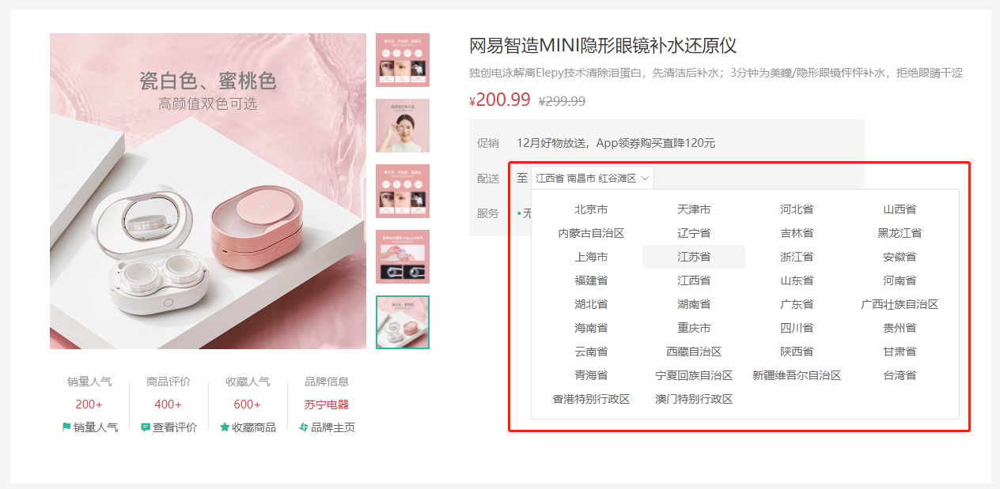


大致步骤：

- 准备基本组件结构
- 完成切换显示隐藏
- 完成点击外部隐藏


落地代码：

`src/components/library/xtx-city.vue`

- 结构

```vue
<template>
  <div class="xtx-city" ref="target">
    <div class="select" @click="toggle" :class="{active:isShow}">
      <span class="placeholder">请选择配送地址</span>
      <span class="value"></span>
      <i class="iconfont icon-angle-down"></i>
    </div>
    <div class="option" v-show='isShow'>
      <span class="ellipsis" v-for="i in 24" :key="i">北京市</span>
    </div>
  </div>
</template>
```

- 逻辑

```vue
<script>
import { ref } from 'vue'
import { onClickOutside } from '@vueuse/core'
export default {
  name: 'XtxCity',
  setup () {
    const isShow = ref(false)
    // 控制选择城市弹窗的显示和隐藏
    const toggle = () => {
      isShow.value = !isShow.value
    }
    return { isShow, toggle }
  }
}
</script>
```

- 样式

```vue
<style scoped lang="less">
.xtx-city {
  display: inline-block;
  position: relative;
  z-index: 400;  
  .select {
    border: 1px solid #e4e4e4;
    height: 30px;
    padding: 0 5px;
    line-height: 28px;
    cursor: pointer;
    &.active {
      background: #fff;
    }
    .placeholder {
      color: #999;
    }
    .value {
      color: #666;
      font-size: 12px;
    }
    i {
      font-size: 12px;
      margin-left: 5px;
    }
  }
  .option {
    width: 542px;
    border: 1px solid #e4e4e4;
    position: absolute;
    left: 0;
    top: 29px;
    background: #fff;
    min-height: 30px;
    line-height: 30px;
    display: flex;
    flex-wrap: wrap;
    padding: 10px;
    > span {
      width: 130px;
      text-align: center;
      cursor: pointer;
      border-radius: 4px;
      padding: 0 3px;
      &:hover {
        background: #f5f5f5;
      }
    }
  }
}
</style>
```

> 总结：
>
> 1. 实现城市选择组件的基本布局
> 2. 控制弹窗的显示和隐藏


## 商品详情-城市组件-获取数据

> 2目的：组件初始化的时候获取城市数据，进行默认展示。

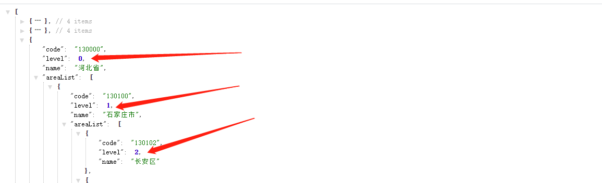

大致步骤：

- 获取数据函数封装且支持缓存。
- 获取数据渲染且加上加载中效果。
- 加上一个`vue-cli`配置，处理图片为base64


落地代码：`src/components/library/xtx-city.vue`

- 获取数据的函数

```js
// 获取城市数据
// 1. 数据在哪里？https://yjy-oss-files.oss-cn-zhangjiakou.aliyuncs.com/tuxian/area.json
// 2. 何时获取？打开城市列表的时候，做个内存中缓存
// 3. 怎么使用数据？定义计算属性，根据点击的省份城市展示
export const getCityList = async () => {
  // 添加缓存，防止频繁加载列表数据
  if (window.cityList) {
    // 缓存中已经存在数据了
    return window.cityList
  }
  const ret = await axios.get(cityUrl)
  // 给window对象添加了一个属性cityList
  if (ret.data) {
      window.cityList = ret.data
  }
  // 把数据返回
  return ret.data
}
```

- toggle使用函数

```js
<script>
import { ref } from 'vue'
import { getCityList } from '@/api/product.js'

export default {
  name: 'XtxCity',
  setup () {
    // 城市列表数据
    const list = ref([])
    // 显示隐藏状态位
    const isShow = ref(false)
    // 控制选择城市弹窗的显示和隐藏
    const toggle = () => {
      isShow.value = !isShow.value
      // 打开弹窗是调用接口获取城市列表数据
      if (isShow.value) {
        getCityList().then(data => {
          list.value = data
        })
      }
    }
    return { isShow, toggle, list }
  }
}
</script>
```

> 总结：
>
> 1. 点击选择城市按钮，调用接口获取城市列表数据
> 2. 添加城市列表数据的缓存（基于window的全局属性进行缓存）

- 加载中样式

```less
.option {
    // 省略...
    .loading {
      height: 290px;
      width: 100%;
      background: url(../../assets/images/loading.gif) no-repeat center;
    }
}
```

- 模板中使用

```diff
    <div class="option" v-if="visible">
+      <div v-if="loading" class="loading"></div>
+      <template v-else>
+        <span class="ellipsis" v-for="item in list" :key="item.code">{{item.name}}</span>
+      </template>
    </div>
```

**注意事项：** 需要配置10kb下的图片打包成base64的格式 `vue.config.js`

```js
  chainWebpack: config => {
    config.module
      .rule('images')
      .use('url-loader')
      .loader('url-loader')
      .tap(options => Object.assign(options, { limit: 10000 }))
  }
```

> 总结：
>
> 1. 添加一个调用接口加载的状态效果
> 2. 需要把小图片转换为base64数据，提高加载效率（基于webpack的配置进行处理）

## 商品详情-城市组件-交互逻辑

> 3目的：显示省市区文字，让组件能够选择省市区并且反馈给父组件。

大致步骤：

- 明确和后台交互的时候需要产生哪些数据，省code，市code，地区code，它们组合再一起的文字。
- 商品详情的默认地址，如果登录了有地址列表，需要获取默认的地址，设置商品详情的地址。
- 然后默认的地址需要传递给`xtx-city`组件做默认值显示
- 然后 `xtx-city` 组件产生数据的时候，需要给出：省code，市code，地区code，它们组合在一起的文字。


落的代码：

- 第一步：父组件设置  省市区的code数据，对应的文字数据`src/views/goods/components/goods-name.vue`

```js
import { ref, toRef } from 'vue'

export default {
  name: 'GoodName',
  props: {
    goods: {
      type: Object,
      default: () => { }
    }
  },
  setup (props) {
    // 如果用户已经登录，那么通过detail.userAddresses可以获取配置地址
    // 默认情况
    const provinceCode = ref('110000')
    const cityCode = ref('119900')
    const countyCode = ref('110101')
    const fullLocation = ref('北京市 市辖区 东城区')
    const { goods } = toRef(props, 'goods')
    if (goods && goods.userAddresses) {
      // 证明有地址：如果有默认地址就使用默认的，否则使用第一个
      const defaultAddress = goods.userAddresses.find(item => item.isDefault === 1)
      if (defaultAddress) {
        // 有默认地址
        provinceCode.value = defaultAddress.provinceCode
        cityCode.value = defaultAddress.cityCode
        countyCode.value = defaultAddress.countyCode
        fullLocation.value = defaultAddress.fullLoaction
      } else {
        // 没有默认的使用第一个地址
        provinceCode.value = goods.userAddresses[0].provinceCode
        cityCode.value = goods.userAddresses[0].cityCode
        countyCode.value = goods.userAddresses[0].countyCode
        fullLocation.value = goods.userAddresses[0].fullLoaction
      }
      console.log(provinceCode.value, cityCode.value, countyCode.value)
    }

    return { fullLocation }
  }
}
```

```vue
<XtxCity :fullLocation="fullLocation" />
```

> 总结：获取后端的详情数据中默认的配送地址，进行显示

- 第二步：监听用户点击 省，市 展示 市列表和地区列表 `src/components/xtx-city.vue`

```diff
    <div class="option" v-show="visible">
+      <span @click="changeCity(city)" class="ellipsis"
```

```js
// 选中的省市区
const changeResult = reactive({
  provinceCode: '',
  provinceName: '',
  cityCode: '',
  cityName: '',
  countyCode: '',
  countyName: '',
  fullLocation: ''
})
// 控制城市的切换
const changeCity = (city) => {
  if (city.level === 0) {
    // 省级
    changeResult.provinceCode = city.code
    changeResult.provinceName = city.name
  } else if (city.level === 1) {
    // 市级
    changeResult.cityCode = city.code
    changeResult.cityName = city.name
  } else if (city.level === 2) {
    // 县级
    changeResult.countyCode = city.code
    changeResult.countyName = city.name
    // 关闭弹窗
    toggle()
    // 把选中的数据交给父组件
    changeResult.fullLocation = `${changeResult.provinceName} ${changeResult.cityName} ${changeResult.countyName}`
    emit('change-result', changeResult)
  }
}
```

- 计算出需要展示列表

```js
// 动态计算当前显示的是省级还是市级还是县级
const cityList = computed(() => {
  // 省级列表
  let result = list.value
  // 计算市级列表
  if (changeResult.provinceCode && changeResult.provinceName) {
    // 点击了省，计算它的市级数据
    result = result.find(item => item.code === changeResult.provinceCode).areaList
  }
  // 计算县级列表
  if (changeResult.cityCode && changeResult.cityName) {
    // 点击了省，计算它的市级数据
    return result.find(item => item.code === changeResult.cityCode).areaList
  }
  return result
})
```

- 打开弹层清空之前的选择

```diff
// 控制选择城市弹窗的显示和隐藏
const toggle = () => {
  isShow.value = !isShow.value
  // 打开弹窗是调用接口获取城市列表数据
  if (isShow.value) {
    loading.value = true
    getCityList().then(data => {
      list.value = data
      loading.value = false
    })
    // 打开弹窗时，请求数据
+    for (const key in changeResult) {
+      changeResult[key] = ''
+    }
  }
}
```

- 第三步：点击地区的时候，将数据通知给父组件使用，关闭对话框 `src/components/xtx-city.vue`

```js
// 切换城市
const changeCity = (item) => {
  // 判断省市区
  if (item.level === 0) {
    // 点击的是省级单位
    changeResult.provinceCode = item.code
    changeResult.provinceName = item.name
  } else if (item.level === 1) {
    // 市级单位
    changeResult.cityCode = item.code
    changeResult.cityName = item.name
  } else if (item.level === 2) {
    // 县级单位：选中省市区的结果，并且关闭弹窗
    changeResult.countyCode = item.code
    changeResult.countyName = item.name
    // 关闭弹窗
    isShow.value = false
    // 拼接完整的地址
    changeResult.fullLocation = `${changeResult.provinceName}${changeResult.cityName}${changeResult.countyName}`
    // 把最终选中的省市区所有数据传递回父组件
    emit('update-city', changeResult)
  }
}
```

- 父组件获取选中的值 `src/views/goods/components/goods-name.vue`

```js
// 获取更新的城市信息
const updateCity = (cityInfo) => {
  provinceCode.value = cityInfo.provinceCode
  cityCode.value = cityInfo.cityCode
  countyCode.value = cityInfo.countyCode
  fullLocation.value = cityInfo.fullLocation
}
```

```vue
<XtxCity @update-city='updateCity' :fullLocation='fullLocation' />
```

> 总结：
>
> 1. 控制选中省市区的切换操作
> 2. 通过计算属性获取当前的省市区数据
> 3. 控制结果的选中

- 第四步，点击弹窗之外关闭弹窗

```JS
import { onClickOutside } from '@vueuse/core'
// 弹窗引用对象
const target = ref(null)
onClickOutside(target, () => {
  // 点击弹窗之外的区域自动触发
  isShow.value = false
})
return { target }
// 模板中需要绑定 ref='target'
```

> 总结：基于vueuse提供onClickOutside方法控制弹窗的关闭

## ★规格组件-SKU&SPU概念

官方话术：

- SPU（Standard Product Unit）：标准化产品单元。是商品信息聚合的最小单位，是一组可复用、易检索的标准化信息的集合，该集合描述了一个产品的特性。通俗点讲，属性值、特性相同的商品就可以称为一个SPU。
- SKU（Stock Keeping Unit）库存量单位，即库存进出计量的单位， 可以是以件、盒、托盘等为单位。SKU是物理上不可分割的最小存货单元。在使用时要根据不同业态，不同管理模式来处理。 

画图理解：

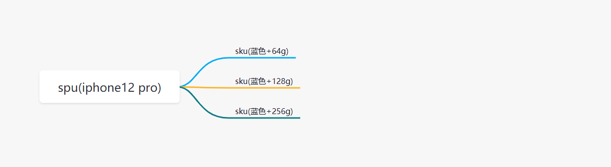

总结一下：

- spu代表一种商品，拥有很多相同的属性。
- sku代表该商品可选规格的任意组合，他是库存单位的唯一标识。

---

- 如何判断组合选择的规格参数是否可以选中？

1. 从后端可以得到所有的SKU数据
2. 我们需要过滤出有库存的SKU数据
3. 为了方便进行组合判断，需要计算每个SKU规格的集合数据的【笛卡尔集】
4. 为了方便判断是否可以选择规格，可以基于笛卡尔集生成规格的【字典】
5. 此时当点击规格标签时，把选中的规格进行组合，然后去字典中判断，只要有一个存在，就证明这种组合是有效的（点击组合点击）

## ★规格组件-基础结构和样式

> 目标，完成规格组件的基础布局。

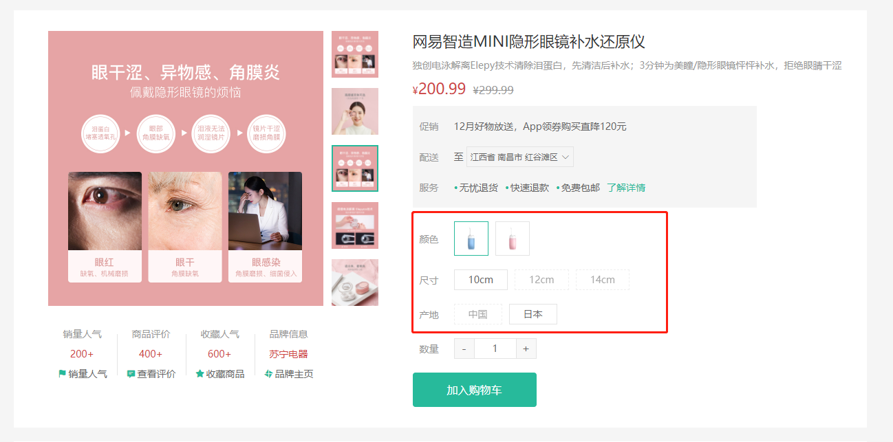


大致步骤：

- 准备组件 
- 使用组件


落地代码：

-  组件结构 `src/views/goods/components/goods-sku.vue`

```vue
<template>
  <div class="goods-sku">
    <dl>
      <dt>颜色</dt>
      <dd>
        
        
      </dd>
    </dl>
    <dl>
      <dt>尺寸</dt>
      <dd>
        <span class="disabled">10英寸</span>
        <span class="selected">20英寸</span>
        <span>30英寸</span>
      </dd>
    </dl>
    <dl>
      <dt>版本</dt>
      <dd>
        <span>美版</span>
        <span>港版</span>
      </dd>
    </dl>
  </div>
</template>
<script>
export default {
  name: 'GoodsSku'
}
</script>
<style scoped lang="less">
.sku-state-mixin () {
  border: 1px solid #e4e4e4;
  margin-right: 10px;
  cursor: pointer;
  &.selected {
    border-color: @xtxColor;
  }
  &.disabled {
    opacity: 0.6;
    border-style: dashed;
    cursor: not-allowed;
  }
}
.goods-sku {
  padding-left: 10px;
  padding-top: 20px;
  dl {
    display: flex;
    padding-bottom: 20px;
    align-items: center;
    dt {
      width: 50px;
      color: #999;
    }
    dd {
      flex: 1;
      color: #666;
      > img {
        width: 50px;
        height: 50px;
        .sku-state-mixin ();
      }
      > span {
        display: inline-block;
        height: 30px;
        line-height: 28px;
        padding: 0 20px;
        .sku-state-mixin ();
      }
    }
  }
}
</style>
```

- 使用组件 `src/views/goods/index.vue`

```diff
+import GoodsSku from './components/goods-sku'

  name: 'XtxGoodsPage',
+  components: { GoodsRelevant, GoodsImage, GoodsSales, GoodsName, GoodsSku },
  setup () {
```

```diff
        <div class="spec">
          <!-- 名字区组件 -->
          <GoodsName :goods="goods" />
          <!-- 规格组件 -->
+          <GoodsSku />
        </div>
```

> 总结： 每一个按钮拥有`selected` `disabled`  类名，做 选中 和 禁用 要用。
>


## ★规格组件-渲染与选中效果

> 目的：根据商品信息渲染规格，完成选中，取消选中效果。

大致步骤：

- 依赖 `goods.specs` 渲染规格
- 绑定按钮点击事件，完成选中和取消选中
  - 当前点的是选中，取消即可
  - 当前点的未选中，先当前规格按钮全部取消，当前按钮选中。


落的代码：`src/views/goods/components/goods-sku.vue`

```vue
<template>
  <div class="goods-sku">
    <dl v-for='(item, i) in specs' :key='i'>
      <dt>{{item.name}}</dt>
      <dd>
        <template v-for='(tag, n) in item.values' :key='n'>
          
          <span :class='{selected: tag.selected}' v-else @click='toggle(tag, item.values)'>{{tag.name}}</span>
        </template>
      </dd>
    </dl>
  </div>
</template>
<script>
export default {
  name: 'GoodsSku',
  props: {
    // 商品的规格参数
    specs: {
      type: Array,
      default: () => []
    }
  },
  setup () {
      // 控制标签的选中和反选(保证仅仅可以选中一个标签)
      const toggle = (tag, list) => {
        // 处理当前点击的标签是否选中
        tag.selected = !tag.selected
        // 处理点击当前标签之外的其他标签的情况
        list.forEach(item => {
          if (item.name !== tag.name) {
            // 其他标签，都编程不选中的状态
            item.selected = false
          }
        })
      }
      return { toggle }
  }
}
</script>
```

> 总结：
>
> 1. 动态渲染所有的规格参数：两层遍历
> 2. 控制标签的选中和反选，并且只能选中一个标签

## ★规格组件-禁用效果-思路分析

> 目标：大致了解禁用效果的整体思路，注意只是了解。

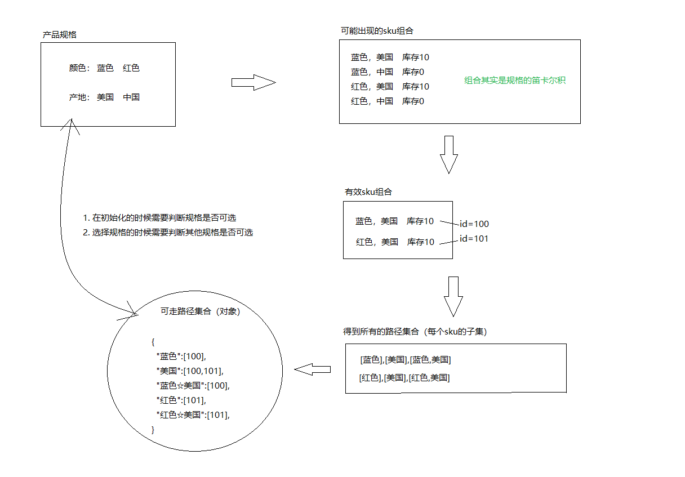

大致步骤：

1. 根据后台返回的skus数据得到有效（有库存）sku组合
2. 根据有效的sku组合得到所有的子集集合（笛卡尔集）
3. 根据子集集合组合成一个路径字典，也就是对象。
4. 在组件初始化的时候去判断每个规格是否可以点击
5. 在点击规格的时候去判断其他规格是否可点击
6. 判断的依据是，拿着所有规格和现在已经选中的规格去搭配，得到可走路径。
   1. 如果可走路径在字典中，可点击
   2. 如果可走路径不在字典中，禁用


## ★规格组件-禁用效果-路径字典

> 目的：根据后台skus数据得到可走路径字典对象

- js算法库 https://github.com/trekhleb/javascript-algorithms
- 幂集算法 https://raw.githubusercontent.com/trekhleb/javascript-algorithms/master/src/algorithms/sets/power-set/bwPowerSet.js

`src/vendor/power-set.js`

```js
/**
 * Find power-set of a set using BITWISE approach.
 *
 * @param {*[]} originalSet
 * @return {*[][]}
 */
export default function bwPowerSet(originalSet) {
  const subSets = [];

  // We will have 2^n possible combinations (where n is a length of original set).
  // It is because for every element of original set we will decide whether to include
  // it or not (2 options for each set element).
  const numberOfCombinations = 2 ** originalSet.length;

  // Each number in binary representation in a range from 0 to 2^n does exactly what we need:
  // it shows by its bits (0 or 1) whether to include related element from the set or not.
  // For example, for the set {1, 2, 3} the binary number of 0b010 would mean that we need to
  // include only "2" to the current set.
  for (let combinationIndex = 0; combinationIndex < numberOfCombinations; combinationIndex += 1) {
    const subSet = [];

    for (let setElementIndex = 0; setElementIndex < originalSet.length; setElementIndex += 1) {
      // Decide whether we need to include current element into the subset or not.
      if (combinationIndex & (1 << setElementIndex)) {
        subSet.push(originalSet[setElementIndex]);
      }
    }

    // Add current subset to the list of all subsets.
    subSets.push(subSet);
  }

  return subSets;
}
```

> 总结：忽略第三方代码的eslint检测：在.eslintignore文件中添加需要被忽略的文件的路径

- 生成数据字典`src/views/goods/components/goods-sku.vue`

```js
import powerSet from '@/vendor/power-set.js'
// 生成路径字典
const usePathMap = (skus) => {
  // 路径字典结果
  const result = {}
  // 规格分隔符
  const spliter = '※'

  skus.forEach(sku => {
    // 过滤掉无效sku数据
    console.log(sku.inventory)
    if (sku.inventory === 0) return
    // 获取规格的集合数据：[蓝色，中国，10cm]
    const spec = sku.specs.map(item => item.valueName)
    // 计算当个sku规格的笛卡尔集
    const specSet = powerSet(spec)
    specSet.forEach(item => {
      // 排除空数组
      if (item.length === 0) return
      // 生成字典的key
      const key = item.join(spliter)
      // 把key添加到字典中
      if (result[key]) {
        // 字典中已经存在当前的key
        result[key].push(sku.id)
      } else {
        // 字典中不存在当前的key
        result[key] = [sku.id]
      }
    })
  })

  return result
}
```

```diff
+  setup (props) {
+    const pathMap = usePathMap(props.skus)
+    console.log(pathMap)
```

- 参照示例

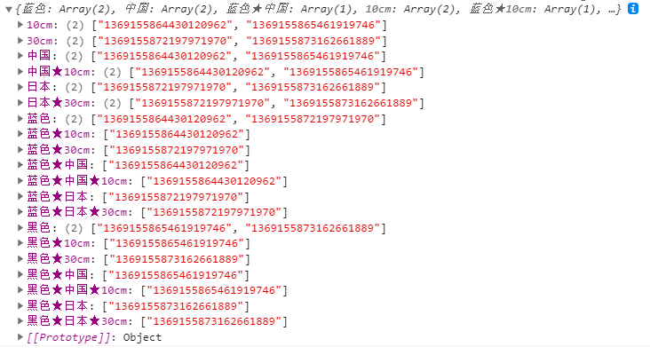


## ★规格组件-禁用效果-设置状态

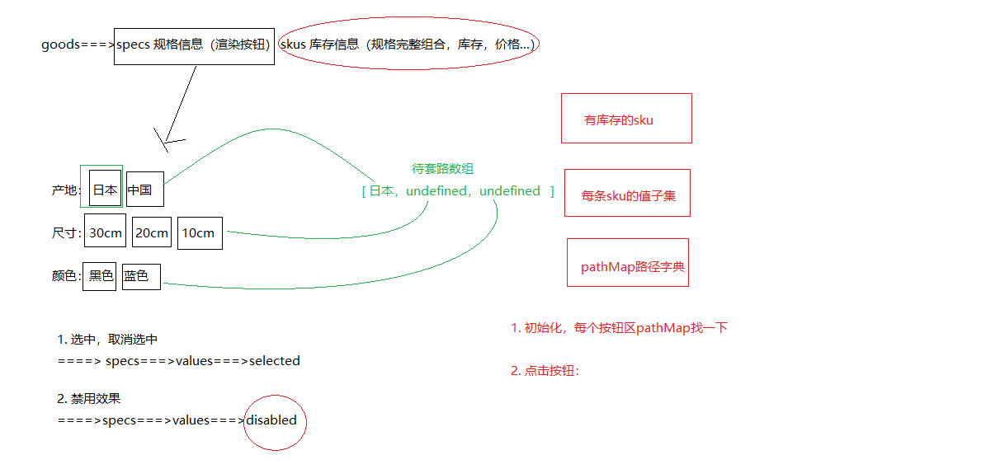

> 目的：在组件初始化的时候，点击规格的时候，去更新其他按钮的禁用状态。

大致的步骤：

- 再需要更新状态的时候获取当前选中的规格数组
- 遍历所有的规格按钮，拿出按钮的值设置给规格数组，然后得到key
- 拿着key去路径字典中查找，有就可点击，没有禁用即可。

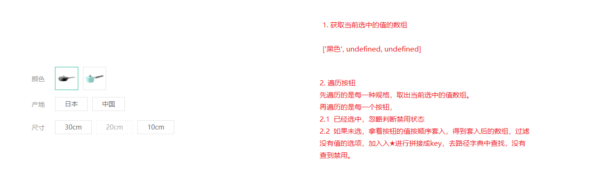

`src/views/goods/components/goods-sku.vue`

```js
// 获取选中的所有规格的值
const getSelectedValues = (specs) => {
  // 选中的所有的规格数据
  const result = []
  specs.forEach((item, index) => {
    // 获取规格的选中的信息
    const spec = item.values.find(tag => tag.selected)
    if (spec) {
      // 该规格被选中了
      result[index] = spec.name
    } else {
      // 该规格没有选中
      result[index] = undefined
    }
  })
  return result
}
```

```js
// 控制规格标签是否被禁用
const updateDisabledStatus = (specs, pathMap) => {
  // seletedValues = [undefined, undefined, undefined]
  specs.forEach((spec, i) => {
    // 每次规格的遍历，选中的值需要重新初始化
    const seletedValues = getSelectedValue(specs)
    spec.values.forEach(tag => {
      if (tag.selected) {
        // 标签本身就是选中状态，不需要处理
        return
      } else {
        // 没有选中（初始化时，需要判断单个规格的禁用状态）
        seletedValues[i] = tag.name
      }
      // 此时，需要判断当前的按钮是否应该被禁用
      // 基于当前选中的值，组合一个路径
      // 过滤掉undefined值，基于剩余的值组合一个路径
      let currentPath = seletedValues.filter(item => item)
      if (currentPath.length > 0) {
        // 拼接路径字符串 currentPath = 黑色★10cm
        currentPath = currentPath.join(spliter)
        // 判断当前的路径是否在路径字典中(如果在字典中没有找到该路径，证明当前的标签应该禁用)
        tag.disabled = !pathMap[currentPath]
      }
      // 单独判断单个按钮是否应该禁用
      // tag.disabled = !pathMap[tag.name]
    })
  })
}
```

```diff
  setup (props) {
    const pathMap = getPathMap(props.goods.skus)
    // 组件初始化的时候更新禁用状态
+    updateDisabledStatus(props.specs, pathMap)
    const clickSpecs = (item, val) => {
      // 如果是禁用状态不作为
+      if (val.disabled) return
      // 1. 选中与取消选中逻辑
      if (val.selected) {
        val.selected = false
      } else {
        item.values.find(bv => { bv.selected = false })
        val.selected = true
      }
      // 点击的时候更新禁用状态
+      updateDisabledStatus(props.specs, pathMap)
    }
    return { clickSpecs }
  }
```

> 总结
>
> 1. 判断初始状态按钮的禁用效果
> 2. 判断点击按钮后，每一个按钮的禁用状态


## ★规格组件-数据通讯

> 目的：根据传入的skuId进行默认选中，选择规格后触发change事件传出选择的sku数据。

大致步骤：

- 根据传入的SKUID选中对应规格按钮
- 选择规格后传递sku信息给父组件
  - 完整规格，传 skuId 价格  原价  库存   规格文字
  - 不完整的，传 空对象


落的代码：

- 根据传人的sku设置默认选中的规格 `src/views/goods/components/goods-sku.vue`

```js
skuId: {
  type: String,
  default: ''
}
```

```js
// 根据传入的skuId初始化规格的选中状态
// skuId表示传入的选中的sku规格的id
// specs表示所有的规格数据
// skus表示后端返回的原始的库存数据
const initSkuSeletedStatus = (skuId, specs, skus) => {
  // 获取当前sku信息
  const currentSku = skus.find(item => item.id === skuId)
  specs.forEach(item => {
    currentSku.specs.forEach(tagInfo => {
      // tagInfo表示应该被选中的规格信息
      const tag = item.values.find(tag => tag.name === tagInfo.valueName)
      if (tag) {
        // 该规格需要被选中
        tag.selected = true
      }
    })
  })
}
```

```diff
  setup (props, { emit }) {
    const pathMap = getPathMap(props.goods.skus)
    // 根据传入的skuId默认选中规格按钮
+    // 根据SKUId初始化规格的选中状态
+    if (props.skuId) {
+      initSkuSeletedStatus(props.skuId, props.specs, props.skus)
+    }
    // 组件初始化的时候更新禁用状态
    updateDisabledStatus(props.goods.specs, pathMap)
```

> 总结：根据skuId中的规格数据控制规格的选中
>

- 根据选择的完整sku规格传出sku信息
  - 其中传出的specsText是提供给购物车存储使用的。

 `src/views/goods/components/goods-sku.vue`

```diff
+  setup (props, { emit }) {
```

```diff
const clickSpecs = (item, val) => {
      // 如果是禁用状态不作为
      if (val.disabled) return false
      // 1. 选中与取消选中逻辑
      if (val.selected) {
        val.selected = false
      } else {
        item.values.find(bv => { bv.selected = false })
        val.selected = true
      }
      // 点击的时候更新禁用状态
      updateDisabledStatus(props.goods.specs, pathMap)
+ // 获取此时选中的规格的所有的值，传递给父组件
+ // 1、如果所有的规格都选择了才是合理的
+ // 2、如果有未选的的规格，就不应该得到数据
+ const result = getSelectedValue(props.specs)
+ if (result.filter(item => item).length === props.specs.length) {
+   // 所有的规格都进行了选择
+   // 有效数据：skuId,price,oldPrice,inventory,specsText (来源于SKU记录)
+   // 根据当前的选中的规格结果，拼接路径字典key
+   const pathKey = result.join(spliter)
+   // 根据路径获取路径字典中存储的skuId
+   const skuId = pathMap[pathKey][0]
+   // 根据SKUId获取详细数据
+   const sku = props.skus.find(item => item.id === skuId)
+   // 拼接specsText数据
+   let specsText = ''
+   sku.specs.forEach(item => {
+     specsText += item.name + ':' + item.valueName + ','
+   })
+   if (specsText.length > 0) {
+     specsText = specsText.substring(0, specsText.length - 1)
+   }
+   // 组合有效数据
+   const specInfo = {
+     skuId: skuId,
+     price: sku.price,
+     oldPrice: sku.oldPrice,
+     inventory: sku.inventory,
+     specsText: specsText
+   }
+   emit('sku-info', specInfo)
+ } else {
+   // 还有规格没有选
+   emit('sku-info', {})
+ }
```

`src/views/goods/index.vue`

```vue
<GoodsSku @sku-info='skuInfo' :specs='goodsDetail.specs' :skus='goodsDetail.skus' />
```

```diff
  setup () {
    const goods = useGoods()
    // sku改变时候触发
+    const skuInfo = (sku) => {
+      if (sku.skuId) {
+        goods.value.price = sku.price
+        goods.value.oldPrice = sku.oldPrice
+        goods.value.inventory = sku.inventory
+      }
+    }
+    return { goods, changeSku }
  }
```

- 基于数组的reduce方法重构拼接字符串的逻辑

```js
let specsText = sku.specs.reduce((result, item) => result + item.name + ':' + item.valueName + ',', '')
specsText = specsText.length > 0 && specsText.substring(0, specsText.length - 1)
// 组合有效数据
const specInfo = {
  skuId: skuId,
  price: sku.price,
  oldPrice: sku.oldPrice,
  inventory: sku.inventory,
  specsText: specsText
}
```

> 总结：数组的reduce方法的基本使用  arr.reduce(callback, initValue)
>
> let specsText = sku.specs.reduce((result, item) => result + item.name + ':' + item.valueName + ',', '')
>
> 1. callback参数表示回调函数
>
>    result表示每次迭代累加的信息；item是数组的每一项数据
>
> 2. initValue表示result的初始值
>
> 3. 获取规格选中之后的商品相关的信息并且传递到父组件

## 商品详情-数量选择组件

> 目的：封装一个通用的数量选中组件。

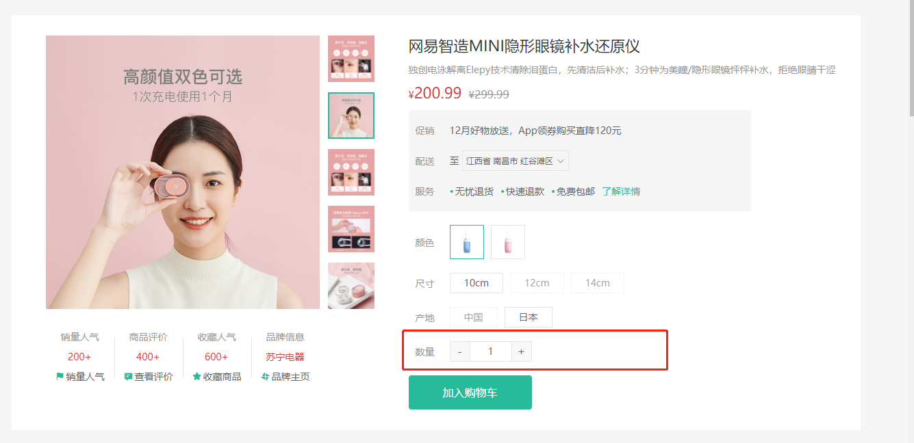

大致功能分析：

- 默认值为1
- 可限制最大最小值
- 点击-就是减1  点击+就是加1
- 需要完成v-model得实现
- 存在无label情况


基础布局代码：`src/components/library/xtx-numbox.vue`

```vue
<template>
  <div class="xtx-numbox">
    <div class="label">数量</div>
    <div class="numbox">
      <a href="javascript:;">-</a>
      <input type="text" readonly value="1">
      <a href="javascript:;">+</a>
    </div>
  </div>
</template>
<script>
export default {
  name: 'XtxNumbox'
}
</script>
<style scoped lang="less">
.xtx-numbox {
  display: flex;
  align-items: center;
  .label {
    width: 60px;
    color: #999;
    padding-left: 10px;
  }
  .numbox {
    width: 120px;
    height: 30px;
    border: 1px solid #e4e4e4;
    display: flex;
    > a {
      width: 29px;
      line-height: 28px;
      text-align: center;
      background: #f8f8f8;
      font-size: 16px;
      color: #666;
      &:first-of-type {
        border-right:1px solid #e4e4e4;
      }
      &:last-of-type {
        border-left:1px solid #e4e4e4;
      }
    }
    > input {
      width: 60px;
      padding: 0 5px;
      text-align: center;
      color: #666;
    }
  }
}
</style>
```

逻辑功能实现：

`src/components/library/xtx-numbox.vue`

```js
<template>
  <div class="xtx-numbox">
    <div class="label">
      <slot>数量</slot>
    </div>
    <div class="numbox">
      <a href="javascript:;" @click='handleSub'>-</a>
      <input type="text" readonly :value="modelValue">
      <a href="javascript:;" @click='handleAdd'>+</a>
    </div>
  </div>
</template>
<script>
import { useVModel } from '@vueuse/core'

export default {
  name: 'XtxNumbox',
  props: {
    modelValue: {
      type: Number,
      default: 1
    },
    inventory: {
      type: Number,
      required: true
    }
  },
  setup (props, { emit }) {
    // 基于第三方方法实现父子组件的通信
    const num = useVModel(props, 'modelValue', emit)
    // 控制数量的减少
    const handleSub = () => {
      if (props.modelValue === 1) return
      // 更新父组件商品的数量
      // emit('update:modelValue', props.modelValue - 1)
      num.value -= 1
    }
    // 控制数量的增加
    const handleAdd = () => {
      if (props.modelValue >= props.inventory) return
      // 更新父组件商品的数量
      // emit('update:modelValue', props.modelValue + 1)
      num.value += 1
    }
    return { handleSub, handleAdd }
  }
}
</script>
<style scoped lang="less">
.xtx-numbox {
  display: flex;
  align-items: center;
  .label {
    width: 60px;
    color: #999;
    padding-left: 10px;
  }
  .numbox {
    width: 120px;
    height: 30px;
    border: 1px solid #e4e4e4;
    display: flex;
    > a {
      width: 29px;
      line-height: 28px;
      text-align: center;
      background: #f8f8f8;
      font-size: 16px;
      color: #666;
      &:first-of-type {
        border-right: 1px solid #e4e4e4;
      }
      &:last-of-type {
        border-left: 1px solid #e4e4e4;
      }
    }
    > input {
      width: 60px;
      padding: 0 5px;
      text-align: center;
      color: #666;
    }
  }
}
</style>
```

`src/views/goods/index.vue`

```vue
<XtxNumbox v-model="num" :inventory='detail.inventory'>数量</XtxNumbox>
```

```diff
// 选择的数量
+    const num = ref(1)
+    return { toggle, n, num }
```

> 总结：
>
> 1. 父向子传递数据
> 2. 子向父传递数据
> 3. 基于第三方vueuse提供的方法useVModel优化父子之间的数据传递

## 商品详情-按钮组件

> 目的：封装一个通用按钮组件，有大、中、小、超小四种尺寸，有默认、主要、次要、灰色四种类型。

大致步骤：

- 完成组件基本结构
- 介绍各个参数的使用
- 测试按钮组件

落地代码：

- 封装组件：`src/components/library/xtx-button.vue`

```vue
<template>
  <button class="xtx-button ellipsis" :class="[size,type]">
    <slot />
  </button>
</template>
<script>
export default {
  name: 'XtxButton',
  props: {
    size: {
      type: String,
      default: 'middle'
    },
    type: {
      type: String,
      default: 'default'
    }
  }
}
</script>
<style scoped lang="less">
.xtx-button {
  appearance: none;
  border: none;
  outline: none;
  background: #fff;
  text-align: center;
  border: 1px solid transparent;
  border-radius: 4px;
  cursor: pointer;
}
.large {
  width: 240px;
  height: 50px;
  font-size: 16px;
}
.middle {
  width: 180px;
  height: 50px;
  font-size: 16px;
}
.small {
  width: 100px;
  height: 32px;
  font-size: 14px;  
}
.mini {
  width: 60px;
  height: 32px;
  font-size: 14px;  
}
.default {
  border-color: #e4e4e4;
  color: #666;
}
.primary {
  border-color: @xtxColor;
  background: @xtxColor;
  color: #fff;
}
.plain {
  border-color: @xtxColor;
  color: @xtxColor;
  background: lighten(@xtxColor,50%);
}
.gray {
  border-color: #ccc;
  background: #ccc;;
  color: #fff;
}
</style>
```

- 使用组件：`src/views/goods/index.vue`

```diff
        <div class="spec">
          <GoodsName :goods="goods"/>
          <GoodsSku :goods="goods" @change="changeSku"/>
          <XtxNumbox label="数量" v-model="num" :max="goods.inventory"/>
+          <XtxButton type="primary" style="margin-top:20px;">加入购物车</XtxButton>
        </div>
```

> 总结：封装通用的按钮组件，抽取尺寸和样式属性；基于默认插槽定制按钮文字。
>
> 注意：Vue3中，组件上的原生属性绑定默认会绑定到组件模板的根节点上；Vue3中，事件绑定的native修饰符已经被淘汰了

## 商品详情-同类推荐组件

> 目的：实现商品的同类推荐与猜你喜欢展示功能。

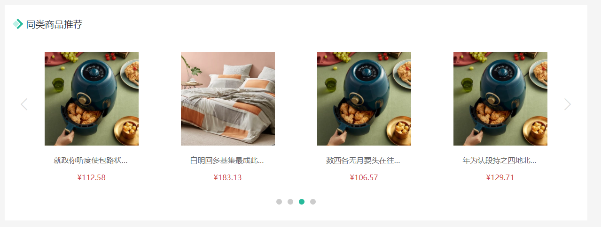

大致功能需求：

- 完成基础布局（头部），后期改造xtx-carousel.vue组件来展示商品效果。
- 然后可以通过是否传入商品ID来区别同类推荐和猜你喜欢。


落的代码开始：

- 基础布局 `src/views/goods/components/goods-relevant.vue`

```vue
<template>
  <div class="goods-relevant">
    <div class="header">
      <i class="icon" />
      <span class="title">同类商品推荐</span>
    </div>
    <!-- 此处使用改造后的xtx-carousel.vue -->
  </div>
</template>

<script>
export default {
  // 同类推荐，猜你喜欢
  name: 'GoodsRelevant'
}
</script>

<style scoped lang='less'>
.goods-relevant {
  background: #fff;
  min-height: 460px;
  margin-top: 20px;
  .header {
    height: 80px;
    line-height: 80px;
    padding: 0 20px;
    .title {
      font-size: 20px;
      padding-left: 10px;
    }
    .icon {
      width: 16px;
      height: 16px;
      display: inline-block;
      border-top: 4px solid @xtxColor;
      border-right: 4px solid @xtxColor;
      box-sizing: border-box;
      position: relative;
      transform: rotate(45deg);
      &::before {
        content: "";
        width: 10px;
        height: 10px;
        position: absolute;
        left: 0;
        top: 2px;
        background: lighten(@xtxColor, 40%);
      }
    }
  }
}
</style>
```

- 获取数据传入xtx-carousel.vue组件 `src/views/goods/index.vue`  传ID

```vue
<!-- 商品推荐 -->
<GoodsRelevant :goodsId="detail.id"/>
```

-  定义获取数据的API`src/api/product.js`

```js
/**
 * 获取商品同类推荐-未传入ID为猜喜欢
 * @param {String} id - 商品ID
 * @param {Number} limit - 获取条数
 */
export const findRelGoods = (id, limit = 16) => {
  return request({
      method: 'get',
      url: '/goods/relevant',
      data: { id, limit }
  })
}
```

- 获取数据 `src/views/goods/components/goods-relevant.vue`  

```diff
  <div class="header">
      <i class="icon" />
+     <span class="title">{{goodsId?'同类商品推荐':'猜你喜欢'}}</span>
  </div>
```

```vue
<script>
import { findRelGoods } from '@/api/product.js'
import { ref } from 'vue'

export default {
  // 同类推荐，猜你喜欢
  name: 'GoodsRelevant',
  props: {
    goodsId: {
      type: String,
      default: ''
    }
  },
  setup (props) {
    // 获取商品同类信息
    const list = ref([])
    findRelGoods(props.goodsId).then(ret => {
      // 把原始的16条数据分成4页
      // 每页的条数
      const pageSize = 4
      // 计算一共有多少页
      const pageNum = Math.ceil(ret.result.length / pageSize)
      for (let i = 1; i <= pageNum; i++) {
        // 获取每页的数据
        const perpage = ret.result.slice((i - 1) * pageSize, i * pageSize)
        list.value.push(perpage)
      }
    })
    console.log(list)
    return { list }
  }
}
</script>
```

```vue
<!-- 此处使用改造后的xtx-carousel.vue -->
<XtxCarousel :sliders="list" style="height:380px" />
```

- 改造xtx-carousel.vue组件  `src/components/library/xtx-carousel.vue`

```diff
+        <RouterLink v-if="item.hrefUrl" :to="item.hrefUrl">
          
        </RouterLink>
+        <div v-else class="slider">
+          <RouterLink v-for="goods in item" :key="goods.id" :to="`/product/${goods.id}`">
+            
+            <p class="name ellipsis">{{goods.name}}</p>
+            <p class="price">&yen;{{goods.price}}</p>
+          </RouterLink>
```

```less
// 轮播商品
.slider {
  display: flex;
  justify-content: space-around;
  padding: 0 40px;
  > a {
    width: 240px;
    text-align: center;
    img {
      padding: 20px;
      width: 230px!important;
      height: 230px!important;
    }
    .name {
      font-size: 16px;
      color: #666;
      padding: 0 40px;
    }
    .price {
      font-size: 16px;
      color: @priceColor;
      margin-top: 15px;
    }
  }
}
```

- 覆盖xtx-carousel.vue的样式在   `src/views/goods/components/goods-relevant.vue`

```less
:deep(.xtx-carousel) {
  height: 380px;
  .carousel {
    &-indicator {
      bottom: 30px;
      span {
        &.active {
          background: @xtxColor;
        }
      }
    }
    &-btn {
      top: 110px;
      opacity: 1;
      background: rgba(0,0,0,0);
      color: #ddd;
      i {
        font-size: 30px;
      }
    }
  }
}
```

> 注意：vue3.0使用深度作用选择器写法 `:deep(选择器)`
>
> 1. 定制轮播图的模板结构，支持单张图片和4张图片
> 2. 定义轮播图整体结构的样式需要在父组件进行定制，防止对其他地方轮播图的影响。

## 商品详情-标签页组件

> 目的：实现商品详情组件和商品评价组件的切换

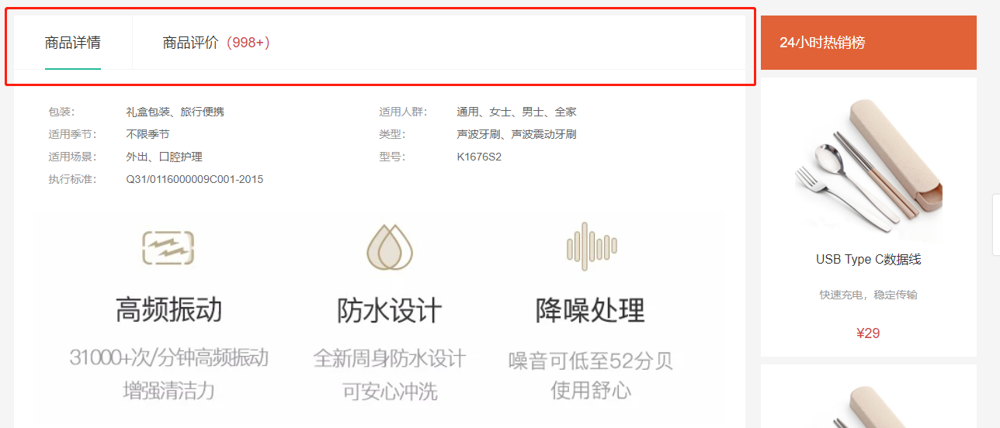

大致步骤：

- 完成基础的tab的导航布局
- 完成tab标签页的切换样式效果
- 使用动态组件完成可切换 详情  和  评论  组件


落的代码：

- 标签页基础布局 `src/vies/goods/components/goods-tabs.vue`

```vue
  <div class="goods-tabs">
    <nav>
      <a class="active" href="javascript:;">商品详情</a>
      <a href="javascript:;">商品评价<span>(500+)</span></a>
    </nav>
    <!-- 切换内容的地方 -->  
  </div>     
```

```less
.goods-tabs {
  min-height: 600px;
  background: #fff;
  nav {
    height: 70px;
    line-height: 70px;
    display: flex;
    border-bottom: 1px solid #f5f5f5;
    a {
      padding: 0 40px;
      font-size: 18px;
      position: relative;
      > span {
        color: @priceColor;
        font-size: 16px;
        margin-left: 10px;
      }
      &:first-child {
        border-right: 1px solid #f5f5f5;
      }
      &.active {
        &::before {
          content: "";
          position: absolute;
          left: 40px;
          bottom: -1px;
          width: 72px;
          height: 2px;
          background: @xtxColor;
        }
      }
    }
  }
}
```

- tabs组件切换 `src/vies/goods/components/goods-tabs.vue`

```vue
<template>
  <div class="goods-tabs">
    <nav>
      <a @click='toggle("GoodsDetail")' :class="{active: componentName === 'GoodsDetail'}" href="javascript:;">商品详情</a>
      <a @click='toggle("GoodsComment")' :class="{active: componentName === 'GoodsComment'}" href="javascript:;">商品评价<span>(500+)</span></a>
    </nav>
    <!-- 切换内容的地方 -->
    <!-- <GoodsDetail v-if='currentIndex === 0'/> -->
    <!-- <GoodsComment v-if='currentIndex === 1'/> -->
    <!-- 基于动态组件控制组件的切换 -->
    <component :is='componentName'></component>
  </div>
</template>
<script>
import GoodsDetail from './goods-detail.vue'
import GoodsComment from './goods-comment.vue'
import { ref } from 'vue'
export default {
  name: 'GoodsTabs',
  components: { GoodsDetail, GoodsComment },
  setup () {
    // 当前组件的名称
    const componentName = ref('GoodsDetail')
    const toggle = (name) => {
      componentName.value = name
    }
    return { toggle, componentName }
  }
}
</script>
```

- 使用tabs组件 `src/views/goods/index.vue`

```diff
+import GoodsTabs from './components/goods-tabs'
// ... 省略
export default {
  name: 'XtxGoodsPage',
+  components: { GoodsRelevant, GoodsImage, GoodsSales, GoodsName, GoodsSku, GoodsTabs },
  setup () {
```

```diff
        <div class="goods-article">
          <!-- 商品+评价 -->
+          <GoodsTabs :goods="goods" />
          <!-- 注意事项 -->
          <div class="goods-warn"></div>
        </div>
```

```diff
-.goods-tabs {
-  min-height: 600px;
-  background: #fff;
-}
```

- 定义详情组件， `src/vies/goods/components/goods-detail.vue`

```vue
<template>
  <div class="goods-detail">详情</div>
</template>
<script>
export default {
  name: 'GoodsDetail'
}
</script>
<style scoped lang="less"></style>
```

-  定义评价组件。`src/vies/goods/components/goods-comment.vue`

```vue
<template>
  <div class="goods-comment">评价</div>
</template>
<script>
export default {
  name: 'GoodsComment'
}
</script>
<style scoped lang="less"></style>

```

> 总结：
>
> 1. 封装Tab选项卡组件并实现切换功能
> 2. 基于动态组件实现组件的切换

## 商品详情-热榜组件

> 目的：展示24小时热榜商品，和周热榜商品。

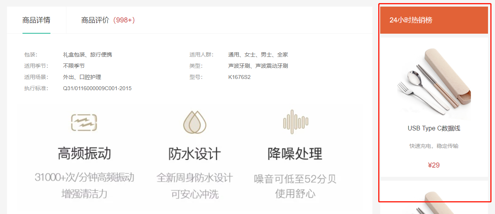

大致步骤：

- 定义一个组件，完成多个组件展现型态，根据传入组件的类型决定。
  - 1代表24小时热销榜 2代表周热销榜 3代表总热销榜
- 获取数据，完成商品展示和标题样式的设置。


落的代码：

- 定义组件  `src/views/goods/components/goods-hot.vue`

```vue
<template>
  <div class="goods-hot">
    <h3>{{title}}</h3>
  </div>
</template>
<script>
import { computed } from 'vue'
export default {
  name: 'GoodsHot',
  props: {
    type: {
      type: Number,
      default: 1
    }
  },
  setup (props) {
    const titleObj = { 1: '24小时热销榜', 2: '周热销榜', 3: '总热销榜' }
    const title = computed(() => {
      return titleObj[props.type]
    })
    return { title }
  }
}
</script>
<style scoped lang="less"></style>
```

- 使用组件  `src/views/goods/index.vue`

```diff
+import GoodsHot from './components/goods-hot'
// ... 省略
  name: 'XtxGoodsPage',
+  components: { GoodsRelevant, GoodsImage, GoodsSales, GoodsName, GoodsSku, GoodsTabs, GoodsHot },
  setup () {
```

```vue
<!-- 24热榜+专题推荐 -->
<div class="goods-aside">
    <GoodsHot :goodsId="goods.id" :type="1" />
    <GoodsHot :goodsId="goods.id" :type="2" />
</div>
```

> 总结：实现热销榜基本结构（抽取属性type区分热销的类型）

- 获取数据，设置组件样式`src/api/goods.js`

```js
/**
 * 获取热榜商品
 * @param {Number} type - 1代表24小时热销榜 2代表周热销榜 3代表总热销榜
 * @param {Number} limit - 获取个数
 */
export const findHotGoods = ({id,type, limit = 3}) => {
  return request({
      method: 'get',
      url: '/goods/hot',
      data: {id, type, limit }
  })
}
```

`src/views/goods/components/goot-hot.vue`

```js
import { computed, ref } from 'vue'
import { findHotGoods } from '@/api/product.js'
import GoodsItem from '@/views/category/components/goods-item.vue'

export default {
  name: 'GoodsHot',
  components: { GoodsItem },
  props: {
    // 热销榜类型
    type: {
      type: Number,
      default: 1
    },
    goodsId: {
      type: String,
      default: ''
    }
  },
  setup (props) {
    // 热销榜类型
    const titleObj = { 1: '24小时热销榜', 2: '周热销榜', 3: '总热销榜' }
    const title = computed(() => {
      return titleObj[props.type]
    })
    // 调用接口获取商品数据
    const list = ref(null)
    findHotGoods({
      id: props.goodsId,
      type: props.type
    }).then(ret => {
      list.value = ret.result
    })

    return { title, list }
  }
}
```

```vue
<template>
  <div class="goods-hot">
    <h3>{{title}}</h3>
    <div v-if="list">
      <GoodsItem v-for="item in list" :key="item.id" :goods="item"/>  
    </div>  
  </div>
</template>
```

```js
.goods-hot {
  h3 {
    height: 70px;
    background: @helpColor;
    color: #fff;
    font-size: 18px;
    line-height: 70px;
    padding-left: 25px;
    margin-bottom: 10px;
    font-weight: normal;
  }
  ::v-deep .goods-item {
    background: #fff;
    width: 100%;
    margin-bottom: 10px;
    img {
      width: 200px;
      height: 200px;
    }
    p {
      margin: 0 10px;
    }
    &:hover {
      transform: none;
      box-shadow: none;
    }
  }
}
```

> 总结：抽取组件时，需要定制变化的数据作为属性，计算属性的使用(动态计算标题)
>
> 1. 调用接口，获取数据，填充模板

## 商品详情-详情组件

> 目的：展示商品属性和商品详情。

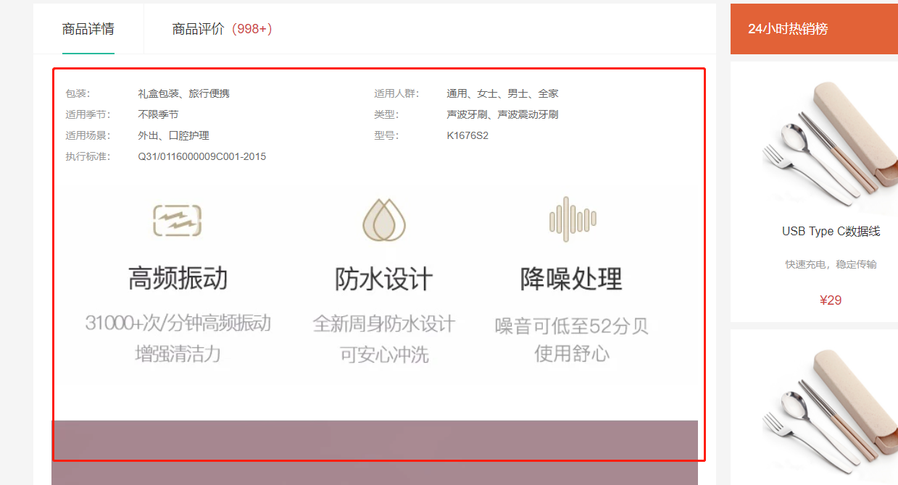

大致步骤：

- 完成基础布局，主要是属性，详情是图片。
- `goods/index.vue` 提供goods数据，子孙组件注入goods数据，渲染展示即可。
  - provide/inject


落的代码：

- 传递goods数据`src/views/goods/index.vue`  setup中提供数据

```js
provide('goods', detail)
```

- 使用goods数据，展示评价数量`src/views/goods/components/goods-tabs.vue`

```js
  setup () {
      const goods = inject('goods')
      return { goods }
  },
```

```diff
+    >商品评价<span>({{goods.commentCount}})</span></a>
```

- 使用goods数据，展示商品详情`src/views/goods/components/goods-detail.vue`

```vue
<template>
  <div class="goods-detail">
    <!-- 属性 -->
    <ul class="attrs">
      <li v-for="item in goods.details.properties" :key="item.value">
        <span class="dt">{{item.name}}</span>
        <span class="dd">{{item.value}}</span>
      </li>
    </ul>
    <!-- 图片 -->
    
  </div>
</template>
<script>
import { inject } from 'vue'
export default {
  name: 'GoodsDetail',
  setup () {
      const goods = inject('goods')
      return { goods }
  }
}
</script>
<style scoped lang="less">
.goods-detail {
  padding: 40px;
  .attrs {
    display: flex;
    flex-wrap: wrap;
    margin-bottom: 30px;
    li {
      display: flex;
      margin-bottom: 10px;
      width: 50%;
      .dt {
        width: 100px;
        color: #999;
      }
      .dd {
        flex: 1;
        color: #666;
      }
    }
  }
  > img {
    width: 100%;
  }
}
</style>
```

> 总结：
>
> 1. 父组件向子孙组件传递数据：provide提供数据，inject接收数据

## 商品详情-注意事项组件

> 目的：展示购买商品的注意事项。

- 商品详情首页 `src/views/goods/index.vue`

```diff
+import GoodsWarn from './components/goods-warn'
```

```diff
  name: 'XtxGoodsPage',
+  components: { GoodsRelevant, GoodsImage, GoodsSales, GoodsName, GoodsSku, GoodsTabs, GoodsHot, GoodsWarn },
  setup () {
```

```
          <!-- 注意事项 -->
+          <GoodsWarn />
```

- 注意事项组件`src/views/goods/components/goods-warn.vue`

```vue
<template>
  <!-- 注意事项 -->
  <div class="goods-warn">
    <h3>注意事项</h3>
    <p class="tit">• 购买运费如何收取？</p>
    <p>
      单笔订单金额(不含运费)满88元免邮费；不满88元，每单收取10元运费。（港澳台地区需满500元免邮费；不满500元，每单收取30元运费)
    </p>
    <br />
    <p class="tit">• 使用什么快递发货?</p>
    <p>默认使用顺丰快递发货(个别商品使用其他快递）</p>
    <p>配送范围覆盖全国大部分地区(港澳台地区除外）</p>
    <br />
    <p class="tit">• 如何申请退货?</p>
    <p>
      1.自收到商品之日起30日内，顾客可申请无忧退货，退款将原路返还，不同的银行处理时间不同，预计1-5个工作日到账；
    </p>
    <p>2.内裤和食品等特殊商品无质量问题不支持退货；</p>
    <p>
      3.退货流程：
      确认收货-申请退货-客服审核通过-用户寄回商品-仓库签收验货-退款审核-退款完成；
    </p>
    <p>
      4.因小兔鲜儿产生的退货，如质量问题，退货邮费由小兔鲜儿承担，退款完成后会以现金券的形式报销。因客户个人原因产生的退货，购买和寄回运费由客户个人承担。
    </p>
  </div>
</template>
<style lang="less" scoped>
.goods-warn {
  margin-top: 20px;
  background: #fff;
  padding-bottom: 40px;
  h3 {
    height: 70px;
    line-height: 70px;
    border-bottom: 1px solid #f5f5f5;
    padding-left: 50px;
    font-size: 18px;
    font-weight: normal;
    margin-bottom: 10px;
  }
  p {
    line-height: 40px;
    padding: 0 25px;
    color: #666;
    &.tit {
      color: #333;
    }
  }
}
</style>
```

> 总结：拆分注意事项组件结构
>

## 商品详情-评价组件-头部渲染

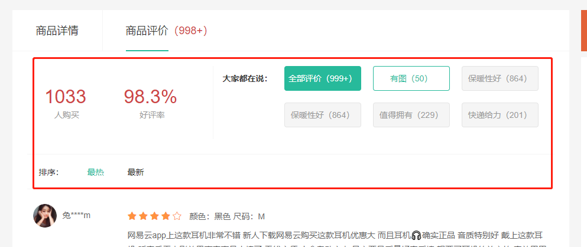

> 目的：根据后台返回的评价信息渲染评价头部内容。

大致步骤：

- 完成静态布局
- 定义API接口
- 获取数据，处理完毕，提供给模版
- 渲染模版


落的代码：

- 布局 `src/views/goods/components/goods-comment.vue`

```vue
<template>
  <div class="goods-comment">
    <div class="head">
      <div class="data">
        <p><span>100</span><span>人购买</span></p>
        <p><span>99.99%</span><span>好评率</span></p>
      </div>
      <div class="tags">
        <div class="dt">大家都在说：</div>
        <div class="dd">
          <a href="javascript:;" class="active">全部评价（1000）</a>
          <a href="javascript:;">好吃（1000）</a>
          <a href="javascript:;">便宜（1000）</a>
          <a href="javascript:;">很好（1000）</a>
          <a href="javascript:;">再来一次（1000）</a>
          <a href="javascript:;">快递棒（1000）</a>
        </div>
      </div>
    </div>
    <div class="sort">
      <span>排序：</span>
      <a href="javascript:;" class="active">默认</a>
      <a href="javascript:;">最新</a>
      <a href="javascript:;">最热</a>
    </div>
    <div class="list"></div>
  </div>
</template>
<script>
export default {
  name: 'GoodsComment'
}
</script>
<style scoped lang="less">
.goods-comment {
  .head {
    display: flex;
    padding: 30px 0;
    .data {
      width: 340px;
      display: flex;
      padding: 20px;
      p {
        flex: 1;
        text-align: center;
        span {
          display: block;
          &:first-child {
            font-size: 32px;
            color: @priceColor;
          }
          &:last-child {
            color: #999;
          }
        }
      }
    }
    .tags {
      flex: 1;
      display: flex;
      border-left: 1px solid #f5f5f5;
      .dt {
        font-weight: bold;
        width: 100px;
        text-align: right;
        line-height: 42px;
      }
      .dd {
        flex: 1;
        display: flex;
        flex-wrap: wrap;
        > a {
          width: 132px;
          height: 42px;
          margin-left: 20px;
          margin-bottom: 20px;
          border-radius: 4px;
          border: 1px solid #e4e4e4;
          background: #f5f5f5;
          color: #999;
          text-align: center;
          line-height: 40px;
          &:hover {
            border-color: @xtxColor;
            background: lighten(@xtxColor,50%);
            color: @xtxColor;
          }
          &.active {
            border-color: @xtxColor;
            background: @xtxColor;
            color: #fff;
          }
        }
      }
    }
  }
  .sort {
    height: 60px;
    line-height: 60px;
    border-top: 1px solid #f5f5f5;
    border-bottom: 1px solid #f5f5f5;
    margin: 0 20px;
    color: #666;
    > span {
      margin-left: 20px;
    }
    > a {
      margin-left: 30px;
      &.active,&:hover {
        color: @xtxColor;
      }
    }
  }
}
</style>
```

- 接口 `src/api/product.js`

```js
// 获取商品的评论的统计数据
export const findCommentInfoByGoods = (id) => {
  // return request({method: 'get',url: '`/goods/${id}/evaluate`'})
  return request({
    method: 'get',
    // 当请求地址是http或者是https等标准协议时，那么axios基准路径不会再次拼接
    // 评论数据没有正式的接口，如下的地址是模拟的假数据
    url: `${mockUrl}goods/${id}/evaluate`
  })
}

// https://mock.boxuegu.com/mock/1175/goods/${id}/evaluate
```

- 获取数据，处理数据 `src/views/goods/components/goods-comment.vue`

```js
import { findCommentInfoByGoods } from '@/api/goods'
import { ref } from 'vue'
const getCommentInfo = (props) => {
  const commentInfo = ref(null)
  findCommentInfoByGoods(props.goods.id).then(data => {
    // type 的目的是将来点击可以区分点的是不是标签
    data.result.tags.unshift({ type: 'img', title: '有图', tagCount: data.result.hasPictureCount })
    data.result.tags.unshift({ type: 'all', title: '全部评价', tagCount: data.result.evaluateCount })
    commentInfo.value = data.result
  })
  return commentInfo
}
export default {
  name: 'GoodsComment',
  props: {
    goods: {
      type: Object,
      default: () => {}
    }
  },
  setup (props) {
    const commentInfo = getCommentInfo(props)
    return { commentInfo }
  }
}
```

- 渲染模版 + tag选中效果  `src/views/goods/components/goods-comment.vue`   

```vue
  <div class="goods-comment" v-if='conditions'>
    <div class="head">
      <div class="data">
        <p><span>{{conditions.salesCount}}</span><span>人购买</span></p>
        <p><span>{{conditions.praisePercent}}</span><span>好评率</span></p>
      </div>
      <div class="tags">
        <div class="dt">大家都在说：</div>
        <div class="dd">
          <a v-for='(item, index) in conditions.tags' :key='index' href="javascript:;">{{item.title}}（{{item.tagCount}}）</a>
        </div>
      </div>
    </div>
    <div class="sort">
      <span>排序：</span>
      <a href="javascript:;" class="active">默认</a>
      <a href="javascript:;">最新</a>
      <a href="javascript:;">最热</a>
    </div>
    <!-- 评论列表 -->
    <div class="list"></div>
  </div>
```

```js
<script>
import { findCommentInfoByGoods } from '@/api/product.js'
import { ref, inject } from 'vue'
export default {
  name: 'GoodsComment',
  setup () {
    const detail = inject('goods')
    const conditions = ref(null)
    findCommentInfoByGoods(detail.value.id).then(ret => {
      ret.result.tags.unshift({
        title: '有图',
        tagCount: ret.result.hasPictureCount
      })
      ret.result.tags.unshift({
        title: '全部评价',
        tagCount: ret.result.evaluateCount
      })
      conditions.value = ret.result
    })
    return { conditions }
  }
}
</script>
```

> 总结：
>
> 1. 调用接口获取数据，渲染动态标签(筛选条件)
> 2. 控制标签选中的切换操作

```js
// 选中筛选条件的索引
const currentIndex = ref(0)
const changeCondition = (index) => {
  currentIndex.value = index
}
return { conditions, currentIndex, changeCondition }
```

```vue
<a @click='changeCondition(index)' :class='{active: currentIndex===index}' v-for='(item, index) in conditions.tags' :key='index' href="javascript:;">{{item.title}}（{{item.tagCount}}）</a>
```


## 商品详情-评价组件-实现列表

> 目的：完成列表渲染，筛选和排序。

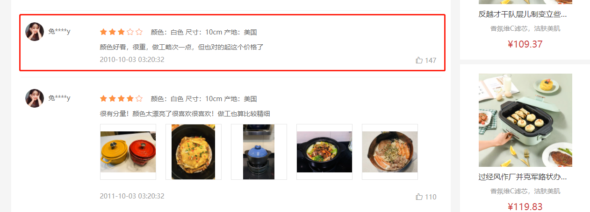

大致步骤：

- 列表基础布局
- 筛选条件数据准备
- 何时去获取数据？
  - 组件初始化
  - 点标签
  - 点排序
- 渲染列表

落地代码：

- 列表基础布局

```vue
    <!-- 列表 -->
    <div class="list">
      <div class="item">
        <div class="user">
          
          <span>兔****m</span>
        </div>
        <div class="body">
          <div class="score">
            <i class="iconfont icon-wjx01"></i>
            <i class="iconfont icon-wjx01"></i>
            <i class="iconfont icon-wjx01"></i>
            <i class="iconfont icon-wjx01"></i>
            <i class="iconfont icon-wjx02"></i>
            <span class="attr">颜色：黑色 尺码：M</span>
          </div>
          <div class="text">网易云app上这款耳机非常不错 新人下载网易云购买这款耳机优惠大 而且耳机🎧确实正品 音质特别好 戴上这款耳机 听音乐看电影效果声音真是太棒了 无线方便 小盒自动充电 最主要是质量好音质棒 想要买耳机的放心拍 音效巴巴滴 老棒了</div>
          <div class="time">
            <span>2020-10-10 10:11:22</span>
            <span class="zan"><i class="iconfont icon-dianzan"></i>100</span>
          </div>
        </div>
      </div>
    </div>
```

```less
  .list {
    padding: 0 20px;
    .item {
      display: flex;
      padding: 25px 10px;
      border-bottom: 1px solid #f5f5f5;
      .user {
        width: 160px;
        img {
          width: 40px;
          height: 40px;
          border-radius: 50%;
          overflow: hidden;
        }
        span {
          padding-left: 10px;
          color: #666;
        }
      }
      .body {
        flex: 1;
        .score {
          line-height: 40px;
          .iconfont {
            color: #ff9240;
            padding-right: 3px;
          }
          .attr {
            padding-left: 10px;
            color: #666;
          }
        }
      }
      .text {
        color: #666;
        line-height: 24px;
      }
      .time {
        color: #999;
        display: flex;
        justify-content: space-between;
        margin-top: 5px;
      }
    }
  }
```

- 筛选条件数据准备：定义筛选条件


```js
// 筛选条件准备
const reqParams = {
      // 当前页码
      page: 1,
      // 每页的条数
      pageSize: 10,
      // 是否有图片
      hasPicture: null,
      // 筛选条件
      tag: null,
      // 排序的字段
      sortField: null
}
```

- 封装获取评论列表数据的接口方法

```js
// 获取评论列表数据
export const findCommentListByGoods = (id, data) => {
  return request({
    method: 'get',
    url: `${mockUrl}goods/${id}/evaluate/page`,
    data
  })
}
```

- 获取评论列表数据

```js
// 获取评论列表数据
const list = ref([])
const reqParams = {
    // 当前页码
    page: 1,
    // 每页的条数
    pageSize: 10,
    // 是否有图片
    hasPicture: null,
    // 筛选条件
    tag: null,
    // 排序的字段
    sortField: null
}
findCommentListByGoods(detail.value.id, reqParams).then(ret => {
    list.value = ret.result
})
return { list, conditions, currentIndex, changeCondition }
```

- 评论列表模板渲染

```vue
<!-- 列表 -->
<div class="list">
  <div class="item" v-for='item in list.items' :key='item.id'>
    <div class="user">
      
      <span>{{item.member.nickname}}</span>
    </div>
    <div class="body">
      <div class="score">
        <i class="iconfont icon-wjx01" v-for='star in item.score' :key='star'></i>
        <i class="iconfont icon-wjx02" v-for='star in 5 - item.score' :key='star'></i>
        <span class="attr">{{item.orderInfo.specs.reduce((ret, item) => `${ret} ${item.name}:${item.nameValue}`, '')}}</span>
      </div>
      <div class="text">{{item.content}}</div>
      <div class="time">
        <span>{{item.createTime}}</span>
        <span class="zan"><i class="iconfont icon-dianzan"></i>{{item.praiseCount}}</span>
      </div>
    </div>
  </div>
</div>
```

- 收集排序条件

```vue
<!-- 排序 -->
<div class="sort">
    <span>排序：</span>
    <a
       @click="changeSort(null)"
       href="javascript:;"
       :class="{active:reqParams.sortField===null}"
       >默认</a>
    <a
       @click="changeSort('praiseCount')"
       href="javascript:;"
       :class="{active:reqParams.sortField==='praiseCount'}"
       >最热</a>
    <a
       @click="changeSort('createTime')"
       href="javascript:;"
       :class="{active:reqParams.sortField==='createTime'}"
       >最新</a>
</div>
```

```js
// 改变排序
const changeSort = (type) => {
    reqParams.sortField = type
    reqParams.page = 1
}
```

- 收集标签和是否有图条件

```js
const changeCondition = (index) => {
  currentIndex.value = index
  const info = conditions.value.tags[index]
  if (info.type === 'img') {
    // 选中有图
    reqParams.hasPicture = true
    reqParams.tag = null
  } else if (info.type === 'all') {
    // 全部评论
    reqParams.hasPicture = null
    reqParams.sorField = null
  } else {
    // 其他条件
    reqParams.tag = info.title
    reqParams.hasPicture = null
  }
  reqParams.page = 1
}
```

- 监听条件的变化（当组件初始化的时候，筛选条件改变的时候）

```js
// 侦听参数的变化
watch(reqParams, () => {
  findCommentListByGoods(detail.value.id, reqParams).then(ret => {
    // 获取总数
    total.value = ret.result.counts
    // 获取评论列表
    list.value = ret.result.items
  })
}, {
  immediate: true
})
```

- 渲染模版：处理数据，昵称加*号，规格拼接字符串。

```js
// 定义转换数据的函数（对应vue2.0的过滤器）
const formatSpecs = (specs) => {
  return specs.reduce((p, c) => `${p} ${c.name}：${c.nameValue}`, '').trim()
}
const formatNickname = (nickname) => {
  return nickname.substr(0, 1) + '****' + nickname.substr(-1)
}
```

>   总结：
>
> 1. 调用接口获取评论基本配置信息和列表数据
> 2. 支持条件筛选和排序


## 商品详情-评价组件-图片预览

> 目的：封装一个组件展示 图片列表 和 预览图片 功能。

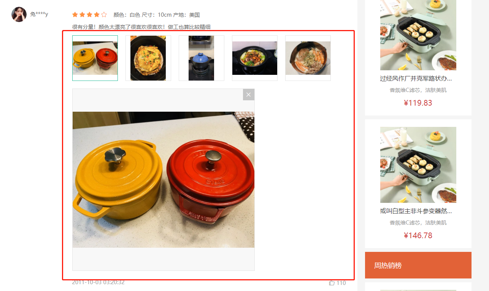

大致步骤：

- 准备一个组件导入goods-comment-image.vue使用起来，传入图片数据
- 展示图片列表，和选中图片功能。
- 提供图片预览功能和关闭图片预览。


落的代码：

- 展示图片列表和选中效果实现`src/views/goods/goods-comment-image.vue`

```vue
<template>
  <div class="goods-comment-image">
    <div class="list">
      <a
        href="javascript:;"
        :class="{active:currImage===url}"
        @click="currImage=url"
        v-for="url in pictures"
        :key="url"
      >
        
      </a>
    </div>
    <div class="preview"></div>
  </div>
</template>
<script>
import { ref } from 'vue'
export default {
  name: 'GoodsCommentImage',
  props: {
    pictures: {
      type: Array,
      default: () => []
    }
  },
  setup () {
    const currImage = ref(null)
    return { currImage }
  }
}
</script>
<style scoped lang="less">
.goods-comment-image {
  .list {
    display: flex;
    flex-wrap: wrap;
    margin-top: 10px;
    a {
      width: 120px;
      height: 120px;
      border:1px solid #e4e4e4;
      margin-right: 20px;
      margin-bottom: 10px;
      img {
        width: 100%;
        height: 100%;
        object-fit: contain;
      }
      &.active {
        border-color: @xtxColor;
      }
    }
  }
}
</style>
```

`src/views/goods/goods-comment.vue`

```diff
+import GoodsCommentImage from './goods-comment-image'
// ...
export default {
  name: 'GoodsComment',
+  components: { GoodsCommentImage },
  props: {
```

```diff
<div class="text">{{item.content}}</div>
<!-- 使用图片预览组件 -->
+  <GoodsCommentImage v-if="item.pictures.length" :pictures="item.pictures" />
<div class="time">
```

- 实现预览图片和关闭预览

```vue
<div class="preview" v-if="currImage">
    
    <i @click="currImage=null" class="iconfont icon-close-new"></i>
</div>
```

```less
.preview {
    width: 480px;
    height: 480px;
    border: 1px solid #e4e4e4;
    background: #f8f8f8;
    margin-bottom: 20px;
    position: relative;
    img {
        width: 100%;
        height: 100%;
        object-fit: contain;
    }
    i {
        position: absolute;
        right: 0;
        top: 0;
        width: 30px;
        height: 30px;
        background: rgba(0,0,0,0.2);
        color: #fff;
        text-align: center;
        line-height: 30px;
    }
}
```

> 总结：
>
> 1. 封装评论的图片预览组件：展示图片列表；控制图片的切换和预览


## 商品详情-评价组件-★分页组件

> 目的：封装一个统一的分页组件。

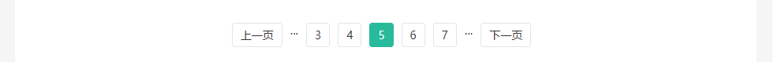

大致步骤：

- 分页基础布局，依赖数据分析。
- 分页内部逻辑，完成切换效果。
- 接收外部数据，提供分页事件。


落的代码：

- 分页基础布局，依赖数据分析 `src/components/library/xtx-pagination.vue`

```vue
<template>
  <div class="xtx-pagination">
    <a href="javascript:;" class="disabled">上一页</a>
    <span>...</span>
    <a href="javascript:;" class="active">3</a>
    <a href="javascript:;">4</a>
    <a href="javascript:;">5</a>
    <a href="javascript:;">6</a>
    <a href="javascript:;">7</a>
    <span>...</span>
    <a href="javascript:;">下一页</a>
  </div>
</template>
<script>
export default {
  name: 'XtxPagination'
}
</script>
<style scoped lang="less">
.xtx-pagination {
  display: flex;
  justify-content: center;
  padding: 30px;
  > a {
    display: inline-block;
    padding: 5px 10px;
    border: 1px solid #e4e4e4;
    border-radius: 4px;
    margin-right: 10px;
    &:hover {
      color: @xtxColor;
    }
    &.active {
      background: @xtxColor;
      color: #fff;
      border-color: @xtxColor;
    }
    &.disabled {
      cursor: not-allowed;
      opacity: 0.4;
      &:hover {
        color: #333
      }
    }
  }
  > span {
    margin-right: 10px;
  }
}
</style>
```

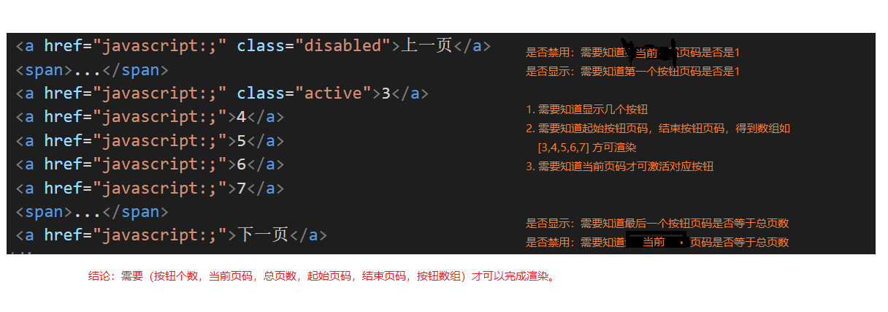

```js
import { computed } from 'vue'

export default {
  name: 'XtxPagination',
  props: {
    total: {
      type: Number,
      required: true
    },
    pagesize: {
      type: Number,
      default: 10
    },
    page: {
      type: Number,
      default: 1
    }
  },
  setup (props, { emit }) {
    // 计算页码
    // 数据的总条数
    // 每页的条数
    // 当前页码
    // 总页数
    const totalPage = Math.ceil(props.total / props.pagesize)
    // 动态计算页码的列表
    const list = computed(() => {
      const pages = []
      if (totalPage <= 5) {
        // 开始的数据
        for (let i = 1; i <= totalPage; i++) {
          pages.push(i)
        }
      } else {
        if (props.page <= 3) {
          // 开始的数据
          for (let i = 1; i <= 5; i++) {
            pages.push(i)
          }
        } else if (props.page >= totalPage - 2) {
          // 结束的数据
          for (let i = totalPage - 4; i <= totalPage; i++) {
            pages.push(i)
          }
        } else {
          // 中间的数据
          for (let i = props.page - 2; i <= props.page + 2; i++) {
            pages.push(i)
          }
        }
      }
      return pages
    })

    // 切换页码:修改父组件的当前页码
    const changePage = (page) => {
      // props.page = page
      emit('update:page', page)
    }

    return { list, changePage }
  }
}
```

```vue
<a :class='{active: page === item}' v-for='item in list' :key='item' href="javascript:;">{{item}}</a>
```

> 总结：实现分页的基本布局结构，动态计算中间的页码

- 控制省略号显示和隐藏

```vue
<span v-if='page>3'>...</span>
span v-if='page<totalPage-2'>...</span>
```

- 控制上一页和下一页

```js
// 切换页码:修改父组件的当前页码
const changePage = (page) => {
    // 防止点击上一页和下一页时超出范围
    if (page <= 0 || page > totalPage) return
    // props.page = page
    emit('update:page', page)
}
```

```vue
<a :class="{disabled: page===1}" @click='changePage(page-1)' href="javascript:;">上一页</a>
<a :class='{disabled: page===totalPage}' @click='changePage(page+1)' href="javascript:;">下一页</a>
```

- 完整实现

```vue
<template>
  <div class="xtx-pagination">
    <a :class="{disabled: page===1}" @click='changePage(page-1)' href="javascript:;">上一页</a>
    <span v-if='page>3'>...</span>
    <a @click='changePage(item)' :class='{active: page === item}' v-for='item in list' :key='item' href="javascript:;">{{item}}</a>
    <span v-if='page<totalPage-2'>...</span>
    <a :class='{disabled: page===totalPage}' @click='changePage(page+1)' href="javascript:;">下一页</a>
  </div>
</template>
<script>
import { computed } from 'vue'

export default {
  name: 'XtxPagination',
  props: {
    total: {
      type: Number,
      required: true
    },
    pagesize: {
      type: Number,
      default: 10
    },
    page: {
      type: Number,
      default: 1
    }
  },
  setup (props, { emit }) {
    // 计算页码
    // 数据的总条数
    // 每页的条数
    // 当前页码
    // 总页数
    const totalPage = Math.ceil(props.total / props.pagesize)
    // 动态计算页码的列表
    const list = computed(() => {
      const pages = []
      if (totalPage <= 5) {
        // 开始的数据
        for (let i = 1; i <= totalPage; i++) {
          pages.push(i)
        }
      } else {
        if (props.page <= 3) {
          // 开始的数据
          for (let i = 1; i <= 5; i++) {
            pages.push(i)
          }
        } else if (props.page >= totalPage - 2) {
          // 结束的数据
          for (let i = totalPage - 4; i <= totalPage; i++) {
            pages.push(i)
          }
        } else {
          // 中间的数据
          for (let i = props.page - 2; i <= props.page + 2; i++) {
            pages.push(i)
          }
        }
      }
      return pages
    })

    // 切换页码:修改父组件的当前页码
    const changePage = (page) => {
      // 防止点击上一页和下一页时超出范围
      if (page <= 0 || page > totalPage) return
      // props.page = page
      emit('update:page', page)
      // 触发接口调用
      emit('change-page', page)
    }

    return { list, changePage, totalPage }
  }
}
</script>
<style scoped lang="less">
.xtx-pagination {
  display: flex;
  justify-content: center;
  padding: 30px;
  > a {
    display: inline-block;
    padding: 5px 10px;
    border: 1px solid #e4e4e4;
    border-radius: 4px;
    margin-right: 10px;
    &:hover {
      color: @xtxColor;
    }
    &.active {
      background: @xtxColor;
      color: #fff;
      border-color: @xtxColor;
    }
    &.disabled {
      cursor: not-allowed;
      opacity: 0.4;
      &:hover {
        color: #333;
      }
    }
  }
  > span {
    margin-right: 10px;
  }
}
</style>

```

```vue
<!-- 分页 -->
<!-- 如果页码发生变化，那么就触发change-page事件 -->
<XtxPagination @change-page='changePage' v-model:page='page' :total='100' />
```

> 总结：
>
> 1. 基本组件的结果
> 2. 动态计算中间的页码
> 3. 控制省略号的显示和隐藏
> 4. 控制页码的切换
> 5. 控制上一页和下一页的按钮禁用状态
> 6. 抽取常用的分页属性
>
> 注意：context.attrs表示非props之外的父组件传递的属性（非响应式的）

```js
import { computed, ref } from 'vue'

export default {
  name: 'XtxPagination',
  props: {
    total: {
      type: Number,
      required: true
    },
    pagesize: {
      type: Number,
      default: 10
    }
    // page: {
    //   type: Number,
    //   default: 1
    // }
  },
  setup (props, { emit, attrs }) {
    // attrs表示父组件传递的属性，但是不是props，并且attrs的值不是响应式的
    console.log(attrs)
    // 计算页码
    // 数据的总条数
    // 每页的条数
    // 当前页码
    const page = ref(attrs.page || 1)
    // 总页数
    const totalPage = Math.ceil(props.total / props.pagesize)
    // 动态计算页码的列表
    const list = computed(() => {
      const pages = []
      if (totalPage <= 5) {
        // 开始的数据
        for (let i = 1; i <= totalPage; i++) {
          pages.push(i)
        }
      } else {
        if (page.value <= 3) {
          // 开始的数据
          for (let i = 1; i <= 5; i++) {
            pages.push(i)
          }
        } else if (page.value >= totalPage - 2) {
          // 结束的数据
          for (let i = totalPage - 4; i <= totalPage; i++) {
            pages.push(i)
          }
        } else {
          // 中间的数据
          for (let i = page.value - 2; i <= page.value + 2; i++) {
            pages.push(i)
          }
        }
      }
      return pages
    })

    // 切换页码:修改父组件的当前页码
    const changePage = (currentPage) => {
      // 防止点击上一页和下一页时超出范围
      if (currentPage <= 0 || currentPage > totalPage) return
      // props.page = page
      page.value = currentPage
      // emit('update:page', currentPage)
      // 触发接口调用
      emit('change-page', currentPage)
    }

    return { list, changePage, totalPage, page }
  }
}
```

```vue
<XtxPagination @change-page='changePage' :page='1' :total='100' />
```


