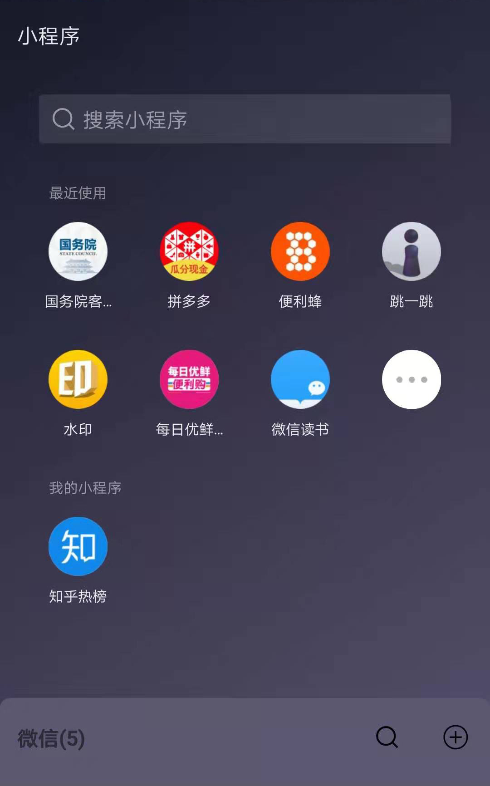
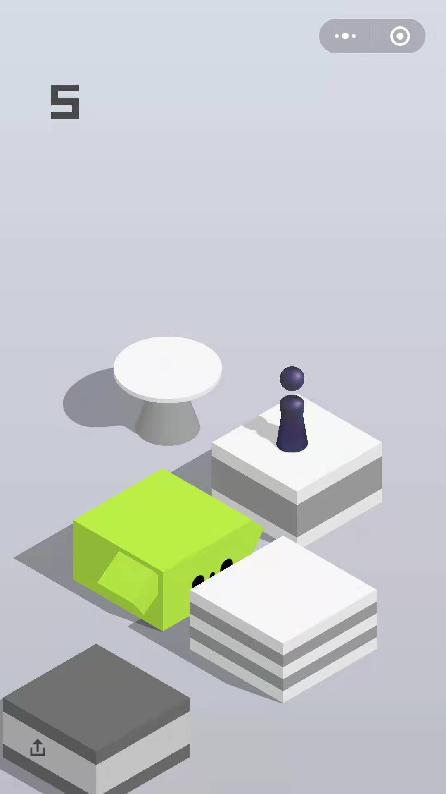
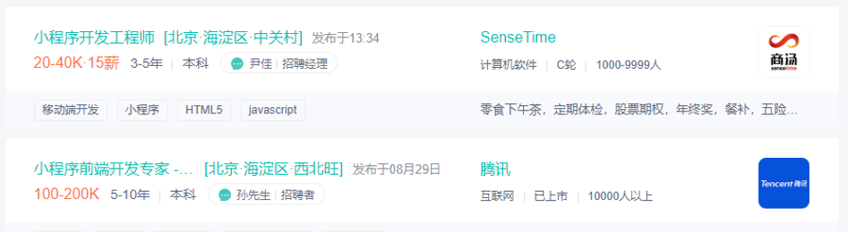
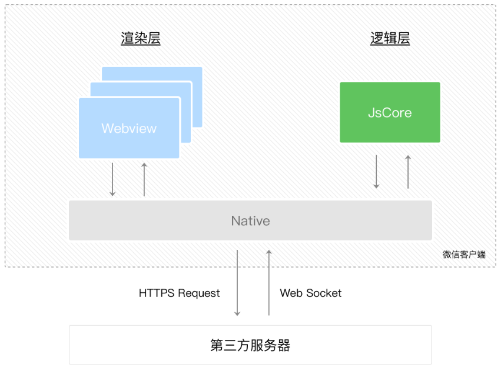

## 微信小程序简介 {#slide-1}

李伟

## 课前准备 {#slide-2}

注册自己的微信小程序账号

安装 小程序开发工具

具备 html 、 css 、 es6  基础

## 课堂目标 {#slide-3}

知道微信小程序是什么

学会建立微信小程序

## 知识点 {#slide-4}

小程序介绍

小程序的特色

小程序的建立

## 小 程序 是什么  {#slide-5}

微信小程序是一种全新的连接 用户端 与 服务端 的方式。

小程序可以在微信内被便捷地获取和传播。

小程序具有出色的用户体验。

## 为什么要学习小程序 {#slide-6}

微信小程序开发成本低、使用方便、用户量大、营销便捷。

微信小程序简单易学、薪资可观，可以提高自己的综合实力，为工作加分 。 

## 小程序与普通网页的区别  {#slide-7}

1. 线程

网页开发是单线程的， js 线程和渲染线程是互斥的。

小程序有一条 js 逻辑线程 和多条 渲染线程 两种线程。

2.DOM

网页开发可以操作 DOM 。

小程序中不能操作 DOM 。

3. 运行环境

网页是在 PC  端和移动端的浏览器上运行

小程序是在 android 、 iOS 、小程序开发者工具上运行

## 扩展：小程序的发展史 {#slide-8}

2016 年 1 月 11 日， 微信 之父张小龙时隔多年的公开亮相，解读了微信的四大 价值观 。 张小龙 指出，越来越多产品通过公众号来做，因为这里开发、获取用户和传播成本更低。拆分出来的服务号并没有提供更好的服务，所以微信内部正在研究新的形态，叫「 微信小程序 」。

2016 年 9 月 21 日，微信小程序正式开启内测。在微信生态下，触手可及、用完即走的微信小程序引起广泛关注。 腾讯云 正式上线微信小程序解决方案，提供小程序在云端服务器的技术方案。

2017 年 1 月 9 日 0 点 ，万众瞩目的微信第一批 小程序正式低调上线 ，用户可以体验到各种各样小程序提供的 服务。 

2017 年 12 月 28 日，微信更新的  6.6.1  版本开放了小游戏，微信启动页面还重点推荐了小游戏「 跳一跳 」，你可以通过「小程序」找到已经玩过的小 游戏。 

2018 年 1 月 18 日，微信提供了电子化的侵权投诉渠道，用户或者企业可以在微信公众平台以及微信客户端入口进行 投诉。

2018 年 1 月 25 日，微信团队在"微信公众平台"发布公告称，"从移动应用分享至微信的小程序页面，用户访问时支持打开来源应用。同时，为提升用户使用体验，开发者可以设置小程序菜单的颜色风格，并根据业务需求，对小程序菜单外的标题栏区域进行 自定义。

2018 年 3 月，微信正式宣布小程序广告组件启动内测，内容还包括第三方可以快速创建并认证小程序、新增小程序插件管理接口和更新基础能力，开发者可以通过小程序来赚取广告收入。   \[7\]   除了公众号文中、朋友圈广告以及公众号底部的广告位都支持小程序落地页投放广告，小程序广告位也可以直达小 程序。

2018 年 7 月 13 日，小程序任务栏功能升级，新增"我的小程序"板块；而小程序原有的"星标"功能升级，可以将喜欢的小程序直接添加到"我的小程序 "。

2018 年 8 月 10 日，微信宣布，小程序后台数据分析及插件功能升级，开发者可查看已添加「我的小程序」的用户数。此外， 2018 年 8 月 1 日至 12 月 31 日期间，小程序（含小游戏）流量主的广告收入分成比例优化上调，单日广告流水 10-100 万区间的部分，开发者可获得的分成由原来流水的 30% 上调到 50% ，优质小程序流量主可获得更高 收益。

2018 年 9 月 28 日，微信"功能直达"正式开放，商家与用户的距离可以更"近"一步：用户微信搜一搜功能词，搜索页面将呈现相关服务的小程序，点击搜索结果，可直达小程序相关服务 页面。

2019 年 8 月 9 日，微信向开发者发布新能力公测与更新公告，微信  PC  版新版本中，支持打开聊天中分享的小程序。安装最新 PC 端测试版微信后，点击聊天中的小程序，便会弹出小程序浮窗。而在小程序右上角的操作选项中，可以进行"最小化"操作，让微信小程序像其他 PC 软件一样最小化，排列于 Windows 系统的任务栏 中。

## 小程序的特色 {#slide-9}

用户：

- 触手可及：可以通过 扫描二维码 、搜索、朋友的分享等方式打开。
- 体验度优秀：小 程序使得服务提供者的 触达 能力变得更 强。

开发者：

- 加载速度快
- 渲染速度快
- 开发速度快（云能力、运维能力和数据汇总能力）
- 用户资源丰富

## 小程序适用场景： {#slide-10}

- 业务逻辑简单
- 使用频率低
- 性能要求低

## 小程序的建立步骤 {#slide-11}

申请 AppID

安装开发者工具

新建项目

## 总结 {#slide-12}

通过一章的学习可以看出小程序优点多多，功能强大，上手快速，接下来就让我们开始具体的学习微信小程序里的各种功能吧！
