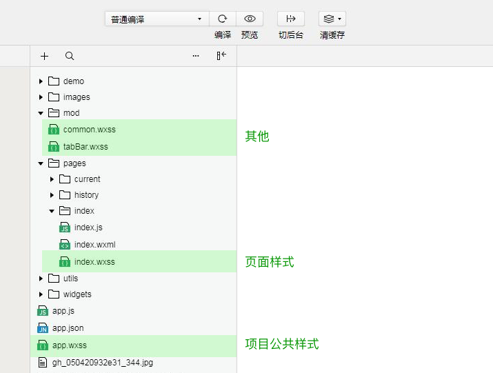
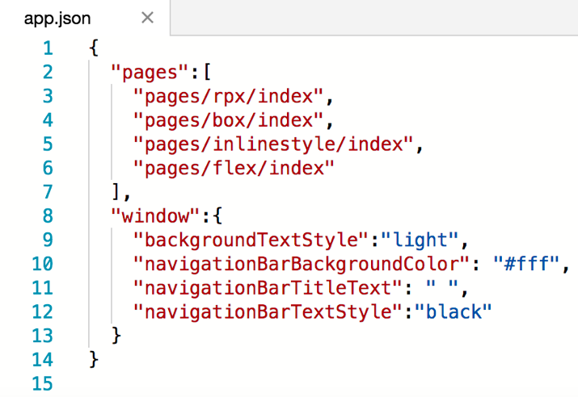
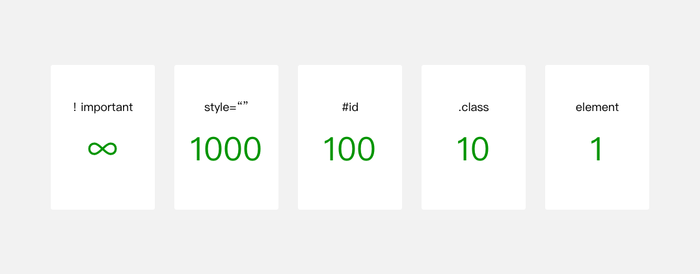
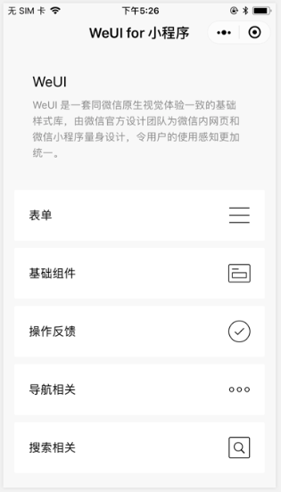

## 小程序代码组成 {#slide-1}

李伟

## 课堂目标 {#slide-2}

理解微信小程序的代码组成

掌握各种代码文件的书写规则 

## 知识点 {#slide-3}

JSON  配置

WXML  模板

WXSS  样式

js  脚本

## JSON  是什么 {#slide-4}

JSON  是一种 数据格式 ，并不是编程语言，在小程序中， JSON 扮演的 静态配置 的角色。

常见的 json  配置文件有 3 种：

- 小程序配置 app.json：做全局配置
- 页面配置 page.json：对小程序具体页面的配置
- 工具配置 project.config.json：对开发者工具的个性化配置，如域名校验、代码上传时自动压缩等

注意：小程序无法在运行过程中去动态更新 JSON

## 扩展  - JSON  语法 {#slide-5}

- JSON 文件都是被包裹在一个大括号 {}  中
- JSON  中无法使用注释
- 键名需要双引号 " "  包裹
- 键值之间有冒号  :  分隔
- 键值对之间用逗号  ,  分隔
- JSON 的值只能是以下几种数据格式：

数字，包含浮点数和整数

字符串，需要包裹在双引号中

Bool 值， true  或者  false

数组，需要包裹在方括号中  \[\]

对象，需要包裹在大括号中  {}

Null

## WXML  模板是什么 {#slide-6}

WXML  全称是  WeiXin Markup Language   微信标记语言 ，结合小程序的基础组件、事件系统，可以构建出页面的结构。

创建 WXML  文件的方法：在 app.json  中的 "pages/index/index"  上新增一行  "pages/wxml/index"  ，便会自动创建 WXML  文件。

## 数据绑定 {#slide-7}

WXML  通过  {{  变量名  }}   来映射 js 里的  data  数据。

变量名是大小写敏感的，也就是说  {{name}}  和  {{NAME}}  是两个不同的变量。

没有被定义的变量的或者是被设置为  undefined   的变量不会被同步到  wxml  中。

示例：

	\<text id=\"{{id}}\"\>{{msg}}\</text\>

	data: {

    		id:1,

    		msg:\' 开课吧 '

	},

注： {{}}  叫做 Mustache  语法。

## {{}}  中的语法逻辑 {#slide-8}

{{}}  具有两种功能： 动态渲染 、 逻辑运算 。

{{}}  中除了变量名，还可以放置数字、字符串，并且做一些逻辑运算。

常见的 逻辑运算 的语法：

- 算数运算
- 字符串拼接
- 三元运算

## WXML  中的条件逻辑 {#slide-9}

在 WXML  里有一套 if 、 elif 、 else   组合。

就比如下面的例子：如果我附近有呷哺，选择火锅；否则如果有肯德基，就选择汉堡；否则，就回家做饭。

  \<text wx: if =\"{{name===\' 呷哺 \'}}\"\>......\</text\>

  \<text wx: elif =\"{{name===\' 肯德基 \'}}\"\>......\</text\>

  \<text wx: else \>......\</text\>

\< block \> 可以一次性判断多个组件标签。

\<block wx:if=\"{{true}}\"\>

  \<view\>......\</view\>

  \<view\> ...... \</view\>

\</block\>

## 列表渲染 {#slide-10}

WXML  使用 wx:for  渲染列表，默认数组的当前项的变量名为 item ，下标名为 index 。 

\<view wx:for=\"{{food}}\" wx:key=\"id\"\>

  \<text\>{{item.name}}\</text\>

\</view\>

food:\[{id:1,name:\' 西红柿鸡蛋面 \'},{id:2,name:\' 香菜蛋花汤 \'},{id:3,name:\' 白菜炖粉条 \'}\]

更多详细

## 列表渲染 – 唯一标志符 {#slide-11}

wx:key  是列表中每一个项目的唯一的标识符。

这个标志符可以提高 wxml  动态渲染的效率。比如列表数据中的某一项数据发生改变时，微信会根据唯一标志符，找找到 wxml  列表中与此条数据对应的项目，然后只对此项目进行渲染。

这和 vue 、 react  里的 diff  算法是一个原理。

wx:key  的赋值方式：

- 列表项目的属性，如 \<view wx:for=\"{{objectArray}}\" wx:key=" attr \" \> {{......}} \</view\>
- 列表项目自身，如 \<view wx:for=\"{{numberArray}}\" wx:key=\" \*this \" \> {{......}} \</view\>

更多详细

## 扩展：模板 {#slide-12}

wxml  中的重复性元素，可以制作成模板，从而方便批量修改。

\<!\-- template  模板需要设置 name \--\>

\<template  name =\" hotel \"\>

  \<text\>{{name}} ： \</text\>

  \<text wx:for=\"{{food}}\" wx:key=\"id\"\>{{index?\' 、 \':\'\'}}{{item.name}}\</text\>

\</template\>

\<!\--  使用模板时， is  指定其使用的模板， data  指定模板数据  \--\>

\<template  is =" hotel "  data ="{{name:\' 呷哺 \',food}}\"\>\</template\>  

## 共同属性 {#slide-13}

所有 wxml  标签都支持的属性称之为共同属性

  属性名           类型           描述             注解
  ---------------- -------------- ---------------- ------------------------------------------
  id               String         组件的唯一标识   整个页面唯一
  class            String         组件的样式类     在对应的  WXSS  中定义的样式类
  style            String         组件的内联样式   可以动态设置的内联样式
  hidden           Boolean        组件是否显示     所有组件默认显示
  data-\*          Any            自定义属性       组件上触发的事件时，会发送给事件处理函数
  bind\*/catch\*   EventHandler   组件的事件       

## wxss  是什么 {#slide-14}

WXSS （ WeiXin Style Sheets ）是小程序的 样式语言 ，用于描述 WXML 的组件的视觉效果。 WXSS  就相当于网页里的 css

## 文件组成 {#slide-15}

## 文件组成 {#slide-16}

项目公共样式： app.wxss ，它会作用到小程序的每个页面。

页面样式：与 app.json 注册过的页面同名且位置同级的 WXSS 文件。

内联样式：在 wxml  中，写在标签的 style  属性里的样式

其它样式：可以被项目公共样式和页面样式引用的样式，比如模板文件里的样式。

注：小程序中不需要考虑样式文件的请求数量，不用像前端那样合并 css  文件。

## wxss 和 css  不一样的地方 {#slide-17}

- wxss 拥有相对的尺寸单位 rpx ，一个单位的 rpx  是手机宽度的 1/750
- 外联样式可用 @import  导入
- background-image  里的图片为网络图片时，其图片所在网络的域名要经过微信许可。
- position  为 absolute  的元素，需要 position  为 fixed  的容器。（这是由小程序的文档流中不存在 window 、 document 对象导致的）  

## 选择器 {#slide-18}

学过 css  的都知道，选择器就是 选择 HTML  标签的一种方式 。

小程序里的选择器就是这个意思，它选择的是 WXML  元素。

  类型           选择器     样例            样例描述
  -------------- ---------- --------------- ----------------------------------------------------
  类选择器       .class     .intro          选择所有拥有  class=\"intro\"  的组件
  id 选择器      #id        #firstname      选择拥有  id=\"firstname\"  的组件
  元素选择器     element    view checkbox   选择所有文档的  view  组件和所有的  checkbox  组件
  伪元素选择器   ::after    view::after     在  view  组件后边插入内容
  伪元素选择器   ::before   view::before    在  view  组件前边插入内容

## 选择器的优先级 {#slide-19}

WXSS 优先级与 CSS 类似，权重如图：

## 扩展： WeUI .wxss {#slide-20}

WeUI   是一套与微信原生视觉体验一致的基础样式库

WeUI  由微信官方设计团队为微信内网页和微信小程序量身设计，令用户的使用感知更加统一。

WeUI  包含 button 、 cell 、 dialog 、 progress 、 toast 、 article 、 actionsheet 、 icon 等各式原生组件的样式。

## 作用域 {#slide-21}

小程 序的作用 域同  NodeJS  比较相似。

在一个文件中声明的 变量和函数 只在该文件中有效 。

因此，在不同的文件中可以声明 相同名字 的变量和函数，不会互相影响。

## 模块化 {#slide-22}

es6  中模块化语法可以应用于小程序中。

A.js  中建立 A  模块

export default class A{

	constructor(name ){

		this.name  = name

	}

}

在 index.js  中引入 A  模块

import A from \'./A.js\'

Page({

	data : {

		fruit:new  A(\' 苹果 \')

	},

})

## 案例： canvas 小球组件 {#slide-23}

我们可以用微信里的 canvas  组件画一个弹动的小球，注意我这里说的是 canvas  组件，不是网页里的那个 canvas  画布。小程序里的 canvas  组件实际上是在 canvas  的基础上有包裹了一层容器。

1. 先找一下 canvas  里的 相关文档

2. 在文档里可以发现，我们再获取组件的时候，用的是一个 SelectorQuery     对象。下面是此对象的获取方法：

	const query = wx.createSelectorQuery()

3.SelectorQuery.select(string selector)  方法可以获取匹配选择器的节点信息对象 NodesRef 。

4.NodesRef.fields(Object fields, function callback)  可获取指定特征的节点信息对象 SelectorQuery 。其参数的常用属性：

- node ：是否返回节点对应的  Node  实例，默认为 false
- size ：是否返回节点尺寸（ width height ）

## 案例： canvas 小球组件 {#slide-24}

5.SelectorQuery.exec(function callback)  执行所有的请求，请求结果是一个数组，由回调函数返回。

6. 从请求结果中我们可以获取 canvas  节点（因为 fields 参数中 node=true ），还可以获取节点以像素为单位的尺寸 width 和 height （因为 fields 参数中 size=true ）。

7. 由 node ，我们可以获取真正的 canvas  画布。到了这一步，我们其实就可以绘图了，单位了完美，我们还要适配设备的像素比 DPR  。

8. 设备的像素比可以从系统信息里获取：

	const dpr = wx.getSystemInfoSync().pixelRatio

9. 使用这个 dpr  把 canvas  画布放大，然而因为 canvas  画布的视觉尺寸已经 canvas  组件限制死了，那他就只能压缩像素的密度，从而让 canvas  画布中的图形看起来更清晰。

	canvas.width = res\[0\].width \* dpr

      canvas.height = res\[0\].height \* dpr

## 案例： canvas 小球组件 {#slide-25}

10. 有了 canvas  画布了，画笔就可以正常获取。

	const ctx = canvas.getContext(\'2d')

11. 我们可以使用上下文对象的 scale  方法让 canvas  的坐标基底也放大，这样我们在绘图的时候考虑的就是设备的物理像素，而不是 canvas  画布放大后的像素单位。 	

	ctx.scale(dpr,dpr)

12 ，画布和画笔都有了，我们就可以建立一个小球模块。

 	const ball=new Ball(20)

	ball.x=150

	ball.y=50

	ball.draw(ctx)

export default class Ball{

  constructor(r=20,color=\'#00acec\'){

    this.r=r

    this.color=color

    this.x=0

    this.y=0

  }

  draw(ctx){

    const {x,y,r,color}=this;

    ctx.save()

    ctx.fillStyle=color

    ctx.beginPath()

    ctx.arc(x,y,r,0,Math.PI\*2)

    ctx.fill()

    ctx.restore()

  }

}

## 案例：弹动的小球 {#slide-26}

13. 弹动效果

    const {width,height}=res\[0\]

    let vy=1

    let ay=0.1

    let bounce=0.9

    setInterval(function(){

      ctx.clearRect(0,0,width,height)

      vy+=ay

      ball.y+=vy

      if(ball.y\>height-ball.r){

        ball.y=height-ball.r

        vy\*=-bounce

      }

      ball.draw(ctx)

    },17)

##   总结 {#slide-27}

在本章中，我们介绍了小程序里的代码文件构成，以及它们所扮演的角色。在下一章中，我们 会给大家介绍 这些代码文件在微信客户端中是如何协同工作的。
