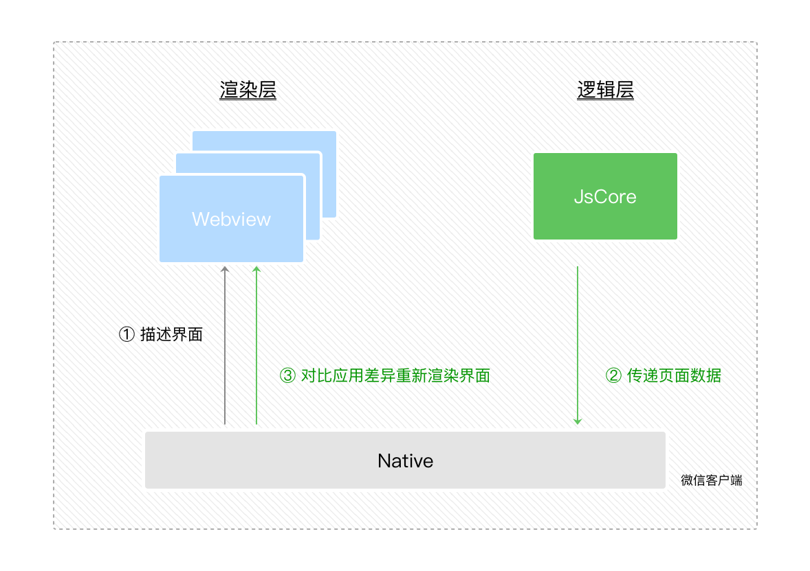
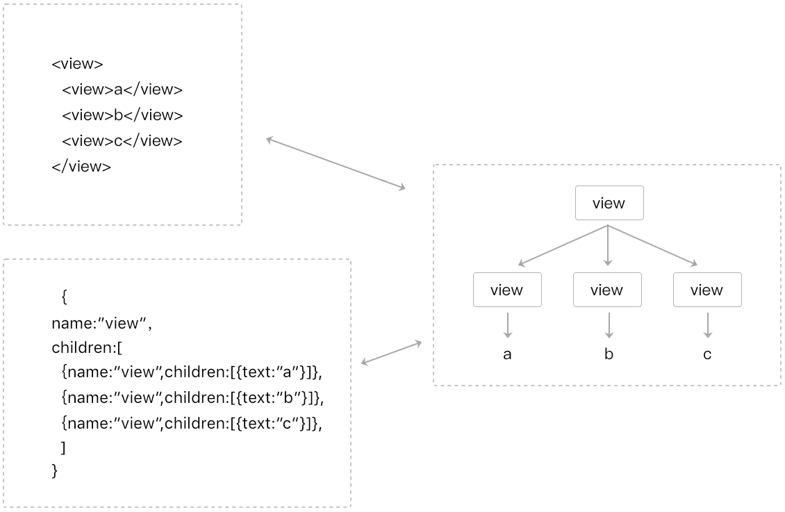
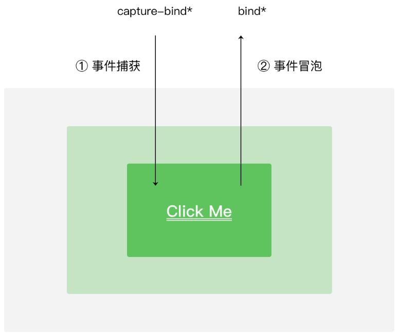

## 微信小程序宿主环境 {#slide-1}

李伟

## 课堂目标 {#slide-2}

理解微信小程序的宿主环境

使微信小程序的各种文件协调合作

## 知识点 {#slide-3}

渲染层和逻辑层

程序

页面

组件

API

事件

## 前言 {#slide-4}

宿主环境是 微信客户端给小程序提供的一种环境  。

宿主指的就是 微信客户端 ，也就是官方 API 里的 wx   对象。

宿主环境的作用是什么？

宿主环境会把我们写的各种文件 整合 到一起，进行 解析 ，然后在微信 APP  里 显示 出我们所看到的样子。

宿主环境可以为小程序提供微信 客户端的能力 ，比如微信扫码，这是普通网页不具备的。

## 双 线程下的 界面渲染原理 {#slide-5}

在 渲染层 ，宿主环境会把 WXML 转化成对应的 JS 对象，也就是 虚拟 Dom 。

在 逻辑层 发生数据变更的时候，我们可以用 setData 方法把数据从逻辑层传递到渲染层。

在渲染层对比 虚拟 Dom 的前后差异，把差异应用在真实 Dom 上，渲染出正确的 UI 界面。

## WXML 变成 虚拟 DOM 后的样子 {#slide-6}

WXML 结构实际上等价于一棵 Dom 树，即 真实 Dom 。

JS 对象也可以来表达 Dom 树的结构，即 虚拟 Dom 。

一棵 DOM  树，

可以用真实 Dom  来描述，

也可以用虚拟 Dom  来描述。

## App {#slide-7}

这里说的 App  是宿主环境提供的一个  App()  构造器 ，用于注册一个程序 App 。

- App()  构造器必须写在项目根目录的 app.js 里。如： App({...})
- App 实例是 单例对象 ，也 是一个全局对象，就像网页里的 window 一样。
- 在其他 JS 脚本中可以使用宿主环境提供的  getApp()  方法来获取 App  实例。利用 getApp()  我们可以将数据写入全局，或者从全局读取数据。   如：

	const app = getApp()

	app. globalData .motto=' 好好学习 '

     

## 点开微信小程序的一瞬间，微信客户端做了些什么 {#slide-8}

点开微信小程序 

微信客户端初始化宿主环境

小程序代码包

网络下载

本地缓存

APP 实例

派发 onLaunch 事件

App 构造器参数所定义的 onLaunch 方法被微信客户端调用

进入微信小程序 

## 小程序的后台状态和前台状态 {#slide-9}

- 后台状态：用户点击小程序 右上角关闭按钮 ，或手机的 home  键 时，会离开小程序，但小程序 并不会被销毁 ，而是进入后台状态。此时， APP 构造器参数里的 onHide   方法会被调用。
- 前台状态：用户再次小程序时，微信用户端会唤醒后台状态的微信小程序，微信小程序就进入了前台状态， onShow   方法会被调用。

注意： App 的生命周期是由用户操作主动触发的，开发者不能在代码里主动调用

## 文件构成和路径 {#slide-10}

一个小程序可以有很多页面，每个页面承载不同的功能，页面之间可以互相跳转。

一个页面是分三部分组成：

界面： WXML 、 WXSS

配置： JSON

逻辑： JS

## 页面构造 器 Page() {#slide-11}

页面的 js  里的所有代码都是写在 Page() 构造器里的。

Page 构造器接受一个 Object 参数 ，在 Object 中可以绑定数据，监听页面事件。

Page( {

   data: { text: \"This is page data.\" },

  onLoad: function(options) { },

  onReady: function() { },

  onShow: function() { },

   onHide: function() { },

  onUnload: function() { },

  onPullDownRefresh: function() { },

  onReachBottom: function() { },

  onShareAppMessage: function () { },

  onPageScroll: function() { }

} )

## 页面的生命周期 {#slide-12}

页面的生命周期首先要考虑三个事件：

页面初次加载时： onLoad ，在页面没被销毁之前只会触发 1 次。

页面显示时： onShow     ，从别的页面返回到当前页面时，都会被调用。

页面初次渲染完成时： onReady ，在页面没被销毁前只会触发 1 次，在逻辑层可以和视图层进行交互。

页面显示后，随着用户的操作，还会触发其它的事件：

- 页面不可见时： onHide ， wx.navigateTo 切换到其他页面、底部 tab 切换时触发。
- 返回到其它页时： onUnload ， wx.redirectTo 或 wx.navigateBack 使当前页面会被微信客户端销毁回收时触发。

## 页面的用户行为 {#slide-13}

- 下拉刷新  onPullDownRefresh ： 监听用户下拉刷新事件，需要在全局或具体页面的 json  文件中配置 enablePullDownRefresh 为 true 。
- 上拉触底  onReachBottom ： 监听用户上拉触底事件。可以在 app.json 的 window 选项中或页面配置 page.json 中设置触发距离 onReachBottomDistance 。在触发距离内滑动期间，本事件只会被触发一次。
- 页面滚动  onPageScroll ： 监听用户滑动页面事件，参数为  Object ，包含  scrollTop  字段，表示页面在垂直方向已滚动的距离（单位 px ）。
- 用户转发  onShareAppMessage ： 只有定义了此事件处理函数，右上角菜单才会显示"转发"按钮，在用户点击转发按钮的时候会调用，此事件需要 return 一个 Object ，包含 title 和 path 两个字段，用于自定义转发内容

## 页面数据的 注意事项 {#slide-14}

- 用数据驱动视图渲染要用 this. setData () ，而要用 this.data ，这不仅无法驱动视图，还会造成数据不一致。
- 由于 setData 是两个线程间的通信，为了提高性能，每次设置的数据不应超过 1024KB  。
- 不要把 data 中的任意一项的 value 设为 undefined ，否则可能会有引起一些不可预料的 bug 。

## 页面跳转 {#slide-15}

页面跳转的方式有很多种：

- 在 app.json  中用 tabBar   属性设置跳转方式
- 在 wxml  页使用导航组件  \< navigator \>  跳转页面
- 在 js  中用 路由 API 跳转

## 运行 js 时要留心异步事件 {#slide-16}

小程序只有一个 JSCode  线程，页面有多个。

小程序切换页面时，小程序的逻辑层依旧运行在同一个 JsCore 线程中。

页面使用了 setTimeout 或者 setInterval 的定时器后，跳转到其他页面时，这些定时器并没有被清除，需要开发者自己在页面离开的时候进行清理。

## 组件 {#slide-17}

一个小程序的页面是由多个组件组成的。

小程序的宿主环境提供了一系列基础组件，如 view 、 text 。

但有的时候，我们还需要自定义组件。

自定义组件的名称要小写：

\<kkb-image\>\</kkb-image\>

## 自定义组件 {#slide-18}

自定义组件的方法：

在主项目下建立 components  文件夹，在其中建立 floatball  文件夹，在此文件夹上右击"新建  Component "，这样就可以建立出 json 、 wxml 、 wxss 、 js  四个文件。

组件的 json 中设置  \"component\": true

组件的 wxml 、 wxss 可以正常写。

组件的 js 中的 properties  可以接受父组件属性。

父组件在调用子组件时要在其 json  文件中设置 usingComponents ，如：

  \"usingComponents\": {

    \"floatball\":\"/components/floatball/floatball\"

  }

## 父子组件的数据传递 {#slide-19}

父组件向子组件传递数据： 属性

父组件  wxml ：

\<floatball  text =\" 开课吧 \"\>\</floatball\>

子组件  js ：

   properties : {

     text :{type:\'string\',value:\' 悬浮球 \'}

   },

子组件向父组件传递数据：事件

在父组件调用子组件时，为其绑定事件，如：

	\<floatball  bind : tapBall ="tapBall\"\>\</floatball\>

建议 onClickBall  的属性名和属性值都写成一样，免得把"在父组件中使用属性值，在子组件中触发属性名"记混了。

在子组件中触发事件的方法是   triggerEvent(eventName, detail) ，如 this. triggerEvent (\' tapBall \',{tap:true})

## api {#slide-20}

宿主环境提供了丰富的 API ，可以很方便调用微信提供的能力。

几乎所有小程序的 API 都挂载在 wx 对象底下（除了 App/Page 等特殊的构造器）。

小程序提供的 API 按照功能主要分为：网络、媒体、文件、数据缓存、位置、设备、界面、界面节点信息、特殊的开放接口。

## API 的常见规律 {#slide-21}

- wx.on\*  开头的  API  是监听某个事件发生的 API 接口，接受一个  Callback  函数作为参数。当该事件触发时，会调用  Callback  函数。如 wx.onError()
- 后缀带 Sync  的方法是同步的方法。如 wx.getSystemInfoSync()
- 如未特殊约定，多数  API  接口为 异步接口  ，都接受一个 Object 作为参数。如 wx.getSystemInfo()
- API 的 Object 参数一般由 success 、 fail 、 complete  来接收请求结果的。如 request  接口
- wx.get\*  开头的 API 是 获取 宿主环境数据的接口。如 wx.getSystemInfo()
- wx.set\*  开头的 API 是 写入 数据到宿主环境的接口。如 wx.setNavigationBarTitle(Object object)

## 用户在渲染层的行为反馈事件 {#slide-22}

  类型                 触发条件
  -------------------- --------------------------------------------------------------------------------------------
  touchstart           手指触摸动作开始
  touchmove            手指触摸后移动
  touchcancel          手指触摸动作被打断，如来电提醒，弹窗
  touchend             手指触摸动作结束
  tap                  手指触摸后马上离开
  longpress            手指触摸后，超过 350ms 再离开，如果指定了事件回调函数并触发了这个事件， tap 事件将不被触发
  longtap              手指触摸后，超过 350 ms 再离开（推荐使用 longpress 事件代替）
  transitionend        会在  WXSS transition  或  wx.createAnimation  动画结束后触发
  animationstart       会在一个  WXSS animation  动画开始时触发
  animationiteration   会在一个  WXSS animation  一次迭代结束时触发
  animationend         会在一个  WXSS animation  动画完成时触发

## 事件捕捉和事件冒泡 {#slide-23}

- bind 前加上 capture-  表示事件捕捉，如 capture-bind:tap
- 若不加前缀， bind : tap  和 bindtap 是一回事。
- 

## 示例：测试事件冒泡和事件捕捉的差异 {#slide-24}

在 wxml  里建立两个容器对象，里面分别包裹着两个子元素。为容器和子元素添加触摸方法：

\<view  bindtap =" tabWrapper \"\>

  \<view  bindtap =" tabText \"\> 事件冒泡 \</view\>

\</view\>

\<view  capture-bind:tap =\" tabWrapper \"\>

  \<view  bindtap =\" tabText \"\> 事件捕捉 \</view\>

\</view\>

js  中的触摸方法：

   tabWrapper (){

    console.log(\'wrapper\');

  },

   tabText (){

    console.log(text\');

  },

##   总结 {#slide-25}

我们在本章介绍了 小程序宿主环境 的基本运行机制以及它所提供的各种能力，

组合这些能力可以完成一个体验非常流畅的小程序。

下一节课我们会说小程序在各种场景中的实际应用。

##   写笔记 {#slide-26}

描述微信小程序从点开到显示的过程，以及 app 和页面的生命周期的触发条件，不少于 500 字。
