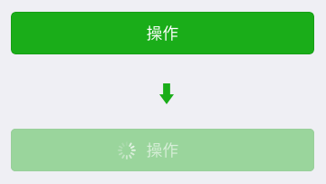
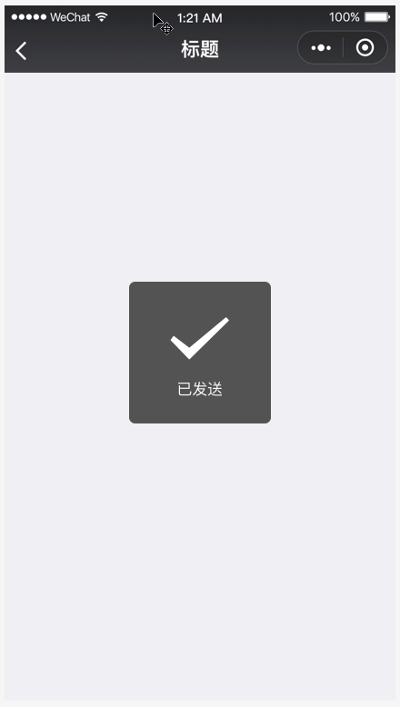
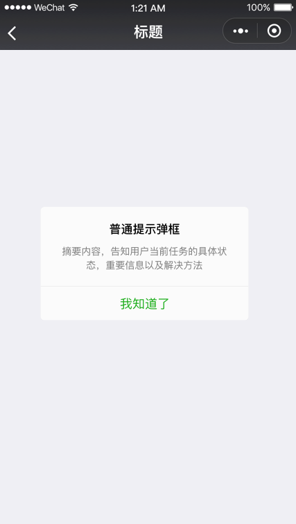

## 微信小程序应用场景 {#slide-1}

李伟

## 课堂目标 {#slide-2}

了解微信小程序的基本开发流程

掌握小程序在实际开发中的一些技巧和注意事项

## 知识点 {#slide-3}

开发流程

界面常见的交互反馈

发起 https  网络通信

微信登录

本地数据缓存

设备能力

## 开发流程 {#slide-4}

在开发前，首先要有 原型图 和 UI 视觉图 。

原型图 通常是由产品经理使用 Axure  绘制，原型图会用简单的图形和文字展示页面功能，比如页面元素的布局和交互逻辑。

UI 视觉图 就是基于原型图的页面布局出的最终视觉效果图。

当然，若页面不复杂， 原型图 和 UI  视觉图 也可能都画在一起。

我们开发者要做的，就是基于 UI 视觉图 和 原型图 的交互逻辑开发小程序。

我们可以按照以下三步走：

WXML+WXSS 还原设计稿 。

按照页面交互，梳理出每个页面的 data 部分 ，填充 WXML 的模板语法。

完成 JS 逻辑 部分。

注意：高效的开发流程有很多种方式，具体还得看团队的工作节奏，我们刚才说的只是最常规的。

比如，若产品 交互体验 还不明确，我们可以先完成一些 局部功能 ，比如与后端数据的对接，并且做好测试。

## 交互反馈 {#slide-5}

用户在小程序上进行交互的时候，某些操作可能比较耗时，需要我们予以及时的反馈，去舒缓用户等待的不良情绪，这样的反馈就是 交互反馈 。

常见的交互反馈有：

- 触摸反馈
- Toast 和模态对话框
- 界面滚动

## 触摸反馈 {#slide-6}

通常页面会摆放一些 button 按钮或者 view 区域，用户触摸按钮之后会给按钮换个颜色。

- 用户触摸后的样式设置可用通过组件的 hover-class 属性实现，如：

如果按钮是要加载数据的，按钮要显示一个 loading 的状态。

- 按钮 loading  状态的显示，可以通过 \<button\>  组件的 loading   属性实现：

## Toast  提示 {#slide-7}

在 某个操作成功 之后，我们希望 提示用户 这次操作成功，并且 不打断用户 接下来的操作。这就需要使用弹出式提示 Toast ， Toast 提示默认 1.5 秒后自动消失。 更多  

    //  显示 Toast

    wx. showToast ({ 

      title: \' 已发送 \',

      icon: \'success\',

      duration: 1500

    })

    //  隐藏 Toast

    wx. hideToast ()

## 模态框 {#slide-8}

在做 错误提示 的时候， Toast  是不合适的，因为错误提示需要 明确告知用户具体原因 ，因此不适合一闪而过的 Toast 。

错误提示需要使用 模态框 ，模态框可以让用户明确知晓自己的操作结果，同时附带 下一步操作 的指引。 更多

    wx. showModal ({

       title : \' 标题 \',

       content : \' 告知当前状态，信息和解决方法 \',

       confirmText : \' 主操作 \',

       cancelText : \' 次要操作 \',

       success : function(res) {

        if (res. confirm ) {

          console.log(\' 用户点击主操作 \')

        } else if (res. cancel ) {

          console.log(\' 用户点击次要操作 \')

        }

      }

    })

## 界面滚动 {#slide-9}

往往手机屏幕是承载不了所有信息的，所以就有了界面滚动。

常见的界面滚动有：下拉刷新、上拉加载。

下拉刷新：用户下拉整个界面时，可以刷新当前页面。

上拉加载：用户上拉整个界面，触底时，加载更多信息。这种交互操作叫为上拉触底。

注： scroll-view   滚动视图组件，提供了提供了丰富的滚动回调触发事件，可以实现界面中某一区域的滚动。

## HTTPS 网络通信 {#slide-10}

wx. request()  的作用：往服务器传递数据，从服务器拉取信息。

request()  有两种方法把数据传递到服务器：

get 请求：通过 url 传递参数，如  url: \'https ://test.com/getinfo? id =1& version =1.0.0\'

post   请求：通过 data 传递参数，如： data : {  id :1,  version :\'1.0.0' },

建议使用 post  传递数据，因为 url  的最大长度是 1024 字节， url 上的参数需要拼接到字符串里，参数的值还要 urlEncode 。

开发中的小程序的 request  请求可以任意写，而正式版的小程序则必须遵循以下条件：

遵循 https   协议。

在 管理平台注册 了。

## 示例 {#slide-11}

1. 使用 id  请求新闻内容

url ： http://localhost:9000/getNews?id=1

method ： 'GET'

2. 使用 id  请求用户名

url ： http://localhost:9000/getUserName

method ： \'POST'

data:{id:2}

## 微信登录 {#slide-12}

微信登录面对的问题：

- 怎么获取用户在微信的信息
- 怎么获取小程序用户的唯一身份标志

示例： 海哥 进入一个电商小程序的时候，小程序要显示提示信息：

如果 海哥 未登录 小程序，显示登录按钮，先让 海哥 登录小程序。

如果 海哥 登录了 小程序：

- 如果 海哥 是新用户，小程序显示" 海哥 您好，欢迎 新 用户光临本店！"
- 如果 海哥 是老用户，小程序显示" 海哥 您好，欢迎 老 用户光临本店！"

在这里面，"海哥"这个昵称，我们可以通过获取用户信息的方法来得到。

然而，在我们判断 海哥 是新用户还是老用户的时候，并不能用昵称判断，因为叫 " 海哥 " 的肯定有很多。我们要用 openid   来判断用户的唯一性。

## openid  的获取方法 {#slide-13}

wx. login ()  方法可以获取微信登录凭证 code

使用 code  可以向微信服务器换取微信用户的唯一识别标志 openid

- 微信服务器提供的接口地址： https://api.weixin.qq.com/sns/ jscode2session ? appid =\< AppId \>& secret =\< AppSecret \>& js_code =\< code \>&grant_type=authorization_code
- AppId 和 AppSecret   是为了确保用 code 换 openid 的人是当前小程序的开发者

注意：

AppId  是公开信息，泄露 AppId 不会带来安全风险

AppSecret  是小程序秘钥，不能泄露，如果发现泄露需要到 小程序管理平台 进行重置。

AppId ： wx3b70d5eb01fb536c

AppSecret ： 084e6e828ca65b61b009276c79b05cef

## 本地数据缓存的概念 {#slide-14}

本地数据缓存：就是将小程序的数据存储在当前设备硬盘上。

本地数据缓存的作用：

- 存储用户在小程序上产生的操作，在用户关闭小程序重新打开时可以恢复之前的状态。
- 缓存一些服务端非实时的数据，从而提高小程序获取数据的速度。

## 读取缓存 {#slide-15}

//  异步读取

wx. getStorage ({

  key: \'key1\',

  success: function(res) {

    //  异步接口在 success 回调才能拿到返回值

     var value1 = res.data

  },

  fail: function() {

    console.log(\' 读取 key1 发生错误 \')

  }

})

//  同步读取

try{

  //  同步接口立即返回值

   var value2 = wx. getStorageSync (\'key2\')

}catch (e) {

  console.log(\' 读取 key2 发生错误 \')

}

## 写入缓存 {#slide-16}

//  异步写入

wx. setStorage ({

  key:\"key\",

  data:\"value1\"

  success: function() {

    console.log(\' 写入 value1 成功 \')

  },

  fail: function() {

    console.log(\' 写入 value1 发生错误 \')

  }

})

//  同步写入

try{

   wx. setStorageSync (\'key\', \'value2\')

  console.log(\' 写入 value2 成功 \')

}catch (e) {

  console.log(\' 写入 value2 发生错误 \')

}

## 案例：利用 本地缓存 提前渲染的商城页面 {#slide-17}

有些商城页面一开始加载数据的时候，就会先把本地缓存的数据显示出来。等新的数据加载完成之后，就再用新的数据更新视图。

这种方式适用于对 数据实时性 / 一致性 要求不高的页面。

## 扩展：设备能力 {#slide-18}

小程序的宿主环境提供了很多的操作设备的能力，可以让我们提高开发效率，增强用户体验。

常见的设备能力：

- 扫码
- 拍照
- 操控蓝牙
- 获取设备网络状态
- 调整屏幕亮度
- ......

##   总结 {#slide-19}

本章我们主要讲解了项目开发流程、界面常见的交互反馈、 https  网络通信、微信登录、本地数据缓存、设备能力。

学到这里，大家离独立完成一个小程序更近了一步，下一章我们来说微信小程序里必备的知识点 - 云开发。
