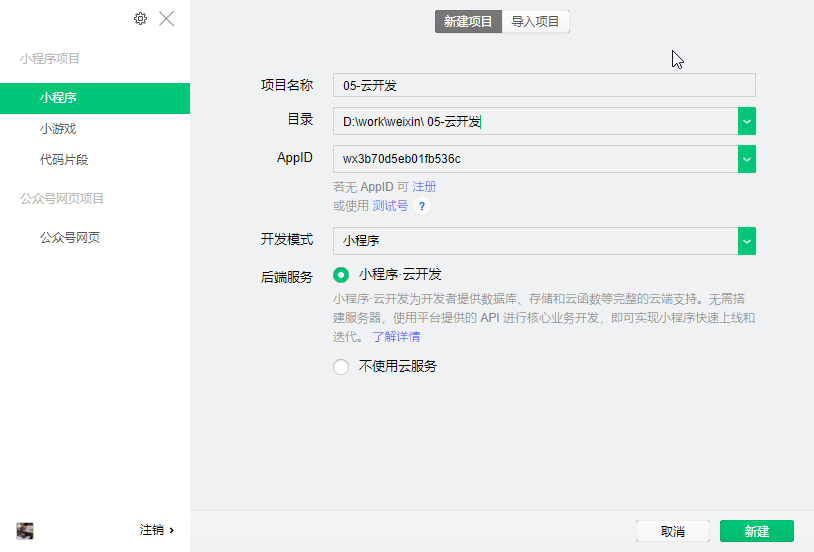
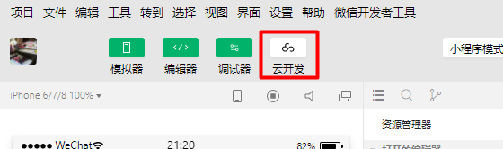
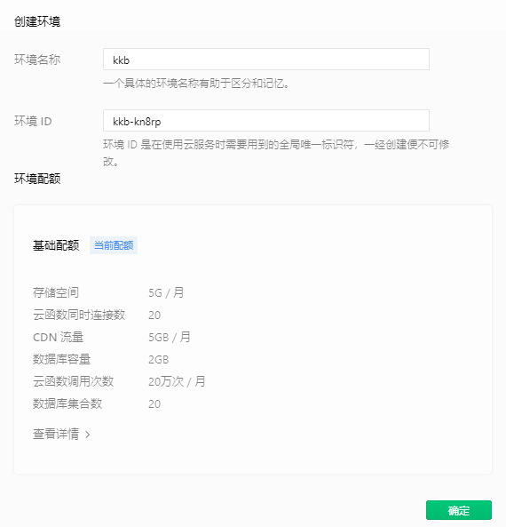
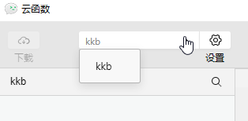
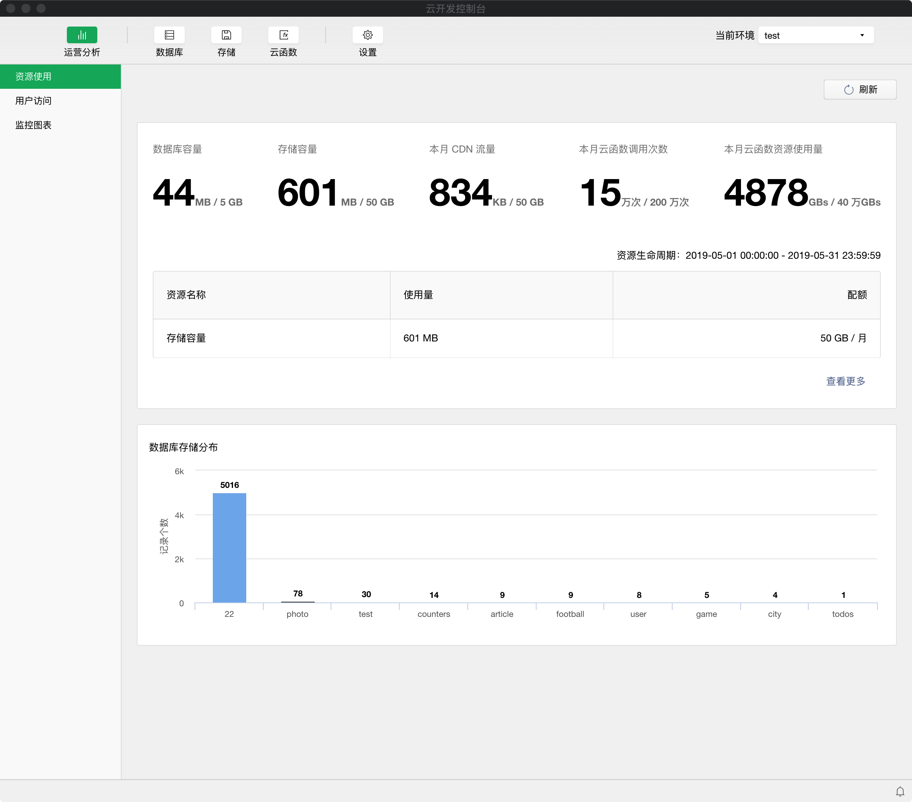
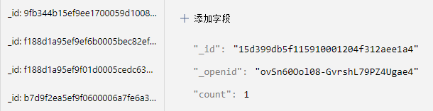

## 微信小程序云开发 {#slide-1}

李伟

## 课堂目标 {#slide-2}

认识云开发的基本概念

掌握云开发的使用方法

## 知识点 {#slide-3}

云开发简介

云开发小程序的建立

云开发能力

环境

配额

## 什么是云开发 {#slide-4}

云开发就是在开发微信小程序、小游戏，无需搭建服务器，使用微信云平台的 API  进行核心业务开发，从而实现快速上线和迭代。

云开发的四大基础功能：

- 云函数 	：无需自建服务器。在云端运行的代码，微信私有协议天然鉴权，开发者只需编写自身业务逻辑代码。
- 数据库	 ：无需自建数据库。一个既可在小程序前端操作，也能在云函数中读写的  JSON  数据库。
- 云存储 ：无需自建存储和  CDN 。在小程序前端直接上传 / 下载云端文件，在云开发控制台可视化管理。
- 云调用 	：原生微信服务集成。基于云函数免鉴权使用小程序开放接口的能力，包括服务端调用、获取开放数据等能力

## 1. 新建云开发模板 {#slide-5}

## 2. 开通云服务 {#slide-6}

在开发者工具工具栏左侧，点击 "云开发" 按钮即可打开云控制台，根据提示开通云开发、创建云环境。

默认配额下可以创建 两个 环境，各个环境相互隔离，每个环境都包含独立的数据库实例、存储空间、云函数配置等资源。

每个环境都有唯一的环境  ID  标识，初始创建的环境自动成为默认环境。

## 3.  体验小程序 {#slide-7}

开通环境后，在项目目录中的" cloudfunctions "文件夹上右击  \>  更多设置  \>  选择刚才建立的环境

之后就可以体验云开发的部分基础能力了。

## 4.  查看控制台 {#slide-8}

控制台具备以下能力：

- 运营分析 ：查看云开发监控、配额使用量、用户访问情况
- 数据库 ：管理数据库，可查看、增加、更新、查找、删除数据、管理索引、管理数据库访问权限等
- 存储管理 ：查看和管理存储空间
- 云函数 ：查看云函数列表、配置、日志

注：若要销毁环境，需要通过工单联系微信服务人员。

## 云函数 {#slide-9}

云函数是一段运行在云端的代码，不需要搭建服务器，在开发工具内编写、一键上传部署即可运行后端代码。

小程序内提供了专门用于 云函数 调用的  API 。

在页面的 js  文件里调用云函数的方法：

wx.cloud. callFunction ({

	name: 云函数名 ,

	data:{ 传给云函数的参数 },

	success: 成功回调

}) 

## 云调用 {#slide-10}

云调用在云函数中调用 微信服务端接口 的一种能力，如获取用户的 appid 、 openid 、 unionid

详情可见具体 开发指引 。

扩展：

appid ：发布到线上的小程序的唯一标志

openid ： 同一用户同一应用唯一，即一个用户在不同小程序中分别拥有一个唯一的用户标志，可以用于在同一个小程序中做用户唯一性的判断

unionid ： 同一用户不同应用唯一 ， 即一个用户在不同小程序中都有一个共同的联合 id ， 可以用于用户量去重

## 云存储 {#slide-11}

云开发有一块存储空间，我们可以向这里面上传或下载文件。

我们在小程序端和云函数里都可以通过  API  使用云存储功能。

- 文件上传： wx.cloud.uploadFile
- 下载云文件： wx.cloud.downloadFile 

## 数据库 {#slide-12}

一个数据库由多个 集合 组成。

集合可看做一个  JSON   数组。

集合中的每个对象就是一条 记录 ，记录的格式是  JSON 。

## 数据库 {#slide-13}

数据的增删改查，可以通过云开发控制台或 js 实现。

集合中每条记录都有两个字段：

- \_id ：记录的唯一标志
- \_openid ：记录的创建者

注：在管理端控制台中创建的记录不会有  \_openid  字段，因为这是属于管理员创建的记录。

开发者可以自定义  \_id ，但不可自定义和修改  \_openid 。

\_openid  是在文档创建时由系统根据小程序用户默认创建的，开发者可使用其来标识和定位文档。

## 数据的增删改查   {#slide-14}

1. 在对数据进行增删改查之前，要先获取数据库和集合。

- 获取数据库： wx.cloud.database()
- 获取集合： db.collection( 集合名称 )

2. 获取了集合之后，就可以对其中的数据进行增删改查了。

増： add ({data  新增数据 ,success,fail})

查： where ({data  查询依据 }). get ({success,fail})  ， doc ( \_id).get({success,fail}) 

改： doc( \_id). update ({data  要更新的数据 ,success,fail}) 

删： doc( \_id). remove ({success,fail}) 

## 资源环境 {#slide-15}

资源环境 就是一个具有独立云开发资源的环境，其云开发资源包括数据库、存储空间、云函数等。

资源环境默认最多 两个 ，各个环境是相互独立的。

在实际开发中，建议每一个 正式环境 都搭配一个 测试环境 ，所有功能先在测试环境测试完毕后再上到正式环境。

## 配额 {#slide-16}

配额 就是腾讯云服务的型号，不同型号的云服务具有不同的存储和计算能力，大家可以根据自己的实际情况做选择。

资源配额可分为四类：

- 资源均衡型
- CDN  资源消耗型
- 云函数资源消耗型
- 数据库资源消耗型

## 《 猜猜谁准 》 多人游戏案例 {#slide-17}

核心知识点：

用户信息和 openid 的获取

webSocket  通信

## webSocket  通信原理 {#slide-18}

## webSocket  多人通信的核心逻辑 {#slide-19}

模拟一个场景：有多个玩家，连接后端服务，每个玩家向后端发送的信息，都会通过后端分享给其它玩家。

微信小程序中的 webSocket   方法和事件：

connectSocket({url})   连接后端 webSocket  服务

onSocketOpen()    与后端 webSocket  服务连接成功事件

onSocketMessage()   接收到后端 webSocket  信息事件

sendSocketMessage()  向后端 webSocket   发送信息

......

注意： webSocket  只支持 wss   协议

##   总结 {#slide-20}

这一章主要讲了云开发的概念和基本使用方法。

通过这一章的学习大家应该掌握了云函数、云调用、云存储和云端数据的增删改查。

云开发还有许多具体的知识，大家可以在将官方文档的云开发统览一遍，以后遇到了具体的需求，再以需求来驱动学习。

##   用微信小程序自拍的案例。 {#slide-21}

camera 组件

button 组件

image 组件

建立三个组件： camera 组件、 button 组件、 image 组件。

- camera 组件可以展示摄像头中的场景。
- 点击 button  按钮时，会把 camera 组件中当前展示的一帧图片静态显示在 Image  中。

注：若同学不喜自拍，也可以拍摄自己喜欢的物品。

代码截图：

- js 部分： js.jpg  
- wxml ： wxml.jpg  
- 拍摄截图：效果 .jpg  

参考案例： https://developers.weixin.qq.com/miniprogram/dev/component/camera.html

