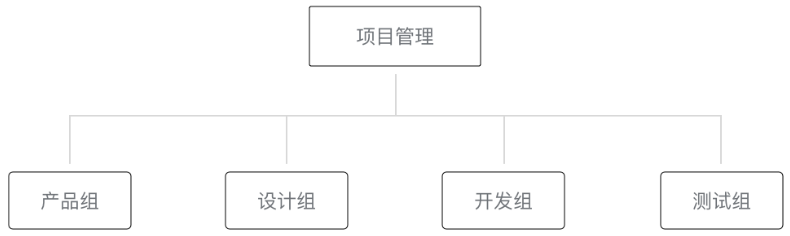
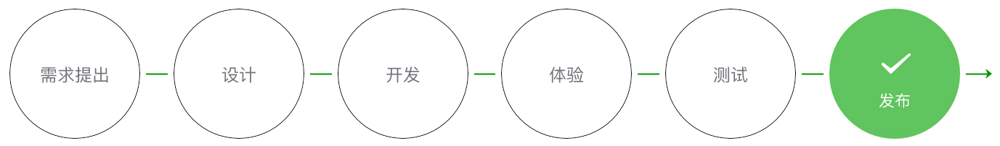
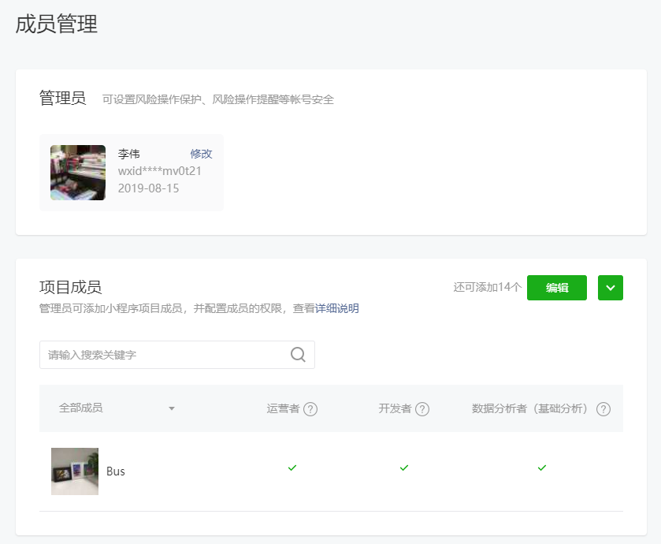
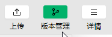
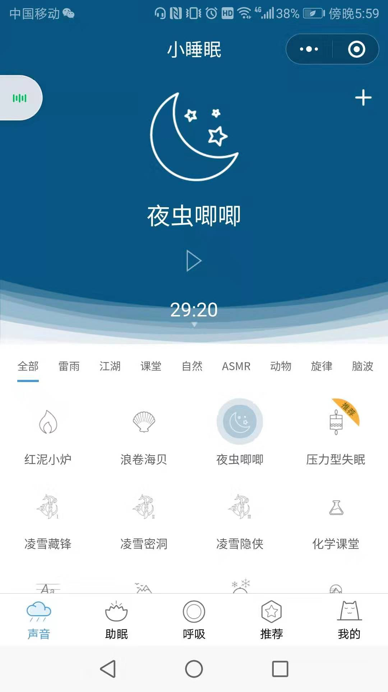
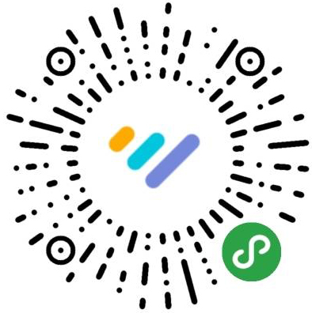

## 微信小程序协同工作和发布 {#slide-1}

李伟

## 课堂目标 {#slide-2}

理解开发小程序时，团队之间的协作方式。

理解小程序的发布流程。

## 知识点 {#slide-3}

协同工作

用户体验

发布

## 人员组织结构和权限分配 {#slide-4}

项目管理人员：负责 统筹 整个项目的进展和风险、 把控 小程序对外发布的节奏。

产品组：提出需求，设计产品原型

设计组：与产品组交流沟通，设计出可视化流程与图形，输出设计方案。

开发组：依据设计方案编写代码。

测试组：对小程序进行各种边界测试。

项目开发流程：

大型公司，分工很细，一个项目要多人协作。

## 权限管理 {#slide-5}

微信平台提供了 权限管理 ，让整个团队更好的协同工作。

在项目完成开发后，就可以用 开发者工具 提交小程序 代码包 ，然后在 小程序管理平台发布 小程序。

相关文档

## 小程序的版本 {#slide-6}

  开发版本     使用开发者工具，可将代码上传到开发版本中。 开发版本只保留每人最新的一份上传的代码。点击提交审核，可将代码提交审核。开发版本可删除，不影响线上版本和审核中版本的代码。
  ------------ -----------------------------------------------------------------------------------------------------------------------------------------------------------------------
  体验版本     可以选择某个开发版本作为体验版，并且选取一份体验版。
  审核中版本   只能有一份代码处于审核中。有审核结果后可以发布到线上，也可直接重新提交审核，覆盖原审核版本。
  线上版本     线上所有用户使用的代码版本，该版本代码在新版本代码发布后被覆盖更新。

一个小程序，可能由多人开发，所以每个开发者都一个开发版本。

另外，我们还需要将一个开发版本当做体验版，用于上传稳定的测试代码。

## 版本管理 {#slide-7}

微信小程序提供了一个 版本管理工具 ，我们可以把自己写的代码提交到 github  上，进行团队协作。

比如我和张三要开发一个小程序的项目 game ，这个项目由我主导：

1. 进入版本管理工具，设置认证方式，如用户名、密码验证

2. 在代码管理平台建立远程仓库 game

3. 我要在 master  上搭建一个简单的项目目录，并推送到 github

4. 我要基于 master  建立一个新的分支 dev_liwei ，用于自己开发，并推送。

5. 让张三在他自己的开发工具里，把项目拉下来，从 master 上拉一个新的分支 dev_zhangsan ，并推送

6. 在 master 的基础上开一个新的分支作为测试分支 test ，并推送

7. 在项目开发到一定阶段的时候，我就可以在 test   中将所有开发者的分支的代码合并一下，然后发布，进行测试。

8. 当项目开发完了，测试也没问题了。就在 test   基础上新建一个 审核版 review  分支，将其推送，并提交审核。

9. 若 review  审核通过，就将 review  同步到线上版 master  分支上。

10. 若 review  审核没有通过，那就继续开发、测试，然后提交审核，直到审核通过。

## 如何提高用户体验 {#slide-8}

导航清晰

流程明确

重点突出

符合预期

等待与反馈

异常处理

内容和文案准确友好

和谐统一

平台适配

## 发布前常常遗漏 的点 {#slide-9}

如果小程序使用到 Flex 布局，并且需要兼容 iOS8 以下系统时，请检查上传小程序包时，开发者工具是否已经开启" 上传代码时样式自动补全 "。

小程序使用的服务器接口应该走 HTTPS 协议 ，并且对应的网络域名确保已经在小程序管理平台配置好。

在测试阶段要 校验域名合法性 ，因为若不校验容易导致开发者误以为测试通过，让正式版小程序因为遇到非法域名无法正常工作。

发布前请检查小程序使用到的 网络接口 已经部署好，并且评估好服务器的 负载 情况。

## 小程序码 {#slide-10}

在发布小程序之后，小程序管理平台会提供对应的 小程序码 的预览和下载，开发者可以自行下载用于线上和线下的小程序服务推广。

小程序码的优势：

- 在样式上更具辨识度和视觉冲击力
- 小程序主题的品牌形象更加清晰明显，可以帮助开发者更好地推广小程序。

##   总结 {#slide-11}

本章主要阐述了一个项目从立项到发布的整体流程和协作方式。

给大家提出一些产品优化的原则和建议。

接下来，我们会对小程序框架的设计背景和运行原理再做进一步的讲解。
