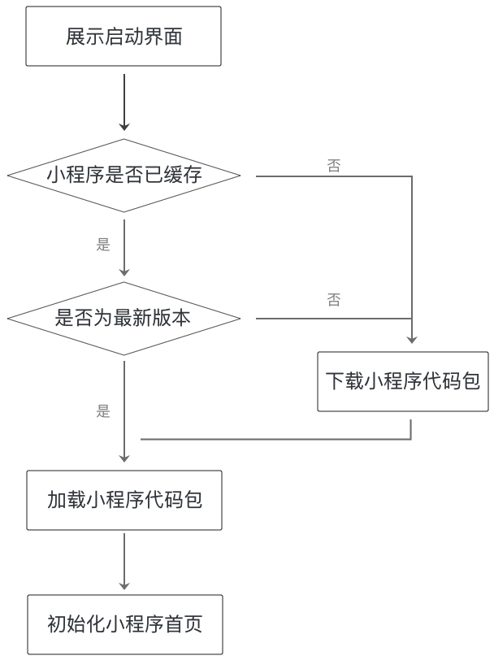
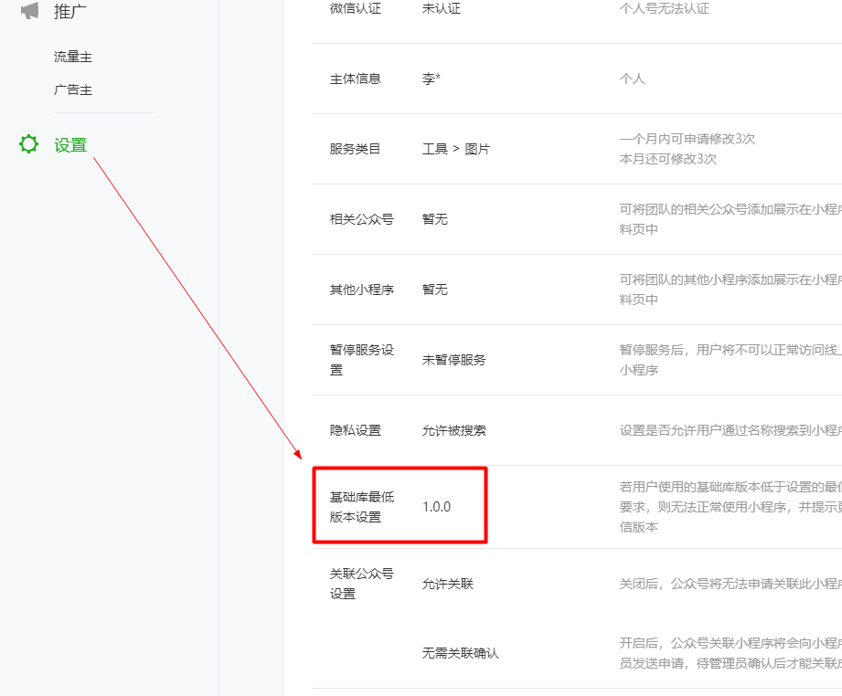

## 微信小程序性能优化 {#slide-1}

李伟

## 知识点 {#slide-2}

小程序的启动

页面层级准备

数据通信

视图渲染

兼容性

## 小程序的启动 {#slide-3}

在小程序启动时，微信会为小程序展示一个固定的启动界面，界面内包含小程序的 图标 、 名称 和 加载提示图标 。

## 分包加载 {#slide-4}

采用分包时，小程序的代码包有两种：

- 一个"主包"，包含小程序启动时会马上打开的页面代码和相关资源。
- 多个"分包"，包含其余的代码和资源。

这样，小程序启动时，只需要先将主包下载完成，就可以立刻启动小程序，从而降低小程序代码包的下载时间。

{

  \" pages \":\[\"pages/index/index\",\"pages/logs/logs\"\],

  \" subPackages \": \[

    {

      \"root\": \" packageA \",

      \"pages\": \["pages/apple/apple\"\]

    }, {

      \"root\": \" packageB \",

      \"pages\": \[\"pages/banana/banana\"\]

    }

  \]

}

app.json  中的配置

## 小程序代码包的大小限制 {#slide-5}

- 单个分包 / 主包大小不能超过  2M
- 整个小程序所有分包大小不超过  16M

## 常规的控制代码包大小的方法 {#slide-6}

- 精简代码 ，去掉不必要的 WXML 结构和未使用的 WXSS 。
- 减少在代码包中直接嵌入的 资源文件 。
- 压缩图片 ，使用适当的图片格式。
- 分包加载

## 页面和 Page  构造器的运行逻辑 {#slide-7}

一个页面的多次显示，并不会使得这个页面的 JS 文件被执行多次，我们可以利用这个特性，建立基于页面的全局变量。

- wx. navigateTo  方法会重新实例化目标页面的 Page 构造器。

例如，页面 A 使用 wx. navigateTo  跳转到页面 B ，再使用 wx. navigateTo 跳转到页面 A ，页面 A 中的 Page 构造器 就会被重新实例化

- wx. navigateBack  方法不会重新实例化目标页面的 Page 构造器 ，但它会销毁当前页面。

- 

## 页面层级 {#slide-8}

在视图层内，小程序的每一个页面都 独立运行 在一个页面层级上。

小程序启动时仅有一个页面层级，每次调用 wx.navigateTo ，都会 新建一个页面层级 ；

相对地， wx. navigateBack 会 销毁一个页面层级 ，并且不会再重新实例化返回页的 Page 构造器。 对于每一个新的页面层级，视图层都需要进行一些额外的准备工作。

在 小程序启动前 ，微信会提前准备好一个页面层级用于展示小程序的 首页 。

除此以外，每当一个页面层级被用于渲染页面，微信都会提前开始准备一个新的页面层级，使得每次 wx.navigateTo  跳转页面时都能够尽快展示一个新的页面。

## 数据通信 {#slide-9}

在每个小程序页面的生命周期中，存在着若干次页面数据通信：

- 逻辑层 向 视图层 发送页面数据（ setData ）
- 视图层 向 逻辑层 反馈数据和用户事件  (data-key 、 bind:\*)

## js 中提高数据更新速度的方法 {#slide-10}

多次 setData 合并成 一次 setData 调用 ，不要过于频繁调用 setData 。

数据通信的性能与 数据量 正相关，因而如果有一些数据字段不在界面中展示，且数据结构比较复杂或包含长字符串，则不应使用 setData 来设置这些数据。

与界面渲染无关的数据最好不要设置在 data 中 ，可以考虑设置在 page 对象的其它字段下。

## js 中提升 数据 更新性能 {#slide-11}

onShow: function() {

    //  不要频繁调用 setData

    this.setData({ a: 1 })

    this.setData({ b: 2 })

    //  绝大多数时候可优化为

     this.setData({ a: 1, b: 2 })

    //  将 与界面无关的数据放在 data 外

     this.setData({myData: {a: \' 这个字符串在 WXML 中用到了 \',b: \' 这个字符串未在 WXML 中用到，且很长 ...' }})

    //  可以优化为

     this.setData({myData:{\'a\': \' 这个字符串在 WXML 中用到了 \'})

    this .\_myData  = {b: \' 这个字符串未在 WXML 中用到，且很长 ...\'}

}

## wxml  中提高数据更新速度的方法 {#slide-12}

- 去掉不必要的事件绑定 （ WXML 中的 bind 和 catch ），从而减少通信的数据量和次数。
- 不要在节点的 data 前缀属性中放置过大的数据， 因为事件绑定时需要传输 target 和 currentTarget 的 dataset

## 当前手机的信息 {#slide-13}

使用  wx.getSystemInfo()  或者  wx. getSystemInfoSync ()  可以获取当前手机的信息。如：

  {

    brand: \"iPhone\",         //  手机品牌

     model: \"iPhone 6\",      //  手机型号

     platform: \"ios\",            //  客户端平台

     system: \"iOS 9.3.4\",   //  操作系统版本

     version: \"6.5.23\",        //  微信版本号

     SDKVersion: \"1.7.0\",  //  小程序基础库版本

     language: \"zh_CN\",    //  微信设置的语言

     pixelRatio: 2,              //  设备像素比

     screenWidth: 667,      //  屏幕宽度

     screenHeight: 375,     //  屏幕高度

     windowWidth: 667,     //  可使用窗口宽度

     windowHeight: 375,    //  可使用窗口高度

     fontSizeSetting: 16     //  用户字体大小设置

   }

## wx .canIUse()  方法 {#slide-14}

wx. canIUse ()  方法可以判断接口或者组件在当前宿主环境是否可用。

//  对象的属性或方法

wx.canIUse(\'console.log\')

wx.canIUse(\'CameraContext.onCameraFrame\')

wx.canIUse(\'CameraFrameListener.start\')

wx.canIUse(\'Image.src\')

// wx 接口参数、回调或者返回值 wx.canIUse(\'getSystemInfoSync.return.safeArea.left\')

wx.canIUse(\'getSystemInfo.success.screenWidth\')

wx.canIUse(\'showToast.object.image\')

wx.canIUse(\'onCompassChange.callback.direction\')

wx.canIUse(\'request.object.method.GET\')

//  组件的属性

wx.canIUse(\'live-player\')

wx.canIUse(\'text.selectable\')

wx.canIUse(\'button.open-type.contact\')

## 小程序基础库版本的兼容 {#slide-15}

在小程序管理后台设置"基础库最低版本设置"，可以达到不向前兼容的目的。

例如：你选择设置你的小程序只支持 1.5.0 版本以上的宿主环境，那么当运行着 1.4.0 版本宿主环境的微信用户打开你的小程序的时候，微信客户端会显示当前小程序不可用，并且提示用户应该去升级微信客户端。

##   总结 {#slide-16}

本章主要介绍了小程序的运行流程和一些重要细节，还介绍了进行优化的基本方法。

主要的优化策略可以归纳为三点：

- 精简代码，降低 WXML 结构和 JS 代码、 wxss 的复杂性；
- 合理使用 setData 调用，减少 setData 次数和数据量；
- 必要时使用分包优化。
