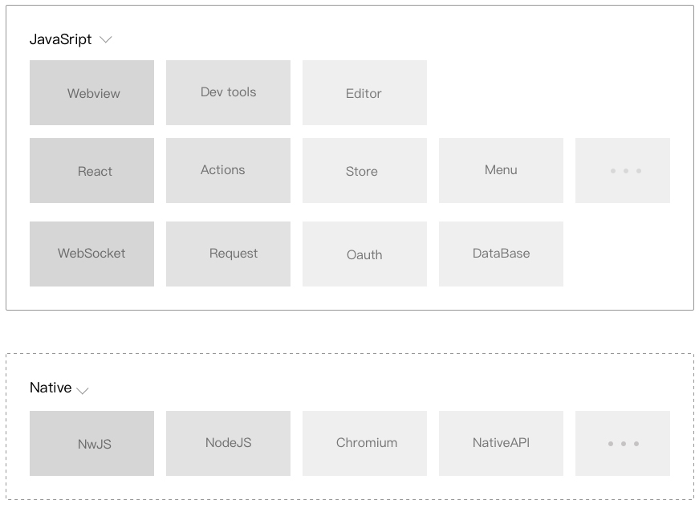
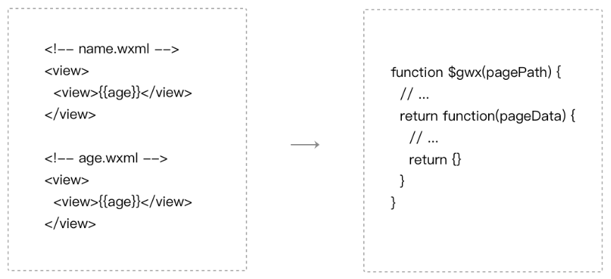

## 微信开发者工具 {#slide-1}

李伟

## 目标 {#slide-2}

深度理解微信开发者工具，让开发者工具为自己的开发效率加成。

## 知识点 {#slide-3}

微信开发者工具存在的意义

代码编译

开发者工具的常用功能

## 微信开发者工具存在的原因 {#slide-4}

微信开发者工具存在的原因肯定是因为当时其它开发者工具写不了微信小程序。

因为小程序渲染层和逻辑层分离， webstorm  之类的网页开发工具是写不了写小程序的，必须使用微信开发者工具。

微信开发者工具是小程序开发生态一站式 IDE ，其功能有：代码开发、编译运行、界面和逻辑调试、真机预览、发布版本等。

## 微信开发者工具底层框架 {#slide-5}

底层模块：基于 nw.js  ，使用 node.js 、 chromium 以及系统 API 来实现

用户交互层：使用 React 、 Redux 等前端技术框架来搭建，可以跨 Mac 和 Windows  平台使用。

## 文件编译 {#slide-6}

微信的渲染环境无法直接理解 wxml 和 wxss 文件 ，所以微信开发者工具会用一个二进制的 wxml 编译器把 wxml 和 wxss 文件编译成 js  后放到微信的渲染环境中运行。

对于 js  文件，在代码上传之前会被 ES6 转 ES5 、代码压缩等，最后合并成一个 app-service.js 

## 开发者工具的常用功能 {#slide-7}

- 删除项目历史
- 建立代码片段
- 工作区设置
- 窗口面板的显示和隐藏
- 快捷键设置
- 模拟操作
- 添加编译模式
- ......

##   总结 {#slide-8}

这一章我们主要讲了微信开发者工具的一些概念知识，对开发者工具的灵活使用，还要大家多去尝试。
