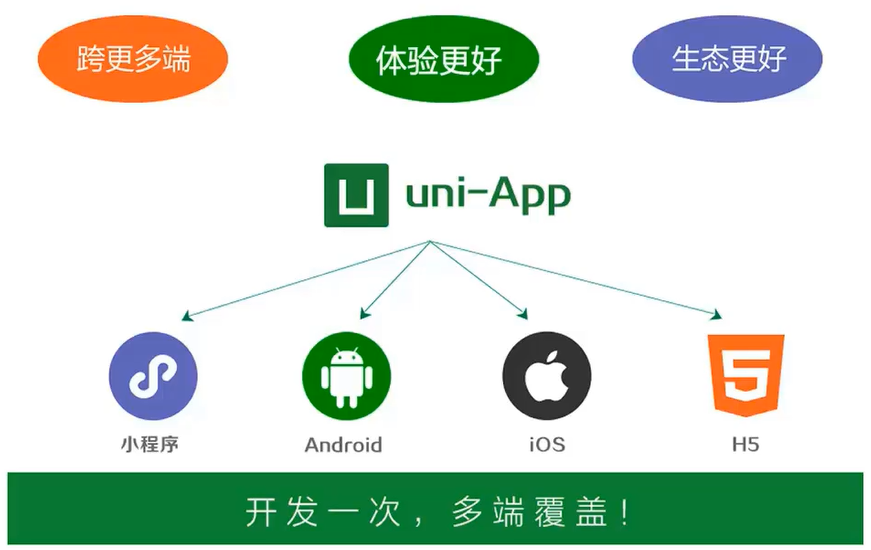
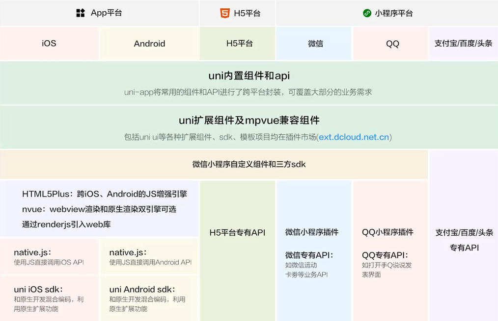
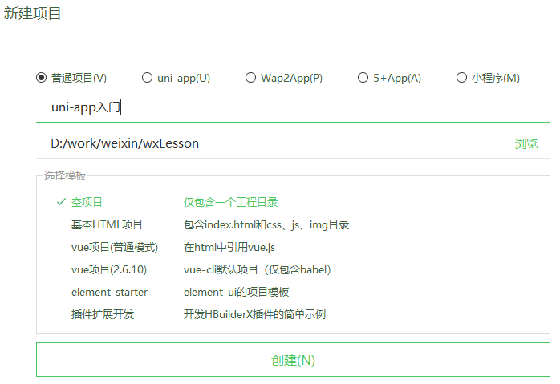

## uni-app  快速入门 {#slide-1}

李伟

## 目标 {#slide-2}

认识 uni-app ，理解其功能。

使用 uni-app  快速开发微信小程序。

## 知识点 {#slide-3}

uni-app  简介

uni-app  的优势

快速入门

## uni-app  简介 {#slide-4}

uni-app  是一个使用  Vue.js  开发所有前端应用的框架，开发者编写一套代码，可发布到 iOS 、 Android 、 H5 、以及各种小程序（微信 / 支付宝 / 百度 / 头条 /QQ/ 钉钉 / 淘宝）、快应用等多个平台。

uni-app  诞生的背景：

多端泛滥

体验不好

生态不丰富

## uni-app  优势 {#slide-5}

跨平台更多：一套代码多端使用，能优雅的在一个项目里调用不同平台的特色功能。

运行体验更好：组件、 api  与微信小程序一致，兼容 weex   原生渲染。

通用技术栈，学习成本低： vue  的语法，微信小程序的 api ，内嵌 mpvue

开放生态，组件更丰富：支持 npm  安装第三方包、支持微信小程序自定义组件及 SDK ，兼容 mpvue  组件及项目， APP 端可以和原生混合编码， Dcloud  新发布了 插件市场

开发成本低： 即便只开发一个平台，也可以 提高 研发效率

## uni-app 功能示意图 {#slide-6}

## 认识官网 {#slide-7}

uni-app 官网： https://uniapp.dcloud.io/

## 快速入门 {#slide-8}

下载 HBuilderX   开发工具

创建 uni-app

配置 manifest.json  文件

uni-app  应用标志

微信小程序 AppID

运行项目

## 项目目录简介 {#slide-9}

┌─ pages                      业务页面文件存放的目录

│  ├─ index

│  │  └─index.vue       index 页面

│  └─ list

│     └─list.vue            list 页面

├─ static                       存放应用引用静态资源（如图片、视频等）的目录，注意：静态资源只能存放于此

├─ wxcomponents       存放小程序组件的目录

├─ main.js                   Vue 初始化入口文件

├─ App.vue                  应用配置，用来配置 App 全局样式以及监听应用生命周期

├─ manifest.json          配置应用名称、 appid 、 logo 、版本等打包信息

├─ pages.json              配置页面路由、导航条、选项卡等页面类信息

└─ uni.scss                  uni-app 内置的常用样式变量

    

## 总结 {#slide-10}

这一章我们主要讲了 uni-app  的优势和配置方法，下节课我们会讲一个 《 美食收藏 》 的小程序项目。

暗号：正切

##   用 uniapp 写微信小程序自拍功能 {#slide-11}

camera 组件

button 组件

image 组件

建立三个组件： camera 组件、 button 组件、 image 组件。

camera 组件可以展示摄像头中的场景。

点击 button  按钮时，会把 camera 组件中当前展示的一帧图片静态显示在 Image  中。

注：若同学不喜自拍，也可以拍摄自己喜欢的物品。

代码截图：

vue  代码截图： vue.jpg

效果截图：效果 .jpg

代码打包上传

参考案例：

https://uniapp.dcloud.io/component/camera

