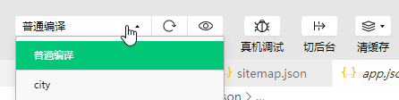
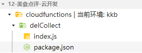
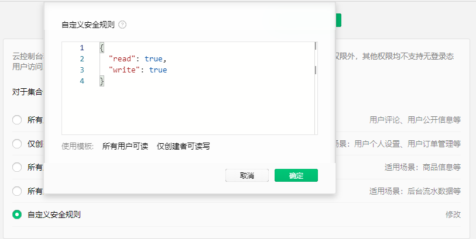

## uni-app  美食收藏 {#slide-1}

李伟

## 目标 {#slide-2}

使用 uni-app  开发实际的微信小程序项目

## 知识点 {#slide-3}

全局设置

QQ  地图

页面跳转和返回

云开发

组件系统

上拉加载

数据缓存

模态框

用户信息和 openid  的获取

## uni-app  和微信小程序不同的地方 {#slide-4}

  uni-app                      微信小程序
  ---------------------------- ---------------------------------
  upx                          rpx
  uni                          wx
  page.json 、 manifest.json   app.json 、 project.config.json
  app.vue                      app.js 、 app.wxss

## 导航条的样式设置 {#slide-5}

通过 page.json  里的 globalStyle   属性可以设置全局样式。

比如所有页面导航条的样式：

- navigationBarTextStyle  导航条文字颜色
- navigationBarTitleText  导航条文字内容
- navigationBarBackgroundColor  导航条背景色

## 首页尝试自动获取用户信息 {#slide-6}

在首页页面加载的时候，我们要先尝试获取 用户信息 ，若用户授权小程序可以获取用户信息，便可以获取，获取后，要将其存储到 全局 。因为以后的页面里会用到。

onLoad() {

	this. getUserInfo ().then(userInfo=\>{

		globalData. userInfo =userInfo;

	})		

}

	

getUserInfo (){

	return new Promise(resolve=\>{

		uni. getSetting ({

			success: res =\> {

				if(res. authSetting \[\'scope.userInfo\'\]){

					uni. getUserInfo ({

						success: ({userInfo}) =\> {

							 resolve (userInfo)

						}

					})

				}

			}

		})

	})

}

## 获取 openid  并缓存到本地 {#slide-7}

在首页页面加载的时候，我们要判断一下本地有没有 openid ，如果没有，就从 云函数 里请求一个，再缓存到本地。

const openid = uni.getStorageSync(\"openid\");

if(!openid){

	this.getOpenidByFn().then(openid=\>{

		uni. setStorage ({

			 key : \"openid\",

			 data : openid

		});

	})

}

getOpenidByFn() {

	return new Promise((resolve,reject)=\>{

		wx.cloud.callFunction({

			name: \'login\',					

			success: res =\> {

				resolve(res.result.openid)

			},

			fail: err =\> {					  

				reject(err)

			}

		})

	})

},

## 基于当前位置获取店铺列表 {#slide-8}

我们要在 页面显示 的时候，判断全局变量里是否有用户的 address   位置。

若有，就将 address   更新到 data ，并基于此位置从数据库获取 店铺列表 。

若无，就要先获取经纬度， 利用 腾讯地图反解析 经纬度得到城市名，再 基于 城市名 从数据库获取 店铺列表 。

## 获取当前位置 {#slide-9}

让用户允许小程序获取当前位置，需要在 manifest.json  文件里配置 mp-weixin  里的 permission 属性。

wx. getLocation ()  方法可以获取当前位置的经纬度， 坐标格式应为  gcj02 。

this. getLocation ()

.then((data)=\>{

	return this. analysis (data);

})

.then(city=\>{

	this.address = city;

	globalData.address=city;

	 this.updateShops();

})

/\*  获取当前经纬度 \* /

getLocation(){

	return new Promise((resolve)=\>{

		uni. getLocation ({

			success: res =\> {

				resolve(res);

			}

		});

	})

},

## 腾讯地图反解析经纬度  {#slide-10}

const  QQMapWX  = require(\'../../utils/qqmap-wx-jssdk.js');

const  map  = new QQMapWX({

	key: \'YACBZ-5LPK6-GOQSO-EP343-7LD4J-SIBLV\'

});

analysis({latitude,longitude}){

	return new Promise((resolve)=\>{

		//  反解析；

		 map . reverseGeocoder ({

			 location : { latitude , longitude },

			success: result =\> {

				resolve(result.result.address_component.city);

			}

		})

	})

},

## 基于城市向云端数据库请求店铺集合 {#slide-11}

现在在云端数据库我们已经有了一个 favorList   集合，是全国各地的店铺。

我们获取城市后，就可以查询在这个城市里的所有店铺了。

对于简单的查询操作，可以直接在小程序端实现。

如根据城市，从某一个起始位置，查询指定数量的热门店铺：

	db.collection(\"favorList\")

		.where({place})

		.skip(this.page \* 5)

		.limit(5).get()

		.then(({data}) =\> {

			this.loading = false;

			reflect(data);

		})

对于后面店铺数据的显示，使用 v-for  即可，这和 vue  是一样，在此便不再多说。

## 组件的调用和传参 {#slide-12}

uni-app  里的组件和 vue  里的组件原理是一样的。

如， ShopList.vue  组件的建立：

\<template\>

	\<view\>...\</view\>

\</template\>

\<script\>

	export default {props: \[\'title\',\'list\',\'loading\'\]};

\</script\>

\<style\>......\</style\>

在 index.vue  里引入 Stat.vue  组件

\<template\>

	\<ShopList 

			title=\' 猜你喜欢 \' 

			:list=\"shops\" 

			:loading=\"loading\"\>

	\</ShopList\>

\</template\>

\<script\>

	import ShopList from \'../../components/ShopList.vue\';

	export default {components: {ShopList}};

\</script\>

## 上拉加载 {#slide-13}

在 uni-app  里的上拉加载和微信小程序一样，都是使用 onReachBottom ()  方法做监听。

如页面下拉触底时，再多加载一定数量的店铺数据：

onReachBottom() {

	this. updateShops ();

},

methods: {

   updateShops (){

    this. getShops ()

      .then(data=\>this. parseShops (data))

      .then(shops=\>{

         if(shops.length){

           this. shops =\[\...this.shops,\...shops\]

           this. page ++;

         }

      })

  },

}

curList  是新获取的数据， this.favorList=\[\...this.favorList, \...curList\]  则是将新数据追加到当前 favorList  的后面，从而生成新的 favorList

## 首页和城市页的跳转 {#slide-14}

页面的跳转有两种实现方式：

- js  路由跳转 方法

	 \<text @click=\" goToCity \" class=\"area_name\"\>......\</text\>

	methods: {

		 goToCity () {

			uni. navigateTo ({url: \'../city/city});

		}

	}

- \< navigator \>  标签

\< navigator  class=\"area_name\" url=\"/pages/city/city\" \>......\</ navigator \>

## 城市的点击 {#slide-15}

在城市页选择了城市后，我们回到上一级页面，也就是首页，这是我们要把所选择的城市传到首页中。

对于传参，我们可以将所选择的城市写入的到全局对象 app  的 globalData 里。如：

	 globalData . address  = city+\' 市 \';

返回上一级页面，我们可以使用 js  里的 navigateBack ()  方法，或者 \< navigate \>  组件。如：

	uni.navigateBack({

	delta: 0

	});

## 点击首字母 {#slide-16}

当我们选择城市页右侧的字母时，我们可以用 scroll-view   组件滚动到指定元素位置

对于中国所有的城市数据，网上很容易下载到，我们直接使用一个静态的 json  文件即可。

对于基于首字母定位城市，我们可以使用 \< scroll-view \>  组件，如：

\<scroll-view class=\" scrollView \"  scroll-y    :scroll-into-view =\" letter \"\>

	\<view  v-for="v  in  cityData \" : key="v\"  :id =\" v.letter \"\>

	 	......

	\</view\>

\</ scroll-view\>

scroll-y ：允许纵向滚动

scroll-into-view ：滚动到指定 id  的元素所在的位置

: id ="v.letter"  是必须要设置的，这是 scroll-view  滚动的依据

## condition  模式配置 {#slide-17}

城市页是由首页跳转过去的。

在我们实际开发中，如果每修改一个地方，都要在首页里点击，跳转到城市页，那是非常痛苦的。

在 pages.json  里有一个 condition  模式配置属性，可以解决我们的这个痛点。

	\"condition\": { 

		\"current\": 1, 

		\"list\": \[{\"name\": \"city\",\"path\": \"pages/city/city\" }\]

	}

配置完 condition  后，我们还要在微信小程序开发工具里手动选择编译模式。

## 获取用户信息 {#slide-18}

在用户中心，若用户未授权小程序获取用户信息的权利，那就会出现默认头像，点击可提示用户授权。

用户授权后，可获取用户信息，然后将其保存在全局。

data() {

	return {

		 userInfo : null,

	};

}

用按钮获取用户信息：

onGetUserInfo({detail:{userInfo}}) {

	if (userInfo) {

		this.userInfo = userInfo;

		globalData.userInfo=userInfo;

	}

},

## 详情页的业务逻辑 {#slide-19}

页面加载时，详情页会更新店铺详情和收藏图标的状态。

在点击收藏图标时，会切换页面和数据库的收藏状态。

## 店铺收藏的业务逻辑 {#slide-20}

点击收藏，可以切换店铺的收藏状态。

若当前店铺没有被用户收藏，在点击时，会将店铺的 id  和用户的 openid  合成一条记录，存储到数据库的 collect  集合里。

若当前店铺已经被用户收藏，在点击时，会基于店铺的 id  和用户的 openid ，从数据库的 collect  集合里删除相应的记录。

## 向数据库的集合里添加记录 {#slide-21}

在获取数据库里的集合后，可以用 add  方法添加数据，如：

	db.collection(\"collect\"). add ({

		data: {openid,id}

	})

## 从数据库的集合里删除记录 {#slide-22}

删除操作，要在服务端实现的，因为服务端安全性更高，所以我们接下来要在云函数里实现删除功能。

wx.cloud.callFunction({

	name: \"delCollect\",

	data: {openid,id:shopId}

})

## 在 uni-app  里使用微信小程序的云开发 {#slide-23}

HBuilder X  开发工具里暂时还没有微信小程序的云开发功能，因此我们在 uni-app  项目里写了云函数后，是没法提交到微信云平台的。

好在，云函数和项目是可以分离的。

所以，要解决这个问题，最简单的方式就是在微信小程序里新建一个云服务项目，在这里面写云函数并提交。

## 云函数的建立和应用 {#slide-24}

我在这里直接用微信开发者工具建立了一个云服务项目。然后在 cloudFunctions  里建立了云函数。

//index.js --  云函数的内容

const cloud = require(\'wx-server-sdk\')

cloud.init();

const db = cloud.database()

const \_ = db.command

exports.main = async (event, context) =\> {

  try {

    return await db.collection(\'collect\').where({

      openid: event.openid,

      id:event.id

    }).remove()

  } catch (e) {

    console.error(e)

  }

}

云函数的用法：

wx.cloud. callFunction ({

	name: \" delCollect \",

	data:  { openid,id }

})

## 扩展： updata  无法更新数据 {#slide-25}

updata  无法更新数据时，在确定自己的其它环节都没问题的前提下，要检查一下数据的写入权限。

云控制台和服务端始终具有数据的读写权限。

而小程序端默认是不支持无登录态的用户访问，其实这里有 BUG ，有的小伙伴登陆了小程序开发工具也无法更新，结果研究了一晚上，最后把自己心态整崩了。

我们可再云开发控制台里自定义数据的安全规则，让小程序端拥有读写权限。

## 模态框提示 {#slide-26}

当我们在详情页里点击收藏时，会先判断用户有没有登录， openid  有没有，这两个条件任意一个不满足，我们就要给用户一个提示，让用户先去登录。

这种需要引导用户行为的操作需要用 模态框 实现。

uni. showModal ({

	title: \' 收藏失败 \',

	content: \' 您尚未登录小程序，请先登录！ \',

	confirmText: \' 确定 \',

	cancelText: \' 取消 \',

	success: function(res) {

		if (res.confirm) {

			uni.navigateTo({

				url: \"/pages/personal/personal\"

			})

		} else() {

			console.log('......\')

		}

	}

})

## 全局变量保存和本地缓存的差别 {#slide-27}

用户信息 - 全局 globalData ：可变的，在小程序首页加载时更新

openid- 本地 storage ：不可变，持久性

## 本地缓存 限制和隔离 {#slide-28}

小程序宿主环境 会管理不同小程序的数据缓存。

不同小程序的 本地缓存空间 是分开的。

每个小程序的缓存空间上限为 10MB 。

如果当前缓存已经达到 10MB ，再通过 wx.setStorage 写入缓存会触发 fail 回调。

考虑到同一个设备可以登录不同微信用户，宿主环境还对 不同用户的缓存 进行了隔离，避免用户间的数据隐私泄露。

由于本地缓存是存放在当前设备，用户换设备之后无法从另一个设备读取到当前设备数据，因此用户的 关键信息 不建议只存在本地缓存，应该把数据放到 服务器端 进行 持久化存储 。

##   总结 {#slide-29}

这一章我们将一些应用比较频繁的微信小程序功能融进了一个项目里，如全局设置， QQ  地图、页面跳转、云开发、组件系统、上拉加载、数据缓存、用户登录、云函数等。

在实战中，大家可以以此为基础，用需求来驱动学习，多看一看官网 API 。

之后若遇到什么问题，我们再随时沟通！

## 作业 {#slide-30}

将我提供的 店铺数据 导入自己的云开发的 数据库 里。

将我提供的 店铺图片 导入自己的云开发的 云存储 里。

用自己的 appid   运行美食收藏项目。

提交代码。

截图：将自己运行的 美食收藏项目的首页 、 云存储的界面 、 数据库的界面 截图 ，一起打包为 zip 压缩包，上传到学习中心。
